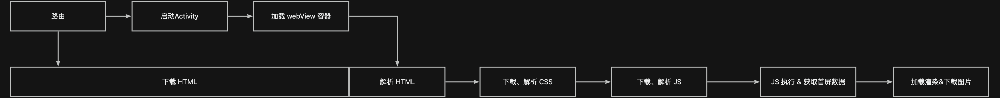
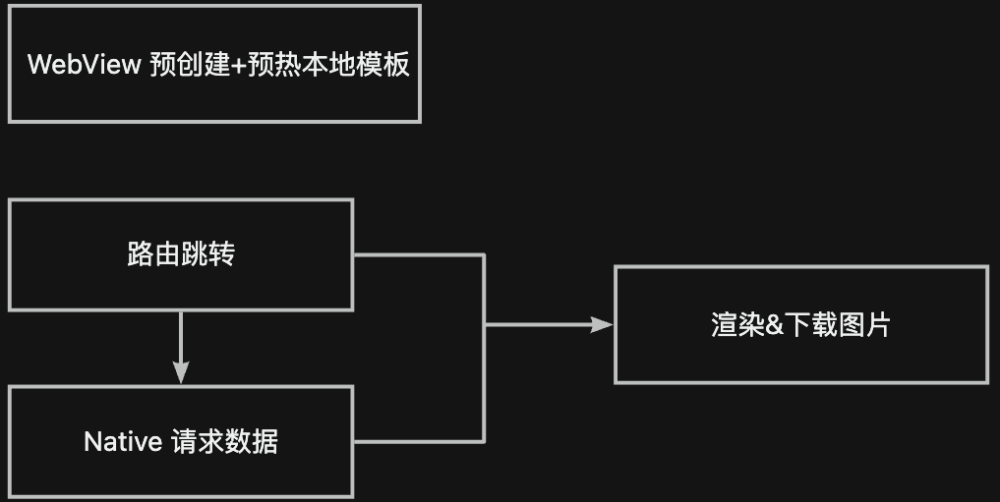
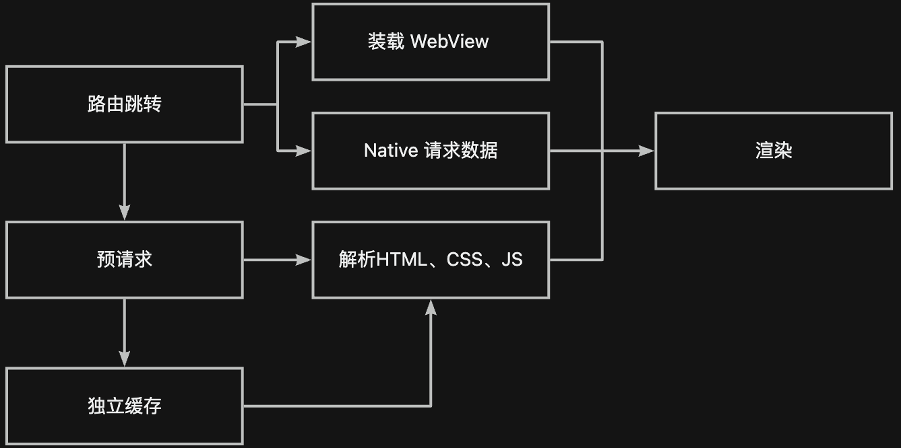
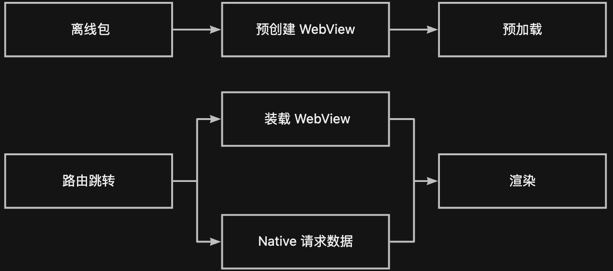
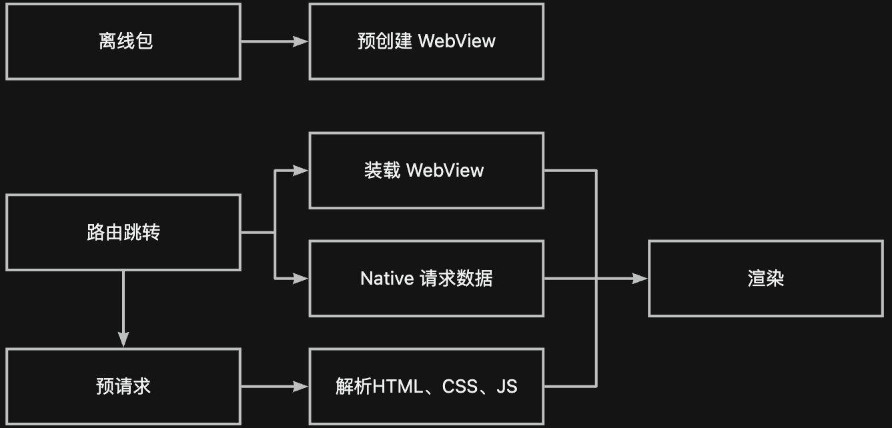

# 指标
既然做优化，首先得确定 WebView 加载 H5 的耗时如何计算。首先我们来看下互联网头部公司如何确定的：<br>
今日头条对 WebView 加载 H5 的耗时 = DOM加载完毕(DOMContentLoaded) - 用户点击时。该计算方式是因为头条为资讯类App，H5 着重用于加载文章详情，该场景下文字居多，而且图片等都由原生来渲染，所以不需要等待图片的加载完毕。<br>
得物对 WebView 加载 H5 的耗时 = 全部渲染完毕(window.onload) - 用户点击时。该计算方式是因为得物为购物社区类App，H5 着重用于加载营销活动等，该场景下图片居多，所以需要等待图片加载完毕。<br>
综上所述，基本可以确定，起始点都是在“用户点击时”，而终点则需要根据实际业务场景来确定，但可确定的一点，终点不是在 webView 的 onPageFinished() 回调时。
# 优化方式
WebView 加载 H5 默认流程

## WebView 容器创建阶段
### WebView 预创建&复用
> 预创建：可避免 webView 初次创建时初始化内核耗时问题。二次创建的 webView 比第一次创建的耗时明显缩小。
> 复用：可直接避免 webView 创建耗时

::: details 预创建
```kotlin
/**
 * 在 Application 中向 IdleHandler 塞入预创建任务
 */
fun init(appContext: Context){
    Looper.getMainLooper().queue.addIdleHandler {
        cacheWebView = WebView(MutableContextWrapper(appContext))
        return@addIdleHandler false
    }
}

/**
 * 使用 WebView
 */
fun bind(context: Context){
    if (cacheWebView == null){
        return WebView(context)
    }
    return cacheWebView.also{
        (it.context as MutableContextWrapper).baseContext = context
        it.clearHistory()
    }
}

/**
 * 不用时销毁
 */
fun release(webView: WebView){
    webView.distory()
}
```
:::

::: details 预创建&复用
```kotlin
/**
 * 与预创建逻辑基本一致，区别有三点：
 *   1. 预创建的 webView 存放在容器中；
 *   2. 使用完 webView 后不要销毁，而是回收
 *   3. 使用 webView 时，在返回时需要独立判断 canGoback()
 */

/**
 * 在 Application 中向 IdleHandler 塞入预创建任务，并将预创建的 webView 放到容器中
 */
fun init(appContext: Context){
    if (webViewContainer.isEmpty()){
        Looper.getMainLooper().queue.addIdleHandler {
            // webViewContainer 是我自定义的容器，内部是 HashMap<Int,SoftReference<WebView>>
            webViewContainer.add(WebView(MutableContextWrapper(appContext)))
            return@addIdleHandler false
        }
    }
}

/**
 * 使用 WebView
 */
fun bind(context: Context): WebView{
    //容器中不够，则创建新的
    val webView = webViewContainer.peek() ?: return WebView(MutableContextWrapper(context))
    webViewContainer.remove(webView)
    return webView.also {
        (it.context as MutableContextWrapper).baseContext = context
        it.clearHistory()
    }
}

/**
 * 回收 WebView
 */
 fun recycle(webView: WebView){
    try {
        webView.apply {
            stopLoading()
            loadUrl("about:blank") //为了复用，将页面设置成空白页
            clearHistory()
            removeAllViews()
            webChromeClient = null
            (parent as? ViewGroup)?.removeView(webView)
            (context as MutableContextWrapper).baseContext = webView.context.applicationContext
        }
    }finally {
        if (webViewContainer.size() < maxCacheSize){
            webViewContainer.add(webView)
        }
    }
}

/**
 * 独立判断 canGoback()
 */
 fun canGoBack(webView: WebView): Boolean{
    if (webView.canGoBack()){
        // 避免复用时，回退到空白页
        val backForwardList = webView.copyBackForwardList()
        if (backForwardList.getItemAtIndex(backForwardList.currentIndex - 1).url != "about:blank"){
            return true
        }
    }
    return false
}
```
:::

## 下载解析 HTML、CSS、JS 阶段
### 预加载
在应用启动时，将 HTML 下载保存至内存中，这样在启动时可以直接使用内存中的 HTML。在页面关闭时刷新 HTML。

### 预请求
在用户点击跳转时(路由阶段），提前下载 HTML 页面，在 WebView 初始化之后直接加载已下载的 HTML 页面。
与预加载的区别在于下载 HTML 的时机。预请求是在用户点击后；预加载是在 App 启动后。

### 模板化
> 适用于样式单一的页面，如资讯类详情页。

#### 本地模板化+并行加载
将公共的 CSS、JS 内置到客户端，并且由客户端请求数据，直接填充页面。

需要结合 webView 预创建一起使用。在 webView 预创建成功后先加载本地模板，提前完成解析动作，之后直接使用该 webView 加载数据即可。

### 独立缓存
在加载过程中，通过 shouldInterceptRequest 拦截请求，将由 Native 实现数据请求+缓存（可自行实现缓存，可以利用 OkHttp + 服务端配置实现），如果由缓存则直接复用。此处需注意时效性问题，可以在连接中添加版本号。

### 离线包
将 CSS、JS、图片等打包，在 App 启动后下载。在 webView 加载时判断，若要加载资源已在离线包中，则直接加载离线包中的资源。
## 获取首屏数据阶段
### 并行加载
> 即 H5 加载过程中，由 Native 端请求数据，H5 加载完成后直接加载数据即可。

实现思路：

- 跳转 WebViewActivity，在其 onCreate() 中请求数据，同时加载 H5
- 请求成功后调用 H5 JS方法将数据回传给 H5
- H5 拿到数据失败的话，触发自己请求
::: details Native 请求数据
```kotlin
override fun onCreate(savedInstanceState: Bundle?) {
    super.onCreate(savedInstanceState)
    enableEdgeToEdge()
    setContentView(R.layout.activity_parallel_web_view)
    ViewCompat.setOnApplyWindowInsetsListener(findViewById(R.id.main)) { v, insets ->
        val systemBars = insets.getInsets(WindowInsetsCompat.Type.systemBars())
        v.setPadding(systemBars.left, systemBars.top, systemBars.right, systemBars.bottom)
        insets
    }

    // Native 段请求数据（模拟请求）
   Handler(Looper.getMainLooper()).postDelayed({
        val data = "{\n" +
                "    \"picUrl\": \"https://p6.music.126.net/obj/wonDlsKUwrLClGjCm8Kx/44658970730/341c/8047/eb07/a960603716d5d927a5bfb9c961329f95.jpg\",\n" +
                "    \"title\": \"AI 入门到放弃之 Transformer\",\n" +
                "    \"clickNum\": 266,\n" +
                "    \"author\": \"测试数据\",\n" +
                "    \"content\": \"让模型在处理一个序列元素时，能够考虑到序列中所有元素的信息，而不仅仅是相邻的元素。考虑所有元素信息的关键：自注意力机制 + 位置编码。Transformer模型主要由两部分组成：编码器（Encoder）\u200C和解码器（Decoder）\u200C。编码器负责将输入序列转换为一系列连续的向量表示，而解码器则利用这些向量表示以及先前生成的输出序列来生成最终的输出。\",\n" +
                "    \"description\": \"让模型在处理一个序列元素时，能够考虑到序列中所有元素的信息，而不仅仅是相邻的元素\"\n" +
                "}"
        // 将数据回传至 H5
        webView.loadUrl("javascript:send2pageData('$data')")
    }, 100)

    val container = findViewById<FrameLayout>(R.id.fl_parallel_container)
    webView = WebView(this)
    webView.webViewClient = object : WebViewClient(){
        override fun shouldOverrideUrlLoading(view: WebView?, request: WebResourceRequest?): Boolean {
            //拦截h5内链接跳转，全部交由 webView 来加载，防止外链跳转至默认浏览器
            view?.loadUrl(request?.url.toString())
            return true
        }
    }
    container.addView(webView, FrameLayout.LayoutParams.MATCH_PARENT, FrameLayout.LayoutParams.MATCH_PARENT)
    webView.loadUrl(intent.getStringExtra("url")?:"")

}
```
:::

::: details H5直接使用数据
```kotlin
<html>
    <body>
        <div class="container">
            
            <div id="title" class="title"></div>
            <div id="content" class="content"></div>
        </div>
    
        <script>
            function send2pageData(result) {
                if (result == null || result == ""){
                    fetchPageData()
                    return
                }
                var data = JSON.parse(result)
                document.getElementById('head').src = data.data.picUrl
                document.getElementById('title').innerText = data.data.title
                document.getElementById('content').innerText = data.data.description
            }
            function fetchPageData(){}
        </script>
    </body>
</html>
```
:::

# 总结
> 不同的场景需要不同的搭配

## 资讯类文章详情页
> 例如：稀土掘金文章详情页

优化方案：WebView 预创建 + 本地模板 + 模板预热 + 并行加载

## 活动页面
> 例如：促销页面

优化方案：WebView 预创建 + 预请求 + 独立缓存 + 并行加载

## 固定样式功能页面
> 例如：稀土掘金 App 中的抽奖页面。

优化方案：WebView 预创建 + 离线包（HTML、CSS、JS、图片）+ 预加载/预请求 + 并行加载


# 实验Demo地址
[https://github.com/StefanShan/WebViewDemo](https://github.com/StefanShan/WebViewDemo)
 <table>
    <caption>
    以下数据均为 20次实验平均耗时（去掉最快和最慢的一次）
    </caption>
    <tr>
        <td align="center">测试方式</td>
        <td align="center">耗时</td>
        <td align="center">备注</td>
    </tr>
    <tr>
        <td>串行加载</td>
        <td>2061ms</td>
        <td rowspan="2">串并行加载均为本地资源加载，不与下面的测试对比。</td>
    </tr>
    <tr>
        <td>并行加载</td>
        <td>1285ms</td>
    </tr>
    <tr>
        <td>默认加载</td>
        <td>3030ms</td>
        <td></td>
    </tr>
    <tr>
        <td>预创建 WebView</td>
        <td>2818ms</td>
        <td></td>
    </tr>
    <tr>
        <td>本地缓存</td>
        <td>2657ms</td>
        <td></td>
    </tr>
    <tr>
        <td>预请求</td>
        <td>3490ms</td>
        <td>预请求不符合预期，HTML请求之后响应太慢。可能h5优化后会符合预期。</td>
    </tr>
    <tr>
        <td>预加载</td>
        <td>2356ms</td>
        <td></td>
    </tr>
</table>

# 拓展
- [【浏览器技术】解锁X5内核WebView同层渲染能力](https://juejin.cn/post/7018037732412768269)
- [修改chromium内核，实现小程序的camera组件同层渲染（Android端）](https://juejin.cn/post/7011385069503774733)
- [修改chromium内核，实现小程序的Map组件同层渲染（Android端）](https://juejin.cn/post/7119881856794755085)
# 参考
- [满满的WebView优化干货，让你的H5实现秒开体验](https://juejin.cn/post/7043706765879279629)
- [Android WebView H5 秒开方案总结](https://juejin.cn/post/7016883220025180191)
- [WebView组件封装(五)——实现H5页面秒开方案总结](https://juejin.cn/post/7348824894157160474)
- [Android开发——H5容器加载速度优化方案](https://blog.csdn.net/SEU_Calvin/article/details/113809809)
- [今日头条品质优化 - 图文详情页秒开实践](https://juejin.cn/post/6876011410061852680)
- [得物App H5秒开优化实战](https://juejin.cn/post/7086284339364757517)
- [H5秒开优化实践](https://juejin.cn/post/7376425155382231080)
- [汽车之家H5页面秒开优化与实践](https://juejin.cn/post/7220243380621099064)
- [Web前端最新优化指标：FP、FCP、FMP、LCP、TTI、CLS、FID、FPS等](https://blog.csdn.net/qq_41887214/article/details/130516839)
