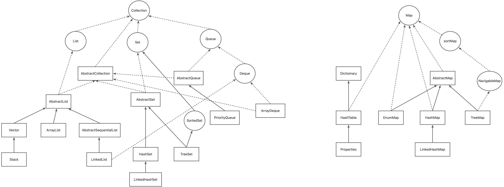

# List、Set、Map 关系图


# Vector

> **同步的** 可增长的数组存储结构。<br>
> 默认初始容量为 10 个，可自定义初始容量、扩容时新增容量 <br>

> 扩容逻辑：
> - 若未指定扩容时新增容量，则扩容为原容量的 2 倍
> - 若指定了扩容时新增容量，则扩容为原容量 + 新增容量
> - 若扩容后容量仍不满足，则扩容容量为 插入后元素个数
> - 若扩容后容量【未超过】额定最大容量（Integer.MAX_VALUE - 8），使用 扩容后的容量大小 为新容器大小
> - 若扩容后容量【超过】额定最大容量，且插入后元素个数【超过】额定最大容量，使用 Integer.MAX_VALUE 为新容器大小
> - 若扩容后容量【超过】额定最大容量，且插入后元素个数【未超过】额定最大容量，使用 额定最大容量 为新容器大小
::: details 扩容逻辑伪代码
```java
int MAX_ARRAY_SIZE = Integer.MAX_VALUE - 8;

public int newCapacity(originalCapacity){
    //插入后元素个数
    int insertAfterCount = originalCapacity + 1;
    //若指定了扩容时新增容量，则扩容为原容量 + 新增容量；否则扩容为原容量的 2 倍
    int newCapacity = increment > 0 ? originalCapacity + increment : originalCapacity * 2;
    //若扩容后容量仍不满足，则扩容容量为 插入后元素个数
    if (newCapacity <= insertAfterCount){
        newCapacity = insertAfterCount;
    }
    //扩容后满足存储，且扩容容量未超过额定最大容量，则使用扩容后的容量。
    if (newCapacity <= MAX_ARRAY_SIZE){
        return newCapacity;
    }
    //扩容后满足存储，但超过了额定最大容量，若插入后元素个数超出额定最大容量，则设定容器容量为 Integer.MAX_VALUE，否则为额定最大容量
    return insertAfterCount > MAX_ARRAY_SIZE ? Integer.MAX_VALUE : MAX_ARRAY_SIZE;
}
```
:::

> 删除、清空元素时，不会缩容。<br>
> 如果想缩容，需自行调用 trimToSize()，将容量缩小至实际存储元素个数
> - 删除元素时，移动数组元素，将末尾元素置为 null
> - 清空元素时，直接将全部元素置为 null

## 存储结构
```java{6,7,10,18,19}
public class Vector<E> extends AbstractList<E> 
    implements List<E>, RandomAccess, Cloneable, java.io.Serializable
{
    protected Object[] elementData;

    // 默认存储大小为 10 个
    public Vector() { this(10); }

    public Vector(int initialCapacity) {
        this(initialCapacity, 0);
    }

    /**
     * @param initialCapacity: 初始容量
     * @param capacityIncrement: 扩容容量（每次扩容是新增容器大小）
     */
    public Vector(int initialCapacity, int capacityIncrement) {
        this.elementData = new Object[initialCapacity];
        this.capacityIncrement = capacityIncrement;
    }
}
```
## 插入元素（发生扩容）
```java{3,9-11,16-28}
public synchronized void addElement(E obj) {
    modCount++;
    ensureCapacityHelper(elementCount + 1); //检测是否扩容
    elementData[elementCount++] = obj;
}

private void ensureCapacityHelper(int minCapacity) {
    // 若添加后超出容器容量，则扩容
    if (minCapacity - elementData.length > 0){
        grow(minCapacity);
    }   
}

private void grow(int minCapacity) {
    int oldCapacity = elementData.length;
    //扩容后大小 = 原容器大小 + 扩容容量大小（默认为原来一倍）
    int newCapacity = oldCapacity + ((capacityIncrement > 0) ? capacityIncrement : oldCapacity);
    //扩容后的容器大小仍不满足，则直接使用元素总量
    if (newCapacity - minCapacity < 0){
        newCapacity = minCapacity;
    }
    //新容器超出额定最大容量（Integer.MAX_VALUE - 8)
    // 若元素总量超出额定最大容量，则设定容器容量为 Integer.MAX_VALUE，否则为额定最大容量
    if (newCapacity - MAX_ARRAY_SIZE > 0){
        newCapacity = hugeCapacity(minCapacity);
    }
    //将原数据 copy 至新容器
    elementData = Arrays.copyOf(elementData, newCapacity);
}
```
## 删除/清空元素
```java{8,11}
public synchronized E remove(int index) {
    modCount++;
    E oldValue = elementData(index);

    int numMoved = elementCount - index - 1;
    if (numMoved > 0){
        //迁移数组元素
        System.arraycopy(elementData, index+1, elementData, index, numMoved);
    }
    //末尾元素置为 null
    elementData[--elementCount] = null;

    return oldValue;
}
```
```java{8-11}
public void clear() {
    removeAllElements();
}

public synchronized void removeAllElements() {
    final Object[] es = elementData;
    //将数组元素全部置为 null
    for (int to = elementCount, i = elementCount = 0; i < to; i++){
        es[i] = null;
    }
    modCount++;
}
```

# ArrayList

> **非同步的** 可增长的数组存储结构（Vector 的非同步版本） <br>
> 默认初始容量为 0，可自定义初始容量 <br>

> 扩容逻辑：
> - 扩容为原容量的 1.5 倍
> - 若扩容后容量仍不满足，且容器通过无参构造函数创建，则扩容容量为 Max(10, 插入后元素个数)
> - 若扩容后容量仍不满足，且容器通过有参构造函数创建，则扩容容量为 插入后元素个数
> - 若扩容后容量【未超过】额定最大容量（Integer.MAX_VALUE - 8），使用 扩容后的容量大小 为新容器大小
> - 若扩容后容量【超过】额定最大容量，且插入后元素个数【超过】额定最大容量，使用 Integer.MAX_VALUE 为新容器大小
> - 若扩容后容量【超过】额定最大容量，且插入后元素个数【未超过】额定最大容量，使用 额定最大容量 为新容器大小

::: details 扩容逻辑伪代码
```java
int MAX_ARRAY_SIZE = Integer.MAX_VALUE - 8;

public int newCapacity(originalCapacity){
    //插入后元素个数
    int insertAfterCount = originalCapacity + 1;
    //扩容原来的 1.5 倍
    int newCapacity = originalCapacity + originalCapacity / 2;
    //扩容后仍不满足
    if (newCapacity <= insertAfterCount){
        //若通过无参构造函数创建，则扩容容量从 10 与 插入后元素个数 中取最大值；否则扩容容量为 插入后元素个数。
        return NoParamsConstructor ? Max(10, insertAfterCount) : insertAfterCount;
    }
    //扩容后满足存储，且扩容容量未超过额定最大容量，则使用扩容后的容量。
    if (newCapacity <= MAX_ARRAY_SIZE){
        return newCapacity;
    }
    //扩容后满足存储，但超过了额定最大容量，若插入后元素个数超出额定最大容量，则设定容器容量为 Integer.MAX_VALUE，否则为额定最大容量
    return insertAfterCount > MAX_ARRAY_SIZE ? Integer.MAX_VALUE : MAX_ARRAY_SIZE;
}
```
:::

> 删除、清空元素时，不会缩容。<br>
> 如果想缩容，需自行调用 trimToSize()，将容量缩小至实际存储元素个数
> - 删除元素时，移动数组元素，将末尾元素置为 null
> - 清空元素时，直接将全部元素置为 null

## 存储结构
```java{7,8,13,15,16}
public class ArrayList<E> extends AbstractList<E>
        implements List<E>, RandomAccess, Cloneable, java.io.Serializable
{
    transient Object[] elementData;

    public ArrayList() {
        // Object[] DEFAULTCAPACITY_EMPTY_ELEMENTDATA = {}
        this.elementData = DEFAULTCAPACITY_EMPTY_ELEMENTDATA;
    }

    public ArrayList(int initialCapacity) {
        if (initialCapacity > 0) {
            this.elementData = new Object[initialCapacity];
        } else if (initialCapacity == 0) {
            //Object[] EMPTY_ELEMENTDATA = {}
            this.elementData = EMPTY_ELEMENTDATA;
        } else {
            throw new IllegalArgumentException("Illegal Capacity: "+ initialCapacity);
        }
    }
}
```
## 插入元素（发生扩容）
```java{3,10,18,23-37}
public boolean add(E e) {
    modCount++;
    add(e, elementData, size);
    return true;
}

private void add(E e, Object[] elementData, int s) {
    if (s == elementData.length){
        // 扩容。实际调用 grow(size + 1);
        elementData = grow();
    }
    elementData[s] = e;
    size = s + 1;
}

private Object[] grow(int minCapacity) {
    // 扩容 & 将原数据 copy 至新容器
    return elementData = Arrays.copyOf(elementData, newCapacity(minCapacity));
}

private int newCapacity(int minCapacity) {
    int oldCapacity = elementData.length;
    //扩容后大小 = 原容器大小 + 原容器大小 / 2
    int newCapacity = oldCapacity + (oldCapacity >> 1);
    //新容器大小仍不满足
    //  若为无参构造函数创建， 则从 默认大小(10个) 与 插入后元素个数 取最大的一个
    //  否则，使用插入后元素个数
    if (newCapacity - minCapacity <= 0) {
        if (elementData == DEFAULTCAPACITY_EMPTY_ELEMENTDATA){
            return Math.max(DEFAULT_CAPACITY, minCapacity);
        }
        return minCapacity;
    }
    //新容器为超出额定最大容量，则使用新容器的容量大小
    //新容器超出额定最大容量（Integer.MAX_VALUE - 8)
    // 若元素总量超出额定最大容量，则设定容器容量为 Integer.MAX_VALUE，否则为额定最大容量
    return (newCapacity - MAX_ARRAY_SIZE <= 0) ? newCapacity : hugeCapacity(minCapacity);
}
```
## 删除\/清空元素
```java{4,5,12-17}
public E remove(int index) {
    Objects.checkIndex(index, size);
    final Object[] es = elementData;
    //真正删除元素
    fastRemove(es, index);
    return oldValue;
}

private void fastRemove(Object[] es, int i) {
    modCount++;
    final int newSize;
    //移动数组元素
    if ((newSize = size - 1) > i){
        System.arraycopy(es, i + 1, es, i, newSize - i);
    }
    //将末尾元素置为 null
    es[size = newSize] = null;
}
```
```java{4-6}
public void clear() {
    modCount++;
    final Object[] es = elementData;
    //全部置为 null
    for (int to = size, i = size = 0; i < to; i++){
         es[i] = null;
    }     
}
```

# LinkedList
> **非同步的**双向链表存储结构 <br>
> 无容量限制 <br>
> 新增元素为双向链表插入节点操作 <br>
> 删除元素为双向链表移除节点操作 

## 存储结构
```java{5-7}
public class LinkedList<E> extends AbstractSequentialList<E>
    implements List<E>, Deque<E>, Cloneable, java.io.Serializable
{
    // 双向链表的头节点、尾节点
    transient Node<E> first;
    transient Node<E> last;
    public LinkedList() {}

    //私有静态内部类
    private static class Node<E> {
        E item;
        Node<E> next;
        Node<E> prev;

        Node(Node<E> prev, E element, Node<E> next) {
            this.item = element;
            this.next = next;
            this.prev = prev;
        }
    }
}
```

## 新增元素
```java{3,8-16,27-35}
// 尾插入 offer() 实际调用的 add()
public boolean add(E e) {
    linkLast(e);
    return true;
}

void linkLast(E e) {
    final Node<E> l = last;
    final Node<E> newNode = new Node<>(l, e, null);
    //若当前没有元素，则新插入的元素，既是头节点，又是尾节点
    //若已有元素，则让原尾节点指向新插入元素，新插入元素成为尾节点
    last = newNode;
    if (l == null)
        first = newNode;
    else
        l.next = newNode;
    size++;
    modCount++;
}

//头插入 push() 实际调用的 addFirst()
public void addFirst(E e) {
    linkFirst(e);
}

private void linkFirst(E e) {
    final Node<E> f = first;
    final Node<E> newNode = new Node<>(null, e, f);
    //若当前没有元素，则新插入的元素，既是头节点，又是尾节点
    //若已有元素，则让原头节点的prev节点指向新插入元素，新插入元素成为头节点
    first = newNode;
    if (f == null)
        last = newNode;
    else
        f.prev = newNode;
    size++;
    modCount++;
}
```

## 删除\/清空元素
```java{12-20,35-43}
//删除头节点 pop()、poll()、remove() 都是删除头节点
public E pop() {
    return removeFirst();
}

public E removeFirst() {
    final Node<E> f = first;
    return unlinkFirst(f);
}

private E unlinkFirst(Node<E> f) {
    final E element = f.item;
    final Node<E> next = f.next; //获取目标节点指向的下个节点
    f.item = null; //将节点持有的数据置为 null，方便 gc
    f.next = null; //切断目标节点与下个节点的关联
    first = next; //让目标节点的下个节点作为头节点
    if (next == null)
        last = null; //目标节点就是最后一个节点，则头节点、尾节点都置为 null
    else
        next.prev = null; //切断下个节点与目标节点的关联
    size--;
    modCount++;
    return element;
}

//删除尾节点
public E removeLast() {
    final Node<E> l = last;
    if (l == null)
        throw new NoSuchElementException();
    return unlinkLast(l);
}

private E unlinkLast(Node<E> l) {
    final E element = l.item;
    final Node<E> prev = l.prev; //获取目标节点指向的上个节点
    l.item = null; //将节点持有的数据置为 null，方便 gc
    l.prev = null; //切断目标节点与上个节点的关联
    last = prev; //让目标节点的上个节点作为尾节点
    if (prev == null)
        first = null; //目标节点就是最后一个节点，则头节点、尾节点都置为 null
    else
        prev.next = null; //切断上个节点与目标节点的关联
    size--;
    modCount++;
    return element;
}
```
```java{3-9}
public void clear() {
    //遍历所有节点，全部置为 null，方便gc
    for (Node<E> x = first; x != null; ) {
        Node<E> next = x.next;
        x.item = null;
        x.next = null;
        x.prev = null;
        x = next;
    }
    first = last = null;
    size = 0;
    modCount++;
}
```

# CopyOnWriteArrayList

> **同步的** 可增长的数组存储结构。<br>
> 初始容量为 0 <br>
> 新增元素时，都会创建新容器，并 copy 原容器中的元素 <br>
> 删除元素时，都会创建新的容器，并 copy 原容器中的元素 <br>
> 其与 Vector 的区别:
> - 锁控制的范围不同：虽然都支持线程安全，但 Vector 对所有元素操作都加锁(synchronized)；而 CopyOnWriteArrayList 对获取操作是不加锁的。
> - 初始容量与扩容大小不同：Vector 有初始容量，且每次扩容都是 2 倍或指定的新增容量；而 CopyOnWriteArrayList 初始容量为0，且每次扩容仅 +1。
> - 缩容：Vector 删除元素后不会缩容，需自行调用 trimToSize(); 而 CopyOnWriteArrayList 每次操作都是基于 copy，所以会自动缩容。

## 存储结构
```java{3,6}
public class CopyOnWriteArrayList<E> implements List<E>, RandomAccess, Cloneable, java.io.Serializable {

    private transient volatile Object[] array;
    
    public CopyOnWriteArrayList() {
        setArray(new Object[0]);
    }

    final void setArray(Object[] a) {
        array = a;
    }
}
```
## 新增元素
```java{2,5}
public boolean add(E e) {
    synchronized (lock) {
        Object[] es = getArray();
        int len = es.length;
        es = Arrays.copyOf(es, len + 1); //扩容,原容量+1，并将原数组元素全部 copy 过来
        es[len] = e;
        setArray(es);
        return true;
    }
}
```
## 删除\/清空元素
```java{2,6-16}
public E remove(int index) {
    synchronized (lock) {
        Object[] es = getArray();
        int len = es.length;
        E oldValue = elementAt(es, index);
        int numMoved = len - index - 1;
        Object[] newElements;
        if (numMoved == 0){
            //若移除最后一个元素，则直接复制创建新数组
            newElements = Arrays.copyOf(es, len - 1); 
        }else {
            //创建新数组，把要移除元素的前面所有元素和后面所有元素分别 copy 至新数组中
            newElements = new Object[len - 1];
            System.arraycopy(es, 0, newElements, 0, index);
            System.arraycopy(es, index + 1, newElements, index, numMoved);
        }
        setArray(newElements);
        return oldValue;
    }
}
```

# 拓展
## Collections # synchronized 
可通过 Collections # synchronized 系列方法，生成一个线程安全的容器。其原理：创建一个 SynchronizedCollection 用来接收之前的值，并且所有的添加、删除等方法上都加了对象锁。

```java
//举例
Set set = Collections.synchronizedSet(new HashSet);

//原理：
public static <T> Set<T> synchronizedSet(Set<T> s) {
    return new SynchronizedSet<>(s);
}

static class SynchronizedSet<E> extends SynchronizedCollection<E>
      implements Set<E> {

    SynchronizedSet(Set<E> s) {
        super(s);
    }

    public boolean equals(Object o) {
        if (this == o)
            return true;
        synchronized (mutex) {return c.equals(o);}
    }
          
    public int hashCode() {
        synchronized (mutex) {return c.hashCode();}
    }
}

static class SynchronizedCollection<E> implements Collection<E>, Serializable {
    final Collection<E> c;  // Backing Collection
    final Object mutex;     // Object on which to synchronize

    SynchronizedCollection(Collection<E> c) {
        this.c = Objects.requireNonNull(c);
        mutex = this;
    }

    public boolean add(E e) {
        synchronized (mutex) {return c.add(e);}
    }
    public boolean remove(Object o) {
        synchronized (mutex) {return c.remove(o);}
    }
    public int size() {
        synchronized (mutex) {return c.size();}
    }
    public boolean isEmpty() {
        synchronized (mutex) {return c.isEmpty();}
    }
    public boolean contains(Object o) {
        synchronized (mutex) {return c.contains(o);}
    }
}

```
