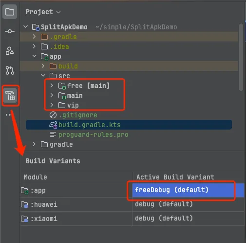
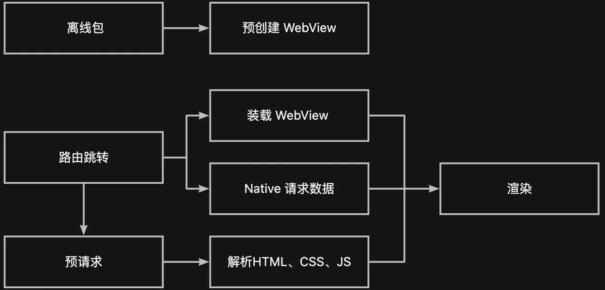
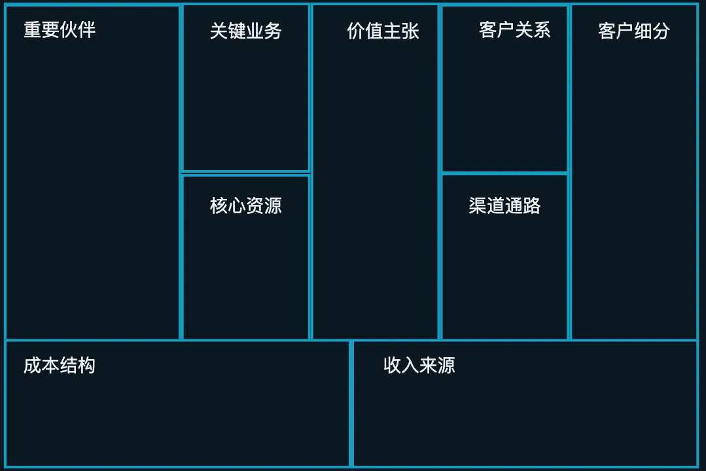
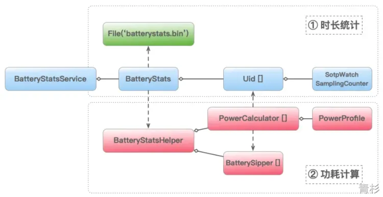
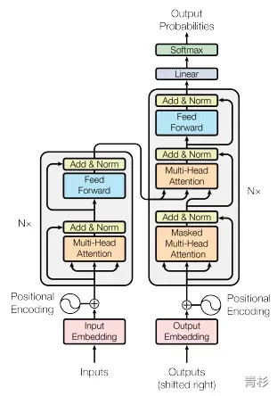
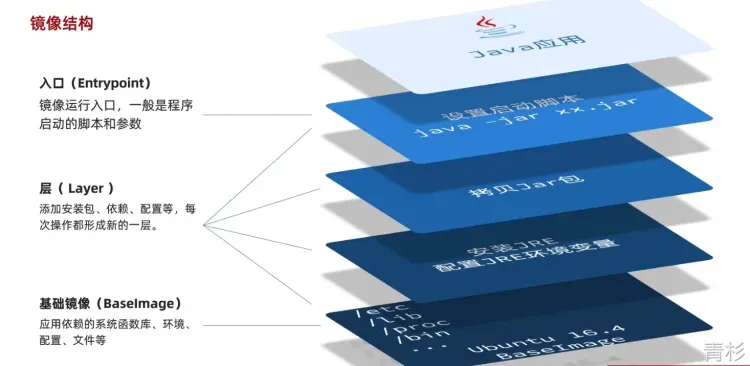
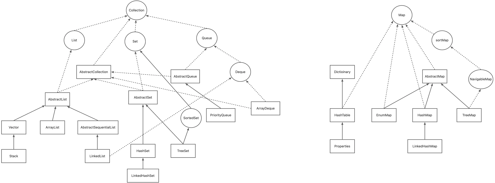
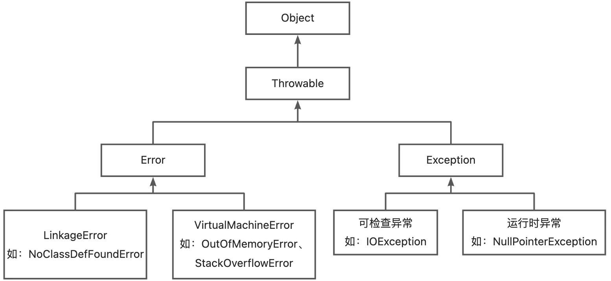
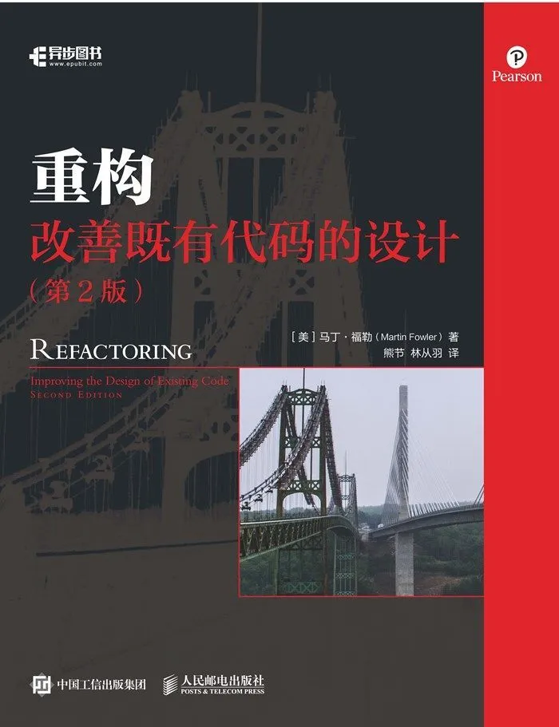

::: timeline 2024
 
 

  <a href="./doc/Android/Gradle_分功能打包">
    
 Gradle 实现分功能打包   如何使用 Gradle productFlovers 实现分功能打包？如：free 与 vip，分渠道。  

    

        
    

  </a>

 

  <a href="./doc/Android/RecyclerView有效曝光">
    
RecycerView 有效曝光埋点实现方案  最近参加面试，被问到一个实景问题：RecyclerView 如何实现曝光埋点？  

    

        
    

  </a>

 

  <a href="./doc//Android/WebView加载优化">
    
探索 WebView 加载优化  探索&实验 WebView 加载 H5 秒开优化方式 

    

        
    

  </a>

 

  <a href="./doc/Java/注解">
    
实例讲解 Java 注解生命周期  面试官：说一下注解生命周期；SOURCE、CLASS、RUNTIME 的区别是什么？ 

    

        
    

  </a>

 

  <a href="./doc/Android/源解Glide_图片缓存">
    
 【源码解读】源解 Glide - 图片缓存  通过阅读 Glide 源码，了解磁盘缓存、内存缓存、BitmapPool 存储结构、存入与取出时机   

    

        
    

  </a>

 

  <a href="./doc/Android/源解Glide_监听者">
    
 【源码解读】源解 Glide - 监听者  通过阅读 Glide 源码，了解如何监听生命周期变化、网络变化、内存变化  

    

        
    

  </a>

 

  <a href="./doc/Android/源解Glide_加载流程">
    
【源码解读】源解 Glide - 网络图片加载流程   通过阅读 Glide 源码，了解从调用 API 到图片显示都经历了什么 

    

        
    

  </a>

 

  <a href="./doc/ThinkSummary/清华-商业模式的逻辑">
    
“清华公开课: 商业模式的逻辑” 笔记   什么是商业模式？商业模式描述了企业如何创造价值、传递价值、获取价值的基本原理。 

    

        
    

  </a>

 

  <a href="./doc/Android/电量优化">
    
Android性能优化-电量优化  电量分析、常用工具、优化手段 

    

        
    

  </a>

 

  <a href="./doc/ThinkSummary/人工智能与大语言模型科普文">
    
人工智能与大语言模型科普文   人工智能（AI）是指用普通计算机程序来呈现人类智能的技术。大语言模型能够理解和生成人类语言，具有强大的语言结构理解和生成能力。 

    

        
    

  </a>

 

  <a href="./doc/后端开发/Docker学习笔记">
    
Docker学习笔记   常用 docker指令、目录挂载、自定义网络、自定义镜像、DockerCompose 

    

        
    

  </a>

 
:::
::: timeline 2023
 
 

  <a href="./doc/ThinkSummary/深入理解Kotlin协程">
    
《深入理解Kotlin协程》读书笔记   一部从工作机制、实现原理、应用场景、使用方法、实践技巧、标准库、框架、应用案例等多个维度全面讲解Kotlin协程的专著。 

    

        
    

  </a>

 

  <a href="./doc/ThinkSummary/横向领导力">
    
《横向领导力》读书笔记   如果你不知道你想努力获得什么目标，那么你很难成功。 

    

        
    

  </a>

 
:::
::: timeline 2022
 
 

  <a href="./doc/Java/源码解析ThreadLocal">
    
源码解析 ThreadLocal  从源码角度解答 ThreadLocal 是如何做到线程隔离存储数据的.

    

        
    

  </a>

 

  <a href="./doc/Java/泛型">
    
Java与Kotlin中的泛型   泛型的类型，泛型类型擦除原理与解决方法.

    

        
    

  </a>

 

  <a href="./doc/Java/Java集合_Set">
    
Java集合-Set篇  讲解常见集合(Set) 相关存储结构、扩容方式、新增/删除/清空操作 

    

        
    

  </a>

 

  <a href="./doc/Java/Java集合_Map">
    
Java集合-Map篇  讲解常见集合(Map) 相关存储结构、扩容方式、新增/删除/清空操作 

    

        
    

  </a>

 

  <a href="./doc/Java/Java集合_List">
    
Java集合-List篇  讲解常见集合(List) 相关存储结构、扩容方式、新增/删除/清空操作 

    

        
    

  </a>

 

  <a href="./doc/Java/Java反射">
    
Java反射  Java 反射基础知识.

    

        
    

  </a>

 

  <a href="./doc/Java/Exception_Error">
    
Exception与Error  什么是 Exception？什么是 Error？两者的关系？

    

        
    

  </a>

 

  <a href="./doc/ThinkSummary/重构—改善既有代码的设计">
    
《重构—改善既有代码的设计》读书笔记   本质上说，重构就是在代码写好之后改进它的设计。 

    

        
    

  </a>

 
:::
::: timeline 2021 及以前
 
 

  <a href="./doc/ThinkSummary/软技能—代码之外的生存指南">
    
《软技能—代码之外的生存指南》读书笔记   这是一本真正从“人”（而非技术也非管理）的角度关注软件开发人员自身发展的书。 

    

        
    

  </a>

 
:::