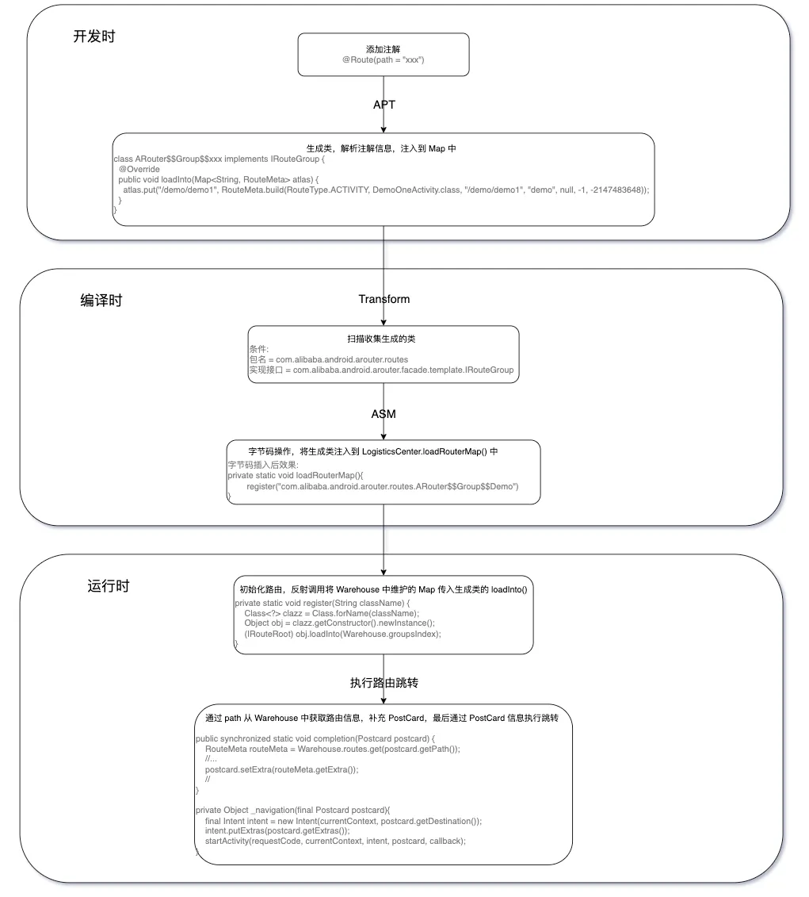
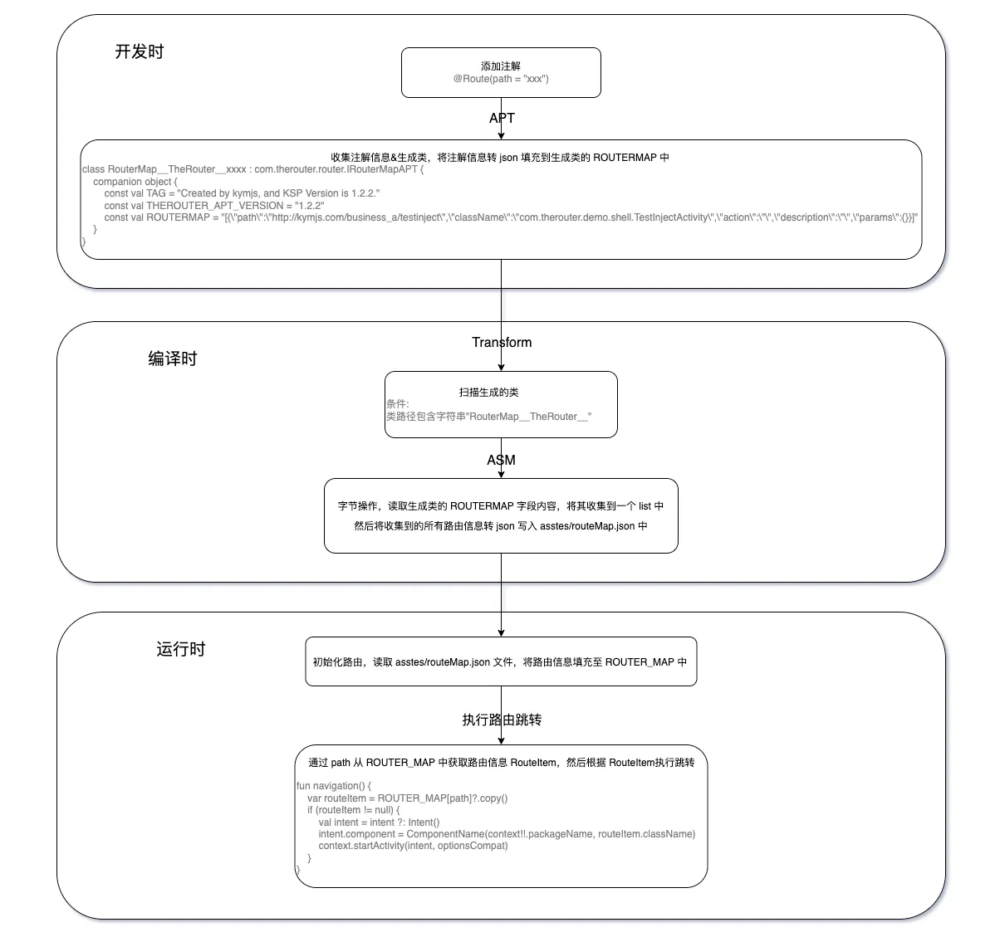
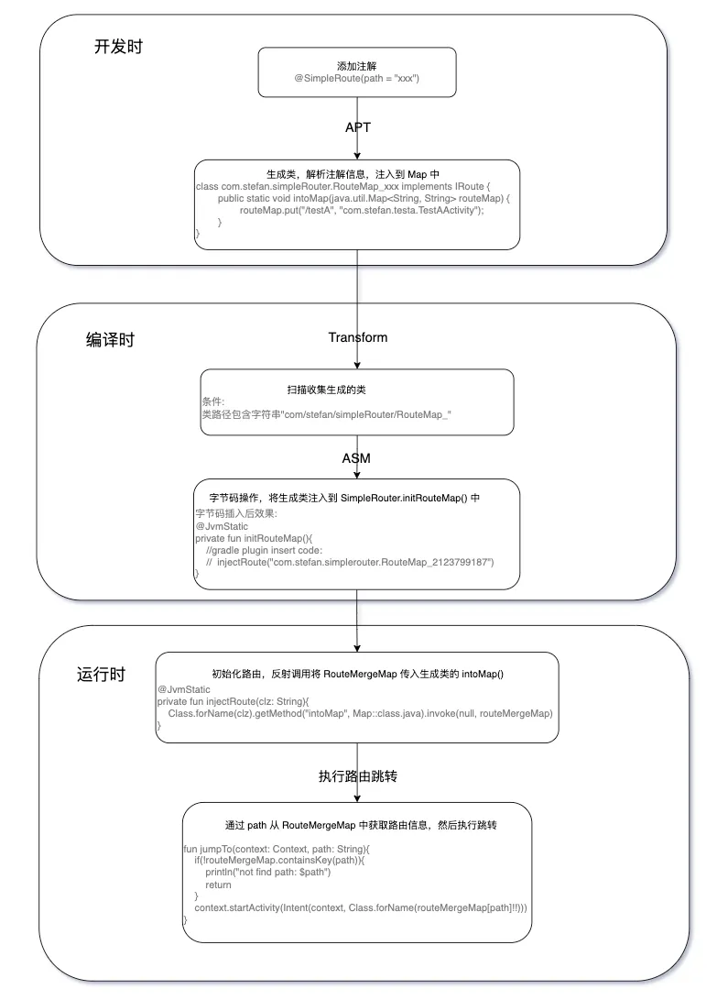

# 基于 Gradle8.0+ transfrom 替代方案实现简易路由框架
---
# 主流路由框架整体方案
## ARouter
> 阿里出品<br>
> 开源地址：https://github.com/alibaba/ARouter/tree/develop


## TheRouter
> 货拉拉出品<br>
> 支持 Gradle8.0+ <br>
> 开源地址：https://github.com/HuolalaTech/hll-wp-therouter-android


# Transform 变化
## Gradle 8.0 之前
1. 创建自定义 Gradle 插件并注册 Transform
```kotlin
class CustomPlugin: Plugin<Project>  {
    override fun apply(target: Project) { {
        if (target.plugins.hasPlugin(AppPlugin)){
            val appExtension = target.extensions.getByType(AppExtension::class.java)
            appExtension.registerTransform(CustomTransform(project))
        }
    }
}
```
2. 创建自定义 Transform
```kotlin
class RegisterTransform(private val project: Project): Transform {
    override fun getName(): String {
        return "$pluginName"
    }

    override fun getInputTypes(): Set<ContentType> {
        return TransformManager.CONTENT_CLASS
    }

    override fun getScopes(): Set<Scope> {
        return TransformManager.SCOPE_FULL_PROJECT
    }

    override fun isIncremental(): Boolean {
        return true
    }

    override fun transform(transformInvocation: TransformInvocation) {
        super.transform(transformInvocation)
        //处理
        transformlogic(transformInvocation.isIncremental, transformInvocation.inputs, transformInvocation.outputProvider)
    }
}
```
3. 对 jar、class 进行处理（增量）
```kotlin
class RegisterTransform(private val project: Project): Transform {
    //....
    private fun theRouterTransform(isIncremental: Boolean, inputs: Collection<TransformInput>, outputProvider: TransformOutputProvider) {
        inputs.forEach { input ->
            // 遍历jar包
            input.jarInputs.forEach { jarInput ->
                val jarName = jarInput.name.lowercase()
                val dest = outputProvider.getContentLocation(jarName, jarInput.contentTypes, jarInput.scopes, Format.JAR)
                if (!isIncremental) {
                    //增量处理
                }else {
                    //全量处理
                }
            }
            // 遍历directory
            input.directoryInputs.forEach { directoryInput ->
                val dest = outputProvider.getContentLocation(directoryInput.name, directoryInput.contentTypes, directoryInput.scopes, Format.DIRECTORY)
                if (!isIncremental) {
                    //增量处理
                }else {
                    //全量处理
                }
            }
        }
    }
}
```
## Gralde 8.0 之后
1. 创建自定义 Gradle 插件并注册 Gradle Task
```kotlin
class CustomPlugin : Plugin<Project> {
    override fun apply(target: Project) {
        /**
         * [gradle8.0 transform替换官方文档](https://developer.android.google.cn/build/releases/gradle-plugin-api-updates?hl=zh-cn)
         * [官方Demo](https://github.com/android/gradle-recipes/blob/agp-7.4/Kotlin/modifyProjectClasses/app/build.gradle.kts#L105)
         */
        target.extensions.getByType(AndroidComponentsExtension::class.java).let { androidComponentsExtension ->
            androidComponentsExtension.onVariants {
                //注册 Gradle Task
                val taskProvider = target.tasks.register("${it.name}CustomTask", CustomTask::class.java)
                it.artifacts.forScope(ScopedArtifacts.Scope.ALL)
                    .use(taskProvider)
                    .toTransform(
                        ScopedArtifact.CLASSES,
                        RouterTask::allJars,
                        RouterTask::allDirectories,
                        RouterTask::output
                    )
            }
        }
    }
}
```
2. 创建自定义 Gradle Task
```kotlin
abstract class CustomTask : DefaultTask() {

    @get:InputFiles
    abstract val allJars: ListProperty<RegularFile> // 所有的jar包

    @get:InputFiles
    abstract val allDirectories: ListProperty<Directory> // 所有的class文件

    @get:OutputFile
    abstract val output: RegularFileProperty // 输出的文件

    @TaskAction
    fun taskAction() {
        //处理
    }
}
```
3. 对 jar、class 进行处理
```kotlin
abstract class CustomTask : DefaultTask() {
    //...

    @TaskAction
    fun taskAction() {
        //构建输出流
        val jarOutput = JarOutputStream(BufferedOutputStream(FileOutputStream(output.get().asFile)))
        //遍历jar包
        allJars.get().forEach { file ->
            val jarFile = JarFile(file.asFile)
            jarFile.entries().asIterator().forEach { jarEntry ->
                //读取 copy
                jarOutput.putNextEntry(JarEntry(jarEntry.name))
                jarFile.getInputStream(jarEntry).use {
                    it.copyTo(jarOutput)
                }
                jarOutput.closeEntry()
            }
            jarFile.close()
        }
        //遍历directory
        allDirectories.get().forEach { directory ->
            directory.asFile.walk().forEach { file ->
                if (!file.isFile) return@forEach
                //读取 copy
                val relativePath = directory.asFile.toURI().relativize(file.toURI()).path.replace(File.separatorChar, '/')
                jarOutput.putNextEntry(JarEntry(relativePath))
                file.inputStream().use { inputStream ->
                    inputStream.copyTo(jarOutput)
                }
                jarOutput.closeEntry()
            }
        }
        jarOutput.close()
    }
}
```
# 简易路由框架方案与实现
## 方案
> 基于 Gradle8.0+ 实现 <br>
> ARouter 与 TheRouter 的缝合怪🐶


## 实现
### 搜集路由信息
1. 创建注解
```kotlin
@Retention(AnnotationRetention.SOURCE)
@Target(AnnotationTarget.CLASS)
annotation class SimpleRoute (
    val path: String = ""
)
```
2. 收集注解信息
```kotlin
class AnnotationProcessor : AbstractProcessor(){
    override fun getSupportedAnnotationTypes(): Set<String> {
        return setOf(SimpleRoute::class.java.canonicalName)
    }

    override fun getSupportedSourceVersion(): SourceVersion {
        return SourceVersion.latestSupported()
    }

    override fun process(set: MutableSet<out TypeElement>?, roundEnvironment: RoundEnvironment): Boolean {
        if (set.isNullOrEmpty()) return false
        val routeList = mutableListOf<RouteBean>()
        //收集被注解类信息
        roundEnvironment.getElementsAnnotatedWith(SimpleRoute::class.java).filterNotNull().forEach {element: Element ->
            val annotation = element.getAnnotation(SimpleRoute::class.java)
            val clsName = element.toString()
            val path = annotation.path
            routeList.add(RouteBean(clsName, path))
        }
        //生成一个类记录收集的注解类信息
        if (routeList.isEmpty()) return true
        var ps: PrintStream? = null
        try {
            val className = "RouteMap_${abs(processingEnv.filer.createSourceFile("temp").toUri().hashCode())}"
            val jfo = processingEnv.filer.createSourceFile("com.stefan.simpleRouter.$className")
            val genJavaFile = File(jfo.toUri().toString())
            if (genJavaFile.exists()) {
                genJavaFile.delete()
            }

            ps = PrintStream(jfo.openOutputStream(), false, "UTF-8")
            ps.println("package com.stefan.simpleRouter;")
            ps.println()
            ps.println("/**")
            ps.println(" * Generated code, Don't modify!!!")
            ps.println(" * JDK Version is ${System.getProperty("java.version")}.")
            ps.println(" */")
            ps.println("@androidx.annotation.Keep")
            ps.println("public class $className implements com.stefan.apt.IRoute {")
            ps.println()

            ps.println("\tpublic static void intoMap(java.util.Map<String, String> routeMap) {")
            for (item in routeList) {
                ps.println("\t\trouteMap.put(\"${item.path}\", \"${item.className}\");")
            }
            ps.println("\t}")

            ps.println("}")
            ps.flush()
        } finally {
            ps?.close()
        }
        return true
    }
}
```
### 整合路由信息
1. 收集生成的类
```kotlin
abstract class RouterTask : DefaultTask() {
    private val routeMapClassList = mutableListOf<String>()
    private var routeApiClass: File? = null

    @TaskAction
    fun taskAction() {
        //构建输出流
        val jarOutput = JarOutputStream(BufferedOutputStream(FileOutputStream(output.get().asFile)))
        //处理jar包
        allJars.get().forEach { file ->
            val jarFile = JarFile(file.asFile)
            jarFile.entries().asIterator().forEach { jarEntry ->
                if (!jarEntry.name.endsWith(".class") || jarEntry.name.contains("META-INF")) return@forEach
                //找到下一步被注入的管理类
                if (jarEntry.name == ROUTE_API_CLASS) {
                    routeApiClass = file.asFile
                    return@forEach
                }
                //搜集生成类
                if (jarEntry.name.startsWith(ROUTE_MAP_CLASS_PREFIX, true) && jarEntry.name.endsWith(".class")) {
                    routeMapClassList.add(jarEntry.name)
                }
                //...
            }
            jarFile.close()
        }
        //处理class文件
        allDirectories.get().forEach { directory ->
            directory.asFile.walk().forEach { file ->
                if (!file.isFile) return@forEach
                val relativePath = directory.asFile.toURI().relativize(file.toURI()).path.replace(File.separatorChar, '/')
                //搜集生成类
                if (relativePath.startsWith(ROUTE_MAP_CLASS_PREFIX, true) && relativePath.endsWith(".class")) {
                    routeMapClassList.add(relativePath)
                }
                //...
            }
        }
    }
}
```
2. 通过 ASM 将路由类注入到管理类中，用于后面初始化
```kotlin
abstract class RouterTask : DefaultTask() {
    private val routeMapClassList = mutableListOf<String>()
    private var routeApiClass: File? = null

    @TaskAction
    fun taskAction() {
         if (routeApiClass == null) return
        //字节码插入
        transform(routeApiClass!!, routeMapClassList, jarOutput)
    }

    private fun transform(routeApiClass: File, routeMapClassList: List<String>, jarOutput: JarOutputStream) {
        val jarFile = JarFile(routeApiClass)
        jarFile.entries().asIterator().forEach { jarEntry ->
            //找到被插入代码的管理类
            if (jarEntry.name == ROUTE_API_CLASS) {
                jarOutput.putNextEntry(JarEntry(jarEntry.name))
                //执行 asm 代码插入
                asmTransform(jarFile.getInputStream(jarEntry), routeMapClassList).inputStream().use {
                    it.copyTo(jarOutput)
                }
                jarOutput.closeEntry()
            }
        }
        jarFile.close()
    }
}
```
### 初始化与跳转
```kotlin
object SimpleRouter {
    //路由集合
    private val routeMergeMap = RouteMergeMap()

    fun init(context: Application){
        //反射调用生成类的 intoMap()，将路由信息统一到 routeMergeMap 中。
        initRouteMap()
    }

    @JvmStatic
    private fun initRouteMap(){
        //asm 插入后效果如下：
        //  injectRoute("com.stefan.simplerouter.RouteMap_2123799187")
    }

    @JvmStatic
    private fun injectRoute(clz: String){
        Class.forName(clz).getMethod("intoMap", Map::class.java).invoke(null, routeMergeMap)
    }

    //根据 path 从 routeMergeMap 获取目标 Activity 进行跳转
    fun jumpTo(context: Context, path: String){
        context.startActivity(Intent(context, Class.forName(routeMergeMap[path]!!)))
    }
}
```
# 完整代码
[简易路由框架 - simpleRouter](https://github.com/StefanShan/simple/tree/master/simpleRouter)
# 坑点
## ASM 操作 Kotlin
**问题：** <br>
ASM 操作字节码，将生成类插入到 `SimpleRouter#initRouteMap()` 中。SimpleRouter 代码如下：
```kotlin
object SimpleRouter {

    @JvmStatic
    private fun initRouteMap(){
        //asm insert code:
        //  injectRoute("com.stefan.simplerouter.RouteMap_2123799187")
    }

    private fun injectRoute(clz: String){
        Class.forName(clz).getMethod("intoMap", Map::class.java).invoke(null, routeMergeMap)
    }
}
```
在运行是崩溃报错如下:
```txt
> java.lang.IncompatibleClassChangeError: The method 'void com.stefan.router.SimpleRouter.injectRoute(java.lang.String)' was expected to be of type static but instead was found to be of type direct (declaration of 'com.stefan.router.SimpleRouter' appears in /data/data/com.stefan.simpleRouter/code_cache/.overlay/base.apk/classes.dex)
> at com.stefan.router.SimpleRouter.initRouteMap(SimpleRouter.kt:19)
```
基本意思就是 `injectRoute()` 该方法应该是静态方法，但实际并不是，所以静态方法 `initRouteMap()` 没法调用 `injectRoute()`。

**原因：** <br>
kotlin 中通过 `object` 创建的类，其方法可以直接调用，类似 java 中的 static 修饰的方法，但实际并不是直接在方法上添加了 static 修饰，而是通过 kotlin 编译器实现了一个单例。<br>
例如，kotlin 代码如下：
```kotlin
object SimpleRouter {
    private fun injectRoute(clz: String){
        Class.forName(clz).getMethod("intoMap", Map::class.java).invoke(null, routeMergeMap)
    }
}
```
经过 kotlin 编译器处理后会变成如下：(可通过 AS 的 kotlin bytecode - decompile 查看)
```java
public final class SimpleRouter {

    private SimpleRouter() {}

    static {
      SimpleRouter var0 = new SimpleRouter();
      INSTANCE = var0;
      routeMergeMap = new RouteMergeMap();
    }

    private final void injectRoute(String clz) {
      Class.forName(clz).getMethod("intoMap", Map.class).invoke((Object)null, routeMergeMap);
   }
}
```
可以发现，kotlin 中 `object` 创建的类其实是一个单例类。那么调用的时候是什么样子呢？
```kotlin
SimpleRouter.injectRoute("test")
```
再通过 kotlin bytecode - decompile 查看
```java
SimpleRouter.INSTANCE.injectRoute("test");
```
可以发现，调用时是 `SimpleRouter.INSTANCE`，根据上面代码可知，就是调用的 `var0`（即 SimpleRouter 的单例）

**解决：** <br>
在方法上添加 `@JvmStatic` 注解即可。kotlin bytecode decompile 如下：
```java
@JvmStatic
private static final void injectRoute(String clz) {
    Class.forName(clz).getMethod("intoMap", Map.class).invoke((Object)null, routeMergeMap);
}
```
# 参考
- [货拉拉 Android 模块化路由框架：TheRouter](https://juejin.cn/post/7139718803637665822)
- [阿里 Android 组件化路由框架：ARouter](https://github.com/alibaba/ARouter/blob/master/README_CN.md)
- [Gradle8.0 Transform 替代方案(官方)](https://developer.android.google.cn/build/releases/gradle-plugin-api-updates?hl=zh_cn)
- [Java字节码(Bytecode)与ASM简单说明](http://blog.hakugyokurou.net/?p=409)
- [Java ASM系列](https://lsieun.github.io/java/asm/index.html)