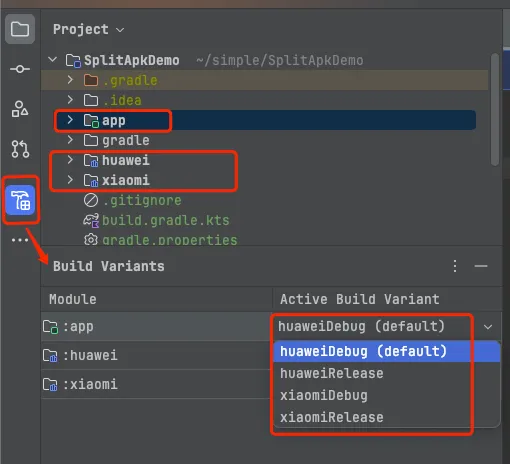

# Gradle 实现分功能打包
---
# 背景
在日常开发中，分功能打包是非常常见的需求。什么是分功能打包呢？<br>
分功能打包有两个场景:
- 在一个 module 中拆分。
- 在不同 module 中拆分。如: 华为、小米上架的 apk 包含的功能不一样。
如果要实现分功能打包，必不可免的要用到 Gradle 的 `productFlavors`功能。对该功能不了解可看[该文章](https://developer.android.google.cn/build/build-variants?hl=zh-cn) <br>
下面按照这个两个场景，来分别用 Demo 来实现一下。
# 实现
## 同一个 Module 中拆分
> 在比较简单的项目或业务功能中比较多见。这里以免费与付费的功能进行拆分打包为例。
### 实现思路:
- 通过 `productFlavors` 定义 vip 与 free 两个变体
- 在 `src` 目录下创建不同文件夹实现功能区分（例如：创建 free、vip、main 三个文件夹。free 包含免费业务，vip 包含付费业务，main 为两者公共逻辑）
- 通过 `sourceSets` 根据不同变体指定代码路径
### 具体实现:
***创建不同文件夹 & 切换不同变体***


***build.gradle 配置***
```kts
android {
  //...
  defaultConfig {
    //...

    //设定变体维度
    flavorDimensions.apply {
      add("type")
    }
  }

  //定义变体
  productFlavors {
    create("free") {
      dimension = "type"
      applicationIdSuffix = ".free"
    }
    create("vip") {
      dimension = "type"
      applicationIdSuffix = ".vip"
    }
  }

  sourceSets {
    getByName("free") {
      // 指定代码路径
      java.srcDirs("src/free/java","src/main/java")
    }
    getByName("vip") {
      // 指定代码路径
      java.srcDirs("src/vip/java","src/main/java")
    }
  }
}
```
### 实现效果:
::: info 此处我们用不同的页面来实现。free apk 点击跳转至 FreeActivity；vip apk 点击跳转至 VipActivity。
:::


## 不同 Module 中拆分
> 该场景常见于分渠道实现功能。例如，华为、小米不同apk，继承各自的 push 等。这里以华为、小米两个apk显示不同内容为例。
### 实现思路：
- 通过 `productFlavors` 定义 huawei 与 xiaomi 两个变体
- 创建两个 `moudle` (huawei、xiaomi)，在 `res` 中定义字符串 `channel_name`。
- 根据 `productFlavors` + `dependencies`，实现按变体添加依赖
### 具体实现：
***定义不同 module & 切换不同变体***

***build.gradle 配置***
```kts
android {
  //...
  defaultConfig {
    //...

    //设定变体维度
    flavorDimensions.apply {
      add("channel")
    }
  }

  //定义变体
  productFlavors {
    create("huawei"){
      dimension = "channel"
      applicationIdSuffix = ".huawei"
    }
    create("xiaomi"){
      dimension = "channel"
      applicationIdSuffix = ".xiaomi"
    }
  }
}

dependencies {
  //...

  //根据变体添加依赖
  "huaweiImplementation"(project(":huawei"))
  "xiaomiImplementation"(project(":xiaomi"))
}
```
### 实现效果：
::: info 此处我们在 huawei module 下定义 `channel_name=huawei`，xiaomi module 下定义 `channel_name=xiaomi`。然后在 app module 下使用 `channel_name`。
:::


# Demo 源码
[分功能打包 Demo](https://github.com/StefanShan/simple/tree/master/SplitApkDemo)
# 推荐阅读
- [【Gradle-19】Android多渠道打包指南](https://juejin.cn/post/7396254541916078132)