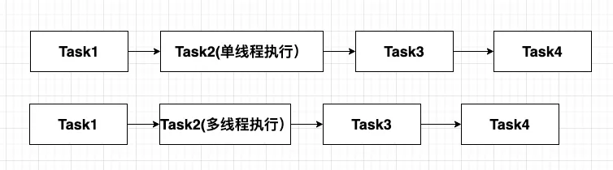

# 性能优化-Gradle 编译优化
---
# Gradle 生命周期

# Gradle 编译检测
## Build Scan
### 指令
```shell
./gradlew build --scan
#or
#./gradlew :app:assembleRealse --scan
```
执行完成后，首次需要接受协议和绑定邮箱，之后就可以打开链接。
```shell {1,5}
Publishing a build scan to scans.gradle.com requires accepting the Gradle Terms of Service defined at https://gradle.com/terms-of-service. Do you accept these terms? [yes, no] yes 
Gradle Terms of Service accepted.

Publishing build scan...
https://gradle.com/s/trk37hbu4pqwa
```
打开链接后需要填写邮箱，之后会将报告发送到该邮箱

### 查看报告
打开分析报告，可以在 Timeline 中看到总体耗时、各模块耗时、每个模块的 Gradle Task 的耗时。

在 Performance 中可以看到编译整个生命周期的耗时情况。

## Profile Report
### 指令
```shell
./gradlew build --profile
#or
#./gradlew :app:assembleRealse --profile
```
```shell{4}
BUILD SUCCESSFUL in 1m 25s
907 actionable tasks: 907 executed

See the profiling report at: file:///Users/stefan/xxxxx/build/reports/profile/profile-2024-09-02-11-35-43.html
```
### 查看报告
生成的是一个静态页面，与 `--scan` 命令查看 `Performance` 的内容类似，可以看到整个编译周期的耗时情况，以及每个 Gradle Task 的耗时。


# 优化手段
## 基础调优
**升级版本** <br>
升级 `Gradle`、`Java`、`Android Gradle Plugin` 的版本。官方推荐是最新版本，因为最新版本会对性能进行优化。但此操作需谨慎，要考虑兼容性。<br>
<br>
**设置堆大小** <br>
在 `Android Studio - Setting` 中搜索 `Memory Settings`。建议配置时应不小于机器可用RAM的1/2，如电脑配置为16G内存，这里至少配置8G。

<br>

**启用并行**
```groovy
# 在 gradle.properties 中添加配置
org.gradle.parallel=true
```
<br>

**启用守护进程**<br>
默认情况下，Gradle 会启用 Daemon，但某些 build 会覆盖此首选项。在 Gradle 3.0 及更高版本中，守护进程会在内存压力下自动关闭，因此启用守护进程始终是安全的。
```groovy
# 在 gradle.properties 中添加配置
org.gradle.daemon=true
```
<br>

**禁用非必需Task**<br>
sync时有若干测试相关的Task，一般情况这些Task都使用不到，这里可以将其禁用掉加快sync速度。在项目根目录下的build.gradle中添加如下代码即可：
```groovy
allprojects {
    //sync 加速：禁用test相关task,mockableAndroidJar task。
    gradle.taskGraph.whenReady {
        tasks.each { task ->
            if (task.name.contains("Test")) {
                task.enabled = false
            } else if (task.name == "mockableAndroidJar") {
                task.enabled = false
            }
        }
    }
}
```
<br>

**配置 minSDKVersion** <br>
将主工程（应用级别工程）中build.gradle minSdkVersion 配置改为21或者更高。sdk version 21 对应Android 5.0系统。<br>
Android 5.0以前版本系统使用的Dalvik虚拟机，加载dex时是解释执行，对主dex要求比较高，主dex中类必须包含Application类及其关联类，否则启动时会出现NoClassDefFoundErrors问题导致crash。所以当minSdkVersion小于21时，最终dex生成时会分析代码依赖关系计算哪些类必须放在主dex中，这是一个非常耗时的操作。<br> 
而Android 5.0及其以上系统版本使用ART虚拟机，apk安装时会进行AOT静态编译操作，加载时对于主dex不再有特殊要求，当minSdkVersion为21或者更高版本时，主dex所属类计算这部分时间能完全节约下来。<br>
另外，非clean编译时对于dex支持增量编译，dex越多增量效果会越好，编译时只需要重新生成改动类所在的dex即可。minSdkVersion在[21, 23)范围内时，dex数量最多只有99个，超过99个时会强制合并成99个。这个限制和Android系统相关，Android 5.x系统最多只能运行99个dex的app。当minSdkVersion为23或更高版本时，dex数量大致为app所有模块（project、aar和jar）的数量。
<br>
<br>
**配置dexOptions** <br>
```groovy
android {
  //...
  dexOptions {
    //preDexLibraries: 声明是否预 dex, 非首次编译时并不会重新构建所有dex文件。
    preDexLibraries true
    //maxProcessCount：设置运行 dex-in-process 时要使用的最大线程数量。默认值为 4。
    maxProcessCount 8
  }
}
```
<br>

**开启aapt2** <br>
aapt不支持资源增量编译，每次修改资源时，所有资源都会重新进行编译。aapt2新增了资源增量编译的功能，非clean编译时能大大缩小资源编译的范围。
```groovy
# 在 gradle.properties 中添加配置
android.enableAapt2=true
```

## 利用缓存
### Configuration Cache
默认情况下，Gradle 不使用配置缓存。<br>
您可以通过启用配置缓存来缓存配置阶段的结果。当 build 配置输入在 build 之间保持不变时，配置缓存允许 Gradle 完全跳过配置阶段。
```groovy
# 在 gradle.properties 中添加配置
org.gradle.configuration-cache=true
```

### Build Cache
默认情况下，Gradle 不使用构建缓存。<br>
构建缓存是一种 Gradle 优化，用于存储特定输入的任务输出。当您稍后使用相同的输入运行同一任务时，Gradle 会从构建缓存中检索输出，而不是再次运行该任务。
```groovy
# 在 gradle.properties 中添加配置
org.gradle.caching=true=
```
#### Local Build Cache
> 存储目录: `.gradle/caches/build-cache-1/` <br>
> 详细配置可查看 [DirectoryBuildCache](https://docs.gradle.org/current/dsl/org.gradle.caching.local.DirectoryBuildCache.html) 的 DSL 文档
```groovy
//在 settings.gradle 中配置
buildCache {
  local {
      enabled = true
      removeUnusedEntriesAfterDays = 7
  }
}
```
#### Remote Build Cache
> - 尝试加载条目时，会向 `https://example.com:8123/cache/<cache-key>` 发出 GET 请求。响应必须具有 2xx 状态和缓存条目作为正文，如果条目不存在，则为 404 Not Found 状态。
> - 尝试存储条目时，会向 `https://example.com:8123/cache/<cache-key>` 发出 PUT 请求。任何 2xx 响应状态都将被解释为成功。可能会返回 413 Payload Too Large 响应，以指示有效负载大于服务器可以接受的负载，这不会被视为错误。<br>

> 详细配置可查看 [HttpBuildCache](https://docs.gradle.org/current/dsl/org.gradle.caching.http.HttpBuildCache.html) 的 DSL 文档
```groovy
//在 settings.gradle 中配置
buildCache {
  remote(HttpBuildCache) {
      enabled = true
      url = 'http://tt-build-cache.bytedance.net/cache/' // 你的 server 路径，别忘了末尾加上 /cache/
      push = true
  }
}
```
## 自定义 Task 与 Transform
### 自定义 Task
**支持增量** <br>
为每个Task定义输入（inputs）和输出（outputs）。如果在执行一个Task时，它的输入和输出与前一次执行时没有发生变化，那么Gradle便会认为该Task是最新的（UP-TO-DATE），将不予执行。<br>
有两种方式:
- 通过注解方式，指定输入输出
:::details 示例
```java
public class ProcessTemplates extends DefaultTask {

  @Input
  public TemplateEngineType getTemplateEngine() {
      return this.templateEngine;
  }

  @InputFiles
  public FileCollection getSourceFiles() {
      return this.sourceFiles;
  }

  @OutputDirectory
  public File getOutputDir() { 
    return this.outputDir;
  }
 }
```
:::
- 通过运行时 API 指定输入输出
::: details 示例
```groovy
tasks.register('processTemplatesAdHoc') {
  inputs.property('engine', TemplateEngineType.FREEMARKER)
  inputs.files(fileTree('src/templates'))
      .withPropertyName('sourceFiles')
      .withPathSensitivity(PathSensitivity.RELATIVE)
  inputs.property('templateData.name', 'docs')
  inputs.property('templateData.variables', [year: '2013'])
  outputs.dir(layout.buildDirectory.dir('genOutput2'))
      .withPropertyName('outputDir')

  doLast {
      // Process the templates here
  }
}
```
:::

**支持 Build Cache** <br>
与上面支持增量一样，可通过 `@CacheableTask` 注解或者运行时 API 声明 Task 支持 Build Cache，并指定输入输出。
:::details 注解示例
```groovy
@CacheableTask                                       
abstract class BundleTask extends NpmTask {

  @Override @Internal                              
  ListProperty<String> getArgs() {
      super.getArgs()
  }

  @InputDirectory
  @SkipWhenEmpty
  @PathSensitive(PathSensitivity.RELATIVE)         
  abstract DirectoryProperty getScripts()

  @InputFiles
  @PathSensitive(PathSensitivity.RELATIVE)         
  abstract ConfigurableFileCollection getConfigFiles()

  @OutputFile
  abstract RegularFileProperty getBundle()

  BundleTask() {
      args.addAll("run", "bundle")
      bundle = projectLayout.buildDirectory.file("bundle.js")
      scripts = projectLayout.projectDirectory.dir("scripts")
      configFiles.from(projectLayout.projectDirectory.file("package.json"))
      configFiles.from(projectLayout.projectDirectory.file("package-lock.json"))
  }
}

tasks.register('bundle', BundleTask)
```
:::
:::details 运行时 API 示例
```groovy
tasks.register('bundle', NpmTask) {
  args = ['run', 'bundle']

  outputs.cacheIf { true }

  inputs.dir(file("scripts"))
      .withPropertyName("scripts")
      .withPathSensitivity(PathSensitivity.RELATIVE)

  inputs.files("package.json", "package-lock.json")
      .withPropertyName("configFiles")
      .withPathSensitivity(PathSensitivity.RELATIVE)

  outputs.file(layout.buildDirectory.file("bundle.js"))
      .withPropertyName("bundle")
}
```
:::

**支持多线程** <br>
在开启多线程时需注意 Task 间依赖问题。如，Task 结束但线程没执行完成，而后面的 Task 需要依赖前者产物(outputs)时就会出现问题。

:::details 示例
```java
class MultiThreadTask extends Task {

  // task执行方法
  @TaskAction
  void run(){
    
    // 3条线程
    CountDownLatch countDownLatch = new CountDownLatch(3);
    ExecutorService executorService = Executors.newFixedThreadPool(3);
  
    // 多线程执行任务
    for (int i = 0; i < 3; i++) {
      executorService.submit(new Runner("runner" + i, countDownLatch));
    }
      
    countDownLatch.await();

  }
}
```
:::

**支持并发执行** <br>
并发执行 Task 是指可以与同一 project 下可以与其它 Task 并发执行的 Task，至于其内部是不是多线程执行并不重要。

:::details 示例
```java
abstract public class CreateMD5 extends SourceTask {

  @OutputDirectory
  abstract public DirectoryProperty getDestinationDirectory();

  @Inject
  abstract public WorkerExecutor getWorkerExecutor(); 

  @TaskAction
  public void createHashes() {
    WorkQueue workQueue = getWorkerExecutor().noIsolation(); 

    for (File sourceFile : getSource().getFiles()) {
      Provider<RegularFile> md5File = getDestinationDirectory().file(sourceFile.getName() + ".md5");
      workQueue.submit(GenerateMD5.class, parameters -> { 
          parameters.getSourceFile().set(sourceFile);
          parameters.getMD5File().set(md5File);
      });
    }
  }
}
```
:::

### 自定义 Transform
**支持增量** <br>
实现 `Transform` 的 `isIncremental()` 接口，支持增量能力。<br>
注意： 由于 transform 的输入输出是依次传递的，上一个 transform 的输出是下一个 transform 的输入。不支持增量的 transform 每次运行都会导致所有输出发生变化，这样即使后面支持增量的 transform 也会因为输入全部发生变化而导致增量失效。所以要支持增量的 transform 一定得放前面。

**支持多线程** <br>
在`Transform`的`transform()`方法中多线程处理相关逻辑。与 Task 支持多线程一样，也需要考虑通过 `CountDownLatch` 保证全部执行完成。

## 优化项目
### 组件化
组件化主要目的是将项目拆分成多 Module 格式，提高 Build Cache 命中。具体如何改造需要业务需求拆分。
### aar化
将模块aar化发布到maven仓库中，工程中采用坐标进行依赖（不再进行源码依赖）。开发时将对应模块切换成源码依赖即可。<br>
切换方式建议使用gradle官方提供的substitute方法，项目中使用原生api、implimentation依赖即可。
> 在回归或正式打包时推荐源码编译
::: details 示例
```groovy
// 使用坐标依赖替换源码模块依赖
configurations.all {
  resolutionStrategy.dependencySubstitution {
    substitute module("org.utils:api") with project(":api") 
    substitute module("org.utils:util:2.5") with project(":util")
  }
}
```
:::
## 远程编译
整体思路：
- 本地代码推送至打包服务器（可通过 Linux rsync）
- 打包服务器执行打包指令
- 本地同步打包服务器结果（可通过 Linux rsync）

开源项目：
- mainframer
- Mirakle

# 推荐阅读
- [提高 Gradle 构建的性能](https://docs.gradle.org/current/userguide/performance.html)
- [使用 Build Cache](https://docs.gradle.org/current/userguide/build_cache.html)
- [增量构建](https://docs.gradle.org/current/userguide/incremental_build.html)
- [开发并行任务](https://docs.gradle.org/current/userguide/worker_api.html)
- [检测 Gradle Builds](https://docs.gradle.org/current/userguide/inspect.html)
- [源码和AAR的依赖替换指南](https://juejin.cn/post/7354940230301696009)
- [mainframer](https://github.com/buildfoundation/mainframer)
- [Mirakle](https://github.com/skrugly/mirakle)
- [Mainframer / Mirakle 的使用](https://blog.stylingandroid.com/mainframer-mirakle/)
- [Mainframer + Docker 加快 Android 构建速度](https://medium.com/@balachandarkm/speed-up-android-builds-with-mainframer-docker-container-in-a-powerful-remote-machine-ce7b9e122a49)
- [使用 Windows 主机进行 Android 代码远程编译](https://juejin.cn/post/7296754045863329807)
- [docker file(记得删除)](https://gist.github.com/balachandarlinks/3a470e2667692e3000bffbeb487d9759)