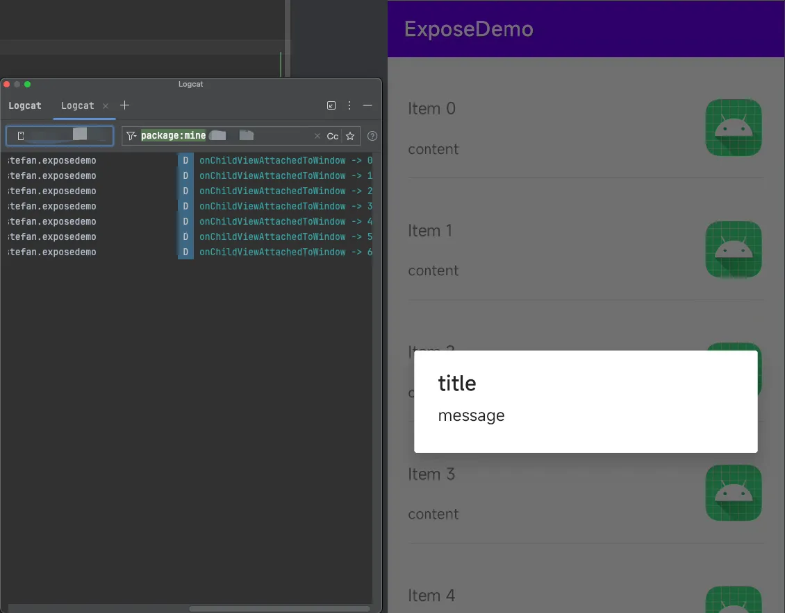
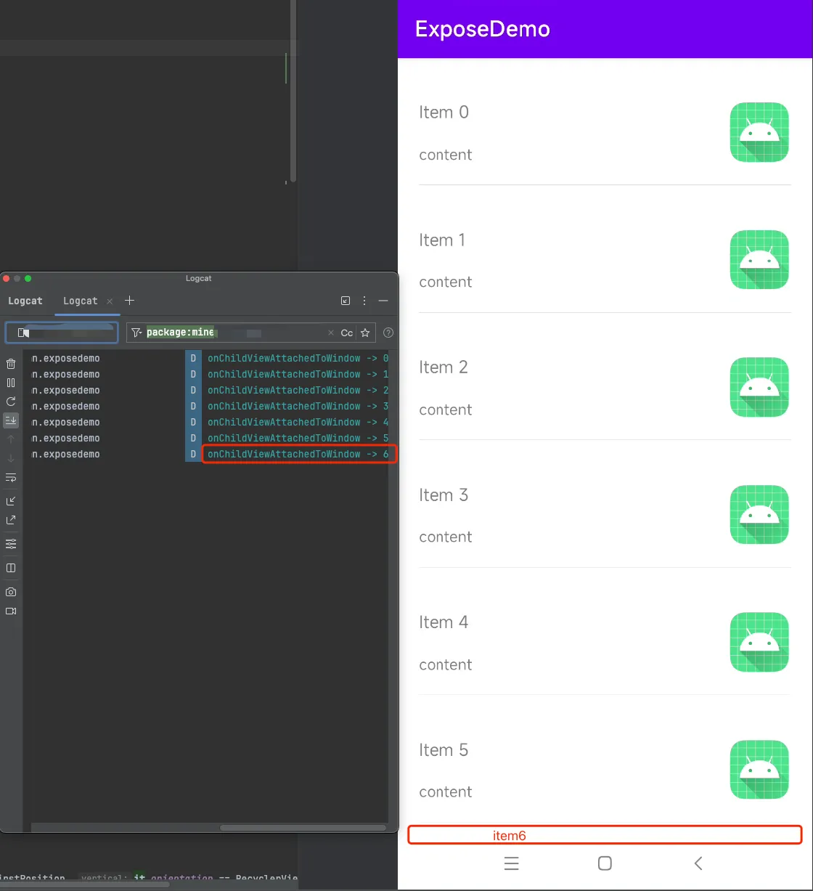
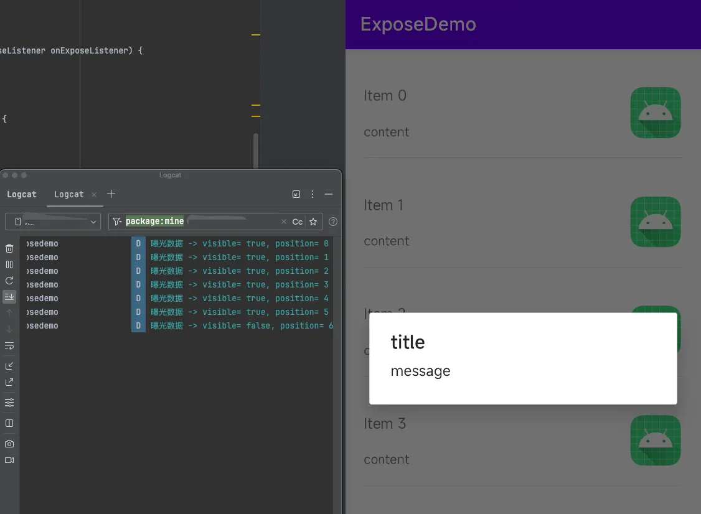
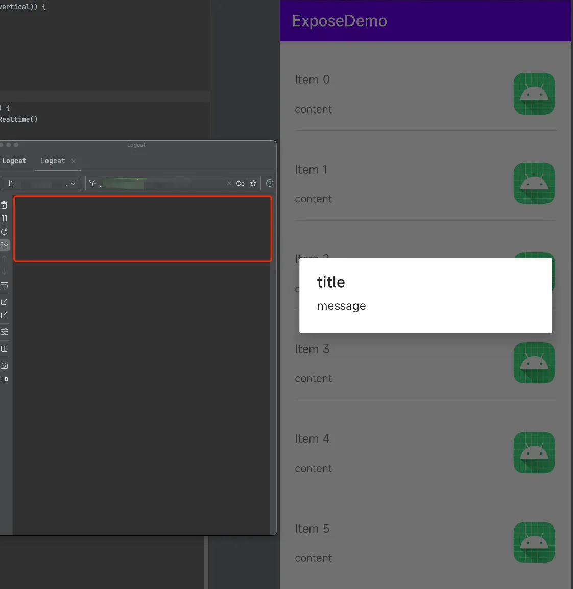
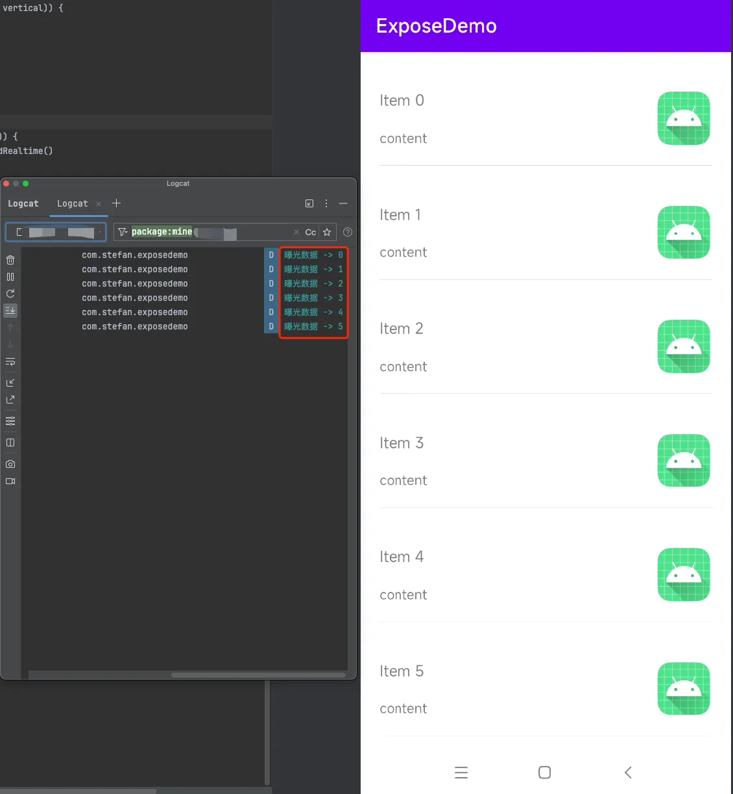
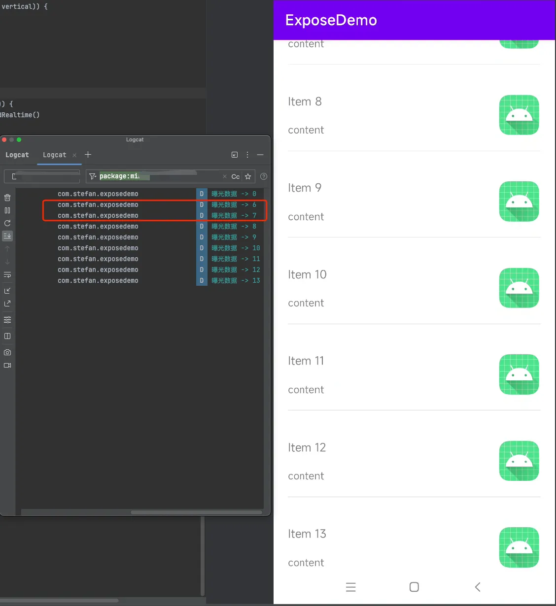
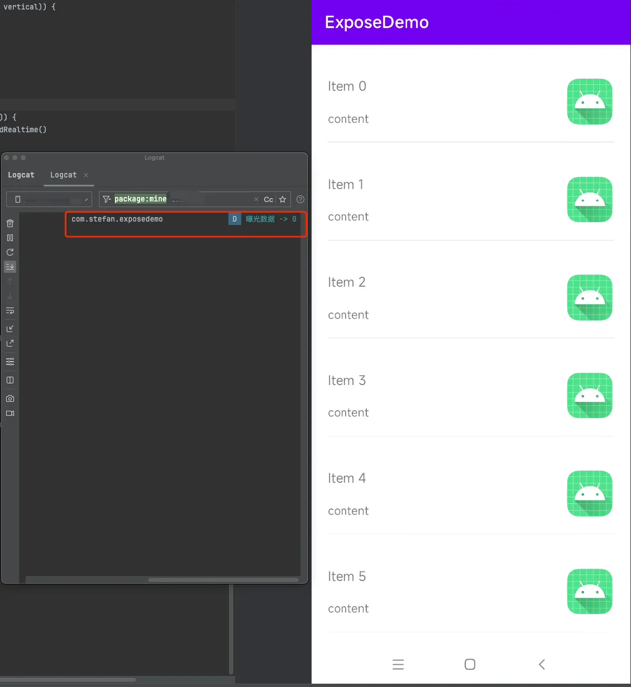

# RecycerView 有效曝光埋点实现方案
---
# 背景
最近参加面试，被问到一个实景问题：RecyclerView 如何实现曝光埋点？<br>
我：很久之前做过，大体是监听滑动和 View 的显示比例然后上报。<br>
面试官：在 bindViewHolder 中监听上报。<br>
我：（内心）bindViewHolder 不太可行吧，没法进行有效曝光条件判断啊，但没试过不敢造次。🐶 <br>
面试后复盘,觉得这个问题是一个很常见的场景，应该总结一下，顺便验证下面试官的思路。于是就有了这篇文章。
# 分析
> Q1: 什么是 RecyclerView 曝光埋点 

用户滑动列表，列表中的数据显示出来，并能被用户看到，即为曝光。

> Q2: 什么是有效曝光

用户滑动列表，列表中的数据除了能被用户看到，还需要满足一定条件(如显示区域 > 50% & 曝光时间 > 1.5s)，即为有效曝光。有效曝光判断可以过滤用户快速滑动的场景。

# 方案
> 赶时间，直接看[“监听滑动，将满足条件的 ItemView 进行曝光埋点”](#node_1)部分或[完整代码](#node_2)。

## bindViewHolder
我理解，面试官提到 bindViewHolder 监听，意思应该是监听 ItemView 的 attach 与 detach。<br>
结论：无法实现曝光及有效曝光埋点。 <br>
主要有以下两个问题：<br>
1. 如果 recyclerView 被遮挡，attch 仍会触发。
2. 只要 ItemView 进入到显示区域（1像素也可）即会触发 attch，无法保证 ItemView 被用户看到。

代码实现：
```kotlin
recyclerView.addOnChildAttachStateChangeListener(object : RecyclerView.OnChildAttachStateChangeListener{
    override fun onChildViewAttachedToWindow(view: View) {
        "onChildViewAttachedToWindow -> ${recyclerView.findContainingViewHolder(view)?.adapterPosition}".toLog()
    }

    override fun onChildViewDetachedFromWindow(view: View) {
        "onChildViewDetachedFromWindow -> ${recyclerView.findContainingViewHolder(view)?.adapterPosition}".toLog()
    }
} )
```
- 问题一：recyclerView 被遮挡
效果：
> 在 recycerView 被遮挡时，仍触发 attch


- 问题二：无法保证 ItemView 被用户看到
效果：
> 第六个数据项还未被用户看到，但已触发 attch


## 监听滑动 & 计算 View 显示比例
监听 attach 和 detach 无法保证用户是否真正看到。所以再来试下滑动监听方式。<br>
思路：监听 onScrollListener，滑动时判断是否显示来实现曝光监听。<br>
通过监听滑动又可细分两种方式：
1. 监听滑动，然后获取显示的第一个 ItemView 与 显示的最后一个 ItemView，然后拿到这个区间的 ItemView（即真正显示的 ItemView）将其上报。
2. 监听滑动，然后获取显示的第一个 ItemView 与 显示的最后一个 ItemView，判断其显示区域比例和显示时长，将满足条件的 ItemView 进行上报。

下面来分别看下这两个细分方案：<br>
### 监听滑动，将区间 ItemView 进行曝光埋点
结论：这种方式可以实现曝光埋点,但也有两个问题：
1. 如果 recyclerView 被遮挡，仍会触发判断。
2. 无法判断显示时长（即无法实现有效曝光），且重复数据过多

代码实现：
> 代码节选自 [曝光埋点方案：recyclerView中的item曝光逻辑实现](https://blog.csdn.net/hfy8971613/article/details/100184601)
```java
int[] range = new int[2];
mRecyclerView.addOnScrollListener(new RecyclerView.OnScrollListener() {
    @Override
    public void onScrolled(RecyclerView recyclerView, int dx, int dy) {
        super.onScrolled(recyclerView, dx, dy);
        manager = (LinearLayoutManager)recyclerView.getLayoutManager();
        range[0] = manager.findFirstVisibleItemPosition();
        range[1] = manager.findLastVisibleItemPosition();
        for (int i = range[0]; i <= range[1]; i++) {
            View view = manager.findViewByPosition(i);
            setCallbackForLogicVisibleView(view, i, orientation);
        }
    }

});

private void setCallbackForLogicVisibleView(View view, int position, int orientation) {
    if (view == null || view.getVisibility() != View.VISIBLE ||
            !view.isShown() || !view.getGlobalVisibleRect(new Rect())) {
        return;
    }
    Rect rect = new Rect();
    boolean cover = view.getGlobalVisibleRect(rect);
    //item逻辑上可见：可见且可见高度（宽度）>view高度（宽度）50%才行
    boolean visibleHeightEnough = orientation == OrientationHelper.VERTICAL && rect.height() > view.getMeasuredHeight() / 2;
    boolean visibleWidthEnough = orientation == OrientationHelper.HORIZONTAL && rect.width() > view.getMeasuredWidth() / 2;
    boolean isItemViewVisibleInLogic = visibleHeightEnough || visibleWidthEnough;
    // 回调触发曝光埋点
    if (cover && mIsRecyclerViewVisibleInLogic && isItemViewVisibleInLogic) {
        mItemOnExposeListener.onItemViewVisible(true, position);
    }else {
        mItemOnExposeListener.onItemViewVisible(false, position);
    }
}
```
- 问题一：recyclerView 被遮挡
效果：
> 在recyclerView 被遮挡，仍会触发判断


- 问题二：无法判断时长，且重复数据多
效果:
> 由于是区间，所以快速滑动也会触发上报。


### 监听滑动，将满足条件的 ItemView 进行曝光埋点 {#node_1}
该方案是基于上面区间方案，进行优化。解决了两个：
1. recyclerView 被遮挡时不触发埋点
2. 实现显示区域比例+时长的有效曝光
3. 【尽量】避免重复数据

实现思路：
- 通过监听 viewTreeObserver#addOnWindowFocusChangeListener() 判断是否被遮挡
- 滑动时通过判断滑动方向+显示区域比例，自行实现 attach 与 detach
- 通过自行实现 attach 与 detach，即可实现显示时长的判断，将满足条件的 ItemView 进行收集
- 在滑动结束时将收集的 ItemView 与显示的 ItemView 进行曝光埋点

核心代码实现：
```kotlin
//首屏数据，直接上报
recyclerView.viewTreeObserver.apply {
    addOnWindowFocusChangeListener {
        if (!it) return@addOnWindowFocusChangeListener
        recyclerView.layoutManager?.let { layoutManager ->
            val isVertical = layoutManager.canScrollVertically()
            for (i in 0 until recyclerView.childCount) {
                val view = recyclerView[i]
                if (checkExposeView(view, isVertical)) {
                    set.add(ExposeData(view, i))
                }
            }
            notifyExposeListener()
        }
    }
}
//滑动监听
recyclerView.addOnScrollListener(object : RecyclerView.OnScrollListener() {

    override fun onScrollStateChanged(recyclerView: RecyclerView, newState: Int) {
        super.onScrollStateChanged(recyclerView, newState)
        when (newState) {
            RecyclerView.SCROLL_STATE_IDLE -> {
                set.addAll(cacheViewWithExposeTimeMap.keys.map {
                    ExposeData(it, recyclerView.getChildAdapterPosition(it))
                })
                cacheViewWithExposeTimeMap.clear()
                cachePositionWithViewMap.clear()
                notifyExposeListener()
            }
        }
    }

    override fun onScrolled(recyclerView: RecyclerView, dx: Int, dy: Int) {
        super.onScrolled(recyclerView, dx, dy)
        recyclerView.layoutManager?.let {
            when (it::class) {
                LinearLayoutManager::class -> {
                    it as LinearLayoutManager
                    val firstPosition = it.findFirstVisibleItemPosition()
                    val lastPosition = it.findLastVisibleItemPosition()
                    //判断滑动方向，并将满足条件的 ItemView 进行收集
                    if (dy > 0 || dx > 0) {
                        markLinearLayoutExpose(recyclerView, lastPosition, firstPosition, it.orientation == RecyclerView.VERTICAL)
                    } else {
                        markLinearLayoutExpose(recyclerView, firstPosition, lastPosition, it.orientation == RecyclerView.VERTICAL)
                    }
                }
                else -> return
            }
        }
    }
})
```
效果：
- recyclerView 被遮挡
> 被遮挡时未触发


> 不遮挡时，将首屏数据上报

- 满足条件（显示区域 >= 50% & 曝光时间 >= 1.5s）
> 向上滑动，Item6 与 Item7 满足条件，则收集。滑动结束后，将收集的满足条件的 ItemView + 正在显示的 ItemView 进行曝光埋点


#### 缺点
虽然进行了优化，但仍不可避免的出现重复数据的情况，相较于“区间曝光”要少很多。<br>
触发场景：在界面上下小幅度滑动，会导致第一个和最后一个 ItemView 被计算进入。<br>
效果：


# 完整代码 {#node_2}
> [RecycerViewExposeDemo](https://github.com/StefanShan/simple/tree/master/recyclerViewExpose)
# 参考
- [曝光埋点方案：recyclerView中的item曝光逻辑实现](https://blog.csdn.net/hfy8971613/article/details/100184601)
- [曝光埋点：深度解析RecyclerView Item展现监听方法](https://www.bytezonex.com/archives/OplbUMBj.html)