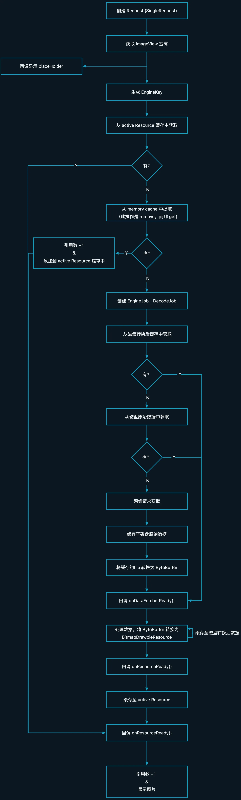

# 源解 Glide - 网络图片加载流程
---
> 声明：<br>
> - 基于 Glide.with(this).load("xxxx.webp").into(imageView) 调用
> - Glide 版本为 V4.10.0

# 阅读源码
## Glide.with()
```java
public class Glide implements ComponentCallbacks2 {
    @NonNull
    public static RequestManager with(@NonNull Context context) {
        // step1: 首先调用 getRetriever() 获取到 RequestManagerRetriever 对象
        // step2: 调用 RequestManagerRetriever#get() 获取 RequestManager 对象
        return getRetriever(context).get(context);
    }
}
```
### getRetriever()内部逻辑
下面我们先阅读 getRetriever() 部分的源码。先说一下该方法主要做了哪些事情：
1. 解析、添加 GlideModule 配置
2. 创建 Glide 对象，配置一些基础配置，例如：缓存大小、线程池等
3. 添加内存变化监听

talk is cheap, show me the code
```java
public class Glide implements ComponentCallbacks2 {

    //调用 getRetriever()内部逻辑:
    //  Glide.get(context) 如果没有初始化过 Glide，则最终会调用 initializeGlide() 创建 Glide 对象并返回该对象，如果初始化过则直接返回 Glide 对象
    //  getRequestManagerRetriever() 即获取 Glide 对象中持有的 requestManagerRetriever 
    private static RequestManagerRetriever getRetriever(@Nullable Context context) {
        return Glide.get(context).getRequestManagerRetriever();
    }

    private static void initializeGlide(@NonNull Context context, @NonNull GlideBuilder builder, @Nullable GeneratedAppGlideModule annotationGeneratedModule) {
        Context applicationContext = context.getApplicationContext();
        
        // 解析、添加 Mainfest GlideModule 配置
        // 添加 GlideModule 注解配置
        //...

        // 调用到 GlideBuilder.build() 方法，配置一些基础配置，如缓存大小、线程池等。
        Glide glide = builder.build(applicationContext);

        //...
        
        //注册监听内存变化
        applicationContext.registerComponentCallbacks(glide);
        Glide.glide = glide;
    }

    //返回 Glide 持有的 requestManagerRetriever对象
    public RequestManagerRetriever getRequestManagerRetriever() {
        return requestManagerRetriever;
    }
}
```
下面重点看两部分：
#### Glide 对象的创建
内部逻辑：
- 添加基础配置：
    - 创建用于加载内存资源、磁盘资源、动画资源的线程池
    - 创建 arrayPool、memoryCache、bitmapCache、diskCache
- 监听网络变化
- 创建 RequestManagerRetriever 对象
- 创建 Engine 对象
- 创建 Glide 对象
```java
public final class GlideBuilder {
    Glide build(@NonNull Context context) {
        if (this.sourceExecutor == null) {
            // 用于加载内存资源的线程池，线程数 <= 4 ( min(4, Cpu核数) )
            this.sourceExecutor = GlideExecutor.newSourceExecutor();
        }

        if (this.diskCacheExecutor == null) {
            // 用于加载磁盘资源的线程池，线程数 = 1
            this.diskCacheExecutor = GlideExecutor.newDiskCacheExecutor();
        }

        if (this.animationExecutor == null) {
            // 用于处理动画的线程池，线程数 <= 2 (Cpu核数 >= 4 时为 2，否则为 1)
            this.animationExecutor = GlideExecutor.newAnimationExecutor();
        }

        if (this.memorySizeCalculator == null) {
            // 内存计算器，内部维护了一些用于后面内存计算的“常量”
            //   如: 
            //      - arrayPool大小 = RAM <= 1G ? 2M : 4M
            //		- 应用最大内存 = 应用内存 * (RAM <= 1G ? 0.33F : 0.4F)
            //		- targetBitmapPool大小 = 屏幕宽 * 屏幕高 * 4 * (os < 8.0 ? 4 : (RAM <=1G ? 0 : 1))
            //      - targetMemoryCache大小 = 屏幕宽 * 屏幕高 * 4 * 2.0F
            //      - 可用内存大小 = 应用最大内存 - arrayPool大小
            //      - bitmapPoolSize = (targetBitmapPool大小 + targetMemoryCache大小 <= 可用内存大小) ? targetBitmapPool大小 : 可用内存大小 / ((os < 8.0 ? 4 : (RAM <=1G ? 0 : 1)) + 2.0F) * (os < 8.0 ? 4 : (RAM <=1G ? 0 : 1))
            //		- memoryCacheSize = (targetBitmapPool大小 + targetMemoryCache大小 <= 可用内存大小) ? targetMemoryCache大小 : 可用内存大小 / ((os < 8.0 ? 4 : (RAM <=1G ? 0 : 1)) + 2.0F) * 2.0F
            this.memorySizeCalculator = (new MemorySizeCalculator.Builder(context)).build();
        }

        if (this.connectivityMonitorFactory == null) {
            // 用于监听网络状态变化
            this.connectivityMonitorFactory = new DefaultConnectivityMonitorFactory();
        }

        if (this.bitmapPool == null) {
            int size = this.memorySizeCalculator.getBitmapPoolSize();
            if (size > 0) {
                //有内存空间，则创建 LruBitmapPool。
                //  内部根据系统版本使用不同策略生成Key， os >= 4.4 ? bitmapSize + bitmapConfig : bitmapWidth + bitmapHeight + bitmapConfig
                this.bitmapPool = new LruBitmapPool((long)size);
            } else {
                //无复用池
                this.bitmapPool = new BitmapPoolAdapter();
            }
        }

        if (this.arrayPool == null) {
            // 创建一个 LruArrayPool，大小为 RAM <= 1G ? 2M : 4M
            this.arrayPool = new LruArrayPool(this.memorySizeCalculator.getArrayPoolSizeInBytes());
        }

        if (this.memoryCache == null) {
            // 创建内存资源缓存池
            this.memoryCache = new LruResourceCache((long)this.memorySizeCalculator.getMemoryCacheSize());
        }

        if (this.diskCacheFactory == null) {
            // 创建磁盘缓存，默认大小约256M
            this.diskCacheFactory = new InternalCacheDiskCacheFactory(context);
        }

        if (this.engine == null) {
            // 创建 Engine
            this.engine = new Engine(this.memoryCache, this.diskCacheFactory, this.diskCacheExecutor, this.sourceExecutor, GlideExecutor.newUnlimitedSourceExecutor(), this.animationExecutor, this.isActiveResourceRetentionAllowed);
        }

        // 请求监听器
        if (this.defaultRequestListeners == null) {
            this.defaultRequestListeners = Collections.emptyList();
        } else {
            this.defaultRequestListeners = Collections.unmodifiableList(this.defaultRequestListeners);
        }

        // 创建 RequestManagerRetriever，后面用于监听生命周期变化
        RequestManagerRetriever requestManagerRetriever = new RequestManagerRetriever(this.requestManagerFactory);
        // 构建 Glide 对象 
        //	- 内部会持有传入参数
        //	- 创建一个 Register 对象，该对象持有各种处理组件（如，解析器、解码器、转码器等）
        //	- 创建 GlideContext 对象，对象持有传入参数，并持有新创建的 ImageViewTargetFactory 对象。
        return new Glide(context, this.engine, this.memoryCache, this.bitmapPool, this.arrayPool, requestManagerRetriever, this.connectivityMonitorFactory, 
                        this.logLevel,  // 4
                        this.defaultRequestOptionsFactory, // 一个 RequestOptions 对象
                        this.defaultTransitionOptions, //  Map<Class<?>, TransitionOptions<?, ?>> 对象, 全局 GlideBuilder 配置时添加的转换器
                        this.defaultRequestListeners, // 一个 List<RequestListener<Object>> 对象，注册的请求监听器
                        this.isLoggingRequestOriginsEnabled, // false
                        this.isImageDecoderEnabledForBitmaps, // false
                        this.hardwareBitmapFdLimit, // 700
                        this.minHardwareDimension // 128
                        );
    }
}
```
::: details Engine 构造方法
```java
public class Engine implements EngineJobListener, MemoryCache.ResourceRemovedListener, EngineResource.ResourceListener {

    public Engine(
      MemoryCache memoryCache,
      DiskCache.Factory diskCacheFactory,
      GlideExecutor diskCacheExecutor,
      GlideExecutor sourceExecutor,
      GlideExecutor sourceUnlimitedExecutor,
      GlideExecutor animationExecutor,
      boolean isActiveResourceRetentionAllowed) {
    this(
        memoryCache,
        diskCacheFactory,
        diskCacheExecutor,
        sourceExecutor,
        sourceUnlimitedExecutor,
        animationExecutor,
        /*jobs=*/ null,
        /*keyFactory=*/ null,
        /*activeResources=*/ null,
        /*engineJobFactory=*/ null,
        /*decodeJobFactory=*/ null,
        /*resourceRecycler=*/ null,
        isActiveResourceRetentionAllowed);
  }
}
```
:::
::: details Glide 构造方法 {#glide构造函数}
```java
public class Glide implements ComponentCallbacks2 {
    Glide(
      @NonNull Context context,
      @NonNull Engine engine,
      @NonNull MemoryCache memoryCache,
      @NonNull BitmapPool bitmapPool,
      @NonNull ArrayPool arrayPool,
      @NonNull RequestManagerRetriever requestManagerRetriever,
      @NonNull ConnectivityMonitorFactory connectivityMonitorFactory,
      int logLevel,
      @NonNull RequestOptionsFactory defaultRequestOptionsFactory,
      @NonNull Map<Class<?>, TransitionOptions<?, ?>> defaultTransitionOptions,
      @NonNull List<RequestListener<Object>> defaultRequestListeners,
      boolean isLoggingRequestOriginsEnabled,
      boolean isImageDecoderEnabledForBitmaps,
      int hardwareBitmapFdLimit,
      int minHardwareDimension) {

        //持有传入的参数
        this.engine = engine;
        this.bitmapPool = bitmapPool;
        this.arrayPool = arrayPool;
        this.memoryCache = memoryCache;
        this.requestManagerRetriever = requestManagerRetriever;
        this.connectivityMonitorFactory = connectivityMonitorFactory;
        this.defaultRequestOptionsFactory = defaultRequestOptionsFactory;

        //获取 Resources 对象 // [!code focus:2]
        final Resources resources = context.getResources(); 

        //创建一个 Register 对象，该对象持有各种处理组件（如，解析器、解码器、转码器等）// [!code focus:2]
        registry = new Registry();
        registry.register(new DefaultImageHeaderParser());
        if (Build.VERSION.SDK_INT >= Build.VERSION_CODES.O_MR1) {
            registry.register(new ExifInterfaceImageHeaderParser());
        }

        List<ImageHeaderParser> imageHeaderParsers = registry.getImageHeaderParsers();
        ByteBufferGifDecoder byteBufferGifDecoder =new ByteBufferGifDecoder(context, imageHeaderParsers, bitmapPool, arrayPool);
        ResourceDecoder<ParcelFileDescriptor, Bitmap> parcelFileDescriptorVideoDecoder =VideoDecoder.parcel(bitmapPool);

        ResourceDecoder<ByteBuffer, Bitmap> byteBufferBitmapDecoder;
        ResourceDecoder<InputStream, Bitmap> streamBitmapDecoder;
        if (isImageDecoderEnabledForBitmaps && Build.VERSION.SDK_INT >= Build.VERSION_CODES.P) {
            streamBitmapDecoder = new InputStreamBitmapImageDecoderResourceDecoder();
            byteBufferBitmapDecoder = new ByteBufferBitmapImageDecoderResourceDecoder();
        } else {
            Downsampler downsampler =new Downsampler(registry.getImageHeaderParsers(), resources.getDisplayMetrics(), bitmapPool, arrayPool);
            byteBufferBitmapDecoder = new ByteBufferBitmapDecoder(downsampler);
            streamBitmapDecoder = new StreamBitmapDecoder(downsampler, arrayPool);
        }

        ResourceDrawableDecoder resourceDrawableDecoder = new ResourceDrawableDecoder(context);
        ResourceLoader.StreamFactory resourceLoaderStreamFactory = new ResourceLoader.StreamFactory(resources);
        ResourceLoader.UriFactory resourceLoaderUriFactory = new ResourceLoader.UriFactory(resources);
        ResourceLoader.FileDescriptorFactory resourceLoaderFileDescriptorFactory = new ResourceLoader.FileDescriptorFactory(resources);
        ResourceLoader.AssetFileDescriptorFactory resourceLoaderAssetFileDescriptorFactory = new ResourceLoader.AssetFileDescriptorFactory(resources);
        BitmapEncoder bitmapEncoder = new BitmapEncoder(arrayPool);

        BitmapBytesTranscoder bitmapBytesTranscoder = new BitmapBytesTranscoder();
        GifDrawableBytesTranscoder gifDrawableBytesTranscoder = new GifDrawableBytesTranscoder();

        ContentResolver contentResolver = context.getContentResolver();

        // 根据不同的数据类型，注册不同的解码器、转码器等 // [!code focus:12]
        registry
            .append(ByteBuffer.class, new ByteBufferEncoder())
            .append(InputStream.class, new StreamEncoder(arrayPool))
            /* Bitmaps */
            .append(Registry.BUCKET_BITMAP, ByteBuffer.class, Bitmap.class, byteBufferBitmapDecoder)
            .append(Registry.BUCKET_BITMAP, InputStream.class, Bitmap.class, streamBitmapDecoder)
            .append( Registry.BUCKET_BITMAP, ParcelFileDescriptor.class, Bitmap.class, parcelFileDescriptorVideoDecoder)
            .append(Registry.BUCKET_BITMAP, AssetFileDescriptor.class, Bitmap.class, VideoDecoder.asset(bitmapPool))
            .append(Bitmap.class, Bitmap.class, UnitModelLoader.Factory.<Bitmap>getInstance())
            .append(Registry.BUCKET_BITMAP, Bitmap.class, Bitmap.class, new UnitBitmapDecoder())
            .append(Bitmap.class, bitmapEncoder)
            /* BitmapDrawables */
            .append(Registry.BUCKET_BITMAP_DRAWABLE, ByteBuffer.class, BitmapDrawable.class, new BitmapDrawableDecoder<>(resources, byteBufferBitmapDecoder))
            .append(Registry.BUCKET_BITMAP_DRAWABLE, InputStream.class, BitmapDrawable.class, new BitmapDrawableDecoder<>(resources, streamBitmapDecoder))
            .append(Registry.BUCKET_BITMAP_DRAWABLE, ParcelFileDescriptor.class,BitmapDrawable.class, new BitmapDrawableDecoder<>(resources, parcelFileDescriptorVideoDecoder))
            .append(BitmapDrawable.class, new BitmapDrawableEncoder(bitmapPool, bitmapEncoder))
            /* GIFs */
            .append(Registry.BUCKET_GIF, InputStream.class, GifDrawable.class, new StreamGifDecoder(imageHeaderParsers, byteBufferGifDecoder, arrayPool))
            .append(Registry.BUCKET_GIF, ByteBuffer.class, GifDrawable.class, byteBufferGifDecoder)
            .append(GifDrawable.class, new GifDrawableEncoder())
            /* GIF Frames */
            // Compilation with Gradle requires the type to be specified for UnitModelLoader here.
            .append(GifDecoder.class, GifDecoder.class, UnitModelLoader.Factory.<GifDecoder>getInstance())
            .append(Registry.BUCKET_BITMAP, GifDecoder.class, Bitmap.class, new GifFrameResourceDecoder(bitmapPool))
            /* Drawables */
            .append(Uri.class, Drawable.class, resourceDrawableDecoder)
            .append(Uri.class, Bitmap.class, new ResourceBitmapDecoder(resourceDrawableDecoder, bitmapPool))
            /* Files */
            .register(new ByteBufferRewinder.Factory())
            .append(File.class, ByteBuffer.class, new ByteBufferFileLoader.Factory())
            .append(File.class, InputStream.class, new FileLoader.StreamFactory())
            .append(File.class, File.class, new FileDecoder())
            .append(File.class, ParcelFileDescriptor.class, new FileLoader.FileDescriptorFactory())
            // Compilation with Gradle requires the type to be specified for UnitModelLoader here.
            .append(File.class, File.class, UnitModelLoader.Factory.<File>getInstance())
            /* Models */
            .register(new InputStreamRewinder.Factory(arrayPool))
            .append(int.class, InputStream.class, resourceLoaderStreamFactory)
            .append(int.class, ParcelFileDescriptor.class, resourceLoaderFileDescriptorFactory)
            .append(Integer.class, InputStream.class, resourceLoaderStreamFactory)
            .append(Integer.class, ParcelFileDescriptor.class, resourceLoaderFileDescriptorFactory)
            .append(Integer.class, Uri.class, resourceLoaderUriFactory)
            .append(int.class, AssetFileDescriptor.class, resourceLoaderAssetFileDescriptorFactory)
            .append(Integer.class, AssetFileDescriptor.class, resourceLoaderAssetFileDescriptorFactory)
            .append(int.class, Uri.class, resourceLoaderUriFactory)
            .append(String.class, InputStream.class, new DataUrlLoader.StreamFactory<String>())
            .append(Uri.class, InputStream.class, new DataUrlLoader.StreamFactory<Uri>())
            .append(String.class, InputStream.class, new StringLoader.StreamFactory())
            .append(String.class, ParcelFileDescriptor.class, new StringLoader.FileDescriptorFactory())
            .append(String.class, AssetFileDescriptor.class, new StringLoader.AssetFileDescriptorFactory())
            .append(Uri.class, InputStream.class, new HttpUriLoader.Factory())
            .append(Uri.class, InputStream.class, new AssetUriLoader.StreamFactory(context.getAssets()))
            .append(Uri.class, ParcelFileDescriptor.class, new AssetUriLoader.FileDescriptorFactory(context.getAssets()))
            .append(Uri.class, InputStream.class, new MediaStoreImageThumbLoader.Factory(context))
            .append(Uri.class, InputStream.class, new MediaStoreVideoThumbLoader.Factory(context))
            .append(Uri.class, InputStream.class, new UriLoader.StreamFactory(contentResolver))
            .append(Uri.class, ParcelFileDescriptor.class, new UriLoader.FileDescriptorFactory(contentResolver))
            .append(Uri.class, AssetFileDescriptor.class, new UriLoader.AssetFileDescriptorFactory(contentResolver))
            .append(Uri.class, InputStream.class, new UrlUriLoader.StreamFactory())
            .append(URL.class, InputStream.class, new UrlLoader.StreamFactory())
            .append(Uri.class, File.class, new MediaStoreFileLoader.Factory(context))
            .append(GlideUrl.class, InputStream.class, new HttpGlideUrlLoader.Factory())
            .append(byte[].class, ByteBuffer.class, new ByteArrayLoader.ByteBufferFactory())
            .append(byte[].class, InputStream.class, new ByteArrayLoader.StreamFactory())
            .append(Uri.class, Uri.class, UnitModelLoader.Factory.<Uri>getInstance())
            .append(Drawable.class, Drawable.class, UnitModelLoader.Factory.<Drawable>getInstance())
            .append(Drawable.class, Drawable.class, new UnitDrawableDecoder())
            /* Transcoders */
            .register(Bitmap.class, BitmapDrawable.class, new BitmapDrawableTranscoder(resources))
            .register(Bitmap.class, byte[].class, bitmapBytesTranscoder)
            .register(Drawable.class, byte[].class, new DrawableBytesTranscoder(bitmapPool, bitmapBytesTranscoder, gifDrawableBytesTranscoder))
            .register(GifDrawable.class, byte[].class, gifDrawableBytesTranscoder);

        //创建 GlideContext 对象，对象持有传入参数，并持有新创建的 ImageViewTargetFactory 对象。 // [!code focus:13]
        ImageViewTargetFactory imageViewTargetFactory = new ImageViewTargetFactory();
        glideContext =new GlideContext(
                context,
                arrayPool,
                registry,
                imageViewTargetFactory,
                defaultRequestOptionsFactory,
                defaultTransitionOptions,
                defaultRequestListeners,
                engine,
                isLoggingRequestOriginsEnabled,
                logLevel);
  }
}
```
:::
#### 注册监听内存变化
内部逻辑：
- 系统内存回调时，调用 trimMemory()，其内部会分别调用 Requestmanager、memoryCache、bitmapPool、arrayPool 的 trimMemory()， 根据不同等级调整内存占用；
- 系统内存紧张时，调用 clearMemory()，其内部会分别调用 memoryCache、bitmapPool、arrayPool 的 clearMemory()，释放内存
```java
public class Glide implements ComponentCallbacks2 {

    // 响应系统内存管理
    public void onTrimMemory(int level) {
        this.trimMemory(level);
    }

    public void trimMemory(int level) {
        Util.assertMainThread();
        Iterator var2 = this.managers.iterator();

        //调用 RequestManager#onTrimMemory()
        while(var2.hasNext()) {
            RequestManager manager = (RequestManager)var2.next();
            // level == 60 && pauseAllOnTrim ? pauseAllRequests : ignore
            manager.onTrimMemory(level);
        }

        // level >=40 ? clear : (level >= 20 || level == 15 ? maxSize/2L : ignore)
        this.memoryCache.trimMemory(level);
        // level >= 40 || os >= 6.0 && level >= 20 ? clear : (level >=20 || level == 15 ? maxSize/2L : ignore)
        this.bitmapPool.trimMemory(level);
        // level >=40 ? clear : (level >= 20 || level == 15 ? maxSize/2L : ignore)
        this.arrayPool.trimMemory(level);
    }

    // 响应系统内存紧张
    public void onLowMemory() {
        this.clearMemory();
    }

    public void clearMemory() {
        Util.assertMainThread();
        this.memoryCache.clearMemory();
        this.bitmapPool.clearMemory();
        this.arrayPool.clearMemory();
    }
}
```
### get() 内部逻辑
内部根据 context 的类型区分实现逻辑，如果是 Activity 或 FragmentActivity 则添加生命周期监听。但最终都会调用 RequestManagerFactory 创建并返回一个 RequestManager 对象。
```java
public class RequestManagerRetriever implements Handler.Callback{ 
    public RequestManager get(@NonNull Context context) {
        // context !is Applciation : 创建一个 Frament 监听生命周期并持有 RequestManager 对象，方法返回 RequestManager 对象
        if (Util.isOnMainThread() && !(context instanceof Application)) {
            if (context instanceof FragmentActivity) {
                return this.get((FragmentActivity)context);
            }

            if (context instanceof Activity) {
                return this.get((Activity)context);
            }

            if (context instanceof ContextWrapper && ((ContextWrapper)context).getBaseContext().getApplicationContext() != null) {
                return this.get(((ContextWrapper)context).getBaseContext());
            }
        }
        //context is Application : 直接调用 fractroy.build() 创建 RequestManager 对象
        return this.getApplicationManager(context);
    }
}
```
::: details RequestManager 创建
```java
public class RequestManagerRetriever implements Handler.Callback{ 

    //默认 factory 为 null，此时执行默认创建
    public RequestManagerRetriever(@Nullable RequestManagerFactory factory) {
        this.factory = factory != null ? factory : DEFAULT_FACTORY;
        handler = new Handler(Looper.getMainLooper(), this /* Callback */);
    }

    private static final RequestManagerFactory DEFAULT_FACTORY =
      new RequestManagerFactory() {
        @NonNull
        @Override
        public RequestManager build(
            @NonNull Glide glide,
            @NonNull Lifecycle lifecycle,
            @NonNull RequestManagerTreeNode requestManagerTreeNode,
            @NonNull Context context) {
          return new RequestManager(glide, lifecycle, requestManagerTreeNode, context);
        }
    };
}
```
```java
public class RequestManager implements ComponentCallbacks2, LifecycleListener, ModelTypes<RequestBuilder<Drawable>> {
    RequestManager(Glide glide, Lifecycle lifecycle, RequestManagerTreeNode treeNode, RequestTracker requestTracker, ConnectivityMonitorFactory factory, Context context) {
        this.targetTracker = new TargetTracker(); //维护生命周期监听者
        this.addSelfToLifecycle = new Runnable() {
            public void run() {
                RequestManager.this.lifecycle.addListener(RequestManager.this);
            }
        };
        this.mainHandler = new Handler(Looper.getMainLooper());
        this.glide = glide;
        this.lifecycle = lifecycle;
        this.treeNode = treeNode;
        this.requestTracker = requestTracker;
        this.context = context;
        this.connectivityMonitor = factory.build(context.getApplicationContext(), new RequestManagerConnectivityListener(requestTracker)); //监听网络状态变化
        //监听生命周期、网络状态变化，用于下发至 TargetTracker、RequestTracker
        if (Util.isOnBackgroundThread()) {
            this.mainHandler.post(this.addSelfToLifecycle);
        } else {
            lifecycle.addListener(this); 
        }

        lifecycle.addListener(this.connectivityMonitor);
        this.defaultRequestListeners = new CopyOnWriteArrayList(glide.getGlideContext().getDefaultRequestListeners());
        this.setRequestOptions(glide.getGlideContext().getDefaultRequestOptions());
        //将自身添加的 glide 对象维护的 requestManager List 中
        glide.registerRequestManager(this);
    }
}
```
:::
## RequestManager.load()
内部主要逻辑为：创建 RequestBuilder 对象，其持有 glide 对象、requestManager 对象、资源类型(默认 Drawable)、context、url字符串
```java
public class RequestManager implements ComponentCallbacks2, LifecycleListener, ModelTypes<RequestBuilder<Drawable>> {
    public RequestBuilder<Drawable> load(@Nullable String string) {
        // step1: 调用 asDrawable() 创建 RequestBuilder<Drawable>
        // step2: 调用 RequestBuilder#load() 存储请求信息
        return this.asDrawable().load(string);
    }
}
```
### asDrawable()
```java
public class RequestManager implements ComponentCallbacks2, LifecycleListener, ModelTypes<RequestBuilder<Drawable>> {
    public RequestBuilder<Drawable> asDrawable() {
        return this.as(Drawable.class);
    }

    public <ResourceType> RequestBuilder<ResourceType> as(@NonNull Class<ResourceType> resourceClass) {
        // 看一下 RequestBuilder 构造函数
        return new RequestBuilder(this.glide, this, resourceClass, this.context);
    }
}
```
```java
public class RequestBuilder<TranscodeType> extends BaseRequestOptions<RequestBuilder<TranscodeType>> implements Cloneable, ModelTypes<RequestBuilder<TranscodeType>> {

    protected RequestBuilder(@NonNull Glide glide, RequestManager requestManager, Class<TranscodeType> transcodeClass, Context context) {
        this.isDefaultTransitionOptionsSet = true;
        this.glide = glide;
        this.requestManager = requestManager;
        this.transcodeClass = transcodeClass;
        this.context = context;
        // 默认 defaultTransition 为空，返回 GenericTransitionOptions 对象
        this.transitionOptions = requestManager.getDefaultTransitionOptions(transcodeClass);
        this.glideContext = glide.getGlideContext();
        // 默认  defaultRequestListener 为空，如果有值则添加到 RequestBuilder 维护的 RequestListener List 中
        this.initRequestListeners(requestManager.getDefaultRequestListeners());
        this.apply(requestManager.getDefaultRequestOptions());
    }
}
```
### load()
```java
public class RequestBuilder<TranscodeType> extends BaseRequestOptions<RequestBuilder<TranscodeType>> implements Cloneable, ModelTypes<RequestBuilder<TranscodeType>> {

    public RequestBuilder<TranscodeType> load(@Nullable String string) {
        return this.loadGeneric(string);
    }
    //记录下请求信息
    private RequestBuilder<TranscodeType> loadGeneric(@Nullable Object model) {
        this.model = model;
        this.isModelSet = true;
        return this;
    }
}
```
## RequestBuilder.into()
内部逻辑：
- 根据 ImageView scaleType 属性配置 requestOptions
- 创建 Request 对象
- 获取 target(此处为 ImageView) 之前的请求，进行比较，如果是同一个 & 之前的请求已完成 & 请求不做缓存，则直接复用之前的请求
- 如果 target(此处为 ImageView) 之前的请求与新建请求(Request 对象)不一样，则取消 target 请求，发起新的请求
```java
public class RequestBuilder<TranscodeType> extends BaseRequestOptions<RequestBuilder<TranscodeType>> implements Cloneable, ModelTypes<RequestBuilder<TranscodeType>> {

    public ViewTarget<ImageView, TranscodeType> into(@NonNull ImageView view) {
        BaseRequestOptions<?> requestOptions = this;
        // 根据 ImageView scaleType 属性配置 requestOptions
        if (!this.isTransformationSet() && this.isTransformationAllowed() && view.getScaleType() != null) {
            switch (view.getScaleType()) {
                case CENTER_CROP:
                    requestOptions = this.clone().optionalCenterCrop();
                    break;
                case CENTER_INSIDE:
                    requestOptions = this.clone().optionalCenterInside();
                    break;
                case FIT_CENTER:
                case FIT_START:
                case FIT_END:
                    requestOptions = this.clone().optionalFitCenter();
                    break;
                case FIT_XY:
                    requestOptions = this.clone().optionalCenterInside();
                case CENTER:
                case MATRIX:
            }
        }
        //调用 glideContext.buildImageViewTarget() 此处传入 ImageView, DrawableClass，内部根据 Drawable.class 创建一个 DrawableImageViewTarget 对象，并且其持有传入的 ImageView
        return (ViewTarget)this.into(this.glideContext.buildImageViewTarget(view, this.transcodeClass), (RequestListener)null, (BaseRequestOptions)requestOptions, Executors.mainThreadExecutor());
    }

    // @params target : DrawableImageViewTarget 对象
    // @params targetListener: null
    // @params options : requestOptions
    // @params callbackExecutor : 主线程
    private <Y extends Target<TranscodeType>> Y into(@NonNull Y target, @Nullable RequestListener<TranscodeType> targetListener, BaseRequestOptions<?> options, Executor callbackExecutor) {
        // step1: 创建 Request 对象，最终调用到 buildRequestRecursive()
        Request request = this.buildRequest(target, targetListener, options, callbackExecutor);
        Request previous = target.getRequest();
        // 如果请求是同一个，并且之前的请求已完成&设置不做内存缓存，则复用之前的请求
        if (request.isEquivalentTo(previous) && !this.isSkipMemoryCacheWithCompletePreviousRequest(options, previous)) {
            if (!((Request)Preconditions.checkNotNull(previous)).isRunning()) {
                previous.begin();
            }

            return target;
        } else {
            this.requestManager.clear(target);	//取消之前的请求，重新创建请求
            target.setRequest(request);	//view.setTag(tagId, request)
            // step2: 建立新的请求
            this.requestManager.track(target, request);
            return target;
        }
    }
}
```
### buildRequest()
内部逻辑：包含 error、thumb 的处理，此处我们执行默认调用，没有设置，所以最终创建 SingleRequest 对象
```java
public class RequestBuilder<TranscodeType> extends BaseRequestOptions<RequestBuilder<TranscodeType>> implements Cloneable, ModelTypes<RequestBuilder<TranscodeType>> {
    /**
     * RequestBuilder.class
     */
    // 最终调用到 buildRequestRecursive()
    // @params requestLock : new Object()
    // @params target : DrawableImageViewTarget
    // @params targetListener : null
    // @params parentCoordinator : null
    // @params transitionOptions : GenericTransitionOptions
    // @params priority : Priority.NORMAL
    // @params overrideWidth : -1
    // @params overrideHeight : -1
    // @params requestOptions: options
    // @params callbackExecutor: 主线程
    private Request buildRequestRecursive(Object requestLock, Target<TranscodeType> target, @Nullable RequestListener<TranscodeType> targetListener, @Nullable RequestCoordinator parentCoordinator, TransitionOptions<?, ? super TranscodeType> transitionOptions, Priority priority, int overrideWidth, int overrideHeight, BaseRequestOptions<?> requestOptions, Executor callbackExecutor) {
        ErrorRequestCoordinator errorRequestCoordinator = null;
        // 这里我们没有设置 error()，即 errorBuilder = null
        if (this.errorBuilder != null) {
            errorRequestCoordinator = new ErrorRequestCoordinator(requestLock, (RequestCoordinator)parentCoordinator);
            parentCoordinator = errorRequestCoordinator;
        }
        // 真正创建 Request 
        Request mainRequest = this.buildThumbnailRequestRecursive(requestLock, target, targetListener, (RequestCoordinator)parentCoordinator, transitionOptions, priority, overrideWidth, overrideHeight, requestOptions, callbackExecutor);
        if (errorRequestCoordinator == null) {
            return mainRequest;
        }
        // ...
    }

    private Request buildThumbnailRequestRecursive(Object requestLock, Target<TranscodeType> target, RequestListener<TranscodeType> targetListener, @Nullable RequestCoordinator parentCoordinator, TransitionOptions<?, ? super TranscodeType> transitionOptions, Priority priority, int overrideWidth, int overrideHeight, BaseRequestOptions<?> requestOptions, Executor callbackExecutor) {
        if (this.thumbnailBuilder != null) {
            // 这里没有设置 thumbnail(RequestBuilder thumbnailRequest), 此处逻辑省略
        } else if (this.thumbSizeMultiplier != null) {
            // 这里没有设置 thumbnail(float sizeMultiplier), 此处逻辑省略
        } else {
            return this.obtainRequest(requestLock, target, targetListener, requestOptions, parentCoordinator, transitionOptions, priority, overrideWidth, overrideHeight, callbackExecutor);
        }
    }

    //创建一个 SingleRequest 对象，即 buildRequestRecursive() 返回的值
    private Request obtainRequest(Object requestLock, Target<TranscodeType> target, RequestListener<TranscodeType> targetListener, BaseRequestOptions<?> requestOptions, RequestCoordinator requestCoordinator, TransitionOptions<?, ? super TranscodeType> transitionOptions, Priority priority, int overrideWidth, int overrideHeight, Executor callbackExecutor) {
        return SingleRequest.obtain(this.context, this.glideContext, requestLock, this.model, this.transcodeClass, requestOptions, overrideWidth, overrideHeight, priority, target, targetListener, this.requestListeners, requestCoordinator, this.glideContext.getEngine(), transitionOptions.getTransitionFactory(), callbackExecutor);
    }
}
```
### requestManager.track()
```java
public class RequestManager implements ComponentCallbacks2, LifecycleListener, ModelTypes<RequestBuilder<Drawable>> {

    synchronized void track(@NonNull Target<?> target, @NonNull Request request) {
        // 将 DrawableImageViewTarget 添加到 TargetTracker 维护的 targets Set 中
        targetTracker.track(target);
        //启动请求
        requestTracker.runRequest(request);
    }
}
```
```java
public class RequestTracker {

    //维护一个弱引用持有对象的 Set
    private final Set<Request> requests = Collections.newSetFromMap(new WeakHashMap<Request, Boolean>());

    public void runRequest(@NonNull Request request) {
        //添加到 requests Set 中
        requests.add(request);
         //如果没有暂停，则开始请求，否则取消请求，添加到 pendingRequests List 中
        if (!isPaused) {
            request.begin();
        } else {
            request.clear();
            pendingRequests.add(request);
        }
    }
}
```
#### 发起请求
> 内部逻辑：
- 先获取 target 大小。如果之前设置过 overrideWidth、overrideHeight 则直接使用，调用onSizeReady()；否则获取 target 的大小，获取成功则回调 onSizeReady()。
- 在获取 target 大小之后判断当前状态，如果请求状态 = 正在请求｜等待 target 大小，并且canNotifyStatusChanged() 返回 true 则回调通过显示 placeHolder。
- 当获取到 target 大小后，设置缩略图比例，然后执行加载
```java
public final class SingleRequest<R> implements Request, SizeReadyCallback, ResourceCallback {
    public void begin() {
        synchronized(this.requestLock) {
            //...
            this.status = SingleRequest.Status.WAITING_FOR_SIZE;
            // 这里默认没有设置大小，所以走 else 逻辑
            if (Util.isValidDimensions(this.overrideWidth, this.overrideHeight)) {
                this.onSizeReady(this.overrideWidth, this.overrideHeight);
            } else {
                // 获取 ImageView 的宽高，调用 ViewTarget#getSize()
                //  回调到 onSizeReady()
                this.target.getSize(this);
            }

            if ((this.status == SingleRequest.Status.RUNNING || this.status == SingleRequest.Status.WAITING_FOR_SIZE) && canNotifyStatusChanged()) {
                // 回调通知 ImageViewTaget onLoadStarted()，显示 placeHolder drawable
                this.target.onLoadStarted(this.getPlaceholderDrawable());
            }
        }
    }

    // 实现 SizeReadyCallback#onSizeReady()
    public void onSizeReady(int width, int height) {
        synchronized(this.requestLock) {
            if (this.status == SingleRequest.Status.WAITING_FOR_SIZE) {
                this.status = SingleRequest.Status.RUNNING;
                // 如果调用了 thumbnail(float sizeMultiplier), 则计算缩略图的宽高。 sizeMultiplier 默认 1.0F
                float sizeMultiplier = this.requestOptions.getSizeMultiplier();
                this.width = maybeApplySizeMultiplier(width, sizeMultiplier);
                this.height = maybeApplySizeMultiplier(height, sizeMultiplier);
                //执行加载
                this.loadStatus = this.engine.load(this.glideContext, this.model, this.requestOptions.getSignature(), this.width, this.height, this.requestOptions.getResourceClass(), this.transcodeClass, this.priority, this.requestOptions.getDiskCacheStrategy(), this.requestOptions.getTransformations(), this.requestOptions.isTransformationRequired(), this.requestOptions.isScaleOnlyOrNoTransform(), this.requestOptions.getOptions(), this.requestOptions.isMemoryCacheable(), this.requestOptions.getUseUnlimitedSourceGeneratorsPool(), this.requestOptions.getUseAnimationPool(), this.requestOptions.getOnlyRetrieveFromCache(), this, this.callbackExecutor);
                if (this.status != SingleRequest.Status.RUNNING) {
                    this.loadStatus = null;
                }
            }
        }
    }

}
```
#### 执行加载
内部逻辑：
- 生成 Key。规则: 资源路径(此时为 url) + 签名 + ImageView 宽 + ImageView 高 + 变形配置 + 资源类型（此处为 Object） + 加载类型（此处为 Drawable）+ 加载配置
- 根据 key 先从内存缓存加载，没有则从磁盘加载，都没有则发起请求。否则缓存有的话直接返回
```java
public class Engine implements EngineJobListener, MemoryCache.ResourceRemovedListener, EngineResource.ResourceListener {

    // @params glideContext : GlideContext，即在 Glide.with() 中 new Glide() 内部创建
    // @params model : String，即 Glide.into() 传入的 ImageUrl
    // @params signature : 签名，默认 EmptySignature 
    // @params width : ImageView 宽
    // @params height : ImageView 高
    // @params resourceClass : Obejct.class
    // @params transcodeClass : Drawable.class
    // @params priority: Priority.NORMAL
    // @params diskCacheStrategy : DiskCacheStrategy.AUTOMATIC
    // @parmas transformations : CachedHashCodeArrayMap 对象，继承自ArrayMap
    // @params isTransformationRequired : false
    // @params isScaleOnlyOrNoTransform : true
    // @params options : Options 对象，实现接口 Key
    // @params isMemoryCacheable : true
    // @params useUnlimitedSourceExecutorPool :  false
    // @params useAnimationPool : false
    // @params onlyRetrieveFromCache : false
    // @params cb : SingleRequest 中实现回调
    // @params callbackExecutor : 主线程
    public <R> LoadStatus load(GlideContext glideContext, Object model, Key signature, int width, int height, Class<?> resourceClass, Class<R> transcodeClass, Priority priority, DiskCacheStrategy diskCacheStrategy, Map<Class<?>, Transformation<?>> transformations, boolean isTransformationRequired, boolean isScaleOnlyOrNoTransform, Options options, boolean isMemoryCacheable, boolean useUnlimitedSourceExecutorPool, boolean useAnimationPool, boolean onlyRetrieveFromCache, ResourceCallback cb, Executor callbackExecutor) {
        long startTime = VERBOSE_IS_LOGGABLE ? LogTime.getLogTime() : 0L;
        //生成 Key，即 new EngineKey()
        EngineKey key = this.keyFactory.buildKey(model, signature, width, height, transformations, resourceClass, transcodeClass, options);
        EngineResource memoryResource;
        synchronized(this) {
            //先从内存缓存中获取
            memoryResource = this.loadFromMemory(key, isMemoryCacheable, startTime);
            if (memoryResource == null) {
                //从磁盘缓存中获取，若没有则发起请求
                return this.waitForExistingOrStartNewJob(glideContext, model, signature, width, height, resourceClass, transcodeClass, priority, diskCacheStrategy, transformations, isTransformationRequired, isScaleOnlyOrNoTransform, options, isMemoryCacheable, useUnlimitedSourceExecutorPool, useAnimationPool, onlyRetrieveFromCache, cb, callbackExecutor, key, startTime);
            }
        }
        //如果内存缓存中有则直接 callback
        cb.onResourceReady(memoryResource, DataSource.MEMORY_CACHE);
        return null;
    }
}
```
##### 从内存中获取
```java
public class Engine implements EngineJobListener, MemoryCache.ResourceRemovedListener, EngineResource.ResourceListener {

    private EngineResource<?> loadFromMemory(EngineKey key, boolean isMemoryCacheable, long startTime) {
        //先从 ActiveResources#get(key) 中获取，内部维护了个 Map<Key,ResourceWeakReference>
        EngineResource<?> active = this.loadFromActiveResources(key);
        if (active != null) {
            return active;
        } else {
            // 从内存缓存中加载
            EngineResource<?> cached = this.loadFromCache(key);
            if (cached != null) {
                return cached;
            } else {
                return null;
            }
        }
    }

    // 从 active resource 中获取
    private EngineResource<?> loadFromActiveResources(Key key) {
        EngineResource<?> active = this.activeResources.get(key);
        // 如果有缓存，则引用数+1
        if (active != null) {
            active.acquire();
        }
        return active;
    }

    // 从内存缓存中获取
    private EngineResource<?> loadFromCache(Key key) {
        EngineResource<?> cached = this.getEngineResourceFromCache(key);
        // 如果有缓存，则引用数+1，并添加到 active resource 中。
        if (cached != null) {
            cached.acquire();
            this.activeResources.activate(key, cached);
        }
        return cached;
    }

    private EngineResource<?> getEngineResourceFromCache(Key key) {
        // 从 Map 中移除
        Resource<?> cached = this.cache.remove(key);
        EngineResource result;
        if (cached == null) {
            result = null;
        } else if (cached instanceof EngineResource) {
            result = (EngineResource)cached;
        } else {
            result = new EngineResource(cached, true, true, key, this);
        }
        return result;
    }
}
```
##### 从磁盘中获取
```java
public class Engine implements EngineJobListener, MemoryCache.ResourceRemovedListener, EngineResource.ResourceListener {

    private <R> LoadStatus waitForExistingOrStartNewJob(GlideContext glideContext, Object model, Key signature, int width, int height, Class<?> resourceClass, Class<R> transcodeClass, Priority priority, DiskCacheStrategy diskCacheStrategy, Map<Class<?>, Transformation<?>> transformations, boolean isTransformationRequired, boolean isScaleOnlyOrNoTransform, Options options, boolean isMemoryCacheable, boolean useUnlimitedSourceExecutorPool, boolean useAnimationPool, boolean onlyRetrieveFromCache, ResourceCallback cb, Executor callbackExecutor, EngineKey key, long startTime) {
        // Jobs 维护了两个 Map(jobs、onlyCacheJobs), 这里 onlyRetrieveFromCache 为 false，从 jobs Map 中获取。
        // 如何 key 相同，则直接复用之前的 Engine Job。
        //	第一次加载，所以为 null，则发起请求
        EngineJob<?> current = this.jobs.get(key, onlyRetrieveFromCache);
        if (current != null) {
            current.addCallback(cb, callbackExecutor);
            return new LoadStatus(cb, current);
        } else {
            // 创建 EngineJob 对象
            EngineJob<R> engineJob = this.engineJobFactory.build(key, isMemoryCacheable, useUnlimitedSourceExecutorPool, useAnimationPool, onlyRetrieveFromCache);
            // 创建 DecodeJob 对象
            //  其持有 EngineJob
            DecodeJob<R> decodeJob = this.decodeJobFactory.build(glideContext, model, key, signature, width, height, resourceClass, transcodeClass, priority, diskCacheStrategy, transformations, isTransformationRequired, isScaleOnlyOrNoTransform, onlyRetrieveFromCache, options, engineJob);
            this.jobs.put(key, engineJob);
            engineJob.addCallback(cb, callbackExecutor);
            //执行 DecodeJob
            engineJob.start(decodeJob);
            return new LoadStatus(cb, engineJob);
        }
    }
}
```
执行 DecodeJob，首先根据 DiskCacheStrategy 判断使用哪个线程池（此处使用 diskCacheExecutor 单线程池），然后在该线程池中执行 DecodeJob。
```java
class EngineJob<R> implements DecodeJob.Callback<R>, Poolable {

    public synchronized void start(DecodeJob<R> decodeJob) {
        this.decodeJob = decodeJob;
        //创建 Excutor, 返回为 diskCacheExecutor，即在 Glide.with() 中创建的 diskCacheExecutor，一个单线程的线程池
        //  willDecodeFromCache()的判断依据 DiskCacheStrategy，默认 AUTOMATIC，此处返回true
        GlideExecutor executor = decodeJob.willDecodeFromCache() ? this.diskCacheExecutor : this.getActiveSourceExecutor();
        // 执行 DecodeJob#run() 
        executor.execute(decodeJob);
    }
}
```
DecodeJob 实现 Runnable，所以直接在线程池执行其 run()。<br>
内部逻辑：
- 初始状态 `INITIALIZE`，通过 `getNextStage()` 获取下一步执行 `ResourceCacheGenerator`，即从转换后磁盘缓存获取。
- 当转换后磁盘缓存没有，则继续 `getNextStage()` 获取下一步执行 `DataCacheGenerator`，即从原始资源磁盘缓存获取。
- 当原始资源磁盘缓存没有，则继续 `getNextStage()` 获取下一步执行 `SourceGenerator`，即从源头（网络请求）获取。但需要换一下线程池，所以执行 `reschedule()`，其最终执行结果为通过 SourceExecutor 线程池再次调用 `runWrapped()`。
- 当通过 SourceExecutor 线程池再次调用 `runWrapped()`，此时状态为`SWITCH_TO_SOURCE_SERVICE`，所以执行 `SourceGenerator#startNext()`，即[发起请求](#发起请求)
```java
class DecodeJob<R> implements DataFetcherGenerator.FetcherReadyCallback, Runnable, Comparable<DecodeJob<?>>, Poolable {

    public void run() {
        //如果取消，则回调失败，释放资源，如重置 EngineJob 参数
        if (isCancelled) {
            notifyFailed();
            return;
        }
        runWrapped();
    }

    private void runWrapped() {
        switch (this.runReason) {
            // 初次执行，默认为 INITIALIZE
            case INITIALIZE:
                stage = getNextStage(Stage.INITIALIZE);
                //根据 stage 值，返回 ResourceCacheGenerator 对象
                currentGenerator = getNextGenerator();
                runGenerators();
                break;
            // 当 stage == DecodeJob.Stage.SOURCE,通过回调再次执行 run() 时，会执行到此处
            case SWITCH_TO_SOURCE_SERVICE:
                //此时再次执行 runGenerators 时，执行的是 SourceGenerator#startNext()
                runGenerators();
                break;
            case DECODE_DATA:
                decodeFromRetrievedData();
                break;
            default:
                throw new IllegalStateException("Unrecognized run reason: " + this.runReason);
        }
    }

    private void runGenerators() {
        boolean isStarted = false;
        //这里分别调用了 ResourceCacheGenerator 和 DataCacheGenerator 的 startNext()，用于读取磁盘缓存，如果有则返回，没有则 isStarted = false
        while(!isCancelled && currentGenerator != null && !(isStarted = currentGenerator.startNext())) {
            stage = getNextStage(stage);
            currentGenerator = getNextGenerator();
            // 当执行完 DataCacheGenerator 仍没有缓存，则 getNextStage() 返回 sstage = DecodeJob.Stage.SOURCE
            // 此时 stage == DecodeJob.Stage.SOURCE，即 currentGenerator = SourceGenerator。然后调用 reschedule() 再次触发 runWrapperd()。
            if (stage == DecodeJob.Stage.SOURCE) {
                reschedule();
                return;
            }
        }
    }

    public void reschedule() {
        runReason = RunReason.SWITCH_TO_SOURCE_SERVICE;
        // 该 callback 会回到 EngineJob.class 中，其又会通过 sourceExecutor 执行 DecodeJob#run()。
        //   sourceExecutor 在 Glide.with() 中创建，一个线程数 <=4 的线程池
        callback.reschedule(this);
    }
}
```
##### 发起请求
内部逻辑：
- 通过 model 获取 ModelLoader，由于此处 model 是链接字符串，所以 ModelLoader 为 `HttpGlideUrlLoader`。转换关系是在 Glide 构造时注册到 Register 中，详细可看[Glide 构造方法代码](#glide构造函数)。
- 以此遍历可处理的 ModelLoader，此处执行 `HttpUrlFetcher#loadData()`，发起请求，请求结果通过 `onDataReady()` 和 `onLoadFailed()` 返回。
- 请求成功，回调 onDataReady()，由于 DiskCacheStrategy = AUTOMATIC，所以将数据赋值给 `dataToCache` 字段，然后调用 `rechedule()`，最终次调用到 `startNext()`。解析来就是[磁盘缓存](#磁盘缓存)

```java
class SourceGenerator implements DataFetcherGenerator, DataFetcher.DataCallback<Object>, DataFetcherGenerator.FetcherReadyCallback {

    public boolean startNext() {
        //....

        sourceCacheGenerator = null;
        loadData = null;
        boolean started = false;
        while (!started && hasNextModelLoader()) {
            // 通过 model 转换获取 ModelLoader，此处 model 为图片链接字符串，通过转换获得 HttpGlideUrlLoader。
            //   mode 与 modelLoader 转换关系是在 Glide 构造函数中添加到 Register 中的。
            loadData = helper.getLoadData().get(loadDataListIndex++);
            if (loadData != null && (helper.getDiskCacheStrategy().isDataCacheable(loadData.fetcher.getDataSource()) || helper.hasLoadPath(loadData.fetcher.getDataClass()))) {
                started = true;
                // 通过 HttpGlideUrlLoader 可知，此处调用的时 HttpUrlFetcher.loadData()，其内部逻辑即通过 HttpURLConnection 网络请求获取结果，超时时间为 2500ms，不支持网络缓存
                //  请求结果通过 DataFetcher.DataCallback 返回，此处传入 this，即该类实现了 onDataReady() 和 onLoadFailed() 回调方法。
                loadData.fetcher.loadData(helper.getPriority(), this);
            }
        }
        return started;
    }

    // 请求成功回调
    public void onDataReady(Object data) {
        DiskCacheStrategy diskCacheStrategy = helper.getDiskCacheStrategy();
        if (data != null && diskCacheStrategy.isDataCacheable(loadData.fetcher.getDataSource())) {
            // 默认 DiskCacheStrategy.AUTOMATIC, 走此处逻辑。
            //  记录数据，再次调用 reschedule()，目的是在请求数据时可能在其他线程中，此操作可回到 Glide 自己的线程中。
            //  再次调用 rechedule() 又会回到 DecodeJob.run()，最后又执行到 SourceGenerator.startNext()，此时 dataToCache 已有值。
            dataToCache = data;
            cb.reschedule();
        } else {
            cb.onDataFetcherReady(
                loadData.sourceKey,
                data,
                loadData.fetcher,
                loadData.fetcher.getDataSource(),
                originalKey);
        }
    }

    // 经过 DataCacheGenerator 将 cache file 转换成 ByteBuffer 后回调
    @Override
    public void onDataFetcherReady(Key sourceKey, Object data, DataFetcher<?> fetcher, DataSource dataSource, Key attemptedKey) {
        // 继续回调到 DecodeJob.class 中
        //   此处 dataSource 没有透传，而是采用了 HttpUrlFetcher.dataSource，即 DataSource.REMOTE
        cb.onDataFetcherReady(sourceKey, data, fetcher, loadData.fetcher.getDataSource(), sourceKey);
    }
}
```
#### 磁盘缓存
内部逻辑：
- 接上一节，再次执行 `startNext()` 此时 dataToCache != null，执行 `cacheData()`，内部会将数据缓存（写入本地文件，此处为原始数据缓存），并创建 `DataCacheGenerator` 对象。
- 继续执行，由于上一步创建了 `DataCacheGenerator` 对象，并赋值给 `sourceCacheGenerator`，所以执行 `DataCacheGenerator#startNext()`。其内部会读取上一步的缓存数据，并通过对应的 ModelLoader 将数据转换成 ByteBuffer，转换完成回调 `onDataFetcherReady()`。
- 最终回调到 `DecodeJob#onDataFetcherReady()`，内部会将 ByteBuffer 转换成 BitmapDrawableResource，转换过程中发生 transformation 操作，转换完成后回调 `EngineJob#onResourceReady()` 并将其缓存（写入本地，此处为转换后数据缓存）。

**缓存原始数据**
```java 
class SourceGenerator implements DataFetcherGenerator, DataFetcher.DataCallback<Object>, DataFetcherGenerator.FetcherReadyCallback {

    public boolean startNext() {
        //当数据请求回来后，再次触发回到 startNetxt()，此时走 cacheData()
        if (dataToCache != null) {
            Object data = dataToCache;
            dataToCache = null;
            // 内部逻辑为，将数据进行缓存，并创建 DataCacheGenerator 对象
            //  sourceCacheGenerator = new DataCacheGenerator(Collections.singletonList(loadData.sourceKey), helper, this);
            cacheData(data);
        }
        // 数据请求回来，缓存完成，则调用 DataCacheGenerator#startNext()
        //   其内部逻辑为，将缓存的 cacheFile 转换成 ByteBuffer，并将处理后的结果通过 callback.onDataFetcherReady() 返回到 SourceGenerator.class.
        if (sourceCacheGenerator != null && sourceCacheGenerator.startNext()) {
            return true;
        }
        //....
        return started;
    }

    private void cacheData(Object dataToCache) {
        long startTime = LogTime.getLogTime();
        try {
            Encoder<Object> encoder = helper.getSourceEncoder(dataToCache);
            DataCacheWriter<Object> writer = new DataCacheWriter<>(encoder, dataToCache, helper.getOptions());
            //生成原始数据的 Key，此处 sourceKey 为 url字符串，signature 为 EmptySignature
            originalKey = new DataCacheKey(loadData.sourceKey, helper.getSignature());
            // 将原始数据写入本地文件
            helper.getDiskCache().put(originalKey, writer);
        } finally {
            loadData.fetcher.cleanup();
        }
        //创建 DataCacheGenerator 对象，用于后续将 file 转成 byteBuffer 并通过 onDataFetcherReady() 回调返回
        sourceCacheGenerator = new DataCacheGenerator(Collections.singletonList(loadData.sourceKey), helper, this);
    }

    // 请求成功回调
    public void onDataReady(Object data) {
        DiskCacheStrategy diskCacheStrategy = helper.getDiskCacheStrategy();
        if (data != null && diskCacheStrategy.isDataCacheable(loadData.fetcher.getDataSource())) {
            // 默认 DiskCacheStrategy.AUTOMATIC, 走此处逻辑。
            //  记录数据，再次调用 reschedule()，目的是在请求数据时可能在其他线程中，此操作可回到 Glide 自己的线程中。
            //  再次调用 rechedule() 又会回到 DecodeJob.run()，最后又执行到 SourceGenerator.startNext()，此时 dataToCache 已有值。
            dataToCache = data;
            cb.reschedule();
        } else {
            cb.onDataFetcherReady(loadData.sourceKey, data, loadData.fetcher, loadData.fetcher.getDataSource(), originalKey);
        }
    }

    // 经过 DataCacheGenerator 将 cache file 转换成 ByteBuffer 后回调
    @Override
    public void onDataFetcherReady(Key sourceKey, Object data, DataFetcher<?> fetcher, DataSource dataSource, Key attemptedKey) {
        // 继续回调到 DecodeJob.class 中
        //   此处 dataSource 没有透传，而是采用了 HttpUrlFetcher.dataSource，即 DataSource.REMOTE
        cb.onDataFetcherReady(sourceKey, data, fetcher, loadData.fetcher.getDataSource(), sourceKey);
    }
}
```
**缓存转换后数据**
```java
class DecodeJob<R> implements DataFetcherGenerator.FetcherReadyCallback, Runnable, Comparable<DecodeJob<?>>, Poolable {

    public void onDataFetcherReady(Key sourceKey, Object data, DataFetcher<?> fetcher, DataSource dataSource, Key attemptedKey) {
        this.currentSourceKey = sourceKey;
        this.currentData = data;
        this.currentFetcher = fetcher;
        this.currentDataSource = dataSource;
        this.currentAttemptingKey = attemptedKey;
        // 如果在 glide 线程池，则再次走 reschedule()，切回到 glide 线程池，执行 decodeFromRetrievedData().
        if (Thread.currentThread() != currentThread) {
            runReason = RunReason.DECODE_DATA;
            callback.reschedule(this);
        } else {
        // 处理数据
        decodeFromRetrievedData();
        }
    }

    private void decodeFromRetrievedData() {
        Resource<R> resource = null;
        try {
            // part1: 解析数据，最终会调用到 decodeFromFetcher()
            resource = decodeFromData(currentFetcher, currentData, currentDataSource);
        } catch (GlideException e) {
            e.setLoggingDetails(currentAttemptingKey, currentDataSource);
            throwables.add(e);
        }
        if (resource != null) {
            // part2: 数据解析转换完成，此时 resource 为 BitmapDrawableResource
            notifyEncodeAndRelease(resource, currentDataSource);
        } else {
            unGenerators();
        }
    }

    /**
     * part1
     */
    private <Data> Resource<R> decodeFromFetcher(Data data, DataSource dataSource) throws GlideException {
        // 根据 data 类型获取 LoadPath，如果没有，则创建并 put 存储
        LoadPath<Data, ?, R> path = decodeHelper.getLoadPath((Class<Data>) data.getClass());
        return runLoadPath(data, dataSource, path);
    }

    private <Data, ResourceType> Resource<R> runLoadPath(Data data, DataSource dataSource, LoadPath<Data, ResourceType, R> path) throws GlideException {
        Options options = getOptionsWithHardwareConfig(dataSource);
        // data 为 ByteBuffer，所以 rewinder 为 ByteBufferRewinder
        DataRewinder<Data> rewinder = glideContext.getRegistry().getRewinder(data);
        try {
            // part1.1: 解析数据，调用 LoadPath.load(),最终交由持有 ByteBufferBitmapDecoder 的 DecodePath 处理
            return path.load(rewinder, options, width, height, new DecodeCallback<ResourceType>(dataSource));
        } finally {
            rewinder.cleanup();
        }
    }

    /**
     * part2
     */
    private void notifyEncodeAndRelease(Resource<R> resource, DataSource dataSource) {

        //....

        // 回调数据处理完成，回调到 EngineJob#onResourceReady()
        notifyComplete(result, dataSource);

        stage = Stage.ENCODE;
        try {
            //在上面解析数据时，由 DecodePath 处理时执行了 transformation， 所以此处为 true.
            //  内部主要是将转换后的资源缓存
            if (deferredEncodeManager.hasResourceToEncode()) {
                deferredEncodeManager.encode(diskCacheProvider, options);
            }
        } finally {}
        //...
    }

}
```
```java
/**
 * part1.1 
 */
public class DecodePath<DataType, ResourceType, Transcode> {

    public Resource<Transcode> decode(DataRewinder<DataType> rewinder, int width, int height, @NonNull Options options, DecodeCallback<ResourceType> callback) throws GlideException {
        //最终调用到 Downsampler.decode 将数据进行转换 ByteBuffer -> InputStream -> BitmapResource(bitmap,bitmapPool)
        Resource<ResourceType> decoded = decodeResource(rewinder, width, height, options);
        //此处 callback 会一直回调到 DecodeJob#onResourceDecoded(DataSource.REMOTE, BitmapResource)，其内部会执行 transformation
        Resource<ResourceType> transformed = callback.onResourceDecoded(decoded);
        // 调用 BitmapDrawableTranscoder#transcode() 将 BitmapResource 转换成 BitmapDrawableResource
        return transcoder.transcode(transformed, options);
    }
}
```
#### 内存缓存
- 接上节，数据处理完成后，回调至 `EngineJob#onResourceReady()`，内部将数据缓存至 ActiveResources 中，最后调用 `DrawableImageViewTarget#onResourceReady()` 将图片显示出来。
**缓存至 ActiveResources**
```java
class EngineJob<R> implements DecodeJob.Callback<R>, Poolable {

    public void onResourceReady(Resource<R> resource, DataSource dataSource) {
        synchronized (this) {
            this.resource = resource;
            this.dataSource = dataSource;
        }
        notifyCallbacksOfResult();
    }

    void notifyCallbacksOfResult() {
        ResourceCallbacksAndExecutors copy;
        Key localKey;
        EngineResource<?> localResource;
        synchronized (this) {
            // 创建 EngineResource 对象
            engineResource = engineResourceFactory.build(resource, isCacheable, key, resourceListener);

            copy = cbs.copy();
            incrementPendingCallbacks(copy.size() + 1);
            
            localKey = key;
            localResource = engineResource;
        }
        // 回调到 Engine#onEngineJobComplete(), 将数据存储到 activeResources 中
        engineJobListener.onEngineJobComplete(this, localKey, localResource);
        
        for (final ResourceCallbackAndExecutor entry : copy) {
            // 执行 CallResourceReady#run()
            //   内部会调用 engineResource#acquire()，调用计数+1，
            //   然后继续回调 onResourceReady()，通过代码追溯可知，此处 callback 是在 SingleRequest.class 的 engine.load 时传入的，
            //     即 callback 的实现在 SingleRequest (见 Glide.into())
            entry.executor.execute(new CallResourceReady(entry.cb));
        }
        decrementPendingCallbacks();
    }
}
```
#### 显示图片
```java
public final class SingleRequest<R> implements Request, SizeReadyCallback, ResourceCallback {

    public void onResourceReady(Resource<?> resource, DataSource dataSource) {
        Resource<?> toRelease = null;
        try {
        synchronized (requestLock) {
            loadStatus = null;
            // received = BitmapDrawable
            Object received = resource.get();
            //...
            onResourceReady((Resource<R>) resource, (R) received, dataSource);
        }
        } finally {
            if (toRelease != null) {
                engine.release(toRelease);
            }
        }
    }
    private void onResourceReady(Resource<R> resource, R result, DataSource dataSource) {
        // We must call isFirstReadyResource before setting status.
        boolean isFirstResource = isFirstReadyResource();
        status = Status.COMPLETE;
        this.resource = resource;
        isCallingCallbacks = true;
        try {
            boolean anyListenerHandledUpdatingTarget = false;
            //...
            if (!anyListenerHandledUpdatingTarget) {
                // 调用 NoTransition.NoAnimationFactory#build() 创建 NoTransition 对象
                Transition<? super R> animation = animationFactory.build(dataSource, isFirstResource);
                // 调用 DrawableImageViewTarget#onResourceReady()，该方法在其父类 ImageViewTarget 中实现。
                target.onResourceReady(result, animation);
            }
        } finally {
            isCallingCallbacks = false;
        }
        notifyLoadSuccess();
    }
}
```
```java
public abstract class ImageViewTarget<Z> extends ViewTarget<ImageView, Z> implements Transition.ViewAdapter {

    public void onResourceReady(@NonNull Z resource, @Nullable Transition<? super Z> transition) {
        if (transition == null || !transition.transition(resource, this)) {
            // 将资源设置到 ImageView 中。 view.setImageDrawable(resource)
            setResourceInternal(resource);
        } else {
            maybeUpdateAnimatable(resource);
        }
    }
}
```
---
# 总结

---
# 资料
- [Glide v4: 资源重用](https://muyangmin.github.io/glide-docs-cn/doc/resourcereuse.html)
