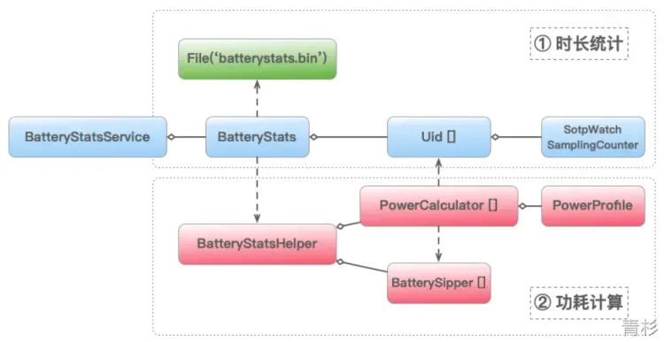

# 性能优化-电量优化
---
# 基础知识
> 电能 = 电压 * 电流 * 时长 <br>
> 模块电量(mAh) = 模块电流(mA) * 时长(h)

系统电量优化红线规则

华为电量优化红线规则

<br>
# 电量分析
## Android 系统电量计算
Android 系统的电量统计工作，是由一个叫 BatteryStatsService 的系统服务完成的。
其中四个比较关键的角色：

- **功率**：power_profile.xml，Android 系统使用此文件来描述设备各个硬件模块的额定功率，包括上面提到的多档位功率和 CPU 电量计算需要到的各种参数值。
> Android 系统要求不同的厂商必须在 [/frameworks/base/core/res/res/xml/power_profile.xml](https://android.googlesource.com/platform/frameworks/base/+/master/core/res/res/xml/power_profile.xml) 中提供组件的电源配置文件。
> - 从手机中导出 /system/framework/framework-res.apk 文件。
> - 使用反编译工具（如 apktool）对导出文件 framework-res.apk 进行反编译。
> - 查看 power_profile.xml 文件在 framework-res 反编译目录路径：/res/xml/power_profile.xml。
::: details Android 源码中的 power_profile.xml
```xml
<?xml version="1.0" encoding="utf-8"?>
<device name="Android">
  <!-- 显示相关配置 -->
  <!-- 环境模式的平均电流消耗，包含背光 -->
  <!-- 环境模式主要应用在 TV 上，类似电脑中的屏幕保护。 -->
  <item name="ambient.on.display0">0.1</item>  <!-- ~100mA -->
  <!-- 环境模式的平均电流消耗，不包含背光 -->
  <item name="screen.on.display0">0.1</item>  <!-- ~100mA -->
  <!-- 全亮度时背光的平均电流消耗 -->
  <item name="screen.full.display0">0.1</item>  <!-- ~100mA -->
  
  <!-- 蓝牙数据传输 -->
  <item name="bluetooth.active">0.1</item> <!-- ~10mA -->
  <!-- 蓝牙开启并可连接，但未连接状态 -->
  <item name="bluetooth.on">0.1</item> <!-- ~0.1mA -->
  <!-- WIFI 开启 -->
  <item name="wifi.on">0.1</item> <!-- ~3mA -->
  <!-- WIFI 数据传输 -->
  <item name="wifi.active">0.1</item> <!-- ~200mA -->
  <!-- WIFI 扫描 -->
  <item name="wifi.scan">0.1</item> <!-- ~100mA -->
  <!-- 音频 -->
  <item name="audio">0.1</item> <!-- ~10mA -->
  <!-- 视频 -->
  <item name="video">0.1</item> <!-- ~50mA -->
  <!-- 相机闪光灯 -->
  <item name="camera.flashlight">0.1</item> <!-- ~160mA -->
  <!-- 相机平均值 -->
  <item name="camera.avg">0.1</item> <!-- ~550mA -->
  <!-- GPS 开启 -->
  <item name="gps.on">0.1</item> <!-- ~50mA -->
  
  <!-- 移动通信模块相关值。对于固件中没有能源报告支持的调制解调器，请使用 radio.active、radio.scanning 和 radio.on。 -->
  <!-- 移动通信模块传输 -->
  <item name="radio.active">0.1</item> <!-- ~200mA -->
  <!-- 移动通信模块信号扫描 -->
  <item name="radio.scanning">0.1</item> <!-- ~10mA -->
  <!-- 移动通信模块传输时不同信号强度下的电流消耗 -->
  <array name="radio.on"> <!-- 信号强度 0 到 BINS-1 -->
      <value>0.2</value> <!-- ~2mA -->
      <value>0.1</value> <!-- ~1mA -->
  </array>

  <!--CPU 运行时的额外功耗（不包括集群和核心）-->
  <array name="cpu.active">
      <value>0.1</value>
  </array>
  <!-- 每个 CPU 集群的核心数 -->
  <!-- CPU 集群就是常说的 CPU 大小核。
    例如下面就列举了，有两个 CPU 集群（暂时可以理解为 大核+小核，4个大核，2个小核）。
       <array name="cpu.clusters.cores">
         <value>4</value> // cluster 0 has cpu0, cpu1, cpu2, cpu3
         <value>2</value> // cluster 1 has cpu4, cpu5
       </array>
  -->
  <array name="cpu.clusters.cores">
      <value>1</value> <!-- cluster 0 has cpu0 -->
  </array>
  <!-- 不同 CPU 集群的运行速率-->
  <array name="cpu.speeds.cluster0">
      <value>400000</value> <!-- 400 MHz CPU speed -->
  </array>
  <!--- CPU 集群运行时电流消耗 --> 
  <array name="cpu.active.cluster0">
      <value>0.1</value>  <!-- ~100mA -->
  </array>
  <!-- CPU 空闲时电流消耗 -->
  <item name="cpu.idle">0.1</item>
  
  <!-- 内存组件(内存总线、内存控制器、RAM 等)电流消耗 -->
  <array name="memory.bandwidths">
    <value>22.7</value> <!-- mA for bucket: 100mb/s-1.5 GB/s memory bandwidth -->
  </array>

  <!-- 标压下电池容量，单位 mAh -->
  <item name="battery.capacity">1000</item>

  <!-- WIFI 相关配置 -->
  <!-- WIFI 控制器(负责管理 Wi-Fi 连接、数据传输和接收等操作)空闲时电流消耗，默认为 0 -->
  <item name="wifi.controller.idle">0</item>
  <!-- WIFI 控制器接收时电流消耗，默认为 0 -->
  <item name="wifi.controller.rx">0</item>
  <!-- WIFI 控制器传输时电流消耗，默认为 0 -->
  <item name="wifi.controller.tx">0</item>
  <!-- WIFI 控制器在不同传输功率下的电流消耗，默认为空 -->
  <!-- 不同传输功率通常与 WIFI 信号强度、距离有关 -->
  <array name="wifi.controller.tx_levels"> <!-- mA -->
  </array>
  <!-- WIFI 控制器工作电压，单位 mV，默认为 0 -->
  <item name="wifi.controller.voltage">0</item>
  <!-- WIFI 控制器在批量扫描时的电流消耗 -->
  <array name="wifi.batchedscan"> <!-- mA -->
    <value>.0002</value> <!-- 1-8/hr -->
    <value>.002</value>  <!-- 9-64/hr -->
    <value>.02</value>   <!-- 65-512/hr -->
    <value>.2</value>    <!-- 513-4,096/hr -->
    <value>2</value>    <!-- 4097-/hr -->
  </array>

  <!-- 移动通信模块(如蜂窝网络、LTE、5G)相关配置-->
  <modem>
    <!-- 睡眠状态电流消耗，单位 mA -->
    <sleep>0</sleep>
    <!-- 空闲状态电流消耗，单位 mA -->
    <idle>0</idle>
    <!-- 可根据不用模式指定多个 <active> 标签 -->
    <!-- 可用属性:
          rat: 指定移动通信技术：LTE、NR、DEFAULT
          nrFrequency: NR 处于活动状态时频率级别："LOW"、"MID"、"HIGH"、"MMWAVE"、"DEFAULT"，
            LOW 表示 <1GHz
            MID 表示 1GHz - 3GHz
            HIGH 表示 3GHz - 6GHz
            MMWAVE 表示 >6GHz
    -->
    <active rat="DEFAULT">
      <!-- 接收时电流消耗，单位 mA -->
      <receive>0</receive>
      <!-- 传输时电流消耗，单位 mA。必须定义所有级别(0 到 4) -->
      <transmit level="0">0</transmit>
      <transmit level="1">0</transmit>
      <transmit level="2">0</transmit>
      <transmit level="3">0</transmit>
      <transmit level="4">0</transmit>
    </active>
  </modem>
  <!-- 移动通信模块(调制解调器)工作电压，单位 mV -->
  <item name="modem.controller.voltage">0</item>

  <!-- GPS 相关配置 -->
  <!-- GPS 信号强度 -->
  <array name="gps.signalqualitybased"> <!-- 强度 0 to 1 -->
    <value>0</value>
    <value>0</value>
  </array>
  <!-- GPS 工作电压，单位 mV -->
  <item name="gps.voltage">0</item>
</device>
  
```
:::
- **时长**：StopWatch & SamplingCounter，其中 StopWatch ⏱ 是用来计算 App 各种硬件模块的使用时长，而 SamplingCounter 则是用来采样统计 App 在不同 CPU Core 和不同 CpuFreq 下的工作时长。
- **计算**：PowerCalculators，每个硬件模块都有一个相应命名的 PowerCalculator 实现，主要是用来完成具体的电量统计算法。
- **存储**：batterystats.bin，电量统计服务相关数据的持久化文件。



### 统计
BatteryStatsService 持有 BatteryStats 类，BatteryStats 又持有一个 Uid [] 数组，每一个 Uid 对应一个 App，安装或者卸载 App ，BatteryStats 会更新相应的 Uid 元素的映射关系。同时 BatteryStats 持有一系列的 StopWatch 和 SamplingCounter，当 App 开始使用某些硬件模块的功能时，BatteryStats 就会调用相应 Uid 的 StopWatch 或 SamplingCounter 来统计其硬件使用时长。
以 Wifi 模块来举例：

- 当 App 通过 WifiManager 系统服务调用 Wifi 模块开始扫描的时候，实际上会通过 WifiManager#startScan () --> WifiScanningServiceImp --> BatteryStatsService#noteWifiScanStartedFromSource () --> BatteryStats#noteWifiScanStartedLocked (uid) 等一连串的调用，通知 BatteryStats 开启 App 相应 Uid 的 Wifi 模块的 StopWatch 开始计时。
- 当 App 通过 WifiManager 停止 Wifi 扫描的时候又会通过类似的流程调用 BatteryStats#noteWifiScanStoppedLocked (uid) 结束 StopWatch 的计时，这样一来就通过 StopWatch 完成 App 对 Wifi 模块使用时长的统计。
### 计算
BatteryStats 是通过依赖的一个 BatteryStatsHelper 的辅助类来完成的。BatteryStatsHelper 通过组合使用 Uid 里的时长数据、PoweProfile 里的功率数据（power_profile.xml 的解析实例）以及具体各个模块的 PowerCalculator 算法，计算出每一个 App 的综合电量消耗，并把计算结果保存在 BatterySipper [] 数组里（按计算值从大到小排序）。
以 Wifi 模块来举例：

- 当需要计算 App 电量消耗的时候，BatteryStats 会通过调用 BtteryStatsHelper#refreshStats () --> #processAppUsage () 来刷新 BatterySipper [] 数组以计算最新的 App 电量消耗数据。
- 其中 Wifi 模块单独的电量统计就是在 processAppUsage 方法中通过 WifiPowerCalculator 来完成的：Wifi 模块电量 = PowerProfile 预置的 Idle 功率 + Uid 统计的 Wifi Idle 时间 + 上行功率 × 上行时间 + 下行功率 × 下行时间。
## 工具
| **工具** | **优点** | **缺点** |
| --- | --- | --- |
| 手机耗电排行 | 直观 | 没有详细数据 |
| 监听电池状态 | 可知电池状态、电量 | 只是整体耗电情况、非实时 |
| dumpsys batterystats | 可知App整体耗电量、各功能模块耗电量 | 可读性比较差、非实时 |
| Battery Historian | 结果直观、有耗电量详情 | 适应 Android 5.0 及以上系统、无堆栈信息、非实时 |
| BatteryCanary | 实时监测、支持问题堆栈 |  |

### 手机耗电排行

### 监听电池状态
> 获取充电状态、电池电量
> [监控电池电量和充电状态](https://developer.android.com/training/monitoring-device-state/doze-standby?hl=zh-cn)

```java
IntentFilter intentFilter = new IntentFilter(Intent.ACTION_BATTERY_CHANGED);
Intent batteryState = registerReceiver(null, intentFilter);
int chargeType = batteryState.getIntExtra(BatteryManager.EXTRA_STATUS, -1);
Log.e("qingshan","充电方式 = " + chargeType); //1.交流电;2.USB;4.无线充电
int batteryPower = batteryState.getIntExtra(BatteryManager.EXTRA_LEVEL, -1);
Log.e("qingshan","电量 = " + batteryPower);
```
### dumpsys batterystats
通过 dumpsys batterystats 导出。
```shell
$ adb shell dumpsys batterystats your.package.name > battery.txt

# 各个Uid的总耗电量，而且是粗略的电量计算估计。
# Estimated power use (mAh):
#     Capacity: 3450, Computed drain: 501, actual drain: 552-587
#     ...
#     Idle: 41.8
#     Uid 0: 135 ( cpu=103 wake=31.5 wifi=0.346 )
#     Uid u0a208: 17.8 ( cpu=17.7 wake=0.00460 wifi=0.0901 )
#     Uid u0a65: 17.5 ( cpu=12.7 wake=4.11 wifi=0.436 gps=0.309 )
#    ...

# reset电量统计
$ adb shell dumpsys batterystats --reset
```
### Battery Historian

- docker 部署
```shell
docker run -p <port>:9999 gcr.io/android-battery-historian/stable:3.0
```

- 获取 bugreport 
```shell

# 重置电量信息
adb shell dumpsys batterystats --reset
# 开始记录电量
adb shell dumpsys batterystats --enable full-wake-history
# 导出电量信息
$ adb bugreport bugreport.zip # 7.0和7.0以后
$ adb bugreport > bugreport.txt # 6.0和6.0之前:
```

- 分析

打开 http://localhost:\<port>，上传 bugreport.zip，等待分析结果

**实战**：通过场景前后对比耗电差异 -> [大众点评App的短视频耗电量优化实战](https://tech.meituan.com/2018/03/11/dianping-shortvideo-battery-testcase.html)
### BatteryCanary
[Matrix-Battery Canary-Demo参考配置](https://github.com/Tencent/matrix/blob/dev/samples/sample-android/app/src/main/java/sample/tencent/matrix/battery/BatteryCanaryInitHelper.java)


以上方某用户反馈的耗电问题为例，可以按照以下流程来排查耗电问题：
- fg=bg, during=86：当前电量报告的统计口径为 App 进入后台 86 分钟的一段时间窗口。
- avg (jffies/min)=6016：这 86 分钟内，当前进程每分钟的 CPU 开销为 6016 Jiffies，根据前面的分析， 6016 Jiffies = 6016 × 10 Millis ≈ 1 Min，也就是说当前进程在后台这一个多小时里，一直占满一个 CPU Core 以上的资源。
- inc_thread_num & cur_thread_num：进程当前一共 175 条线程，统计期间减少了 5 条。
- (~/R) Thread-29 (27479) 5940/510924 jiffies：Top 1 的问题线程是 “Thread-29”，tid 为 27479，统计期间一共消耗 510924 Jiffies（每分钟 5940）。
- scanning：统计期间进程 Bluetooth/Wifi/GPS 调用为 0。
- app_stats：统计期间进程的前后台、充电、亮灭屏等状态。

根据以上的排查结果，可以发现导致 App 耗电的主要原因是 “Thread-29” 线程在后台期间一直 Running，在电量统计报告的下方也可以看到该线程的 StackTrace Dump，从中可以定位到该线程一直在 mg_mgr_poll 方法中循环…… 至此，后续的工作就简单多了。


<br>
# 优化
> 重点模块：CPU、屏幕、WIFI、数据网络、GPS、音视频通话

### WakeLock
- acquire 与 release 成对出现，一定要及时释放。
- 使用带参数的 acquire，设置超时时间。
- 在 try-catch 中，确保在 finally 中释放。

### GPS
- 根据业务场景，区分精度定位和粗略定位，非强需求推荐粗略定位。
- 根据业务场景，区分网络定位与 GPS 定位，非强需求推荐网络定位。
- 降低 GPS 请求频率，及时关闭。

### 蓝牙
- 避免后台频繁扫描。
- startScan 与 stopScan  成对出现，添加超时停止。

### 网络
- 监听网络连接，网络可用时发起请求。
- 添加网络缓存，避免重复请求。
- 推荐在 WIFI 场景下进行大数据传输、请求。
- 使用 JSON、Protobuf、gzip 压缩请求数据。
- 避免后台频繁 WIFI 扫描。
- 推荐使用厂商 push 替换长链接，或优化长链接，数据业务下通常是 5min，WIFI 网络下通常可以达到 20min 或更久。
- 禁止轮询。

### 后台任务调度
合理使用后台任务框架。
[Android后台调度任务与省电](https://blog.dreamtobe.cn/2016/08/15/android_scheduler_and_battery/)
[后台工作概览 | Background work | Android Developers](https://developer.android.google.cn/develop/background-work/background-tasks?hl=zh-cn)
### 前台交互

- 及时释放资源，如停止动画、释放音频。
- 推荐使用暗黑模式（即深色系）。
- 减少页面刷新区域、过度绘制。
- 使用 SurfaceView 替代 TextureView 播放视频。
- 对 App、Activity、Windows、View 精确控制硬件绘制（硬件绘制功耗更高）。
# 参考

- [Android App 电量统计原理与优化-腾讯云开发者社区-腾讯云](https://cloud.tencent.com/developer/article/1855937)
- [19 | 耗电优化（下）：耗电的优化方法与线上监控-Android开发高手课-极客时间](https://time.geekbang.org/column/article/80100)
- [抖音功耗优化实践](https://mp.weixin.qq.com/s/Sj3hSYpSoGIuNIUpu7ZQeg)
- [功耗优化 · 方案篇 · Android功耗优化指导规范 - 掘金](https://juejin.cn/post/7201364247502078013)
- [【Android 电量优化】xxxx -阿里云开发者社区](https://developer.aliyun.com/search?k=%E3%80%90Android+%E7%94%B5%E9%87%8F%E4%BC%98%E5%8C%96%E3%80%91%E7%94%B5%E9%87%8F%E4%BC%98%E5%8C%96&scene=community&page=1)
