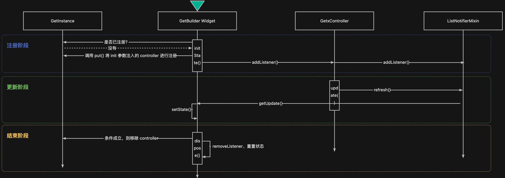
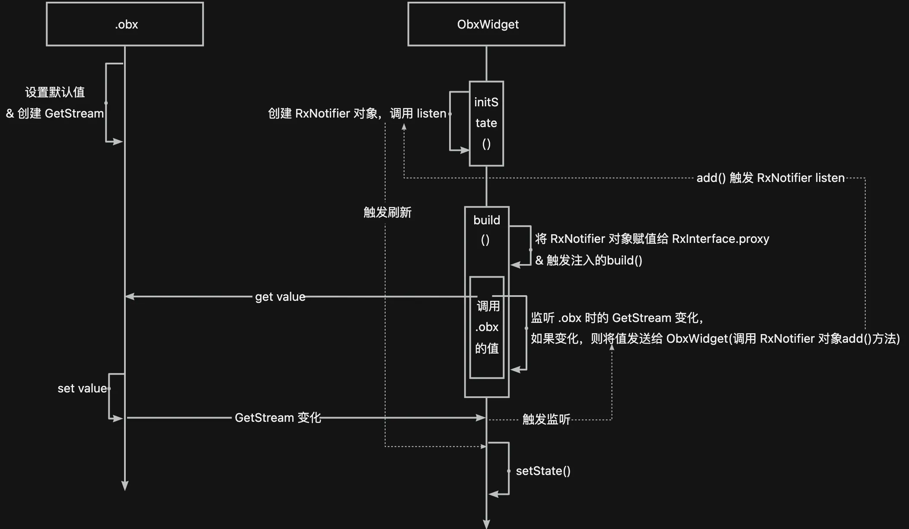
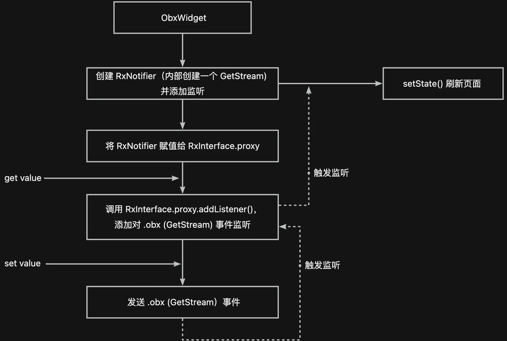

# GetX 状态管理原理
---
# GetBuilder
## 状态管理类注入
> 示例：Get.put(CommonState())
```dart
extension Inst on GetInterface {
   S put<S>(S dependency,
        {String? tag,
        bool permanent = false,
        InstanceBuilderCallback<S>? builder}) =>
    GetInstance().put<S>(dependency, tag: tag, permanent: permanent);
}
```
```dart
class GetInstance {

  static final Map<String, _InstanceBuilderFactory> _singl = {};
  
  S put<S>(
    S dependency, {
    String? tag,
    bool permanent = false,
    @Deprecated("Do not use builder, it will be removed in the next update")
    InstanceBuilderCallback<S>? builder,
  }) {
    //创建 _InstanceBuilderFactory，并添加到 _singl Map 中。
    _insert(isSingleton: true, name: tag, permanent: permanent, builder: builder ?? (() => dependency));
    return find<S>(tag: tag);
  }

  void _insert<S>({bool? isSingleton, String? name, bool permanent = false, required InstanceBuilderCallback<S> builder, bool fenix = false}) {
    //key = name == null ? type.toString() : type.toString() + name;
    final key = _getKey(S, name);
    //是否已存在
    if (_singl.containsKey(key)) {
      final dep = _singl[key];
      //已存在但已废弃，则创建新的并覆盖
      if (dep != null && dep.isDirty) {
        _singl[key] = _InstanceBuilderFactory<S>( isSingleton, builder, permanent, false, fenix, name, lateRemove: dep as _InstanceBuilderFactory<S>);
      }
    } else {
      _singl[key] = _InstanceBuilderFactory<S>(isSingleton, builder, permanent, false, fenix, name);
    }
  }

  S find<S>({String? tag}) {
    //构建 key
    final key = _getKey(S, tag);
    //检测是否存在
    if (isRegistered<S>(tag: tag)) {
      //获取到 _InstanceBuilderFactory
      final dep = _singl[key];
      //...
      //如果通过 put() 存入则标记 isInit = true，并根据 Get.smartManagement 与路由建立关联
      final i = _initDependencies<S>(name: tag);
      //返回 controller
      return i ?? dep.getDependency() as S;
    }
  }
}
```
_**小结**_

1. controller 管理的核心在 GetInstance 中，内部维护了一个名为 _singl 的 Map
2. Map 的 key 由 controller 的类型和 tag 生成。
3. 创建并注册成功后，调用 find() 返回注册的 controller。

## GetBulder Widget
```dart
class GetBuilder<T extends GetxController> extends StatefulWidget {
  
  final GetControllerBuilder<T> builder;
  final bool global;  //true
  final Object? id;
  final String? tag;
  final bool autoRemove;  //true
  final bool assignId;  //false
  final Object Function(T value)? filter;
  final void Function(GetBuilderState<T> state)? initState,dispose,didChangeDependencies;
  final void Function(GetBuilder oldWidget, GetBuilderState<T> state)? didUpdateWidget;
  final T? init;

  @override
  GetBuilderState<T> createState() => GetBuilderState<T>();
}

class GetBuilderState<T extends GetxController> extends State<GetBuilder<T>> with GetStateUpdaterMixin {

  bool? _isCreator = false;

  @override
  void initState() {
    super.initState();
    //调用注入的 initState()
    widget.initState?.call(this);
    //检测 controller 是否注册
    //	bool isRegistered<S>({String? tag}) => _singl.containsKey(_getKey(S, tag));
    var isRegistered = GetInstance().isRegistered<T>(tag: widget.tag);
    //是否全局，默认 true
    if (widget.global) {
      if (isRegistered) {
        //检测 controller 是否已就绪
        //	当 controller isInit = false 时返回 true。
        //  _isCreator 用于在 dispose() 中判断是否需要从状态管理中移除
        if (GetInstance().isPrepared<T>(tag: widget.tag)) {
          _isCreator = true;
        } else {
          _isCreator = false;
        }
        controller = GetInstance().find<T>(tag: widget.tag);
      } else {
        //未注册，则将注入的 init（即 controller) 注册
        controller = widget.init;
        _isCreator = true;
        GetInstance().put<T>(controller!, tag: widget.tag);
      }
    } else {
      //非全局，则不注册，并调用 controller#onStart()
      controller = widget.init;
      _isCreator = true;
      controller?.onStart();
    }
    //调用注入的 filter() 过滤 controller
    if (widget.filter != null) {
      _filter = widget.filter!(controller!);
    }

    _subscribeToController();
  }

  void _subscribeToController() {
    //移除之前的监听
    _remove?.call();
    //根据是否注入 id 来区分监听。当有事件时最终都是执行 getUpdate()，该方法在 GetStateUpdaterMixin 中。
    _remove = (widget.id == null)
        ? controller?.addListener(_filter != null ? _filterUpdate : getUpdate)
        : controller?.addListenerId(widget.id, _filter != null ? _filterUpdate : getUpdate);
  }

  @override
  void dispose() {
    super.dispose();
    //调用注入的 dispose()
    widget.dispose?.call(this);
    //检测 controller 是否已不再需要，若true则移除。
    //	_isCreator: 当 controller isInit = false 时为 true，即 controller 已不再使用.
    //  widget.assignId: 默认为 true
    //  widget.autoRemove: 默认为 true
    if (_isCreator! || widget.assignId) {
      if (widget.autoRemove && GetInstance().isRegistered<T>(tag: widget.tag)) {
        GetInstance().delete<T>(tag: widget.tag);
      }
    }
    //移除监听
    _remove?.call();
    //重置状态
    controller = null;
    _isCreator = null;
    _remove = null;
    _filter = null;
  }

  @override
  Widget build(BuildContext context) {
    //执行注入的 builder()，返回 controller 并加载页面
    return widget.builder(controller!);
  }
}

mixin GetStateUpdaterMixin<T extends StatefulWidget> on State<T> {
  //如果 widget 已挂载，则调用 setState() 触发刷新
  void getUpdate() {
    if (mounted) setState(() {});
  }
}
```

```dart
//controller?.addListener()
//controller?.addListenerId()
mixin ListNotifierMixin on ListenableMixin {
  
  List<GetStateUpdate?>? _updaters = <GetStateUpdate?>[];
  HashMap<Object?, List<GetStateUpdate>>? _updatersGroupIds = HashMap<Object?, List<GetStateUpdate>>();
  
  @override
  Disposer addListener(GetStateUpdate listener) {
    _updaters!.add(listener);
    return () => _updaters!.remove(listener);
  }

  Disposer addListenerId(Object? key, GetStateUpdate listener) {
    _updatersGroupIds![key] ??= <GetStateUpdate>[];
    _updatersGroupIds![key]!.add(listener);
    return () => _updatersGroupIds![key]!.remove(listener);
  }
}
```

_**小结**_

1. GetBuilder Widget 在 initState() 阶段获取注入的状态管理类，若没有则创建（使用 init 入参注入的状态管理类）。调用 controller.addListener() 添加监听，若有事件发生则触发 setState() 刷新 GetBuilder Widget。
2. GetBuilder Widget 在 dispose() 阶段注销监听和重置状态，并根据条件判断是否需要将 controller 销毁。

## GetxController Upadte
```dart
abstract class GetxController extends DisposableInterface with ListenableMixin, ListNotifierMixin {
  
  void update([List<Object>? ids, bool condition = true]) {
    if (!condition) {
      return;
    }
    if (ids == null) {
      refresh();
    } else {
      for (final id in ids) {
        refreshGroup(id);
      }
    }
  }
}

mixin ListNotifierMixin on ListenableMixin {
  List<GetStateUpdate?>? _updaters = <GetStateUpdate?>[];
  HashMap<Object?, List<GetStateUpdate>>? _updatersGroupIds = HashMap<Object?, List<GetStateUpdate>>();

  @protected
  void refresh() {
    //遍历_updaters 回调 
    _notifyUpdate();
  }

  @protected
  void refreshGroup(Object id) {
    //获取 _updatersGroupIds 中的 List，遍历回调
    _notifyIdUpdate(id);
  }
}
```

_**小结**_

在 GetxController 中调用 update()，根据是否传入 ids 触发不同的回调。该回调最终执行到 GetBuilder Widget 的监听。

## 小结


**注意点：**

1. 如果手动设置了 global = false，则不校验和注册(put) controller，并在 GetBuilder$dispose() 时销毁（置为 null）。
2. controller.addListener() 时区分是否传入 id，在 update() 时也会区分触发回调。
3. update() 时直接执行 setState() 刷新 GetBuilder$builder 内容，所以需要控制刷新范围。

# Obx
## .box
>示例： var count = 0.obx

```dart
class RxInt extends Rx<int> {}
class Rx<T> extends _RxImpl<T> {}
abstract class _RxImpl<T> extends RxNotifier<T> with RxObjectMixin<T> {
  //将初始值赋值给 _value， RxObjectMixin 中
  _RxImpl(T initial) {
    _value = initial;
  }
}

class RxNotifier<T> = RxInterface<T> with NotifyManager<T>;

//.obx 创建了一个 _RxImpl 对象，内部创建了 GetStream 对象，GetStream 可以理解为一个 Stream
mixin NotifyManager<T> {
  GetStream<T> subject = GetStream<T>();
  final _subscriptions = <GetStream, List<StreamSubscription>>{};
}
```

_**小结**_

1. .box 最终实现是 _RxImpl<\T>，其继承自 RxNotifier，RxNotifier 混入了 NotifyManager，所以 _RxImpl 最终继承了 RxInterface 并混入了 NotifyManager 和 RxObjectMixin。
2. _RxImpl 在创建的时候，由于混入 NotifyManager，所以也就创建了一个  GetStream。（此 Stream 将用于数据变更事件传输）

## Obx Widget
> 示例：Obx(() => Text(controller.count.value))

```dart
class Obx extends ObxWidget {
  final WidgetCallback builder;

  const Obx(this.builder, {Key? key}) : super(key: key);

  @override
  Widget build() => builder();
}
```

```dart
abstract class ObxWidget extends StatefulWidget {
  @override
  ObxState createState() => ObxState();

  @protected
  Widget build();
}

class ObxState extends State<ObxWidget> {
  final _observer = RxNotifier();

  @override
  void initState() {
    super.initState();
    // RxNotifier 混入了 NotifyManager，此处调用的是 NotifyManager$listen()
    //  当接收到事件时触发 setState() 重新 build()
    subs = _observer.listen(_updateTree, cancelOnError: false);
  }

  void _updateTree(_) {
    if (mounted) {
      setState(() {});
    }
  }

  @override
  void dispose() {
    //移除 RxNotifier 监听
    subs.cancel();
    //实际调用 NotifyManager.close，移除对 .obx 的监听。
    _observer.close();
    super.dispose();
  }

  @override
  Widget build(BuildContext context) => RxInterface.notifyChildren(_observer, widget.build);
}
```

```dart
abstract class RxInterface<T> {

  static RxInterface? proxy;
  
  // observer 为 ObxWidget 创建的 RxNotifier
  // 方法宗旨为将最新 observer 赋值给 proxy
  static T notifyChildren<T>(RxNotifier observer, ValueGetter<T> builder) {
    final oldObserver = RxInterface.proxy;
    RxInterface.proxy = observer;
    final result = builder();
    if (!observer.canUpdate) {
      RxInterface.proxy = oldObserver;
      throw """....""";
    }
    RxInterface.proxy = oldObserver;
    return result;
  }
}
```

```dart
//controller.count.value 即调用 RxInt.value，实际调用到 RxObjectMixin$value()
abstract class _RxImpl<T> extends RxNotifier<T> with RxObjectMixin<T> {}
mixin RxObjectMixin<T> on NotifyManager<T> {
  T get value {
    //注册 ObxWidget 创建的 RxNotifier 监听，将 .obx 时创建的 GetStream 作为监听处理。
    //  addListener() 实际调用的 NotifyManager$addListener()
    RxInterface.proxy?.addListener(subject);
    //返回 .obx 时初始化的值
    return _value;
  }
}
```

```dart
class RxNotifier<T> = RxInterface<T> with NotifyManager<T>;
mixin NotifyManager<T> {
  final _subscriptions = <GetStream, List<StreamSubscription>>{};

  //rxGetx 为 .box 时创建的 GetStream
  //subject 为 ObxWidget 时创建的 GetStream
  // 由此实现数据变动消息转换，.obx 数据变动 -> ObxWidget
  void addListener(GetStream<T> rxGetx) {
    if (!_subscriptions.containsKey(rxGetx)) {
      final subs = rxGetx.listen((data) {
        if (!subject.isClosed) subject.add(data);
      });
      final listSubscriptions = _subscriptions[rxGetx] ??= <StreamSubscription>[];
      listSubscriptions.add(subs);
    }
  }

  //移除所有 GetStream 监听
  void close() {
    _subscriptions.forEach((getStream, subscriptions) {
      for (final subscription in subscriptions) {
        subscription.cancel();
      }
    });

    _subscriptions.clear();
    subject.close();
  }
}
```

_**小结**_

1. Obx 对应 ObxWidget，内部创建了一个 RxNotifier 对象，RxNotifier 混入了 NotifyManager，所以也创建了一个 GetStream。
2. ObxWidget 在 initState() 阶段添加了对 RxNotifier 对象的监听，如果有事件则触发 setState() 刷新 ObxWidget。
3. ObxWidget 在 build() 阶段除了加载页面，还将 RxNotifier 赋值给 RxInterface.proxy。
4. 若在 Obx() 中（即 build() 阶段）使用了 .obx 值，实际执行 _RxImpl$get value()，其调用 RxInterface.proxy.addListener()（即 RxNotifier.addListener()）将 _RxImpl 持有的 Stream 传入。addListener() 具体实现在 NotifyManager 中，内部逻辑为添加传入的 _RxImpl 的 Stream 监听，如果有事件则调用 RxNotifier.add() 转发事件。
5. ObxWidget 在 dispose() 阶段移除 RxNotifier 对象的监听，并移除对所有 _RxImpl 的 GetStream 的监听。

## Update
> 示例：<br>
> var count = 0.obx;
> <br>
> count++;

```dart
abstract class _RxImpl<T> extends RxNotifier<T> with RxObjectMixin<T> {}
mixin RxObjectMixin<T> on NotifyManager<T> {
  // count++ 最终调用 set value()
  set value(T val) {
    if (subject.isClosed) return;
    sentToStream = false;
    if (_value == val && !firstRebuild) return;
    firstRebuild = false;
    //赋值
    _value = val;
    sentToStream = true;
    //通知 .obx 的 GetStream 数据变动
    subject.add(_value);
  }
}
```

_**小结**_

修改 .obx 值，即调用 _RxImpl$set value() 方法，更新数据，并调用其持有的 GetStream 的 add() 发送事件。结合 ObxWidget 中的监听，该事件最终转发到 ObxWidget 触发 setState() 刷新页面。

## 小结


+ .obx (即 Rx<\T>) 的作用：
    - 设置初始默认值。
    - 创建一个 GetStream 用于后续状态通知 (Rx mixin NotifyManager)。
    - 提供 get value() 方法，其内部调用 RxInterface.proxy 持有的 RxNotifier 对象的 addListener() 注册监听。具体实现在 NotifyManager 中，内部监听传入的 GetStream，当有事件时调用 RxNotifier$add() 触发它的监听。
    - 提供 set value() 方法，更新值，并发送 GetStream 事件。
+ ObxWidget 的作用：
    - 创建 RxNotifier(mixin NotifyManager) 对象，并监听其变化(GetStream)，如果有事件则触发 setState() 刷新页面（即执行注入的 build() 方法）。
    - 在 build() 中将创建的 RxNotifier 对象赋值给 RxInterface.proxy，并执行一次页面加载。
    - 注入的 build() 中如果使用了 .obx，即调用了 .obx 的 get value，此时建立了 ObxWidget RxNotifier 与 .obx GetStream 间的关联。
+ .obx 更新触发 ObxWidget 刷新的流程：



# 总结
1. GetX 的状态管理方案，主要利用 Dart 的 mixin 来实现状态的传递，即监听者与被监听着都混入同一个 mixin。
2. GetBuilder 是 GetX 提供的轻量状态管理方式，必须依赖 GetxController 。GetBuilder 与 GetxController 都混入 ListNotifierMixin 类，其提供了注册监听和发送事件，即实现了 GetxController 内发生数据变动，GetBuilder 感知并触发 build()。但需要注意 GetBuilder 的刷新范围，因为 GetxController 中只要执行了 update()（没有带 id），则会触发所有 GetBuilder 刷新，如果与状态无关的页面过多，会浪费资源。
3. Obx 是 GetX 提供的响应式状态管理方式，非必需 GetxController。.obx 与 ObxWidget 都混入了 NotifyManager，其内部实现了 .obx Stream 中的事件转发至 ObxWidget Stream 的逻辑，即实现了 .obx 数据变动，ObxWidget 感知并触发 build()。该方式使用简单，并且自行控制刷新范围，但由于使用 Stream 方式对资源消耗相对 GetBuilder 要多一些。


