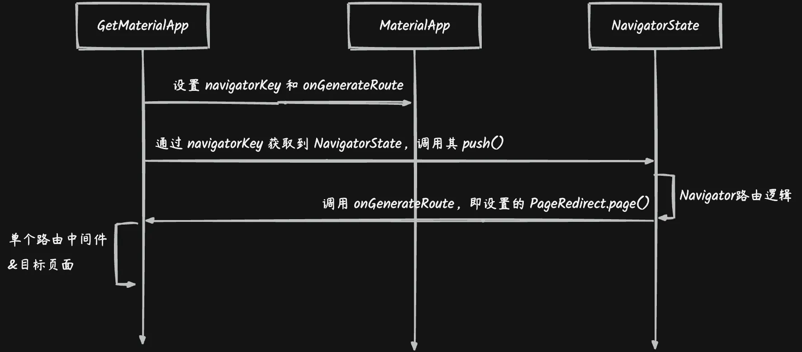

# GetX 路由原理
---

# 源码解读
## GetMaterialApp
```dart
class GetMaterialApp extends StatelessWidget {
  
  final GlobalKey<NavigatorState>? navigatorKey;

  // GetBuilder 为 StatefulWidget。方法执行顺序：initState -> init -> builder
  @override
  Widget build(BuildContext context) => GetBuilder<GetMaterialController>(
    //创建 GetMaterialController
    init: Get.rootController,
    initState: (i) {
          //...
          //存储路由名称与路由映射关系
          if (getPages != null) {
            Get.addPages(getPages!);
          }
          //...
        },
    //执行默认 MaterialApp，并指定 navigatorKey
    // Get.key 会调用到 GetMaterialController.key 创建一个 GlobalKey<NavigatorState>
    builder: (_) => MaterialApp(
                navigatorKey: (navigatorKey == null ? Get.key : Get.addKey(navigatorKey!)),
                home: home,
                routes: routes ?? const <String, WidgetBuilder>{},
                initialRoute: initialRoute,
                onGenerateRoute: (getPages != null ? generator : onGenerateRoute),
                onGenerateInitialRoutes: (getPages == null || home != null) ? onGenerateInitialRoutes : initialRoutesGenerate,
                onUnknownRoute: onUnknownRoute,
                navigatorObservers: (navigatorObservers == null
                    ? <NavigatorObserver>[ GetObserver(routingCallback, Get.routing) ]
                    : <NavigatorObserver>[ GetObserver(routingCallback, Get.routing) ]..addAll(navigatorObservers!)),
                //...
              ),
  );

  Route<dynamic> generator(RouteSettings settings) {
    return PageRedirect(settings: settings, unknownRoute: unknownRoute).page();
  }
}
```

## Get.toName()
```dart
extension GetNavigation on GetInterface {
  
  Future<T?>? toNamed<T>(
    String page, {
    dynamic arguments,
    int? id,
    bool preventDuplicates = true,
    Map<String, String>? parameters,
  }) {
    //...
    //global(id) 获取到 GlobalKey<NavigatorState>，即在 GetMaterialApp 中设置的 navigatorKey
    //  最后调用 NavigatorState.pushNamed() 走 Navigator路由逻辑
    return global(id).currentState?.pushNamed<T>( page, arguments: arguments);
  }
}
```

```dart
// 根据 Navigator路由逻辑，pushNamed() 会调用 onGenerateRoute，即 GetMaterialApp.generator()
class GetMaterialApp extends StatelessWidget {
 
  @override
  Widget build(BuildContext context) => GetBuilder<GetMaterialController>(
    //...
    builder: (_) => MaterialApp(
                home: home,
                initialRoute: initialRoute,
                onGenerateRoute: (getPages != null ? generator : onGenerateRoute),
                //...
              ),
  );

  Route<dynamic> generator(RouteSettings settings) {
    //内部通过路由name 获取 GetPage，返回 GetPageRoute 对象
    return PageRedirect(settings: settings, unknownRoute: unknownRoute).page();
  }
}
```

```dart
class PageRedirect {
  
  GetPageRoute<T> page<T>() {
    //检查是否需要重定向
    while (needRecheck()) {}
    // isUnknown 默认为 false
    final r = (isUnknown ? unknownRoute : route)!;
    return GetPageRoute<T>(
      page: r.page,
      parameter: r.parameters,
      settings: isUnknown
          ? RouteSettings(
              name: r.name,
              arguments: settings!.arguments,
            )
          : settings,
      curve: r.curve,
      opaque: r.opaque,
      showCupertinoParallax: r.showCupertinoParallax,
      gestureWidth: r.gestureWidth,
      customTransition: r.customTransition,
      binding: r.binding,
      bindings: r.bindings,
      transitionDuration: r.transitionDuration ?? Get.defaultTransitionDuration,
      transition: r.transition,
      popGesture: r.popGesture,
      fullscreenDialog: r.fullscreenDialog,
      middlewares: r.middlewares,
    );
  }

  bool needRecheck() {
    //获取路由名称对应的路由数据。routeTree 是在 GetMaterialApp 中添加的（即 getPages）
    final match = Get.routeTree.matchRoute(settings!.name!);
    //走单个路由指定的中间件，返回 GetPage。
    final runner = MiddlewareRunner(match.route!.middlewares);
    route = runner.runOnPageCalled(match.route);
    //...
  }
}
```

```dart
class GetPageRoute<T> extends PageRoute<T> with GetPageRouteTransitionMixin<T>, PageRouteReportMixin {
  
  Widget _getChild() {
    //走单个路由指定中间件
    final middlewareRunner = MiddlewareRunner(middlewares);
    final localbindings = [
      if (bindings != null) ...bindings!,
      if (binding != null) ...[binding!]
    ];
    final bindingsToBind = middlewareRunner.runOnBindingsStart(localbindings);
    if (bindingsToBind != null) {
      for (final binding in bindingsToBind) {
        binding.dependencies();
      }
    }
    final pageToBuild = middlewareRunner.runOnPageBuildStart(page)!;
    _child = middlewareRunner.runOnPageBuilt(pageToBuild());
    return _child!;
  }

  @override
  Widget buildContent(BuildContext context) {
    return _getChild();
  }
}
```

## GetX 中间件
### 全局处理
#### 设置方式
```dart
GetMaterialApp(
  //...
  routingCallback: (routing) {
    if(routing.current == '/second'){
      openAds();
    }
  }
)
```

#### 触发原理
> 设置监听
>

```dart
class GetMaterialApp extends StatelessWidget {

  final ValueChanged<Routing?>? routingCallback;

  const GetMaterialApp({
    //...
    this.routingCallback,
    //...
  });

  @override
  Widget build(BuildContext context) => GetBuilder<GetMaterialController>(
    //...
    builder: (_) => MaterialApp(
                //...
                //添加 navigatorObservers
                //  Get.routing 获取到 GetMaterialController 创建时内部创建的 Routing 对象
                navigatorObservers: (navigatorObservers == null
                    ? <NavigatorObserver>[ GetObserver(routingCallback, Get.routing) ]
                    : <NavigatorObserver>[ GetObserver(routingCallback, Get.routing) ]..addAll(navigatorObservers!)),
                //...
              ),
  );

  Route<dynamic> generator(RouteSettings settings) {
    return PageRedirect(settings: settings, unknownRoute: unknownRoute).page();
  }
}
```

```dart
class GetObserver extends NavigatorObserver {
  
  @override
  void didPush(Route route, Route? previousRoute) {
    super.didPush(route, previousRoute);
    //调用 Routing.update()，更新路由信息
    _routeSend?.update((value) {
      //...
    });
    if (routing != null) {
      routing!(_routeSend);
    }
  }
}
```

> 触发分发

```dart
class NavigatorState extends State<Navigator> with TickerProviderStateMixin, RestorationMixin {

  //刷新路由栈
  void _flushHistoryUpdates({bool rearrangeOverlay = true}) {
    //...
    
    _flushObserverNotifications();
    //...
  }

  //分发消息
  void _flushObserverNotifications() {
    if (_effectiveObservers.isEmpty) {
      _observedRouteDeletions.clear();
      _observedRouteAdditions.clear();
      return;
    }
    
    while (_observedRouteAdditions.isNotEmpty) {
      final _NavigatorObservation observation = _observedRouteAdditions.removeLast();
      _effectiveObservers.forEach(observation.notify);
    }

    while (_observedRouteDeletions.isNotEmpty) {
      final _NavigatorObservation observation = _observedRouteDeletions.removeFirst();
      _effectiveObservers.forEach(observation.notify);
    }
  }
}
```

### 单个路由处理
#### 设置方式
```dart
GetMaterialApp(
  initialRoute: '/',
  getPages: [
    GetPage(name: '/', page: () => MyHomePage()),
    GetPage(name: '/second', page: () => Second(),  middlewares: [LoginMiddleware()]),
  ],
)
  class LoginMiddleware extends GetMiddleware {}
```

### 触发原理
> 设置监听
>

```dart
class GetPage<T> extends Page<T> {
  
  final List<GetMiddleware>? middlewares;
  
}
```

> 触发分发

```dart
class PageRedirect {
  
  GetPageRoute<T> page<T>() {
    //检查是否需要重定向
    while (needRecheck()) {}
    //...
  }

  bool needRecheck() {
    //获取路由名称对应的路由数据。routeTree 是在 GetMaterialApp 中添加的（即 getPages）
    final match = Get.routeTree.matchRoute(settings!.name!);
    //走单个路由指定的中间件，返回 GetPage。
    final runner = MiddlewareRunner(match.route!.middlewares);
    route = runner.runOnPageCalled(match.route);
    //...
  }
}
```

```dart
class MiddlewareRunner {
  MiddlewareRunner(this._middlewares);

  GetPage? runOnPageCalled(GetPage? page) {
    //根据优先级排序并遍历分发
    _getMiddlewares().forEach((element) {
      page = element.onPageCalled(page);
    });
    return page;
  }
}
```

## 读源码学到什么
### GetX 路由是自己实现的吗？
> 不是，在 Navigator 路由基础上拓展出来的。

```dart
extension GetNavigation on GetInterface {
  
  Future<T?>? toNamed<T>(
    String page, {
    dynamic arguments,
    int? id,
    bool preventDuplicates = true,
    Map<String, String>? parameters,
  }) {
    //...
    //global(id) 获取到 GlobalKey<NavigatorState>，即在 GetMaterialApp 中设置的 navigatorKey
    //  最后调用 NavigatorState.pushNamed() 走 Navigator路由逻辑
    return global(id).currentState?.pushNamed<T>( page, arguments: arguments);
  }
}
```

### GetX 如何实现不需要 context 的
> 在 GetMaterialApp 内部给 MaterialApp 设置了 navigatorKey (GlobalKey\<NavigatorState\>)，后续通过 GlobalKey 来获取并调用 NavigatorState 中的方法。

```dart
//设置 GlobalKey<NavigatorState>
class GetMaterialApp extends StatelessWidget {
  
  final GlobalKey<NavigatorState>? navigatorKey;

  // GetBuilder 为 StatefulWidget。方法执行顺序：initState -> init -> builder
  @override
  Widget build(BuildContext context) => GetBuilder<GetMaterialController>(
    //...
    //执行默认 MaterialApp，并指定 navigatorKey
    // Get.key 会调用到 GetMaterialController.key 创建一个 GlobalKey<NavigatorState>
    builder: (_) => MaterialApp(
                navigatorKey: (navigatorKey == null ? Get.key : Get.addKey(navigatorKey!)),
                //...
              ),
  );
}

//通过 GlobalKey 获取 NavigatorState
extension GetNavigation on GetInterface {
  
  Future<T?>? toNamed<T>(String page) {
    //...
    //global(id) 获取到 GlobalKey<NavigatorState>，即在 GetMaterialApp 中设置的 navigatorKey
    //  最后调用 NavigatorState.pushNamed() 走 Navigator路由逻辑
    return global(id).currentState?.pushNamed<T>( page, arguments: arguments);
  }
}
```

### GetX 路由设置中，同时设置了全局和单个路由中间件执行顺序
> 单个路由比全局路由中间件优先级更高。
>

```dart
class NavigatorState extends State<Navigator> with TickerProviderStateMixin, RestorationMixin {

  Future<T?> pushNamed<T extends Object?>(String routeName,) {
    //首先调用 _routeNamed() 获取路由名对应路由信息。其内部调用 onGenerateRoute() 此处为 PageRedirect.page()
    // PageRedirect.page() 内部逻辑会先执行单个路由中间件。
    //然后调用 push()，内部会执行到 _flushHistoryUpdates()
    return push<T?>(_routeNamed<T>(routeName, arguments: arguments)!);
  }
  
  //刷新路由栈
  void _flushHistoryUpdates({bool rearrangeOverlay = true}) {
    //...

    //触发执行全局路由中间件
    _flushObserverNotifications();
    //...
  }

```