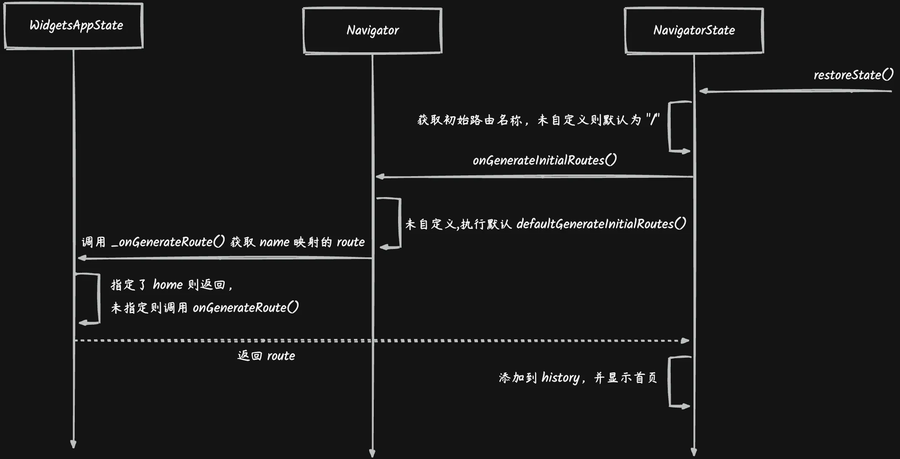
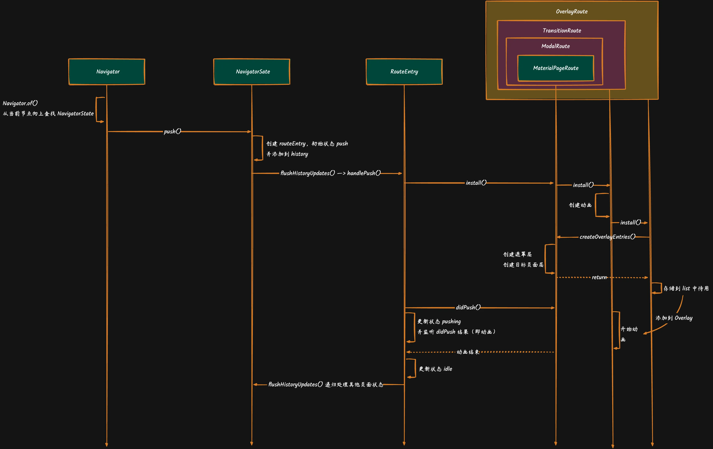
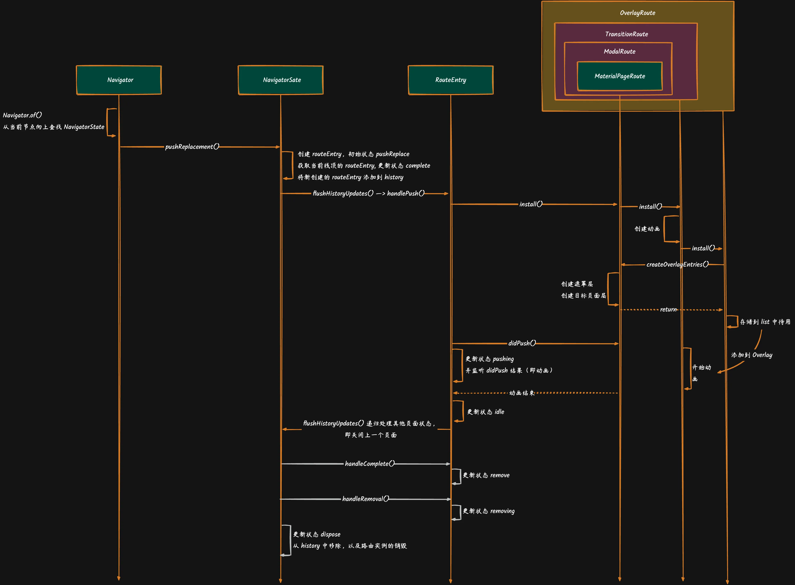

# Nagivator 路由原理
---
# 源码解读
## MaterialApp
```dart
class MaterialApp extends StatefulWidget {
  //...
  @override
  State<MaterialApp> createState() => _MaterialAppState();
}

class _MaterialAppState extends State<MaterialApp> {
  //...
  @override
  Widget build(BuildContext context) {
    Widget result = _buildWidgetApp(context);
    //...
  }
  
  Widget _buildWidgetApp(BuildContext context) {
    //创建一个 WidgetsApp，将路由相关参数传入
    return WidgetsApp(
      key: GlobalObjectKey(this),
      navigatorKey: widget.navigatorKey,
      navigatorObservers: widget.navigatorObservers!,
      pageRouteBuilder: <T>(RouteSettings settings, WidgetBuilder builder) {
        return MaterialPageRoute<T>(settings: settings, builder: builder);
      },
      home: widget.home,
      routes: widget.routes!,
      initialRoute: widget.initialRoute,
      onGenerateRoute: widget.onGenerateRoute,
      onGenerateInitialRoutes: widget.onGenerateInitialRoutes,
      //...
    );
  }
}
```
```dart 
class WidgetsApp extends StatefulWidget {
  //...
  @override
  State<WidgetsApp> createState() => _WidgetsAppState();
}

class _WidgetsAppState extends State<WidgetsApp> with WidgetsBindingObserver {
  //...
  @override
  Widget build(BuildContext context) {
    Widget? routing;
    routing = FocusScope(
      debugLabel: 'Navigator Scope',
      autofocus: true,
      // 创建 Navigator，将参数，这是整个路由的管理者
      child: Navigator(
        clipBehavior: Clip.none,
        restorationScopeId: 'nav',
        key: _navigator,
        initialRoute: _initialRouteName,
        onGenerateRoute: _onGenerateRoute,
        onGenerateInitialRoutes: widget.onGenerateInitialRoutes == null
          ? Navigator.defaultGenerateInitialRoutes
          : (NavigatorState navigator, String initialRouteName) {
            return widget.onGenerateInitialRoutes!(initialRouteName);
          },
        onUnknownRoute: _onUnknownRoute,
        observers: widget.navigatorObservers!,
        routeTraversalEdgeBehavior: kIsWeb ? TraversalEdgeBehavior.leaveFlutterView : TraversalEdgeBehavior.parentScope,
        reportsRouteUpdateToEngine: true,
      ),
    );
    //...
    //伪代码
    // return routing;
  }
}
```
```dart
class Navigator extends StatefulWidget {
  @override
  NavigatorState createState() => NavigatorState();
}

class NavigatorState extends State<Navigator> with TickerProviderStateMixin, RestorationMixin {

  // _History 是一个实现了 ChangeNotifier 的迭代器，是一个历史记录队列
  final _History _history = _History();

  @override
  void initState() {
    super.initState();
    //监听页面栈变化，发送 Notifucation
    _history.addListener(_handleHistoryChanged);
  }
  
  return HeroControllerScope.none(
      child: NotificationListener<NavigationNotification>(
        onNotification: (NavigationNotification notification) {
          if (notification.canHandlePop || !canPop()) {
            return false;
          }
          const NavigationNotification nextNotification = NavigationNotification(
            canHandlePop: true,
          );
          nextNotification.dispatch(context);
          return true;
        },
        child:
          //....
          // 基于 Overlay 实现页面跳转覆盖
          Overlay(
            key: _overlayKey,
            clipBehavior: widget.clipBehavior,
            initialEntries: overlay == null ?  _allRouteOverlayEntries.toList(growable: false) : const <OverlayEntry>[],
          )
      )
    );
}
```
### 小结
要使用 Navigator 实现路由跳转，必须在顶层使用 MaterialApp 进行包装。通过上面代码可知，使用 MaterialApp 的主要目的是创建 Navigator Widget，其内部包含了主要路由跳转逻辑。

## 初始路由


```dart
class _WidgetsAppState extends State<WidgetsApp> with WidgetsBindingObserver {

  @override
  Widget build(BuildContext context) {
    Widget? routing;
    routing = FocusScope(
      debugLabel: 'Navigator Scope',
      autofocus: true,
      // 创建 Navigator
      child: Navigator(
        clipBehavior: Clip.none,
        restorationScopeId: 'nav',
        key: _navigator,
        initialRoute: _initialRouteName,
        onGenerateRoute: _onGenerateRoute, 
        onGenerateInitialRoutes: widget.onGenerateInitialRoutes == null
          ? Navigator.defaultGenerateInitialRoutes
          : (NavigatorState navigator, String initialRouteName) {
            return widget.onGenerateInitialRoutes!(initialRouteName);
          },
        onUnknownRoute: _onUnknownRoute,
        observers: widget.navigatorObservers!,
        routeTraversalEdgeBehavior: kIsWeb ? TraversalEdgeBehavior.leaveFlutterView : TraversalEdgeBehavior.parentScope,
        reportsRouteUpdateToEngine: true,
      ),
    );
    //...
    //伪代码
    // return routing;
  }
  
  Route<dynamic>? _onGenerateRoute(RouteSettings settings) {
    final String? name = settings.name;
    //使用默认首地址"/" 并且指定了 home，则映射为 home
    final WidgetBuilder? pageContentBuilder = name == Navigator.defaultRouteName && widget.home != null
        ? (BuildContext context) => widget.home!
        : widget.routes![name];
    if (pageContentBuilder != null) {
      final Route<dynamic> route = widget.pageRouteBuilder!<dynamic>(
        settings,
        pageContentBuilder,
      );
      return route;
    }
    //...
  }
}
```
```dart
class Navigator extends StatefulWidget {

  const Navigator({
    this.pages = const <Page<dynamic>>[],
    this.initialRoute,
    this.onGenerateInitialRoutes = Navigator.defaultGenerateInitialRoutes, //默认实现，可自定义
    this.onGenerateRoute, //此处为 _WidgetsAppState#_onGenerateRoute()
    //...
  });

  static List<Route<dynamic>> defaultGenerateInitialRoutes(NavigatorState navigator, String initialRouteName) {
    final List<Route<dynamic>?> result = <Route<dynamic>?>[];
    if (initialRouteName.startsWith('/') && initialRouteName.length > 1) {
      initialRouteName = initialRouteName.substring(1); 
      //调用 Navigator._routeNamed 获取 name 映射的 route，内部会调用 onGenerateRoute()，此处默认调用 WidgetsApp._onGenerateRoute()
      result.add(navigator._routeNamed<dynamic>(Navigator.defaultRouteName, arguments: null, allowNull: true));
      //...
    }
    //...
    return result;
  }
  
  @override
  NavigatorState createState() => NavigatorState();
}

class NavigatorState extends State<Navigator> with TickerProviderStateMixin, RestorationMixin {

  @override
  void restoreState(RestorationBucket? oldBucket, bool initialRestore) {
    //...
    // If there was nothing to restore, we need to process the initial route.
    if (!_serializableHistory.hasData) {
      //获取初始路由名称，默认为 "/"
      String? initialRoute = widget.initialRoute;
      if (widget.pages.isEmpty) {
        initialRoute = initialRoute ?? Navigator.defaultRouteName;
      }
      if (initialRoute != null) {
        //调用 onGenerateInitialRoutes() 获取初始路由名称映射的 route
        //此处默认调用到 Navigator.defaultGenerateInitialRoutes()
        _history.addAll(
          widget.onGenerateInitialRoutes(
            this,
            widget.initialRoute ?? Navigator.defaultRouteName,
          ).map((Route<dynamic> route) => _RouteEntry(
              route,
              pageBased: false,
              initialState: _RouteLifecycle.add,
              restorationInformation: route.settings.name != null
                ? _RestorationInformation.named(
                  name: route.settings.name!,
                  arguments: null,
                  restorationScopeId: _nextPagelessRestorationScopeId,
                )
                : null,
            ),
          ),
        );
      }
    }
    //入栈&显示首页
    _flushHistoryUpdates();
  }
}
```
### 小结
初始路由逻辑执行实际在 NavigatorState.restoreState() 中，其获取初始路由名称，未指定则默认为“/”，然后调用 onGenerateInitialRoutes() 获取 name 映射的 route，未指定则默认指定 NavigatorState.defaultGenerateInitialRoutes()，其内部会调用 _WidgetsAppState._onGenerateRoute() 将初始路由指定为 home。

## Navigator.push()
> 示例代码：<br>
> `Navigator.of(context).push(MaterialPageRoute(builder: (context) => TargetWidget()))`


```dart
class Navigator extends StatefulWidget {
  
  static NavigatorState of(BuildContext context, {bool rootNavigator = false}) {
    NavigatorState? navigator;
    if (context is StatefulElement && context.state is NavigatorState) {
      navigator = context.state as NavigatorState;
    }
    if (rootNavigator) {
      //从当前节点向上查找，直到最顶层祖先节点
      navigator = context.findRootAncestorStateOfType<NavigatorState>() ?? navigator;
    } else {
      //从当前节点向上查找，找到即停止
      navigator = navigator ?? context.findAncestorStateOfType<NavigatorState>();
    }
    return navigator!;
  }
}
```
```dart
class NavigatorState extends State<Navigator> with TickerProviderStateMixin, RestorationMixin {

  // _History 是一个实现了 ChangeNotifier 的迭代器，是一个历史记录队列
  final _History _history = _History();
  
  @optionalTypeArgs
  Future<T?> push<T extends Object?>(Route<T> route) {
    //此处 route 为 MaterialPageRoute
    _pushEntry(_RouteEntry(route, pageBased: false, initialState: _RouteLifecycle.push));
    return route.popped;
  }
  
  void _pushEntry(_RouteEntry entry) {
    //添加到历史队列中
    _history.add(entry);
    //执行页面跳转逻辑
    _flushHistoryUpdates();
    //跳转善后逻辑
    _afterNavigation(entry.route);
  }

  void _flushHistoryUpdates({bool rearrangeOverlay = true}) {
    _flushingHistory = true;
    int index = _history.length - 1;
    _RouteEntry? next;
    _RouteEntry? entry = _history[index];
    _RouteEntry? previous = index > 0 ? _history[index - 1] : null;
    bool canRemoveOrAdd = false; 
    Route<dynamic>? poppedRoute; 
    final List<_RouteEntry> toBeDisposed = <_RouteEntry>[];
    while (index >= 0) {
      //调用 push() 则初始状态为 _RouteLifecycle.push
      switch (entry!.currentState) {
        //...
        case _RouteLifecycle.push:
        case _RouteLifecycle.pushReplace:
        case _RouteLifecycle.replace:
          //调用 _RouteEntry.handlePush()。该方法是一个异步操作。
          entry.handlePush(
            navigator: this,
            previous: previous?.route,
            previousPresent: _getRouteBefore(index - 1, _RouteEntry.isPresentPredicate)?.route,
            isNewFirst: next == null,
          );
          if (entry.currentState == _RouteLifecycle.idle) {
            continue;
          }
        //...
      }
      index -= 1;
      next = entry;
      entry = previous;
      previous = index > 0 ? _history[index - 1] : null;
    }
    //...
  }
}
```
```dart
class _RouteEntry extends RouteTransitionRecord {

  void handlePush({ required NavigatorState navigator, required bool isNewFirst, required Route<dynamic>? previous, required Route<dynamic>? previousPresent }) {
    final _RouteLifecycle previousState = currentState;
    route._navigator = navigator;
    //执行 MaterialPageRoute.install(), 实际执行父类 ModalRoute.install()
    route.install();
    if (currentState == _RouteLifecycle.push || currentState == _RouteLifecycle.pushReplace) {
      //执行 MaterialPageRoute.didPush()，实际调用父类 TransitionRoute.didPush()
      final TickerFuture routeFuture = route.didPush();
      //更新状态
      currentState = _RouteLifecycle.pushing;
      //跳转动画完成
      routeFuture.whenCompleteOrCancel(() {
        if (currentState == _RouteLifecycle.pushing) {
          //更新状态
          currentState = _RouteLifecycle.idle;
          //递归调用，再次回到 NavigatorState._flushHistoryUpdates()。因为是异步操作，通过递归再次回到_flushHistoryUpdates()
          navigator._flushHistoryUpdates();
        }
      });
    }
  }
}
```
```dart
abstract class ModalRoute<T> extends TransitionRoute<T> with LocalHistoryRoute<T> {
  
  @override
  void install() {
    super.install();
    //创建动画
    _animationProxy = ProxyAnimation(super.animation);
    _secondaryAnimationProxy = ProxyAnimation(super.secondaryAnimation);
  }

  @override
  Iterable<OverlayEntry> createOverlayEntries() {
    return <OverlayEntry>[
      //遮罩层
      _modalBarrier = OverlayEntry(builder: _buildModalBarrier),
      //跳转目标层
      _modalScope = OverlayEntry(builder: _buildModalScope, maintainState: maintainState, canSizeOverlay: opaque),
    ];
  }
}

abstract class TransitionRoute<T> extends OverlayRoute<T> implements PredictiveBackRoute {
  
  @override
  void install() {
    //跳转动画
    _controller = createAnimationController();
    _animation = createAnimation()
      ..addStatusListener(_handleStatusChanged);
    super.install();
    if (_animation!.isCompleted && overlayEntries.isNotEmpty) {
      overlayEntries.first.opaque = opaque;
    }
  }

  
  @override
  TickerFuture didPush() {
    super.didPush();
    //执行动画
    return _controller!.forward();
  }
}

abstract class OverlayRoute<T> extends Route<T> {

  final List<OverlayEntry> _overlayEntries = <OverlayEntry>[];
  
  @override
  void install() {
    // createOverlayEntries() 由子类 ModalRoute 实现
    _overlayEntries.addAll(createOverlayEntries());
    super.install();
  }
}
```
### 小结
跳转调用 `Navigator.of()` 找到顶层的 Navigator，然后调用其 `push()` 触发跳转，通过 MaterialPageRoute 来实现具体跳转动画逻辑。<br>
MaterialPageRoute 内部实现具体跳转动画逻辑，具体为添加转场动画，将跳转页面添加到 Overlay 中。

## Navigator.pushName()
```dart
class NavigatorState extends State<Navigator> with TickerProviderStateMixin, RestorationMixin {

  Future<T?> pushNamed<T extends Object?>(String routeName, {Object? arguments}) {
    //最终也是调用 push()。重点看 _routeNamed() 是如何将 name 转成 router 的
    return push<T?>(_routeNamed<T>(routeName, arguments: arguments)!);
  }

  Route<T?>? _routeNamed<T>(String name, { required Object? arguments, bool allowNull = false }) {
    //校验是否设置 onGenerateRoute.
    assert(() {
      if (widget.onGenerateRoute == null) {
        throw FlutterError(
          'Navigator.onGenerateRoute was null, but the route named "$name" was referenced.\n'
          //...
        );
      }
      return true;
    }());
    final RouteSettings settings = RouteSettings(name: name, arguments: arguments);
    //通过调用 onGenerateRoute() 转换成 route。该逻辑由使用者实现。
    Route<T?>? route = widget.onGenerateRoute!(settings) as Route<T?>?;
    if (route == null && !allowNull) {
      //如果设置了 onUnknownRoute，未转换成功时调用该方法。如果没有设置则报错。
      if (widget.onUnknownRoute == null) {
        throw FlutterError.fromParts(...);
      }
      route = widget.onUnknownRoute!(settings) as Route<T?>?;
      if (route == null) {
        throw FlutterError.fromParts(...);
      }
    }
    return route;
  }
}
```
### 小结
跳转逻辑共用 `push()` 部分，通过 `onGenerateRoute()` 实现依赖反转，由调用者实现路由名与路由实例的映射管理。

## Navigator.pushReplacement()



```dart
class NavigatorState extends State<Navigator> with TickerProviderStateMixin, RestorationMixin {

  Future<T?> pushReplacement<T extends Object?, TO extends Object?>(Route<T> newRoute, { TO? result }) {
    _pushReplacementEntry(_RouteEntry(newRoute, pageBased: false, initialState: _RouteLifecycle.pushReplace), result);
    return newRoute.popped;
  }

  void _pushReplacementEntry<TO extends Object?>(_RouteEntry entry, TO? result) {
    //...
    //获取当前栈顶的 _RouteEntry，然后调用 complete()
    _history.lastWhere(_RouteEntry.isPresentPredicate).complete(result, isReplaced: true);
    //新路由实例添加到 _history 中
    _history.add(entry);
    _flushHistoryUpdates();
    _afterNavigation(entry.route);
  }

  void _flushHistoryUpdates({bool rearrangeOverlay = true}) {
    _flushingHistory = true;
    int index = _history.length - 1;
    _RouteEntry? next;
    _RouteEntry? entry = _history[index];
    _RouteEntry? previous = index > 0 ? _history[index - 1] : null;
    bool canRemoveOrAdd = false; 
    Route<dynamic>? poppedRoute; 
    final List<_RouteEntry> toBeDisposed = <_RouteEntry>[];
    while (index >= 0) {
      switch (entry!.currentState) {
        //...
        //首先处理新路由实例，与 push() 一致
        case _RouteLifecycle.push:
        case _RouteLifecycle.pushReplace:
        case _RouteLifecycle.replace:
          //调用 _RouteEntry.handlePush()。该方法是一个异步操作。
          entry.handlePush(
            navigator: this,
            previous: previous?.route,
            previousPresent: _getRouteBefore(index - 1, _RouteEntry.isPresentPredicate)?.route,
            isNewFirst: next == null,
          );
          if (entry.currentState == _RouteLifecycle.idle) {
            continue;
          }
        case _RouteLifecycle.idle:
          if (!seenTopActiveRoute && poppedRoute != null) {
            entry.handleDidPopNext(poppedRoute);
          }
          seenTopActiveRoute = true;
          canRemoveOrAdd = true;
        //...
        //处理跳转前页面
        case _RouteLifecycle.complete:
          entry.handleComplete();
          continue;
        case _RouteLifecycle.remove:
          //...
          entry.handleRemoval(
            navigator: this,
            previousPresent: _getRouteBefore(index, _RouteEntry.willBePresentPredicate)?.route,
          );
          continue;
        case _RouteLifecycle.removing:
          //...
          entry.currentState = _RouteLifecycle.dispose;
          continue;
        case _RouteLifecycle.dispose:
          //从 _history 中移除跳转前页面
          toBeDisposed.add(_history.removeAt(index));
          entry = next;
        //...
      }
      index -= 1;
      next = entry;
      entry = previous;
      previous = index > 0 ? _history[index - 1] : null;
    }
    //...
    //统一处理要移除的路由实例
    for (final _RouteEntry entry in toBeDisposed) {
      _disposeRouteEntry(entry, graceful: true);
    }
  }
}
```
```dart
class _RouteEntry extends RouteTransitionRecord {

  void complete<T>(T result, { bool isReplaced = false }) {
    _reportRemovalToObserver = !isReplaced;
    pendingResult = result;
    //修改状态，用于后面关闭跳转前页面
    currentState = _RouteLifecycle.complete;
  }
  
  void handleComplete() {
    //调用 MaterialPageRoute.didComplete()，实际调用 Route.didComplete()
    route.didComplete(pendingResult);
    pendingResult = null;
    //修改状态
    currentState = _RouteLifecycle.remove;
  }

  void handleRemoval({ required NavigatorState navigator, required Route<dynamic>? previousPresent }) {
    //修改状态
    currentState = _RouteLifecycle.removing;
    //...
  }
}
```
### 小结
`pushReplacement()` 方法用于跳转并关闭当前页面，跳转逻辑与 `push()` 一致，增加了跳转完成后，关闭当前页面的逻辑。<br>
关闭逻辑主要体现在，添加新路由实例前，将最上层路由实例（当前页面）标记为 complete 状态，在跳转完成后继续状态逻辑判断时，实现关闭逻辑（即从 history 中移除）。

## Navigator.pushAndRemoveUntil()
```dart
class NavigatorState extends State<Navigator> with TickerProviderStateMixin, RestorationMixin {

  Future<T?> pushAndRemoveUntil<T extends Object?>(Route<T> newRoute, RoutePredicate predicate) {
    _pushEntryAndRemoveUntil(_RouteEntry(newRoute, pageBased: false, initialState: _RouteLifecycle.push), predicate);
    return newRoute.popped;
  }

  void _pushEntryAndRemoveUntil(_RouteEntry entry, RoutePredicate predicate) {
    int index = _history.length - 1;
    _history.add(entry);
    //根据调用者设置的条件判断，逐一移除
    while (index >= 0 && !predicate(_history[index].route)) {
      if (_history[index].isPresent) {
        _history[index].remove();
      }
      index -= 1;
    }
    _flushHistoryUpdates();
    _afterNavigation(entry.route);
  }
}
```
### 小结
与 `push()` 逻辑基本一致，在执行跳转前先根据调用者设置的条件判断移除符合的路由实例。

## Navigator.pop()
```dart
class NavigatorState extends State<Navigator> with TickerProviderStateMixin, RestorationMixin {

  void pop<T extends Object?>([ T? result ]) {
    //找到最顶层可移除的路由实例
    final _RouteEntry entry = _history.lastWhere(_RouteEntry.isPresentPredicate);
    //...
    //调用 _RouteEntry.pop()，将状态变成 _RouteLifecycle.pop
    entry.pop<T>(result);
    if (entry.currentState == _RouteLifecycle.pop) {
      _flushHistoryUpdates(rearrangeOverlay: false);
    }
    _afterNavigation(entry.route);
  }

  void _flushHistoryUpdates({bool rearrangeOverlay = true}) {
    _flushingHistory = true;
    int index = _history.length - 1;
    _RouteEntry? next;
    _RouteEntry? entry = _history[index];
    _RouteEntry? previous = index > 0 ? _history[index - 1] : null;
    bool canRemoveOrAdd = false; 
    Route<dynamic>? poppedRoute; 
    final List<_RouteEntry> toBeDisposed = <_RouteEntry>[];
    while (index >= 0) {
      switch (entry!.currentState) {
        //...
        case _RouteLifecycle.pop:
          // 调用 handlePop() 默认返回 true，其内部会将状态修改为 _RouteLifecycle.dispose
          if (!entry.handlePop(
                navigator: this,
                previousPresent: _getRouteBefore(index, _RouteEntry.willBePresentPredicate)?.route)){
            continue;
          }
          _observedRouteDeletions.add(
            _NavigatorPopObservation(entry.route, _getRouteBefore(index, _RouteEntry.willBePresentPredicate)?.route),
          );
          canRemoveOrAdd = true;
        //...
        case _RouteLifecycle.dispose:
          //将当前路由实例从栈中移除
          toBeDisposed.add(_history.removeAt(index));
          entry = next;
        //...
      }
      index -= 1;
      next = entry;
      entry = previous;
      previous = index > 0 ? _history[index - 1] : null;
    }
    //...
    //统一处理要移除的路由实例
    for (final _RouteEntry entry in toBeDisposed) {
      _disposeRouteEntry(entry, graceful: true);
    }
  }

  void finalizeRoute(Route<dynamic> route) {
    //找到要移除 route 对应的 routeEntry
    final int index = _history.indexWhere(_RouteEntry.isRoutePredicate(route));
    final _RouteEntry entry =  _history[index];
    //将当前路由实例状态修改为 _RouteLifecycle.dispose
    entry.finalize();
    //...
  }
}
```
```dart
class _RouteEntry extends RouteTransitionRecord {

  void pop<T>(T? result) {
    pendingResult = result;
    currentState = _RouteLifecycle.pop;
  }

  bool handlePop({ required NavigatorState navigator, required Route<dynamic>? previousPresent }) {
    currentState = _RouteLifecycle.popping;
    //此处 route 为 MaterialPageRoute，最终调用其父类 OverlayRoute.didPop()
    //默认 didPop() 返回 true
    if (!route.didPop(pendingResult)) {
      currentState = _RouteLifecycle.idle;
      return false;
    }
    route.onPopInvokedWithResult(true, pendingResult);
    pendingResult = null;
    return true;
  }
}
```
```dart
abstract class OverlayRoute<T> extends Route<T> {

  bool didPop(T? result) {
    final bool returnValue = super.didPop(result);
    // finishedWhenPopped 默认为 true，可在子类中自定义。若自定义为 false，则需自己调用 NavigatorState.finalizeRoute()
    if (finishedWhenPopped) {
      navigator!.finalizeRoute(this);
    }
    return returnValue;
  }
}
```
### 小结
`pop()` 逻辑与 `pushReplacement()` 中跳转后销毁上一个页面逻辑类似，初始状态为 pop，最后状态改为 dispose，从 history 中移除。

## 总结
上面代码主要涉及四个类 <br>
**MaterialApp**：此处主要作用是在顶层创建 Navigator Widget，用于管理路由。<br>
**Navigator**：其是一个 StatefulWidget，NavigatorState 是整个路由的管理者，其内部维护一个状态机，根据路由实例状态进行不同逻辑处理，如入栈/出栈，调用 routeEntry 或 route 方法实现跳转动画、实例销毁等。<br>
**RouteEntry**：路由实例，封装每个 route，内部维护实例状态以及调用 route 方法。<br>
**Route**：涉及子类（MaterialPageRoute -> ModalRoute -> TransitionRoute -> OverlayRoute），用于处理具体的跳转逻辑，如创建图层、跳转动画等。

# 读源码学到什么

## 初始路由时同时指定 home 与 initialRouteName + onGenerateInitialRoutes 哪个生效
> 答案：initialRouteName + onGenerateInitialRoutes <br>
> 原因：执行到 NavigatorState.restoreState() 时会先查找 initialRouteName 对应的路由实例（即 onGenerateInitialRoutes()）


## 查找指定 state 方式
- `findRootAncestorStateOfType<T extends State>()`：从当前节点向上查找，直到最顶层祖先节点.
- `findAncestorStateOfType<T extends State>()`：从当前节点向上查找，找到即停止

## 设计原则 - 单一职责
单一职责：一个类或模块只负责完成一个功能。<br>
具体体现在 RouteEntry 中，内部持有 route 实例，负责维护 route 状态等。
```dart
class _RouteEntry extends RouteTransitionRecord {
  _RouteEntry(this.route,);

  //入栈逻辑
  void handlePush(NavigatorState navigator,){}

  //出栈逻辑
  bool handlePop(NavigatorState navigator){}

  //...
}
```

## 设计模式 - 模板模式
模板模式：在一个方法中定义一个模板，并将某些步骤推迟到子类中实现。<br>
具体体现在 OverlayRoute 中获取 OverlayEntry。
```dart
abstract class OverlayRoute<T> extends Route<T> {
  
  //由子类实现
  Iterable<OverlayEntry> createOverlayEntries();

  void install() {
    //调用 createOverlayEntries()，获取子类实现的 OverlayEntry 数组
    _overlayEntries.addAll(createOverlayEntries());
    super.install();
  }
}
```

## 设计模式 - 状态机
状态机实现模式有多种，在上面代码中，NavigatorState 中通过“分支逻辑法”实现，即通过将事件触发的状态转移和动作执行，通过 switch 等分支判断进行拆分.
```dart
class NavigatorState extends State<Navigator> with TickerProviderStateMixin, RestorationMixin {

  void _flushHistoryUpdates({bool rearrangeOverlay = true}) {
    int index = _history.length - 1;
    //...
    while (index >= 0) {
      switch (entry!.currentState) {
        //...
        //...
        //首先处理新路由实例，与 push() 一致
        case _RouteLifecycle.push:
        case _RouteLifecycle.pushReplace:
        case _RouteLifecycle.replace:
          //入栈
          //...
        case _RouteLifecycle.idle:
          //入栈完成
          //...
        case _RouteLifecycle.complete:
          //...
        case _RouteLifecycle.remove:
          //...
          continue;
        case _RouteLifecycle.removing:
          //...
          continue;
        case _RouteLifecycle.dispose:
          //将当前路由实例从栈中移除
          //..
        //...
      }
      //...
    }
    //...
  }
}
```