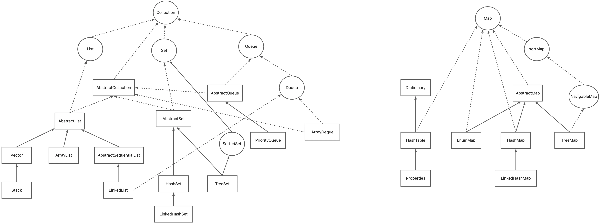

# Java 集合 - Map 篇
---
# List、Set、Map 关系图

<br>

# HashMap
> - 非同步版本的 HashTable，支持 Null 作为 key 和 value。
> - 默认初始容量为 16，负载因子为 0.75。可自定义初始容量和负载因子。

> 插入元素(扩容)逻辑:
> - 如果容器未初始化(首次添加)，则先调用 resize() 开辟空间。默认容器大小16，负载因子0.75，即有效存储大小为 12
> - 根据 (容器容量-1)&hash 得到 index
>   - 如果当前 index 位置元素为 null， 则直接创建 node 插入
>   - 如果当前 index 已有元素，且该元素 key 相同，则取出(用变量 e 来承接)该元素
>   - 如果当前 index 已有元素，但该元素 key 不同且有 next（即是一个单链表），则遍历查找，若遍历到 key 相同的元素则取出(用变量 e 来承接)， 否则直接在末尾插入
>   - 如果当前 index 已有元素，但该元素 key 不同且类型为 TreeNode（即是一个二叉树），则遍历查找，遍历到 key 相同的元素则取出(用变量 e 来承接)， 否则直接在末尾插入
> - 如果插入的元素 key 已存在，则判断是否要覆盖（当 onlyIfAbsent = false || oldValue = null 时覆盖），并返回原 value 值
> - 如果插入的元素 key 不存在，则插入后重新计算容量。超出有效存储大小时，执行扩容
>   - 扩容为原来的一倍，并根据新容器容量重新计算 index，将原容器中数据迁移到新 index 位置
::: details 插入&扩容伪代码
```java
// 插入
public V put(K key, V value){
    int hash = key.hashCode() ^ (key.hashCode()>>>16);
    int n;
    Node e;
    if (table == null || (n = table.size) == 0){
        //初始化容器
        n = resize();
    }
    int index = (n - 1) & hash;
    int p = table[index];
    if (p == null){
        //如果 index 位置为 null，则直接插入
        table[index] = new Node(hash, key, value)
    }else {
        if (p.hash == hash && p.key == key){
            //如果 index 有元素且 key 相同，则取出
            e = p;
        }else if (p instanceof TreeNode){
            //如果 index 有元素且是二叉树，则从二叉树中查找，没有则插入，有则取出
            e = findOrInsertForTree(hash, key, value);
        }else{
            //单链表循环查找，没有则插入，有则取出
            e = findOrInsertForLink(hash, key, value);
        }
        //如果插入元素 key 现在，则判断是否覆盖，并返回原 value 值
        if (e != null){
            V oldValue = e.value;
            if (!onlyIfAbsent || oldValue == null){
                e.value = value;
            }
            return oldValue;
        }
    }
    //如果插入元素key不存在，则判断是否扩容
    if(currentSize > validSize){
        resize();
    }
    return null;
}

//扩容
public int resize(){
    if (table.size == 0){
        //初始化容器，默认最大容量16，有效容量 16*0.75=12
        table = new Node[16];
        validSize = 16 * 0.75;
    }else {
        //扩容：创建新容器，容量为原容器的两倍，然后根据新 index 将原容器数据重新插入
        Node[] oldTable = table;
        Node[] newTable = new Table[oldTable.size * 2];
        validSize = newTable.size * 0.75;
        table = newTable;
        for(int i = 0; i < oldTable.size; i++){
            Node temp = oldTable[i];
            newTable[(newTable.size - 1) & temp.hash] = temp;
        }
    }
}
```
:::

> 删除元素逻辑：
> - 根据 hash 计算得到 index，通过 index 获取到 node，然后遍历查找到要删除的元素
> - 如果删除的元素在二叉树中，则调用二叉树移除操作
> - 如果删除的元素在链表中，如果在表头则直接让下一个元素作为表头，否则执行链表删除操作

## 存储结构
```java{4,7,10}
public class HashMap<K,V> extends AbstractMap<K,V>
    implements Map<K,V>, Cloneable, Serializable 
{
    static final float DEFAULT_LOAD_FACTOR = 0.75f;

    //维护一个 Node 类型的数组
    transient Node<K,V>[] table;

    public HashMap() {
        this.loadFactor = DEFAULT_LOAD_FACTOR; 
    }

    //自定义初始容量&负载因子
    public HashMap(int initialCapacity, float loadFactor) {
        // 超过最大容量，则用最大容量(2^30)    
        if (initialCapacity > MAXIMUM_CAPACITY)
            initialCapacity = MAXIMUM_CAPACITY;
        this.loadFactor = loadFactor;
        // tableSizeFor() 会取初始容量最小的2的幂次方。
        //  例如，initialCapacity= 3，则 threshold= 4
        this.threshold = tableSizeFor(initialCapacity);
    }
}
```
::: details Class Node{}
```java
static class Node<K,V> implements Map.Entry<K,V> {
    final int hash;
    final K key;
    V value;
    Node<K,V> next; //单链表结构

    Node(int hash, K key, V value, Node<K,V> next) { // [!code focus:5]
        this.hash = hash;
        this.key = key;
        this.value = value;
        this.next = next;
    }
    //....
}
```
:::
## 插入元素 {#put}
```java{2,17-18,21-23,26-49,51-56,63-66}
public V put(K key, V value) {
    return putVal(hash(key), key, value, false, true);
}

//为什么这里需要将高位数据移位到低位进行异或运算呢？
//  这是因为有些数据计算出的哈希值差异主要在高位，
//  而 HashMap 里的哈希寻址是忽略容量以上的高位的，
//  那么这种处理就可以有效避免类似情况下的哈希碰撞。
static final int hash(Object key) {
    int h;
    return (key == null) ? 0 : (h = key.hashCode()) ^ (h >>> 16);
}

final V putVal(int hash, K key, V value, boolean onlyIfAbsent, boolean evict) {
    Node<K,V>[] tab; Node<K,V> p; int n, i;
    if ((tab = table) == null || (n = tab.length) == 0){
        //初次添加，tab = null, 首先调用 resize() 开辟空间
        n = (tab = resize()).length;
    } 
    if ((p = tab[i = (n - 1) & hash]) == null){
        //计算后得到 index，该 index 未有存储的元素，则创建 Node 添加到数组中
        // 此处调用 newNode()，返回的 Node 对象
        tab[i] = newNode(hash, key, value, null);
    }else {
        Node<K,V> e; K k;
        if (p.hash == hash && ((k = p.key) == key || (key != null && key.equals(k)))){
            //当前 index 只有一个元素，hash值相等 & key 相同，则直接拿出该元素
             e = p;
        }else if (p instanceof TreeNode){
            //当前 index 是一个二叉树，则调用二叉树插入方法，如果二叉树中存在该元素，则直接返回已存在元素
            e = ((TreeNode<K,V>)p).putTreeVal(this, tab, hash, key, value);
        }else {
            //当前 index 是一个单链表
            for (int binCount = 0; ; ++binCount) {
                if ((e = p.next) == null) {
                    //在末尾插入新元素
                    p.next = newNode(hash, key, value, null);
                    //判断链表容量 >= 最大阈值(TREEIFY_THRESHOLD= 8),则转红黑树
                    if (binCount >= TREEIFY_THRESHOLD - 1) 
                        treeifyBin(tab, hash);
                    break;
                }
                if (e.hash == hash &&((k = e.key) == key || (key != null && key.equals(k)))){
                    //当前链表已存在新插入的元素，则直接中断遍历，此时 e 就是已存在的元素
                     break;
                }
                p = e;
            }
        }
        if (e != null) {
            //插入的元素已存在
            V oldValue = e.value;
            if (!onlyIfAbsent || oldValue == null){
                //如果原 value == null || onlyInfAbsent = false(put 默认为 false)，则覆盖 value
                e.value = value;
            }
            //此处是一个模板函数，用于自定义元素已存在时插入后的操作。可参考 LinkedHashMap
            afterNodeAccess(e);
            return oldValue;
        }
    }
    ++modCount;
    if (++size > threshold){
        //插入元素后，超过扩容阈值，进行扩容
        resize();
    }
    //此处是一个模板函数，用于自定义新元素插入后的操作。
    afterNodeInsertion(evict);
    return null;
}
```
::: details void resize()
```java{23-26,29-32,38-41}
final Node<K,V>[] resize() {
        Node<K,V>[] oldTab = table;
        int oldCap = (oldTab == null) ? 0 : oldTab.length;
        int oldThr = threshold;
        int newCap, newThr = 0;
        //原容器已存在元素，即扩容前判断逻辑
        if (oldCap > 0) {
            //如果原容器数据量已超过最大值(DEFAULT_INITIAL_CAPACITY= 2^30)，则不再扩容，直接返回原容器。
            if (oldCap >= MAXIMUM_CAPACITY) {
                threshold = Integer.MAX_VALUE;
                return oldTab;
            }
            //如果原容器数据量已大于等于默认大小(DEFAULT_INITIAL_CAPACITY= 16)，并且扩容一倍的话不会超过最大值(MAXIMUM_CAPACITY= 2^30)，则将容器扩大一倍。
            else if ((newCap = oldCap << 1) < MAXIMUM_CAPACITY && oldCap >= DEFAULT_INITIAL_CAPACITY){
                newThr = oldThr << 1; 
            }               
        }
        //原容器不存在元素，即容器初始化判断
        else if (oldThr > 0) {
            //构造函数时设置了 threshold，则初始容器大小为传入的 threshold 大小 
            newCap = oldThr;
        }else {        
            //初始容器大小为 16      
            newCap = DEFAULT_INITIAL_CAPACITY;
            //有效容量 = 0.75 * 16 = 12
            newThr = (int)(DEFAULT_LOAD_FACTOR * DEFAULT_INITIAL_CAPACITY);
        }
        //当扩容时(扩容一倍后>=最大值or原容器元素数量<16) || 初始容器时指定了初始容量
        if (newThr == 0) {
            float ft = (float)newCap * loadFactor;
            newThr = (newCap < MAXIMUM_CAPACITY && ft < (float)MAXIMUM_CAPACITY ? (int)ft : Integer.MAX_VALUE);
        }
        //设置新的扩容阈值
        threshold = newThr;
        Node<K,V>[] newTab = (Node<K,V>[])new Node[newCap];
        table = newTab;
        if (oldTab != null) {
            for (int j = 0; j < oldCap; ++j) {
                //将原容器中数据，根据新容器大小重新计算 index，存入新容器中
                //....
            }
        }
        return newTab;
    }
```
:::
## 删除/清空元素
```java
// 删除
public V remove(Object key) {
    Node<K,V> e;
    return (e = removeNode(hash(key), key, null, false, true)) == null ? null : e.value;
}
final Node<K,V> removeNode(int hash, Object key, Object value, boolean matchValue, boolean movable) {
    Node<K,V>[] tab; Node<K,V> p; int n, index;
    //判断容器是否为空 & 根据计算的 index 获取 Node 是否为 null
    if ((tab = table) != null && (n = tab.length) > 0 && (p = tab[index = (n - 1) & hash]) != null) {
        Node<K,V> node = null, e; K k; V v;
        if (p.hash == hash && ((k = p.key) == key || (key != null && key.equals(k)))){
            //当前 index 为要查找的 node 时，直接取出
             node = p;
        }else if ((e = p.next) != null) {
            //从二叉树或链表中取出
            if (p instanceof TreeNode)
                node = ((TreeNode<K,V>)p).getTreeNode(hash, key);
            else {
                do {
                    if (e.hash == hash &&
                        ((k = e.key) == key ||
                            (key != null && key.equals(k)))) {
                        node = e;
                        break;
                    }
                    p = e;
                } while ((e = e.next) != null);
            }
        }
        // 找到 key 对应的 node 时，判断 value（忽略 or value相等）
        if (node != null && (!matchValue || (v = node.value) == value || (value != null && value.equals(v)))) {
            if (node instanceof TreeNode){
                //从二叉树中移除
                 ((TreeNode<K,V>)node).removeTreeNode(this, tab, movable);
            }else if (node == p){
                //链表头即为要删除的元素，让下个元素当链表头
                tab[index] = node.next;
            }else{
                //从链表中移除
                p.next = node.next;
            }
            ++modCount;
            --size;
            //此处是一个模板函数，用于自定义元素移除后的操作。
            afterNodeRemoval(node);
            return node;
        }
    }
    return null;
}

// 清空
public void clear() {
    Node<K,V>[] tab;
    modCount++;
    if ((tab = table) != null && size > 0) {
        size = 0;
        //遍历，全部置为 null
        for (int i = 0; i < tab.length; ++i){
            tab[i] = null;
        }
    }
}
```
---
# LinkedHashMap
> - 继承自 HashMap，通过重写 newNode 方法内部维护了一个双向链表
> - 通过重写 afterNodeInsertion()、afterNodeAccess()、afterNodeRemoval()，实现了插入、删除的操作
> - 可成继承自 LinkedHashMap，设置 accessOrder = true，并重写 removeEldestEntry()，实现 LurCache
## 存储结构
```java
public class LinkedHashMap<K,V> extends HashMap<K,V> implements Map<K,V> {


    //双重链表的头（长者）
    transient LinkedHashMap.Entry<K,V> head;

    //双向链表的尾部（最年轻）
    transient LinkedHashMap.Entry<K,V> tail;

    //此链接哈希映射的迭代排序方法： true 用于访问顺序， false 用于插入顺序
    final boolean accessOrder;

    public LinkedHashMap() {
        super();
        accessOrder = false;
    }

    public LinkedHashMap(int initialCapacity, float loadFactor, boolean accessOrder) {
        super(initialCapacity, loadFactor);
        this.accessOrder = accessOrder;
    }

}
```
::: details Class Entry{}
```java
static class Entry<K,V> extends HashMap.Node<K,V> {
    Entry<K,V> before, after;
    Entry(int hash, K key, V value, Node<K,V> next) {
        super(hash, key, value, next);
    }
}
```
:::
## 插入元素
> 插入操作实际调用 [HashMap#put()](#put)，通过重写模板方法 afterNodeInsertion() 和 afterNodeAccess() 实现插入后的自定义操作（是否需要删除旧元素、是否按照'访问顺序'更新元素排序）
```java
//插入元素时，LinkedHashMap 重写了 HashMap 的 newNode() 
Node<K,V> newNode(int hash, K key, V value, Node<K,V> e) {
    LinkedHashMap.Entry<K,V> p = new LinkedHashMap.Entry<>(hash, key, value, e);
    //将元素添加到双向链表尾部   
    linkNodeLast(p);
    return p;
}

// 当插入的元素Key不存在时，调用该方法
void afterNodeInsertion(boolean evict) {
    LinkedHashMap.Entry<K,V> first;
    //注意 removeEldestEntry()，默认为 flase。可重写该方法，判断双向链表头元素是否需要删除
    if (evict && (first = head) != null && removeEldestEntry(first)) {
        K key = first.key;
        removeNode(hash(key), key, null, false, true);
    }
}

//当插入的元素Key存在时，调用该方法
void afterNodeAccess(Node<K,V> e) {
    LinkedHashMap.Entry<K,V> last;
    //如果按照'访问顺序'排序，且双向链表尾部（最新）元素不是插入的元素，则将该元素移动到双向链表尾部（即更新访问排序）
    if (accessOrder && (last = tail) != e) {
        LinkedHashMap.Entry<K,V> p = (LinkedHashMap.Entry<K,V>)e, b = p.before, a = p.after;
        p.after = null;
        if (b == null)
            head = a;
        else
            b.after = a;
        if (a != null)
            a.before = b;
        else
            last = b;
        if (last == null)
            head = p;
        else {
            p.before = last;
            last.after = p;
        }
        tail = p;
        ++modCount;
    }
}
```
## 删除/清空元素
```java
//删除
void afterNodeRemoval(Node<K,V> e) {
    //执行双向链表删除操作
    LinkedHashMap.Entry<K,V> p = (LinkedHashMap.Entry<K,V>)e, b = p.before, a = p.after;
    p.before = p.after = null;
    if (b == null)
        head = a;
    else
        b.after = a;
    if (a == null)
        tail = b;
    else
        a.before = b;
}

//清空
public void clear() {
    //调用 HashMap clear() & 重置双向链表的头和尾
    super.clear();
    head = tail = null;
}
```
---
# TreeMap
> - 基于红黑树的一种提供顺序访问的 Map，它的 get、put、remove 之类操作都是 O（log(n)）的时间复杂度
> - 具体排序可以由指定的 Comparator 来决定，或者根据键的自然顺序来判断
## 存储结构
```java
public class TreeMap<K,V>extends AbstractMap<K,V>
    implements NavigableMap<K,V>, Cloneable, java.io.Serializable
{

    //用于保持此树状图中顺序的比较器，默认用键的自然顺序
    private final Comparator<? super K> comparator;

    //红黑树根
    private transient Entry<K,V> root;

    public TreeMap() {
        comparator = null;
    }

    public TreeMap(Comparator<? super K> comparator) {
        this.comparator = comparator;
    }
}
```
::: details Class Entiry{}
```java
static final class Entry<K,V> implements Map.Entry<K,V> {
    K key;
    V value;
    Entry<K,V> left;
    Entry<K,V> right;
    Entry<K,V> parent;
    boolean color = BLACK;

    Entry(K key, V value, Entry<K,V> parent) {
        this.key = key;
        this.value = value;
        this.parent = parent;
    }

    public K getKey() {
        return key;
    }

    public V getValue() {
        return value;
    }

    public V setValue(V value) {
        V oldValue = this.value;
        this.value = value;
        return oldValue;
    }

    public boolean equals(Object o) {
        if (!(o instanceof Map.Entry))
            return false;
        Map.Entry<?,?> e = (Map.Entry<?,?>)o;
        return valEquals(key,e.getKey()) && valEquals(value,e.getValue());
    }

    public int hashCode() {
        int keyHash = (key==null ? 0 : key.hashCode());
        int valueHash = (value==null ? 0 : value.hashCode());
        return keyHash ^ valueHash;
    }
}
```
:::
## 插入元素
```java
public V put(K key, V value) {
    Entry<K,V> t = root;
    if (t == null) {
        // 树根为 null，直接创建 Entry 插入
        compare(key, key); 
        root = new Entry<>(key, value, null);
        size = 1;
        modCount++;
        return null;
    }
    int cmp;
    Entry<K,V> parent;
    Comparator<? super K> cpr = comparator;
    //走自定义比较器。小在左子树，大的在右子树，key相等直接覆盖 value
    if (cpr != null) {
        do {
            parent = t;
            cmp = cpr.compare(key, t.key);
            if (cmp < 0)
                t = t.left;
            else if (cmp > 0)
                t = t.right;
            else
                return t.setValue(value);
        } while (t != null);
    }
    //走默认比较器。按照 key 的自然顺序进行比较
    else {
        Comparable<? super K> k = (Comparable<? super K>) key;
        do {
            parent = t;
            cmp = k.compareTo(t.key);
            if (cmp < 0)
                t = t.left;
            else if (cmp > 0)
                t = t.right;
            else
                return t.setValue(value);
        } while (t != null);
    }
    //树中没有 key，则创建新的 Entry 插入
    Entry<K,V> e = new Entry<>(key, value, parent);
    if (cmp < 0){
        parent.left = e;
    }else{
        parent.right = e;
    }
    // 修正红黑树
    fixAfterInsertion(e);
    size++;
    modCount++;
    return null;
}
```
## 删除/清空元素
```java
//删除
public V remove(Object key) {
    Entry<K,V> p = getEntry(key);
    if (p == null){
        return null;
    }
    V oldValue = p.value;
    //从红黑树中移除，并修正
    deleteEntry(p);
    return oldValue;
}

//清空
public void clear() {
    modCount++;
    size = 0;
    root = null;
}
```
---
# ConcurrentHashMap
> - 支持并发的 HashMap，与 HashMap 一样的存储结构(Node 类型数组)，通过 volatile 进行修饰
> - 通过自旋 + CAS 在插入、删除时实现乐观锁，当 hash 冲突时降级成互斥锁(synchronized)
> - 支持自动扩容，每次扩容为原容器的两倍，并按照新容器容量重新计算 index 进行数据迁移，迁移时支持多线程操作(自旋+CAS)
## 存储结构
```java
public class ConcurrentHashMap<K,V> extends AbstractMap<K,V>
    implements ConcurrentMap<K,V>, Serializable 
{
    //用 volatile 修饰一个 Node 类型数组
    transient volatile Node<K,V>[] table;

    public ConcurrentHashMap() {}

    //默认负载因子 0.75
    public ConcurrentHashMap(int initialCapacity) {
        this(initialCapacity, LOAD_FACTOR, 1);
    }

    public ConcurrentHashMap(int initialCapacity, float loadFactor, int concurrencyLevel) {
        if (initialCapacity < concurrencyLevel){
             initialCapacity = concurrencyLevel;
        }
        long size = (long)(1.0 + (long)initialCapacity / loadFactor);
        int cap = (size >= (long)MAXIMUM_CAPACITY) ?  MAXIMUM_CAPACITY : tableSizeFor((int)size);
        this.sizeCtl = cap;
    }
}
```
## 插入元素
```java
public V put(K key, V value) {
    return putVal(key, value, false);
}
final V putVal(K key, V value, boolean onlyIfAbsent) {
    int hash = spread(key.hashCode()); //计算 hash 值
    int binCount = 0;
    //死循环实现自旋操作
    for (Node<K,V>[] tab = table;;) {
        Node<K,V> f; int n, i, fh; K fk; V fv;
        // 初始化容器，完成后进入下一轮自旋（循环）
        if (tab == null || (n = tab.length) == 0){
            tab = initTable();
        }
        //如果容器中 index 位置为 null，则通过 CAS 保证插入新创建的 Node。如果插入失败，则进入下一轮自旋（循环）；如果成功则 break 跳出自旋
        else if ((f = tabAt(tab, i = (n - 1) & hash)) == null) {
            if (casTabAt(tab, i, null, new Node<K,V>(hash, key, value))) break;            
        }
        //如果 hash = -1，表示扩容中，执行协助扩容，然后进入下一轮自旋（循环）
        else if ((fh = f.hash) == MOVED){
            tab = helpTransfer(tab, f);
        }
        //如果 onlyIfAbsent = true & hash 相等 & key 相等，则返回当前 key 的 value
        else if (onlyIfAbsent && fh == hash && ((fk = f.key) == key || (fk != null && key.equals(fk))) && (fv = f.val) != null){
            return fv;
        }
        //当前容器 index 位置已有元素，且key 与新加入元素不同，（即出现 hash 冲突）则通过 synchronized 保证插入
        else {
            V oldVal = null;
            synchronized (f) {
                //二次判断，防止其他线程已经修改
                if (tabAt(tab, i) == f) {
                    if (fh >= 0) {
                        //遍历链表。
                        binCount = 1;
                        for (Node<K,V> e = f;; ++binCount) {
                            K ek;
                            //找到 key 相等的，根据 onlyIfAbsent 决定是否覆盖
                            if (e.hash == hash && ((ek = e.key) == key || (ek != null && key.equals(ek)))) {
                                oldVal = e.val;
                                if (!onlyIfAbsent)
                                    e.val = value;
                                break;
                            }
                            Node<K,V> pred = e;
                            //找不到则在末尾插入
                            if ((e = e.next) == null) {
                                pred.next = new Node<K,V>(hash, key, value);
                                break;
                            }
                        }
                    }
                    //从二叉树中查找
                    else if (f instanceof TreeBin) {
                        Node<K,V> p;
                        binCount = 2;
                        if ((p = ((TreeBin<K,V>)f).putTreeVal(hash, key, value)) != null) {
                            oldVal = p.val;
                            if (!onlyIfAbsent)
                                p.val = value;
                        }
                    }
                    else if (f instanceof ReservationNode) throw new IllegalStateException("Recursive update");
                }
            }
            //判断是否需要将链表转换成二叉树
            if (binCount != 0) {
                if (binCount >= TREEIFY_THRESHOLD)
                    treeifyBin(tab, i);
                if (oldVal != null)
                    return oldVal;
                break;
            }
        }
    }
    //计数+1，判断是否需要扩容
    addCount(1L, binCount);
    return null;
}
```
::: details 扩容
```java
private final void transfer(Node<K,V>[] tab, Node<K,V>[] nextTab) {
    int n = tab.length, stride;
    if ((stride = (NCPU > 1) ? (n >>> 3) / NCPU : n) < MIN_TRANSFER_STRIDE){
         stride = MIN_TRANSFER_STRIDE; // subdivide range
    }
    //创建新容器，容量为原容器一倍。若新容器容量超过最大额度，则标记失败，停止扩容
    if (nextTab == null) {            
        try {
            Node<K,V>[] nt = (Node<K,V>[])new Node<?,?>[n << 1];
            nextTab = nt;
        } catch (Throwable ex) {      
            sizeCtl = Integer.MAX_VALUE;
            return;
        }
        nextTable = nextTab;
        transferIndex = n;
    }
    int nextn = nextTab.length;
    ForwardingNode<K,V> fwd = new ForwardingNode<K,V>(nextTab);
    boolean advance = true;
    boolean finishing = false;
    //自旋
    for (int i = 0, bound = 0;;) {
        Node<K,V> f; int fh;
        //并发分段迁移
        while (advance) {
            int nextIndex, nextBound;
            if (--i >= bound || finishing)
                advance = false;
            else if ((nextIndex = transferIndex) <= 0) {
                i = -1;
                advance = false;
            }
            else if (U.compareAndSetInt
                        (this, TRANSFERINDEX, nextIndex,
                        nextBound = (nextIndex > stride ?
                                    nextIndex - stride : 0))) {
                bound = nextBound;
                i = nextIndex - 1;
                advance = false;
            }
        }
        //迁移完成
        if (i < 0 || i >= n || i + n >= nextn) {
            int sc;
            if (finishing) {
                nextTable = null;
                table = nextTab;
                sizeCtl = (n << 1) - (n >>> 1);
                return;
            }
            if (U.compareAndSetInt(this, SIZECTL, sc = sizeCtl, sc - 1)) {
                if ((sc - 2) != resizeStamp(n) << RESIZE_STAMP_SHIFT)
                    return;
                finishing = advance = true;
                i = n; // recheck before commit
            }
        }
        //没有数据，标记已迁移（填充 ForwardingNode)
        else if ((f = tabAt(tab, i)) == null){
            advance = casTabAt(tab, i, null, fwd);
        }
        //正在迁移
        else if ((fh = f.hash) == MOVED){
            advance = true;
        }
        // 迁移数据
        else {
            synchronized (f) {
                if (tabAt(tab, i) == f) {
                    // 将原容器中数据迁移至新容器
                    //...
                }
            }
        }
    }
}
```
:::
## 删除/清空元素
```java
//删除
public V remove(Object key) {
    return replaceNode(key, null, null);
}
final V replaceNode(Object key, V value, Object cv) {
    int hash = spread(key.hashCode());
    //自旋
    for (Node<K,V>[] tab = table;;) {
        Node<K,V> f; int n, i, fh;
        //删除的元素已不存在
        if (tab == null || (n = tab.length) == 0 || (f = tabAt(tab, i = (n - 1) & hash)) == null) break;
        //数据迁移中，协助迁移，进入下次自旋
        else if ((fh = f.hash) == MOVED)
            tab = helpTransfer(tab, f);
        else {
            V oldVal = null;
            boolean validated = false;
            synchronized (f) {
                if (tabAt(tab, i) == f) {
                    // 找到元素，将其设置为 null
                    //。。。
                }
            }
            //发生了删除，且元素存在，则计数-1，并返回旧值
            if (validated) {
                if (oldVal != null) {
                    if (value == null){
                        addCount(-1L, -1);
                    }
                    return oldVal;
                }
                break;
            }
        }
    }
    return null;
}

//清空
public void clear() {
    long delta = 0L; 
    int i = 0;
    Node<K,V>[] tab = table;
    //遍历
    while (tab != null && i < tab.length) {
        int fh;
        Node<K,V> f = tabAt(tab, i);
        //当前 index 上没有数据，下一轮遍历
        if (f == null){
            ++i;
        }
        //数据正在迁移，调用辅助迁移，并重置 i，重新遍历    
        else if ((fh = f.hash) == MOVED) {
            tab = helpTransfer(tab, f);
            i = 0; // restart
        }
        //数据迁移
        else {
            synchronized (f) {
                if (tabAt(tab, i) == f) {
                    Node<K,V> p = (fh >= 0 ? f : (f instanceof TreeBin) ? ((TreeBin<K,V>)f).first : null);
                    //遍历当前 index 中所有元素，用 delta 统计要删除的元素数量
                    while (p != null) {
                        --delta;
                        p = p.next;
                    }
                    //将当前 index 中元素删除（设置为 null)
                    setTabAt(tab, i++, null);
                }
            }
        }
    }
    //发生删除操作，更新元素数量
    if (delta != 0L){
        addCount(delta, -1);
    }  
}
```