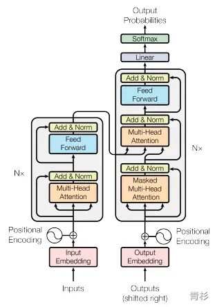

# 人工智能与大语言模型科普文
---
# 人工智能
## 什么是人工智能
> 人工智能（AI）是指用普通计算机程序来呈现人类智能的技术。
> 人工智能的四个主要组成部分是：
> - 专家系统：作为专家处理正在审查的情况，并产生预期或预期的绩效。
> - 启发式问题解决：包括评估小范围的解决方案，并可能涉及一些猜测，以找到接近最优的解决方案。
> - 自然语言处理：在自然语言中实现人机之间的交流。
> - 计算机视觉：自动生成识别形状和功能的能力。
> 人工智能的核心问题包括建构能够跟人类似甚至超卓的推理、知识、计划、学习、交流、感知、移动 、移物、使用工具和操控机械的能力等。 
> -- 引自“[维基百科-人工智能](https://zh.wikipedia.org/wiki/%E4%BA%BA%E5%B7%A5%E6%99%BA%E8%83%BD)”

常见人工智能领域：

- **计算机视觉**（Computer Vision，CV）：计算机视觉致力于使计算机能够理解和处理图像、视频和其他视觉数据。它包括目标检测、图像分割、人脸识别等任务。
- **语音识别和处理**（Speech Recognition and Processing）：这个领域关注将人类语音转换为文本，以及对语音数据进行分析和处理。
- **自然语言处理**（Natural Language Processing，NLP）：NLP 旨在使计算机能够理解、生成和处理人类语言。它包括文本分类、机器翻译、问答系统等任务。
- **机器学习**（Machine Learning，ML）：ML 是 AI 的一个重要子领域，它使用数据来训练模型，使其能够自动改进性能。
- **知识图谱**（Knowledge Graph）：知识图谱是一种用图模型来描述知识和建模世界万物之间的关联关系的技术方法
- 等等
## 机器学习
机器学习是人工智能的一个子领域，机器学习的目标是设计和开发一些算法和模型，使计算机在不需要明确编程的情况下，从数据中自动分析获得规律，并利用规律对未知数据进行预测。
机器学习可分为两类：

- **监督学习**：从给定的训练数据集中（训练数据集包含特征(输入)和标签(输出)），学习特征与标签间的映射关系，并生成一个函数，可根据这个函数预测结果。
- **无监督学习**：从给定的训练数据集中（训练数据集不包含标签），学习和发现数据中潜在的结构和规律，，并生成一个函数，可根据这个函数预测结果。
### 深度学习
深度学习是机器学习的一种类型。它试图模拟人脑的工作原理，通过神经网络进行学习。深度学习模型由多层神经网络组成，可以处理大量的数据并从中学习复杂的模式。常应用于计算机视觉、语音识别、自然语言处理、音频识别与生物信息学等领域
### 强化学习
强化学习是机器学习的一种类型。根据感知到的状态采取相应的动作，然后环境会给出一个奖励信号，智能体根据这个反馈调整其策略，以期在未来获得更大的奖励。类似人类通过试错逐步优化行为。常应用于游戏、机器人、自动驾驶等领域。
## 神经网络
神经网络是指模仿人脑神经元工作方式的算法模型。常见神经网络架构有：

- 循环神经网络（Recurrent Neural Networks，RNN）：一类具有短期记忆能力的神经网络，用于处理有序数据，例如：视频、语音、文本等。
- 卷积神经网络（Convolutional Neural Networks，CNN）：通过卷积层和池化层来提取图像特征，广泛应用于图像分类、目标检测等领域。
- Transformer：允许模型在处理一个序列元素时，能够考虑到序列中所有元素的信息，而不仅仅是相邻的元素的。
- 等等...
### 循环神经网络
一类具有短期记忆能力的神经网络。其具备短期记忆能力的关键：通过使用带自反馈的神经元，使得网络的输出不仅和当前的输入有关，还和上一时刻的输出相关，于是在处理任意长度的时序数据时，就具有短期记忆能力。
RNN的结构包括输入层、隐藏层和输出层。

- 输入层的特征向量（例如文本中的单词或时间序列中的数据点）通过权重矩阵传递到隐藏层。
- 隐藏层的值不仅由当前时刻的输入决定，还受到上一时刻隐藏层的影响。
- 输出层根据隐藏层的值计算出最终的输出。

限制：

- 梯度消失问题：由于反向传播时梯度逐层传递，当序列很长时，梯度可能变得非常小，网络的前面层权重无法得到有效更新，导致停止学习。
- 梯度爆炸问题：在深层网络或递归神经网络中，误差梯度在更新中累积得到一个非常大的梯度，这样的梯度会大幅度更新网络参数，进而导致网络不稳定。
- 长期依赖消失问题：当序列很长时，信息在传递过程中可能丢失，导致无法有效地处理长期依赖性。
#### 参考资料：

- [深度学习之循环神经网络](https://www.cnblogs.com/Luv-GEM/p/10703906.html)
### 卷积神经网络
一种前馈神经网络，具有局部连接和权值共享等特点。
CNN由多个卷积层、全连接层和池化层组成（卷积层用于提取图像特征，全连接层用于分类，池化层用于压缩数据和减少过拟合）。

- 数据输入层：对原始图像进行预处理，包括去均值、归一化和PCA/白化等操作。
- 卷积计算层：执行卷积运算，提取图像特征。
- ReLU激励层：应用非线性映射，如ReLU函数。
- 池化层：压缩数据，保持特征不变性。
- 全连接层：用于分类和输出。
#### 参考资料：

- [一文搞懂卷积神经网络（CNN）的原理（超详细）](https://blog.csdn.net/AI_dataloads/article/details/133250229)
- [3分钟看懂图像识别和卷积神经网络_哔哩哔哩_bilibili](https://www.bilibili.com/video/BV1AL4y1b7er/?spm_id_from=333.1007.top_right_bar_window_history.content.click&vd_source=85ea0a5088d20bab1ef0e85150124a33)
- [【卷积神经网络】为什么卷积哪儿都能用？_哔哩哔哩_bilibili](https://www.bilibili.com/video/BV1Ys4y1M7W5/?spm_id_from=333.1007.top_right_bar_window_history.content.click&vd_source=85ea0a5088d20bab1ef0e85150124a33)
### Transformer
让模型在处理一个序列元素时，能够考虑到序列中所有元素的信息，而不仅仅是相邻的元素。考虑所有元素信息的关键：自注意力机制 + 位置编码。
Transformer模型主要由两部分组成：编码器（Encoder）‌和解码器（Decoder）‌。编码器负责将输入序列转换为一系列连续的向量表示，而解码器则利用这些向量表示以及先前生成的输出序列来生成最终的输出。

基于 Transformer 架构进行拆分，可分为三种主流架构：

- 仅编码器：主要适用于不需要生成序列的任务，只需要对输入进行编码和处理的单向任务场景，如文本分类、情感分析等，如以 BERT 为代表的相关模型。
- 仅解码器：通常用于序列生成任务，可以从输入的编码中生成相应的序列，如文本生成、机器翻译等。如以 GPT 为代表的相关模型。
- 编码器-解码器：通常用于序列到序列（Seq2Seq）任务，如机器翻译、对话生成等，如以 T5 为代表相关大模型。
#### 参考资料：

- [ChatGPT原理揭密！背后的黑科技Transformer模型_哔哩哔哩_bilibili](https://www.bilibili.com/video/BV1ZG411y7aZ/?spm_id_from=pageDriver&vd_source=85ea0a5088d20bab1ef0e85150124a33)
- [如何理解 Transformer 中的自注意力机制？ - 知乎](https://www.zhihu.com/question/560879732)
- [Attention is all you need](https://proceedings.neurips.cc/paper_files/paper/2017/file/3f5ee243547dee91fbd053c1c4a845aa-Paper.pdf)
# 大语言模型(LLM)
## 什么是大语言模型
通常使用深度学习技术，如神经网络，来训练大量的文本数据。大语言模型能够理解和生成人类语言，具有强大的语言结构理解和生成能力。
特点：

- 规模大：大量数据生成大量的参数。（大语言模型中，参数通常指神经网络中的权重和偏置）
- 上下文学习：能够记住之前的对话或文本片段，并据此生成连贯且相关的回应或输出。
- 遵循用户的指令：根据给定的提示或命令来生成相应的文本。
- 循序渐进推理：能够根据一系列的提示或指令，逐步推导出最后的答案或结论。
## 大模型训练
### 从零开始训练
#### 预训练（Pretraining）
预训练是大型语言模型（LLM）的第一步。在预训练阶段，模型使用大量无标签的文本数据进行无监督学习训练，以学习语言知识和世界知识。预训练的目标是让模型具备通用的语言理解能力（词汇、句法和语义的规律）。
#### 指令微调（Instruction Tuning）
微调是预训练后的第二步。在微调阶段，模型使用特定任务的有标签数据（包括人类对模型应该执行的任务描述和期望的输出结果）进行监督学习训练，以适应下游任务。微调的目标是使模型在特定任务上表现良好。
微调技术：

- Supervised Fine-Tuning（监督微调，SFT）：指在源数据集上预训练一个神经网络模型，即源模型。然后创建一个新的神经网络模型，即目标模型。目标模型复制了源模型上除了输出层外的所有模型设计及其参数。这些模型参数包含了源数据集上学习到的知识，且这些知识同样适用于目标数据集。微调时，为目标模型添加一个输出大小为目标数据集类别个数的输出层，并随机初始化该层的模型参数。在目标数据集上训练目标模型时，将从头训练到输出层，其余层的参数都基于源模型的参数微调得到。
   - 优点：
      - 利用预训练模型的参数和结构，避免从头开始训练模型，从而加速模型的训练过程，并且能够提高模型在目标任务上的表现。
   - 缺点：
      - 需要大量的标注数据用于目标任务的微调，如果标注数据不足，可能会导致微调后的模型表现不佳。
      - 由于预训练模型的参数和结构对微调后的模型性能有很大影响，因此选择合适的预训练模型也很重要。
- LoRA（大语言模型的低阶自适应）：冻结预训练好的模型权重参数，在冻结原模型参数的情况下，通过往模型中加入额外的网络层，并只训练这些新增的网络层参数。
- Freeze：对原始模型部分参数进行冻结操作，仅训练部分参数，以达到在单卡或不进行 TP 或 PP 操作，就可以对大模型进行训练。在语言模型模型微调中，Freeze 微调方法仅微调 Transformer 后几层的全连接层参数，而冻结其它所有参数。
- Prompt-tuning（提示调整）：调整输入提示而非修改模型参数。这使得模型可以执行特定任务，而不修改底层模型参数。
#### 奖励模型（Reward Model）
在微调阶段只是将预训练中的知识给引导出来，只告诉了模型什么是好的数据，但没有给出不好的数据，当微调数据有限的情况下，可能会出现“有害性”或“幻觉”问题。而奖励模型就是解决该问题的，奖励模型通过对生成的内容进行打分来筛选出“正确”的数据。
#### 强化学习（Reinforcement Learning）
使用奖励模型阶段挑出这些回复中得分较高的回复并再次训练原本的模型。
### 基于基座模型微调
> 基于基座模型微调前提：预训练模型和下游任务的差距不大，预训练模型中通常已经包含微调任务中所需要的知识。

模型库：[ModelScope - 模型列表页](https://www.modelscope.cn/models)
基座模型代表：

- LLaMA
- MPT
- Gemma
- 国内各大语言模型平台
   - [微调百川Baichuan-13B保姆式教程，手把手教你训练百亿大模型](https://zhuanlan.zhihu.com/p/643950663)
### 参考资料：

- [【LLM】从零开始训练大模型](https://zhuanlan.zhihu.com/p/636270877)
- [大语言模型微调技术：SFT 监督微调、LoRA 微调方法、P-tuning v2 微调方法、Freeze 监督微调方法](https://cloud.tencent.com/developer/article/2338313)
- [大模型扫盲系列——初识大模型](https://cloud.tencent.com/developer/article/2362076)
- [OpanAI-调整语言模型以遵循指令](https://openai.com/research/instruction-following)
## ChatGPT 与 AlphaGO/Zero 的区别

- ChatGPT 是基于 Transformer 架构实现理解和生成文本。(GPT = Generative Pre-trained Transformer = 生成式预训练Transformer）
- AlphaGO 是基于监督学习和强化学习，以人类专家的棋谱作为训练数据，专用于围棋领域。
- AlphaZero 是基于深度学习和强化学习，不需要棋局数据，通过自我博弈从零学习，专用于棋盘类领域。

参考资料：

- [Alpha Go / Zero是怎样炼成的（part1:简述）_哔哩哔哩_bilibili](https://www.bilibili.com/video/BV1a5411Q7en/?spm_id_from=333.788&vd_source=85ea0a5088d20bab1ef0e85150124a33)
# 国内大语言模型
| **大模型** | **出品方** | **可选大模型** | **支持独立训练** | **支持微调** | **补充** | API | 收费 |
| --- | --- | --- | --- | --- | --- | --- | --- |
| 千帆 | 百度 | ✅ | ✅ | ✅ | - 支持独立训练模型（全流程）| [API介绍](https://cloud.baidu.com/doc/WENXINWORKSHOP/s/flfmc9do2) | [计费概述](https://cloud.baidu.com/doc/WENXINWORKSHOP/s/Blfmc9dlf)   收费分为六部分：  - 平台预置服务调用（即模型API)   - 用户部署服务调用（即独立部署模型）  - 模型精调   - 模型评估   - 数据管理  - 插件服务|
| 混元 | 腾讯 | ❌ | ❌ | ❌ | - 仅提供自家大模型API | [接口文档](https://cloud.tencent.com/document/product/1729/101848) | [购买指南](https://cloud.tencent.com/document/product/1729/97731)   注册即送 10w Token，1 token ≈ 1.8 个中文汉字或 3 个英文字母|
| 通义 | 阿里 | ✅ | ✅ | ✅ | - 支持独立训练模型（阿里云百炼） |  | 各模型API及收费价格：[模型列表_模型服务灵积(DashScope)](https://help.aliyun.com/zh/dashscope/developer-reference/model-square/?spm=a2c4g.11186623.0.0.4531140b3r59BQ)   [阿里云百炼](https://bailian.aliyun.com/?spm=5176.28508143.J_4VYgf18xNlTAyFFbOuOQe.212.62c8154ahLNuPP&accounttraceid=89849a0035134cfbb51b234f032bb1dbckse) |
| 星火 | 讯飞 | ❌ | ❌ | ✅ | - 提供自家大模型API | [星火认知大模型服务说明](https://www.xfyun.cn/doc/spark/%E6%8E%A5%E5%8F%A3%E8%AF%B4%E6%98%8E.html) |  |
| 方舟 | 抖音 | ✅ | ❌ | ✅ | - 各大模型API独立收费   - 支持模型微调（仅支持字节大模型） | [API调用指南](https://www.volcengine.com/docs/82379/1099475) | [产品计费--火山方舟大模型服务平台-火山引擎](https://www.volcengine.com/docs/82379/1099320)   API 免费 50w Token   收费分三部分：  - 模型推理（即模型 API）  - 模型精调 |
| 百川 | 百川智能(前搜狗CEO王小川创办) | ❌ | ❌ | ❌ | - 仅提供自家大模型API | [百川大模型-接口文档](https://platform.baichuan-ai.com/docs/api) | [百川大模型-价格说明](https://platform.baichuan-ai.com/price)   注册即送 100w Token，1 token ≈ 1.5 个汉字 |
