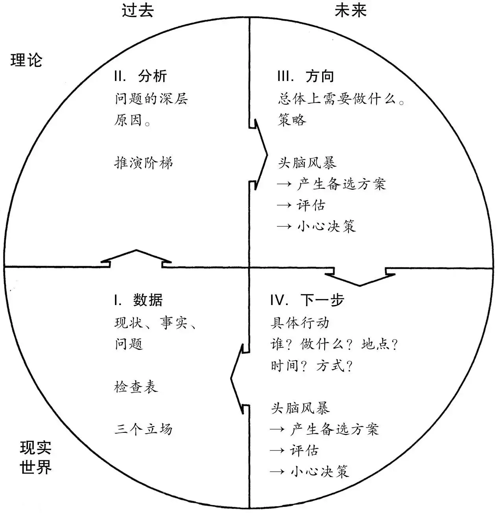
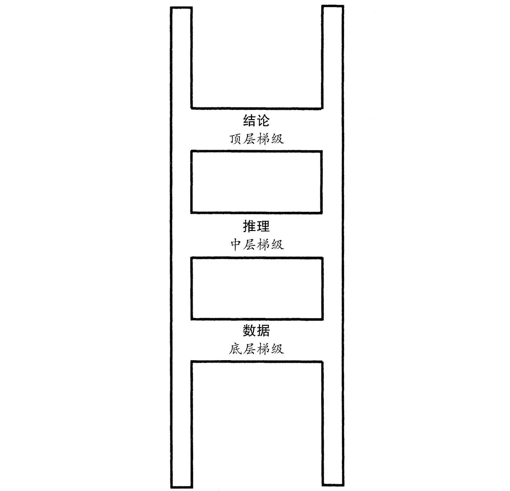
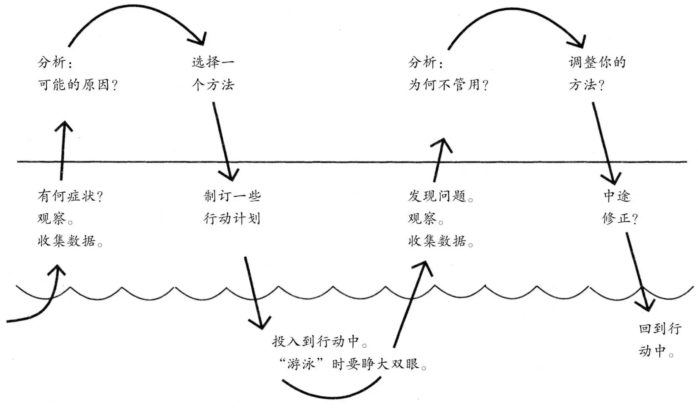

# 《横向领导力》读书笔记
---
# 团都合作无法改善的三个原因：
## 个人技能有限
- 缺乏良好的工作习惯
   - 无法完成独立工作
   - 犯过的错误，还会再犯
   - 没有形成有效可行的固定工作流程
## 缺乏对良好合作的清晰认识

   - 高效的团队效率应该有怎样的表现？
   - 良好的团队合作的目标是什么？
   - 什么样的工作方式是正确的？谁来分配任务，如何分配，分配给谁（知道不应该做什么 与 知道应该做什么 完全是两回事）
## 如何影响他人

- 无法让他人改进他们的行为
# 如何协调团队
## 提升个人技能，为团队做更大贡献
先把自己分内的事情做到最好，同时了解其他方面的知识（对他人有所帮助的知识），成为一名优秀的追随者。
## 有明确目标
知道自己想要一个什么样的团队，以及如何落实。知道如何做好比知道什么不好更重要。
## 影响他人

   - [提问] 提出问题，让人们思考某个合作中问题并寻求解决方案
   - [作答] 说出自己的想法，邀请别人接受、运用或修改该想法
   - [行动] 将自己的想法付诸行动，作为进一步改进的基础
# 横向领导力五个基本要素（让别人做什么）
> 目标：根据你想要实现的结果制定目标
> 思考：有条理地思考，从数据，到分析，到方向，再到具体行动
> 学习：在经验中学习，随时学习，随时总结
> 专注：通过接受具有挑战性的任务，充分投入到工作中
> 反馈：对于应该坚持的工作方法和需要改进的工作方法提供和寻求反馈

## 目标
> 知道想要做什么，做成什么样子，大家一起参与制定目标

### 技能提升（独立工作时把事情做好）
> 制定良好的个人目标

一组优秀的目标应符合四个标准：

- 鼓励你付出更大的努力
- 有助于对成功进行衡量，对你付出的努力进行评估
- 鼓励你从现在开始努力
- 保证你的日常工作有助于实现你想要获得的最终结果

在三个时间段制定目标：

- 鼓舞人心的长远目标（远期目标可以为我们的工作提供方向和理由）

良好的远期目标应该着眼与未来，不受近期的琐事影响，应该清晰可及，指导你明天的工作。

- 本身具有价值的中期目标（中期目标可以为我们提供前进道路上的一些可以测量的、有价值的路标）

把一座桥从河岸搭建到河流中间并不算是中期目标，搭建横跨两岸、仅有一半宽度的桥梁才算是中期目标。

- 一些可以即刻着手去实现的短期目标
### 明确目标（共同使用该技能应该达到怎样的效果）
### 改进团队合作方式（使用技能及“提问、作答、行动”技巧）
## 思考
> 有效产生新的思想并付诸行动

### 技能提升

- 数据：寻找制订决策所需要的信息

用三个不同立场看待问题，避免“有色眼镜”过滤掉重要信息

   - 自己：问自己对局面的整体感受如何、情况如何、可以获取哪些信息、什么是重要的，意识到自己的立场对观察结果产生多大影响。同时不要看到其他人观点具有一定合理性就放弃自己的观点，必须意识到自己观点的不完整性。
   - 对方：站在对方的角度，感受对局面的看法，利用“有色眼镜”可以得到利于“自己”（即对方）的信息，可以理解对方的观点，以及改进自己的想法。
   - 中立方：站在旁观者角度，可以洞察整个局面，可以注意到更多情况。例如踢足球，把自己想象在看台，可以留心观察双方队员正在看什么、想要干什么。
- 分析：你应该静下心来寻找原因，而不是立即对眼前的问题作出反应

当你分析某个局面时，一定要区分两种不同的“原因”：你无法改变的原因和你能够改变的原因。不要对你无法改变的事情叹息，应该关注你能改变的事情。
如何对分析进行检验？ -> 使用“推演阶梯”

通过观察到的“数据”，“推理”他人可能的想法，得出最终的“结论”

- 方向：想出具有创造性的方法

在这个阶段，你只需想出可行的策略，对它们进行评估，小心地在这些策略中作出选择。你应该将你的需求与可用的资源进行对比，并以此为基础制定总体计划。
将思考分成三部分：产生想法—评估想法—作出决定

   - 产生想法：头脑风暴，此过程只需想，不要批判
   - 评估想法：对头脑风暴中产生的想法列举优缺点
   - 做出决定：根据列举的优缺点，选择最终想法
- 下一步：把好的想法转化为行动计划

所谓“可行的计划”，指的是一组非常清晰的指令，人们在执行这些指令时不会产生疑问，能够获得预期的结果。
### 共同使用这一技能的效果
> 所有人有条理地“同步思考”问题：人越多，无组织思考的危害越严重

不管你是与另一个人合作，还是与许多人合作，饼图都是一个良好的会议框架。你们的目标是在四个象限的帮助下实现“同步思考”。在每个象限中，你们可以指出何时进行头脑风暴、产生选项，何时对选项进行评估，何时作决定，以进一步规范集体思维。
作为一个团队，我们不需要从头到尾严格遵守四个象限的顺序。面对许多问题时，我们可以列出所有问题的数据，然后进行分析，依此类推。我们也可以一次研究一个问题，每个问题按照合理的步骤进行到“下一步”。我们还可以从解决方案开始，回过头来研究支持这个方案的分析和数据。我们也可以将所有这些方法结合起来。最重要的是，对于每个问题，我们都要把每个象限中的思考表述清楚——或者说，我们应该找出还有哪些空缺需要填补。
### 改进团队合作
想让一个团队了解系统性思考方式，最简单的方法就是引导他们对目前的问题进行有序的讨论。
## 学习/计划
> 实践检验思想，检查哪些地方存在缺陷，不断修正，趋向完美

### 技能提升
> 在工作中不断学习问题：计划基于错误的假设，行动基于错误的计划

思考需要靠行动来提供新的数据，行动需要不断依靠新的思考来修改方向。（边思考边行动，用行动来验证思考，发现问题，调整行动）
你应该考虑风险问题。当你感觉将你的想法付诸实践存在风险并为此感到犹豫时，你应该问自己：“采取行动与不采取行动、保持原状相比，哪个风险更大？”
该行动的时候就应该停止思考，立即动手；该思考的时候就应该立即放下手里的工具，想一想你正在做什么，你是怎么做的。
将行动与思考进行结合，不断重复这个循环，每次总结都会产生新的信息，有了这些信息，你就可以投入到新的工作中，制定新的计划并付诸实践。

### 共同使用这一技能的效果
> 共同准备和总结问题：人越多，越难从实践中学习

理想目标是：组织里的每个人都理解在计划得到完善之前开始行动的价值，以及随时停下来查看局面发展状况和团队合作情况的价值。
### 改进团队合作

- 收集数据：对情况进行观察，并询问别人注意到了什么，留心观察哪些能够将你的想法推翻的“数据”。然后将这些信息提供给能够有效利用它们的人，一个会思考如何处理这些信息，并不会批评你的人。
- 分析：根据已有信息，分析问题出现的原因。
- 提供方向：向处于更佳位置、能够改变局面的人提出建议
- 采取行动：先自己落实一些方法，验证想法是否是对的
> 当你努力想让同事采取更好的做法时，必须牢记：你会发现你所尝试的一些方法效果并不好。面对失败，你很容易认为这是一项无法完成的任务。这时，你应该总结经验，吸取教训。你可以对你的行为进行仔细分析，看一看哪里出了问题。当你再次努力，你应该作出一些调整。通过实践和总结，你的努力会越来越有成效。

## 专注/激励
> 制定的目标影响专注程度，较低要求时，可以重新制定合理目标，激发斗志

想知道如何鼓励他人为团队的共同事业投入更多精力，你应该首先问自己两个问题：一是为什么你不能更加努力地工作，二是对此你能做什么。
### 技能提升
> 塑造你的工作，使之包含趣味性和挑战性

- 问题：有时对工作缺乏热情
- 分析：
   - 不喜欢这份工作
   - 没有挑战性
   - 做的事一点都不重要
- 想法(解决方案)：
   - 制订一系列短期目标，并循序渐进的实现
   - 寻找机会充分发挥你的能力。如：帮助同事解决问题，帮助同事改善他们的技能（即分享自己的经验），做无人过问的工作。
- 总之将你力所能及、对集体有好处、对你自己也有好处的事情纳入你的工作范围
### 共同使用这一技能的效果
> 每个人充分投入到工作中

- 找出大家不专心工作的原因
   - 有人感到被冷落了：无法自己制订工作计划，只能遵守命令。这样不会有很强的责任心。
   - 把责任推给别人：面对一项任务时，集体中的每个人都在等着其他人完成这个任务。任务分配有问题。
- 解决办法：
   - 尽量向每个人分配具有隐性价值（尊重、自主性、影响）的任务或角色
   - 为每个人提供发表意见的机会
   - 大家共同承担分配工作的责任
   - 使用更好的标准来分配工作

一些分配任务的基本标准：

      - 将工作分配给能够完成任务的最小群体。
      - 将工作交给胜任这项工作的、级别最低的员工处理。
      - 给每个人分配他能胜任的最重要的任务。
### 改进团队合作
> 营造努力工作的氛围你可以把改善团队合作当成你的任务

- 提升组员的参与度，指定结果后，放手组员来实现。
- 先询问再决定，自己不知道的要询问下属
## 反馈
> 接受同事的建议、分享自己的建议与结果

### 技能提升
> 学习如何通过提供反馈来帮助别人问题：有能力帮助同事时，我们没有伸出援手

你反馈的目的是什么呢？你是想鼓励他，还是指出他的错误？你是想对他作出评价，还是对他的优秀表现提出表扬。至少有三种不同的方法可以选择。你应该根据不同的目的提供不同的反馈。

- “感谢”是把你对他人努力工作的感激和赞许之情表达出来。这是一种情感上的表达，目的是满足对方情感上的需要。
- “建议”（或“指导”）是指出你认为对方的哪些具体行为应该坚持，哪些应该改变。此时你的关注点是评价工作而不是评价人。
- “评估”是根据一组明确或默认的标准以及其他人的表现对对方的表现作出评价。
### 共同使用这一技能的效果
> 大家相互支持，相互指导

为什么大家不愿意互相帮助？
因为存在一些毫无根据的假设：

- 我来这儿不是为了相互奉承的。他只是在做本职工作而已，没有必要对他所做的工作表示感谢。
- 只有弱者才需要表扬。
- 有能力的人不需要别人来告诉他如何工作。为了维持完美无缺的形象，回避/拒绝别人建议，否认自己的错误。
- 指导是上级对下级做的事。仅仅接受来自上级的建议或将建议或指导等同于命令

解决办法 - 整个团队在一组更好的假设下共同工作：

- 感谢会让每个人拥有更好的表现。不分上下级，感谢别人为这件事所付出的努力，即使这件事没有办成功。
- 寻求指导是有能力的象征。一个人的能力越强，就越能从指导中受益。寻求建议并不是软弱的标志，它说明人们拥有接触新思想的观念和提升自我的意愿。
- 谁都可以指导别人，谁都可以接受别人的指导。你的上级，你的下属，与你平级的同事，他们都有可能对你提出宝贵的建议。你应该倾听所有人的声音，然后认真考虑他们提出的建议。你对他们的个人意见不应该影响到你对这些建议的评价。
### 改进团队合作
> 表示感谢、请求指导

当你不是团队领导，你怎样鼓励团队获得更好的反馈技能以及有关反馈的假设呢？这个问题的答案相对来说比较简单。首先，你可以向你的下属、同事、上司表示感谢。他们可能会理解你的意图，并效仿你的做法。不过，主动指导你的上司是有风险的，尤其是这一做法在你的团队中并不常见时。在这一点上，你需要非常谨慎。
# 如何影响他人（怎么样让他们按照你的想法去做）
提出工作建议时，

- 要注意他人的角色，不能拒绝他人参与，不能命令他人，要让他知道自己角色的重要性；
- 要说明建议背后的想法，明确产生的价值，为什么要这样做，同时也要让他人参与思考；
- 行胜于言，要先实践自己的想法，才能说服别人去做

实践方法论：
> 你不需要研究如何解决问题，关键在于改善解决问题的过程。

- 提出具体的问题、建议，便于清晰且易于操作的实践
- 不能摆出高人一等，以平等身份把你的信息、分析、思想、建议提出来，邀请别人一起决策
- 对事不对人，“锯子更好用，就不应该用锤子”，研究工具问题而不是人的问题
- 理解他人目前做法的原因，可能看上去缺乏效率，但这么做可能有其他原因
- 勇于承担责任，承认自己的错误，承担相应责任，这样不会让其他人产生很强的危机感
- 斟酌人们如何看待他们的角色，你分配的角色既要满足同事的要求，又要帮助团队提高效率。分配的角色应该是活跃的、能展示出自己的能力、在某种程度上能控制他们所做的事情以及团队前进方向
- 保持开放心态。说服同事相信你愿意接受他们的正确意见 比 说服他们接受你的意见 更容易。要做一名优秀的领导者，你必须知道何时应该做一名合格的追随者。
# 总结：
横向领导者可以做的事情：

- 提高个人工作技能：
   - 根据结果制定目标。
   - 按照“问题—分析—战略—策略”的顺序有条理地思考。
   - 尽快投入行动，定期总结，以便更快地从经验中学习。
   - 充分投入到有挑战性的任务中。
   - 协助团队营造一个上下级和同事之间相互支持、相互反馈的氛围。
- 促使大家共同使用这些技能。为此，你可以：
   - 提出具有启发性的问题。
   - 提供数据、想法和建议。
   - 按照你的理想做出表率。
- 你的同事可能掌握更多的信息，拥有更好的想法。
- 你要虚心接受不同的意见。
