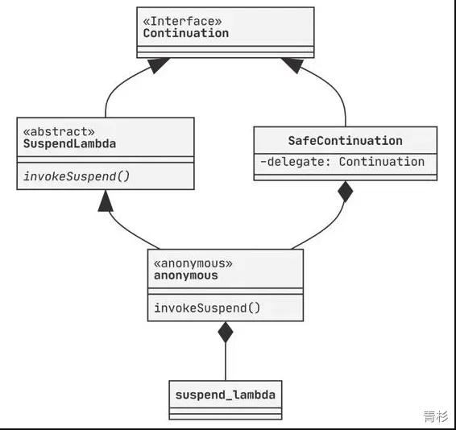

# 《深入理解Kotlin协程》读书笔记
---
> 协程：需要程序自己处理挂起和恢复
# 协程分类
> 按照分类，kotlin 协程是无栈、非对称协程

## 按调用栈分类

- 有栈协程
> 每一个协程都有自己的调用栈，有点类似于线程的调用栈，这种情况下的协程实现其实很大程度上接近线程，主要的不同体现在调度上。

- 无栈协程
> 协程没有自己的调用栈，挂起点的状态通过状态机或者闭包等语法来实现。

有栈协程的优点是可以在任意函数调用层级的任意位置挂起，并转移调度权，例如Lua的协程。在这方面多数无栈协程就显得力不从心了，例如Python的Generator。通常，有栈协程总是会给协程开辟一块栈内存，因此内存开销也大大增加，而无栈协程在内存方面就比较有优势了。
当然也有反例，Go语言的go routine可以认为是有栈协程的一个实现，不过Go运行时在这里做了大量优化，它的栈内存可以根据需要进行扩容和缩容，最小一般为内存页长4KB，比内核线程的栈空间（通常是MB级别）要小得多。
## 按调度方式分类

- 对称协程
> 任何一个协程都是相互独立且平等的，调度权可以在任意协程之间转移。

- 非对称协程
> 协程出让调度权的目标只能是它的调用者，即协程之间存在调用和被调用关系。

对称协程实际上已经非常接近线程的样子了，例如Go语言中的go routine可以通过读写不同的channel来实现控制权的自由转移。常见语言对协程的实现大多是非对称实现，例如 JS 中的 async/await，await时将调度权转移到异步调用中，异步调用返回结果或抛出异常时总是将调度权转移回await的位置。
# 基础协程
## 协程的构造
```kotlin
//创建一个协程
val continuation = suspend{
    println("In Coroutine")
    5
}.createCoroutine(object: Continuation<Int>{
    override fun resumeWith(result: Result<Int>){
        println("Coroutine End: $result")
    }

	override val context = EmptyCoroutineContext
})

//启动协程
continuation.resume()
```
这里创建协程的代码的 API 如下：

> Q：createCoroutine() 创建返回的 Continuation，为什么调用起 resume() 就可以触发协程体执行？

createCoroutine() 返回的是 SafeContinuation 的实力，其持有一个 delegate 属性，它就是 Continuation 的本体，它的类型是 <\FileName>Kt$<\FunctionName>$continuation$1（没错就是一个匿名内部类类型），即我们的协程体。
我们的协程体 Suspend Lambda（suspend() -> T) 在经过 kotlin 编译器处理生成一个匿名内部类，这个类继承自SuspendLambda类，而这个类又是Continuation接口的实现类。
一个函数如何对应一个类呢？这里其实不难理解，Suspend Lambda有一个抽象函数invokeSuspend（这个函数在它的父类BaseContinuationImpl中声明），编译生成的匿名内部类中这个函数的实现就是我们的协程体。
协程体的类实现关系图如下：

> 在了解了拦截器之后，你还会发现这里的delegate实际上是拦截器拦截之后的结果，通常来讲这也是一层“马甲”，不过我们这里还没有添加拦截器，所以它就是协程体本身

## 函数的挂起
通过 suspend 修饰的函数即为挂起函数，但函数是否真正挂起则取决于函数内部是否存在异步操作。
例如：
```kotlin
suspend fun notSuspend() = suspendCoroutine<Int>{ continuation ->
    continuation.resume(1000)
}
```
异步调用是否发生，取决于resume函数与对应的挂起函数的调用是否在相同的调用栈上，切换函数调用栈的方法可以是切换到其他线程上执行，也可以是不切换线程但在当前函数返回之后的某一个时刻再执行。前者比较容易理解，后者其实通常就是先将Continuation的实例保存下来，在后续合适的时机再调用，存在事件循环的平台很容易做到这一点。
> CPS变换（Continuation-Passing-Style Transformation，即“续体传递风格”）

通过传递Continuation来控制异步调用流程的。Kotlin协程挂起时就将挂起点的信息保存到了Continuation对象中。Continuation携带了协程继续执行所需要的上下文，恢复执行的时候只需要执行它的恢复调用并且把需要的参数或者异常传入即可。
如上面示例中的 notSuspend() 挂起函数，在经过 kotlin 编译器编译后，对应 java 代码如下：
```kotlin
/**
 * 方法会注入一个 Continuation 入参，即续体传递
 *   这也是为什么挂起函数可以调用普通函数，但普通函数无法调用挂起函数
 * 
 * 方法返回一个 Object 类型，当需要挂起时，返回一个状态 COROUTINE_SUSPENDED，否则直接返回结果
 */
public final Object notSuspend(@NotNull Continuation completion) {
    //...
}
```
## 协程的拦截器
每个挂起点的恢复都可以注入拦截器（如: 日志拦截器），更常见的如线程切换（线程调度器）。
```kotlin
suspend{
    suspendFunc("hello")
    suspendFunc("world")
}.startCoroutine(object: Continuation<Int> {
    //...
})
```
如上面代码，调用了两次挂起函数 suspendFunc()，对应的恢复调用有 3 次：

- 协程启动时调用一次，通过恢复调用来开始执行协程体从开始到下一个挂起点之间的逻辑。
- 挂起点如果是异步挂起（suspendFunc()）则在恢复时调用一次。

所以上面代码恢复调用次数为 3 次，即 1 + n（n 代表异步挂起点个数）次。
> 拦截器的实现

```kotlin
class LogInterceptor : ContinuationInterceptor {
  override val key = ContinuationInterceptor

  override fun <T> interceptContinuation(continuation: Continuation<T>)
      = LogContinuation(continuation)
}

class LogContinuation<T>(private val continuation: Continuation<T>)
  : Continuation<T> by continuation {
  override fun resumeWith(result: Result<T>) {
    println("before resumeWith: $result")
    continuation.resumeWith(result)
    println("after resumeWith.")
  }
}
```
将日志拦截器添加到上下文中
```kotlin
suspend {
  ... // 省略
}.startCoroutine(object : Continuation<Int> {
  override val context = LogInterceptor()
  ... // 省略 resumeWith
})
```
执行结果：
```kotlin
before resumeWith: Success(kotlin.Unit) // 协程启动时调用
after resumeWith.
before resumeWith: Success(5) //第一次调用 suspendFunc()
after resumeWith.
before resumeWith: Success(5) //第二次调用 suspendFunc()
Coroutine End: Success(5)
after resumeWith.
```
在“协程的构造”一节中提到 SafeContinuation 持有一个 delegate 在没有拦截器时就是协程体，当有拦截器时就是拦截器返回的新 Continuation。
添加拦截器后类实现关系图如下：

# Kotlin协程官方库
## 基础API
### 启动模式

- DEFAULT：协程创建后，立即开始调度，在调度前如果协程被取消，其将直接进入取消响应的状态。
- TOMIC：协程创建后，立即开始调度，协程执行到第一个挂起点之前不响应取消。
- LAZY：只有协程被需要时，包括主动调用协程的start、join或者await等函数时才会开始调度，如果调度前就被取消，那么该协程将直接进入异常结束状态。
- UNDISPATCHED：协程创建后立即在当前函数调用栈中执行，直到遇到第一个真正挂起的点。
> 注意，“立即调度”与“立即执行”的差别：立即调度表示协程的调度器会立即接收调度指令，但具体执行的时机以及在哪个线程上执行，还需要根据调度器的具体情况而定。
> 根据“立即调度”和“立即执行”进行分类
> - DEFAULT 虽然是立即调度，但也有可能在执行前被取消。
> - DEFAULT 虽然是立即调度，但也有可能在执行前被取消。
> - ATOMIC 虽然是立即调度，但其将调度和执行两个步骤合二为一了，就像它的名字一样，其保证调度和执行是原子操作，因此协程也一定会执行。
> - UNDISPATCHED 和 ATOMIC 虽然都会保证协程一定执行，但在第一个挂起点之前，前者运行在协程创建时所在的线程，后者则会调度到指定的调度器所在的线程上执行。

```kotlin
fun CoroutineScope.launch(
  context: CoroutineContext = EmptyCoroutineContext,
  start: CoroutineStart = CoroutineStart.DEFAULT,
  block: suspend CoroutineScope.() -> Unit
): Job { ... }
```
### 调度器

- Default：默认调度器，适合处理后台计算，其是一个CPU密集型任务调度器。
- IO：IO调度器，适合执行IO相关操作，其是一个IO密集型任务调度器。
- Main：UI调度器，根据平台不同会被初始化为对应的UI线程的调度器，例如在Android平台上它会将协程调度到UI事件循环中执行，即通常在主线程上执行。
- Unconfined：“无所谓”调度器，不要求协程执行在特定线程上。协程的调度器如果是Unconfined，那么它在挂起点恢复执行时会在恢复所在的线程上直接执行，当然，如果嵌套创建以它为调度器的协程，那么这些协程会在启动时被调度到协程框架内部的事件循环上，以避免出现StackOverflow。
> Q：Default 和 IO 调度器实际使用同一个线程池，为什么二者在使用上会存在差异呢？
> A：由于IO任务通常会阻塞实际执行任务的线程，在阻塞过程中线程虽然不占用CPU，但却占用了大量内存，这段时间内被IO任务占据线程实际上是资源使用不合理的表现，因此IO调度器对于IO任务的并发量做了限制，避免过多的IO任务并发占用过多的系统资源，同时在调度时为任务打上PROBABLY_BLOCKING的标签，以方便线程池在执行任务调度时对阻塞任务和非阻塞任务区别对待。

**将已有线程池转为调度器**
```kotlin
Executors.newSingleThreadExecutor()
  .asCoroutineDispatcher()
  .use { dispatcher ->
    val result = withContext(dispatcher) {
      delay(100)
      "Hello World"
    }
  }
```
### 全局异常处理器

1. 自定义全局处理器
```kotlin
class GlobalCoroutineExceptionHandler: CoroutineExceptionHandler {
  override val key = CoroutineExceptionHandler

  override fun handleException(
    context: CoroutineContext, 
    exception: Throwable
  ) {
    println("Global Coroutine exception: $exception")
  }
}
```

2. 在classpath下面创建META-INF/services目录，并在其中创建一个名为kotlinx.coroutines.CoroutineExceptionHandler的文件，文件的内容就是我们的全局异常处理器的全类名
```kotlin
com.bennyhuo.kotlin.coroutine.ch06.exceptionhandler.GlobalCoroutineExceptionHandler
```

3. 当程序中有未捕获的异常时，就会由自定义的全局异常处理器处理。
> 全局异常处理器不适用于JavaScript和Native平台

```kotlin
//示例
GlobalScope.launch {    
  throw ArithmeticException("Hey!")
}.join()


//日志输出：
Global Coroutine exception: java.lang.ArithmeticException: Hey!
Exception in thread "<...>" java.lang.ArithmeticException: Hey!
  at com.bennyhuo.kotlin.<...>.GlobalCoroutineExceptionHandlerKt$main$2.invokeSuspend(GlobalCoroutineExceptionHandler.kt:18)
  ...
```
### 同步操作支持协程取消
利用 yield() 使得协程中同步操作在执行中时支持响应协程取消。
yield() 的作用主要是检查所在协程的状态，如果已经取消，则抛出取消异常予以响应。此外，它还会尝试出让线程的执行权，给其他协程提供执行机会。
```kotlin
GlobalScope.launch {
  listOf(1,2,3,4).forEach {
    yield()	//检查是否取消
    println(it)
  }
}.join()
```
### 超时取消
withTimeou(){} 可以设定一个超时，如果它的第二个参数 block 运行超时，那么就会被取消，取消后 withTimeout 直接抛出取消异常。如果不希望在超时的情况下抛出取消异常，也可以使用 withTimeoutOrNull，它的效果是在超时的情况下返回 null 。
```kotlin
GlobalScope.launch {
  val user = withTimeout(5000) {
    getUserSuspend()
  }
  println(user)
}.join()
```
### 禁止取消
NonCancellable 的作用就是禁止作用范围内的协程被取消。
```kotlin
GlobalScope.launch {
  val job = launch {
    listOf(1,2,3,4).forEach {
      yield()
      //禁止 delay() 响应取消
      withContext(NonCancellable){
        delay(it * 100L)
      }
    }
  }
  delay(200)
  job.cancelAndJoin()
}.join()
```
## 热流 Channel
> 热流：不管是否有订阅者，会一直创建新数据

Channel 可实现两个协程之间的通信
```kotlin
val channel = Channel<Int>()

val producer = GlobalScope.launch {
  var i = 0
  while (true){
    delay(1000)
    channel.send(i++)
  }
}

val consumer = GlobalScope.launch {
  while(true){
    val element = channel.receive()
    println(element)
  }
}

producer.join()
consumer.join()
```
### Channel 的缓冲区
```kotlin
public fun <E> Channel(capacity: Int = RENDEZVOUS): Channel<E> =
  when (capacity) {
    RENDEZVOUS -> RendezvousChannel()
    UNLIMITED -> LinkedListChannel()
    CONFLATED -> ConflatedChannel()
    else -> ArrayChannel(capacity)
  }
```

- RENDEZVOUS：译为“不见不散”，缓冲区容量为 0，即没有订阅者时，生产者一直处于挂起状态。
- UNLIMITED：译为“来者不拒”，缓冲区容量不限制，即没有订阅者时，生产者也会一直生产。
- CONFLATED：译为“合并”，缓冲区容量为 1，即没有订阅者时，生产者会一直生产，但只保留最新值。
### Channel 的迭代器
Channel本身确实有些像序列，可以依次读取，所以我们在读取的时候也可以直接获取一个Channel的iterator。
```kotlin
val consumer = GlobalScope.launch {
  val iterator = channel.iterator()
  while(iterator.hasNext()){ // 挂起点
    val element = iterator.next()
    println(element)
    delay(2000)
  }
}

// 或
val consumer = GlobalScope.launch {
  for (element in channel) {
    println(element)
    delay(2000)
  }
}
```
### Channel 的关闭
对于一个Channel，如果我们调用了它的close方法，它会立即停止接收新元素，也就是说这时候它的isClosedForSend会立即返回true。而由于Channel缓冲区的存在，这时候可能还有一些元素没有被处理完，因此要等所有的元素都被读取之后isClosedForReceive才会返回true。
```kotlin
val channel = Channel<Int>(3)

val producer = GlobalScope.launch {
  List(3){
    channel.send(it)
    println("send $it")
  }
  channel.close()
  println("""close channel. 
    |  - ClosedForSend: ${channel.isClosedForSend}
    |  - ClosedForReceive: ${channel.isClosedForReceive}""".trimMargin())
}

val consumer = GlobalScope.launch {
  for (element in channel) {
    println("receive $element")
    delay(1000)
  }

  println("""After Consuming. 
    |   - ClosedForSend: ${channel.isClosedForSend} 
    |   - ClosedForReceive: ${channel.isClosedForReceive}""".trimMargin())
}

//输出：
send 0
receive 0
send 1
send 2
close channel. 
  - ClosedForSend: true
  - ClosedForReceive: false
▶1000ms later
receive 1
▶1000ms later
receive 2
▶1000ms later
After Consuming. 
   - ClosedForSend: true 
   - ClosedForReceive: true
```
> Q: Channel的关闭有什么意义？
> A：Channel内部的资源其实就是个缓冲区，如果我们创建一个Channel而不去关闭它，虽然并不会造成系统资源的泄露，但却会让接收端一直处于挂起等待的状态，因此一定要在适当的时机关闭Channel。

> Q: Channel的关闭究竟应该由谁来处理?
> A:  一对一单向通信，由发送端处理关闭，一对一双向通信、一对多、多对多，由主导方处理关闭。

## 冷流 Flow
> 冷流：只有订阅才会产生数据

```kotlin
val intFlow = flow {
  (1..3).forEach { 
    emit(it)
    delay(100)
  }
}

//消费，并指定消费在 myDispatcher 调度器上
GlobalScope.launch(myDispatcher) {
  //指定生产在 IO 调度器上
  intFlow.flowOn(Dispatchers.IO)
    .collect { println(it) }
}.join()
```
### Flow 的异常处理
> 如果没有调用catch函数，未捕获的异常会在消费时抛出。请注意，catch函数只能捕获它上游的异常。

```kotlin
flow {
  emit(1)
  throw ArithmeticException("Div 0")
}.catch { t: Throwable ->
  println("caught error: $t")
}
```
### 分离 Flow 的消费和触发
collect() 可以包含消费和触发操作，如果想将消费与触发分离，可通过 onEach() 可以指定具体的消费操作。
```kotlin
fun createFlow() = flow<Int> {
    (1..3).forEach {
      emit(it)
      delay(100)
    }
}.onEach { 
    //消费
    println(it) 
}

fun main(){
  GlobalScope.launch {
    createFlow().collect() //触发
  }
}
//或者
fun main(){
  createFlow().launchIn(GlobalScope)  //触发
}
```
### Flow 的取消
Flow没有提供取消操作，Flow的取消主要依赖于末端操作符所在的协程的状态。
```kotlin
val job = GlobalScope.launch {
  val intFlow = flow {
    (1..3).forEach {
      delay(1000)
      emit(it)
    }
  }

  intFlow.collect { println(it) }
}

delay(2500)
job.cancelAndJoin()

//在上述代码中，每隔1000ms生产一个元素，2500ms以后协程被取消，
//  因此最后一个元素生产前Flow就已经被取消了，输出为：
// 1
// ▶1000ms later
// 2
```
### Flow 的背压
> 背压问题在生产者的生产速率高于消费者的处理速率的情况下出现。

解决方式：

1. 添加缓冲（buffer）但会造成数据积压
```kotlin
flow {
  List(100) {
    emit(it)
  }
}.buffer()
```

2. 新数据覆盖老数据（conflate）
```kotlin
flow {
  List(100) {
    emit(it)
  }
}.conflate()
.collect { value ->
  println("Collecting $value")
  delay(100) 
  println("$value collected")
}

//输出：
// Collecting 1
// 1 collected
// Collecting 99
// 99 collected
```

3. 取最新数据（collectLatest）
> **与 conflate 的区别：**
> collectLatest并不会直接用新数据覆盖老数据，而是每一个数据都会被处理，只不过如果前一个还没被处理完后一个就来了的话，处理前一个数据的逻辑就会被取消。

```kotlin
flow {
  List(100) {
    emit(it)
  }
}.collectLatest { value ->
  println("Collecting $value")
  delay(100)
  println("$value collected")
}

//输出：
// Collecting 0
// Collecting 1
// ...
// Collecting 97
// Collecting 98
// Collecting 99
// ▶100ms later
// 99 collected
```
## 多路复用 Select
### 多路复用 await
> 场景：
> 分别从网络和本地缓存获取数据，期望哪个先返回就先显示哪个，如果先返回的是本地缓存，那么我们还需要获取网络结果来展示最终结果。

```kotlin
//从网络获取数据
fun CoroutineScope.getUserFromApi(login: String) = async(Dispatchers.IO){
  githubApi.getUserSuspend(login)
}

//从本地获取数据
fun CoroutineScope.getUserFromLocal(login:String) = async(Dispatchers.IO){
  File(localDir, login).takeIf { it.exists() }
    ?.readText()
    ?.let { 
      gson.fromJson(it, User::class.java) 
    }
}

GlobalScope.launch {
  val login = "..."
  val localDeferred = getUserFromLocal(login)
  val remoteDeferred = getUserFromApi(login)

  //使用 select 多路服用 await
  // 调用了onAwait在select中注册回调，select总是会立即调用最先返回的事件的回调
  val userResponse = select<Response<User?>> {
    localDeferred.onAwait { Response(it, true) }
    remoteDeferred.onAwait { Response(it, false) }
  }
  
  //显示最先返回的数据
  userResponse.value?.let { println(it) }
  
  //判断先返回的是否为本地，如果是，则获取忘了结果，更新本地并显示
  userResponse.isLocal.takeIf { it }?.let {
    val userFromApi = remoteDeferred.await()
    cacheUser(login, userFromApi)
    println(userFromApi)
  }
}.join()
```
### 多路复用 Channel
```kotlin
val channels = List(10) { Channel<Int>() }

GlobalScope.launch {
  delay(100)
  channels[Random.nextInt(10)].send(200)
}

//对于onReceive，如果Channel被关闭，select会直接抛出异常；
//  而对于onReceiveOrNull，如果遇到Channel被关闭的情况，it的值就是null。
val result = select<Int?> {
  channels.forEach { channel ->
    channel.onReceive { it }
    // OR
    channel.onReceiveOrNull { it }
  }
}
println(result)
```
### 使用 Flow 实现多路复用
> 例如，使用 Flow 实现 “多路复用 await” 一节中的场景。

```kotlin
//从网络获取数据
fun CoroutineScope.getUserFromApi(login: String) = async(Dispatchers.IO){
  githubApi.getUserSuspend(login)
}

//从本地获取数据
fun CoroutineScope.getUserFromLocal(login:String) = async(Dispatchers.IO){
  File(localDir, login).takeIf { it.exists() }
    ?.readText()
    ?.let { 
      gson.fromJson(it, User::class.java) 
    }
}

coroutineScope {
  val login = "..."
  // 创建由两个函数引用组成的List
  listOf(::getUserFromApi, ::getUserFromLocal)
    .map { function ->
      //调用这两个函数得到deferred
      function.call(login)
    }
    .map { deferred ->
      //重点！！！
      //对于每一个deferred我们创建一个单独的Flow，
      //  并在Flow内部发送deferred.await()返回的结果，即返回的User对象
      flow { emit(deferred.await()) }
    }
    //将两个Flow实例整合成一个Flow进行处理
    .merge() 
    .onEach { user ->
      println("Result: $user")
    }.launchIn(this)
}
```

> 例如：使用 Flow 实现 “多路复用 Channel” 一节中的场景。

```kotlin
val channels = List(10) { Channel<Int>() }

GlobalScope.launch {
  delay(100)
  channels[Random.nextInt(10)].send(200)
}

val result = channels.map {
  //通过 consumeAsFlow() 被映射成Flow
  it.consumeAsFlow()
}
.merge()
.first()
```
## 并发安全
### 协程并发工具
#### Channel
> 并发安全的消息通道

#### Mutex
> 轻量级锁，它的lock和unlock从语义上与线程锁比较类似，之所以轻量是因为它在获取不到锁时不会阻塞线程而只是挂起等待锁的释放。

```kotlin
var count = 0
val mutext = Mutex()
List(1000) {
  GlobalScope.launch {
    mutext.withLock {
      count++
    }
  }
}.joinAll()

println(count)
```
#### Semaphore
> 轻量级信号量，信号量可以有多个，协程在获取到信号量后即可执行并发操作。
> 当Semaphore的参数为1时，效果等价于Mutex。

```kotlin
var count = 0
val semaphore = Semaphore(1)
List(1000) {
  GlobalScope.launch {
    semaphore.withPermit {
      count++
    }
  }
}.joinAll()

println(count)
```
