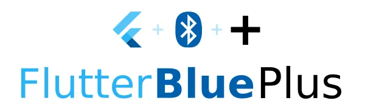

  <a href="./Flutter/FlutterBluePlus封装">
    
 手把手教你如何封装 flutter_blue_plus   详细介绍 flutter_blue_plus 封装思路、实现、坑点。  

    

        
    

  </a>

 

  <a href="./Android/Gradle_分功能打包">
    
 Gradle 实现分功能打包   如何使用 Gradle productFlovers 实现分功能打包？如：free 与 vip，分渠道。  

    

        
    

  </a>

 

  <a href="./Android/RecyclerView有效曝光">
    
RecycerView 有效曝光埋点实现方案  最近参加面试，被问到一个实景问题：RecyclerView 如何实现曝光埋点？  

    

        
    

  </a>

 

  <a href="./Android/WebView加载优化">
    
探索 WebView 加载优化  探索&实验 WebView 加载 H5 秒开优化方式 

    

        
    

  </a>

 