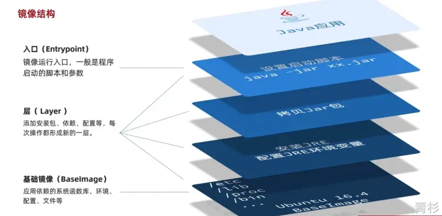

# Android
---

  <a href="./Android/模块打包aar">
    
 Android性能优化-编译优化之模块aar化   自定义 Gradle 插件，支持模块自动打包aar，以及源码与aar切换  

    

        
    

  </a>

 

  <a href="./Android/Gradle编译优化">
    
 Android性能优化-编译优化   探索常见Android编译检测与优化方式  

    

        
    

  </a>

 

  <a href="./Android/Gradle_分功能打包">
    
 Gradle 实现分功能打包   如何使用 Gradle productFlovers 实现分功能打包？如：free 与 vip，分渠道。  

    

        
    

  </a>

 

  <a href="./Android/RecyclerView有效曝光">
    
RecycerView 有效曝光埋点实现方案  最近参加面试，被问到一个实景问题：RecyclerView 如何实现曝光埋点？  

    

        
    

  </a>

 

  <a href="./Android/WebView加载优化">
    
Android性能优化-探索 WebView 加载优化  探索&实验 WebView 加载 H5 秒开优化方式 

    

        
    

  </a>

 

  <a href="./Android/源解Glide_图片缓存">
    
 【源码解读】源解 Glide - 图片缓存  通过阅读 Glide 源码，了解磁盘缓存、内存缓存、BitmapPool 存储结构、存入与取出时机 

    

        
    

  </a>

 

  <a href="./Android/源解Glide_监听者">
    
 【源码解读】源解 Glide - 监听者  通过阅读 Glide 源码，了解如何监听生命周期变化、网络变化、内存变化  

    

        
    

  </a>

 

  <a href="./Android/源解Glide_加载流程">
    
 【源码解读】源解 Glide - 网络图片加载流程  通过阅读 Glide 源码，了解从调用 API 到图片显示都经历了什么  

    

        
    

  </a>

 

  <a href="./Android/电量优化">
    
Android性能优化-电量优化  电量分析、常用工具、优化手段 

    

        
    

  </a>

 

# 后端开发
---

  <a href="./后端开发/Docker学习笔记">
    
Docker学习笔记   常用 docker指令、目录挂载、自定义网络、自定义镜像、DockerCompose 

    

        
    

  </a>

 

# Java
---

  <a href="./Java/注解">
    
Java注解生命周期  面试官：说一下注解生命周期；SOURCE、CLASS、RUNTIME 的区别是什么？ 

    

        
    

  </a>

 

  <a href="./Java/源码解析ThreadLocal">
    
源码解析 ThreadLocal  从源码角度解答 ThreadLocal 是如何做到线程隔离存储数据的. 

    

        
    

  </a>

 

  <a href="./Java/泛型">
    
Java与Kotlin中的泛型   泛型的类型，泛型类型擦除原理与解决方法.

    

        
    

  </a>

 

  <a href="./Java/Java集合_Set">
    
Java集合-Set篇  讲解常见集合(Set) 相关存储结构、扩容方式、新增/删除/清空操作 

    

        
    

  </a>

 

  <a href="./Java/Java集合_Map">
    
Java集合-Map篇  讲解常见集合(Map) 相关存储结构、扩容方式、新增/删除/清空操作 

    

        
    

  </a>

 

  <a href="./Java/Java集合_List">
    
Java集合-List篇  讲解常见集合(List) 相关存储结构、扩容方式、新增/删除/清空操作 

    

        
    

  </a>

 

  <a href="./Java/Java反射">
    
Java 反射  Java 反射基础知识.

    

        
    

  </a>

 

  <a href="./Java/Exception_Error">
    
Exception与Error  什么是 Exception？什么是 Error？两者的关系？

    

        
    

  </a>

 

