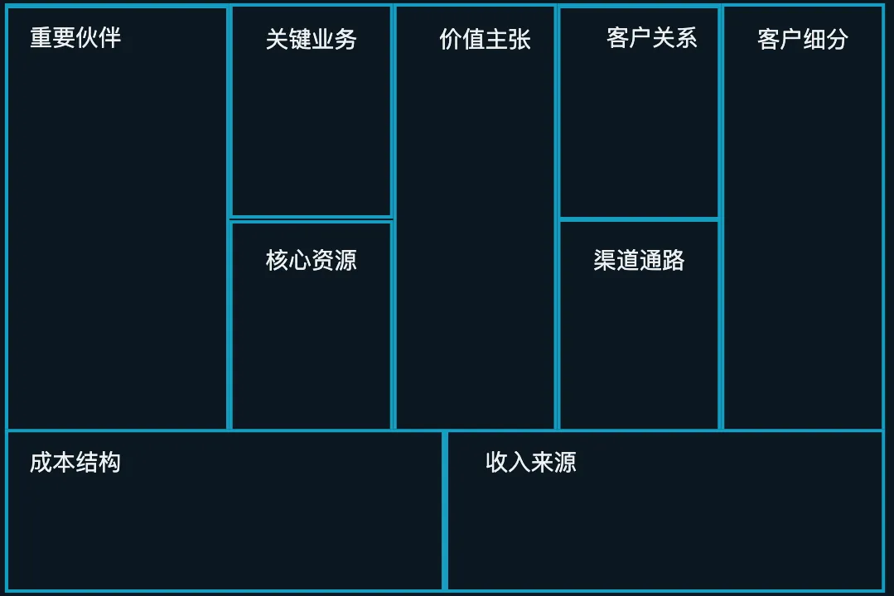
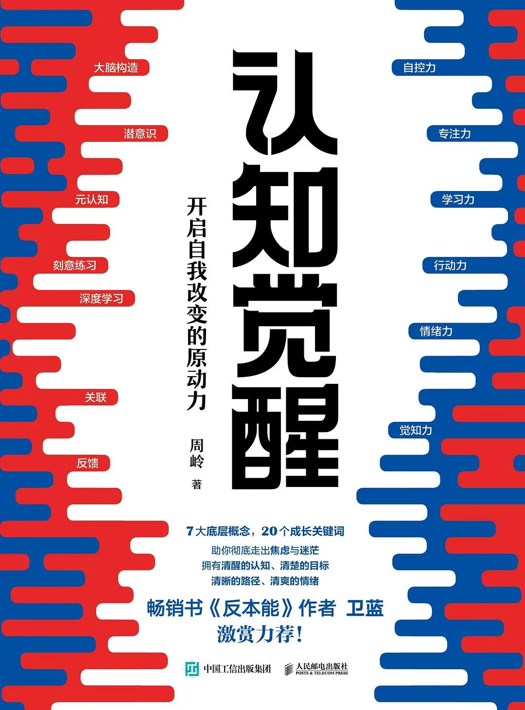
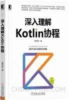
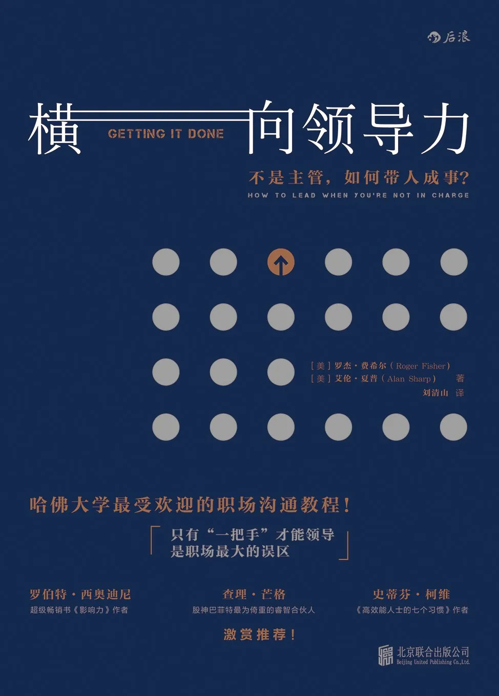
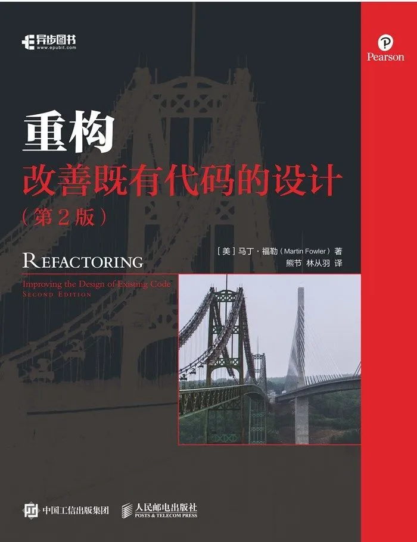
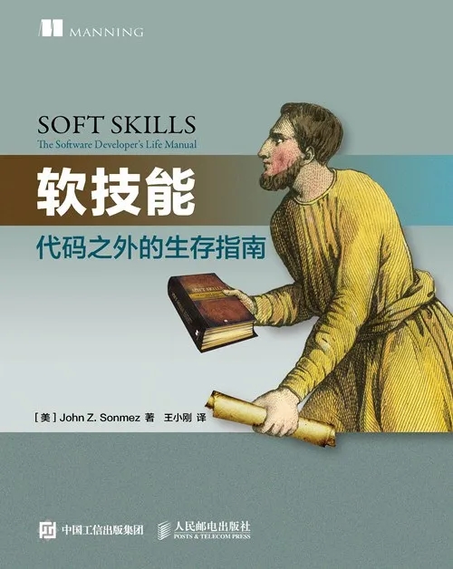

# 总结与思考
---

  <a href="./ThinkSummary/清华-商业模式的逻辑">
    
“清华公开课: 商业模式的逻辑” 笔记   什么是商业模式？商业模式描述了企业如何创造价值、传递价值、获取价值的基本原理。 

    

        
    

  </a>

 

  <a href="./ThinkSummary/人工智能与大语言模型科普文">
    
人工智能与大语言模型科普文   人工智能（AI）是指用普通计算机程序来呈现人类智能的技术。大语言模型能够理解和生成人类语言，具有强大的语言结构理解和生成能力。 

    

        
    

  </a>

 

# 读书笔记
---

  <a href="./ThinkSummary/我的外婆从不内耗">
    
 《我的外婆，从不内耗》读书笔记   在我成长的过程中，是外婆的言传身教治好了我所有的焦虑和拧巴，纠结和自卑。 

    

        
    

  </a>

 

  <a href="./ThinkSummary/认知觉醒">
    
 《认知觉醒：开启自我改变的原动力》读书笔记   通过“大脑构造、潜意识、元认知”等思维规律，你将真正看清自己；通过“深度学习、关联、反馈”事物规律，你将洞悉如何真正成事！ 

    

        
    

  </a>

 

  <a href="./ThinkSummary/深入理解Kotlin协程">
    
《深入理解Kotlin协程》读书笔记   一部从工作机制、实现原理、应用场景、使用方法、实践技巧、标准库、框架、应用案例等多个维度全面讲解Kotlin协程的专著。 

    

        
    

  </a>

 

  <a href="./ThinkSummary/横向领导力">
    
《横向领导力》读书笔记   如果你不知道你想努力获得什么目标，那么你很难成功。 

    

        
    

  </a>

 

  <a href="./ThinkSummary/重构—改善既有代码的设计">
    
《重构—改善既有代码的设计》读书笔记   本质上说，重构就是在代码写好之后改进它的设计。 

    

        
    

  </a>

 

  <a href="./ThinkSummary/软技能—代码之外的生存指南">
    
《软技能—代码之外的生存指南》读书笔记   这是一本真正从“人”（而非技术也非管理）的角度关注软件开发人员自身发展的书。 

    

        
    

  </a>

 