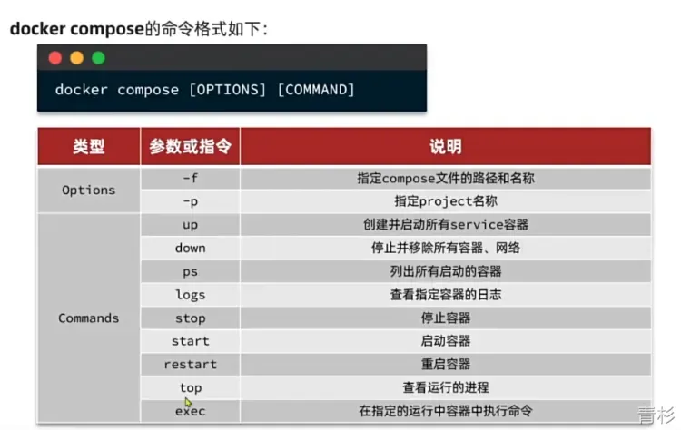

# Docker 学习笔记
----
# 常见命令
- 从仓库拉取镜像：`docker pull `
- 查询本地镜像：`docker images`
- 删除本地镜像：`docker rmi`
- 制作镜像：`dokcer build`
- 本地镜像打包成压缩包：`docker save`
- 依赖加载镜像压缩包：`docker load -i + 压缩包`
- 本地镜像推送到仓库：`docker push `
- 运行镜像（如果本地没有，会自动拉取）：`docker run`
- 暂停镜像：`docker stop + 容器名`
- 启动镜像：`docker start + 容器名`
- 查询运行中的镜像进程：`docker ps (-a)（ -a 包含停止的容器）`
- 删除容器：`docker rm -f  + 容器名`
- 查看镜像运行日志：`docker logs (-f) （-f 会持续输出）`
- 进入容器：`docker exec (-it) + 容器名 + bash （进入容器内部，可修改配置等）`
- 查看容器详情：`docker inspect + 容器名`

# Linux 安装 Docker
```shell
# 更新apt包索引
sudo apt-get update

# 为支持https
sudo apt-get install \
    apt-transport-https \
    ca-certificates \
    curl \
    gnupg-agent \
    software-properties-common

# 添加Docker GPG秘钥
# 国内源
curl -fsSL https://mirrors.ustc.edu.cn/docker-ce/linux/ubuntu/gpg | sudo apt-key add -
# 或者国外源
# curl -fsSL https://download.docker.com/linux/ubuntu/gpg | sudo apt-key add -

# 添加安装源
# 推荐国内源
sudo add-apt-repository \
    "deb [arch=amd64] https://mirrors.ustc.edu.cn/docker-ce/linux/ubuntu \
    $(lsb_release -cs) \
    stable"
# 或者国外源
# sudo add-apt-repository \
#   "deb [arch=amd64] https://download.docker.com/linux/ubuntu \
#   $(lsb_release -cs) \
#   stable"

# 更新apt包索引
sudo apt-get update

# 安装docker
sudo apt-get install docker-ce docker-ce-cli containerd.io

#开自启docker
sudo systemctl enable docker
sudo systemctl start docker

#取消 sudo 执行 docker 命令
sudo usermod -aG docker $USER

# 测试 
docker --version
```
# 挂载
挂载主要是用来解决容器内配置修改、文件操作等，因为容器内仅支持基础环境，像 vim 等并没有，如果想修改配置、移动文件等操作，实现起来比较负责，所以此时挂载一个数据卷/本地目录，实现文件的映射（双向绑定），方便操作。
> 注意：挂载操作要在容器创建时实现，容器创建之后无法再挂载。

## 挂载数据卷
数据卷(Volume)是一个虚拟目录，是容器内目录与宿主机目录之间映射的桥梁。这里的宿主机可以理解成服务器。此时操作宿主机目录就会映射操作容器内的目录。

挂载执行命令：
```xml
docker run -d --name 容器名 -e 环境变量 -p 端口映射 -v 数据卷名:容器内目录 镜像名
```
例如：docker run -d --name nginx -p 80:80 -v html:/usr/share/nginx/html nginx
此时，创建了 nginx 容器，并创建了 html 数据卷，将 nginx 容器中的 html 目录映射到了宿主中的 html 数据卷。
此后，通过 docker volume inspect html 查看 html 数据卷的详细信息，就可知其存储路径(Mountpoint 字段），之后此路径下的操作都会映射到容器内目录的文件。
常用命令：

- 创建数据卷：docker volume create
- 查看所有数据卷：docker volume ls
- 删除指定数据卷：docker volume rm + 数据卷名
- 查看某个数据卷详情：docker volume inspect + 数据卷名
- 清除数据卷：docker volume prune
## 挂载本地目录
挂载执行命令：
```xml
docker run -d --name 容器名 -e 环境变量 -p 端口映射 -v 本地绝对路径:容器内目录 镜像名
```
例如：docker run -d --name mysql -p 337:337 -v /root/mysql:/var/lib/mysql mysql
此时，创建了 mysql 容器，并将 mysql 容器的数据存储目录(/var/lib/mysql) 映射到本地路径(/root/mysql），之后操作该本地路径就等于操作容器目录。
# 自定义镜像
> 镜像就是包含应用程序、程序运行的系统函数库、运行配置等文件的文件包


## Dockerfile
Dockerfile 是一个文本文件，其中包含一个个的指令(Instruction)，用指令来说明要执行什么操作来构建镜像，将来 Docker 可以根据 Dockerfile 帮我们构建镜像。常见执行如下：（详细语法-> https://docs.docker.com/engine/reference/builder）

| 指令 | 说明 | 示例 |
| --- | --- | --- |
| FROM | 基础镜像 | FROM centos:6 |
| ENV | 环境变量，可在后面指令试用 | ENV key value |
| COPY | 拷贝本地文件至镜像的指定目录 | COPY ./jre11.tar.gz /tmp |
| RUN | 执行 Linux 的 shell 命令，一般是安装过程的命令 | RUN tar -zxvf /tmp/jre11.tar.gz && EXPORTS path=/tmp/jre11:$path |
| EXPOSE | 指定容器运行时监听的端口，给镜像使用者看的 | EXPOSE 8080 |
| ENTRYPOINT | 镜像中应用的启动启动命令，容器运行时调用 | ENTRYPOINT java -jar xxx.jar |

示例1：基于 Ubuntu 基础镜像构建 java 应用
```dockerfile
#基础镜像
FROM ubuntu:16.04
#配置环境变量
ENV JAVA_DIR=/usr/local
#拷贝jdk和java项目的包
COPY ./jdk8.tar.gz $JAVA_DIR/
COPY ./docker-demo.jar /tmp/app.jar
#安装JDK
RUN cd $JAVA_DIR \ && tar -xf ./jdk8.tar.gz \ && mv ./jdk1.8.0_144 ./java8
#配置环境变量
ENV JAVA_HOME=$JAVA_DIR/java8
ENV PATH=$PATH:$JAVA_HOME/bin
#入口，java项目启动命令
ENTRYPOINT ["java","-jar","/app.jar"]
```
示例2：基于JDK 基础镜像构建 java 应用
```dockerfile
#基础镜像
FROM openjdk:11.0-jre-buster
#拷贝java项目包
COPY ./docer-demo.jar /tmp/app.jar
#入口，java项目启动命令
ENTRYPOINT ["java","-jar","/app.jar"]
```
## 构建镜像
```shell
#docker build -t 镜像名:镜像版本 Dockerfile目录
#docker build -t repository:tag(tag 不指定默认 latest) dockerfilePath
docker build -t xxx:1.0 .
```
# 容器间通信
> 例如：一个 java 项目，需要链接数据库、Redis等，则对应 Docker 上不同的镜像。

## 默认网络
默认情况下，Docker 在安装之后默认会创建一张虚拟网卡，会在这张虚拟网卡上创建一个虚拟网桥，所有容器都是以 bridge 方式链接到这个虚拟网桥上。

这种情况下，各容器可通过 ip 实现相互之间的链接，但弊端是，当 docker 重启后后 ip 会变化，这种 hardcode 方式成本很高。
## 自定义网络
创建自定义网络，加入自定义网络的容器除了可以通过 ip 访问，还可以通过容器名互相访问。
docker 自定义网络操作命令

| 命令 | 说明 | 示例 |
| --- | --- | --- |
| docker network create | 创建一个网络 | docker network create 网络名 |
| docker network ls  | 查看所有网络 |  |
| docker network rm | 删除指定网络 |  |
| docker network prune | 清除未使用的网络 |  |
| docker network connect | 使指定容器连接加入某网络 | docker network connect 网络名 容器名 |
| docker network disconnect | 使指定容器链接离开某网络 |  |
| docker network inspect | 查看网络详细信息 |  |

- 创建时直接加入网络
```shell
docker run -d --name 容器名 -p 8080:8080 --network 网络名 镜像名
```
# DockerCompose
Docker Compose 通过一个单独的 docker-compose.yml 模板文件 (YAML格式）来定义一组相关联的应用容器，帮助我们实现多个互相关联的 Docker 容器的快速部署。


```shell
# 启动所有容器并后台运行
# -d 表示后台运行
docker compose up -d
```

> 学习来源：
> [01.Docker课程介绍_哔哩哔哩_bilibili](https://www.bilibili.com/video/BV1HP4118797?p=1&vd_source=85ea0a5088d20bab1ef0e85150124a33)