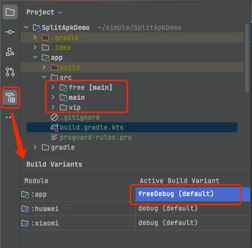

---
# https://vitepress.dev/reference/default-theme-home-page
layout: home

hero:
  name: "青杉的博客"
  text: "知识库、日志、总结"
  tagline: 一切烦恼都是想得多做的少

features:
  - icon: <svg t="1721188150262" class="icon" viewBox="0 0 1024 1024" version="1.1" xmlns="http://www.w3.org/2000/svg" p-id="14829" width="104" height="104"><path d="M307.2 204.8a51.2 51.2 0 0 1 51.2-51.2h307.2a51.2 51.2 0 0 1 51.2 51.2v51.2H307.2V204.8z" fill="#9486FF" p-id="14830"></path><path d="M204.8 358.4V307.2a51.2 51.2 0 0 1 51.2-51.2h512a51.2 51.2 0 0 1 51.2 51.2v51.2" fill="#FFBA00" p-id="14831"></path><path d="M153.6 358.4m51.2 0l614.4 0q51.2 0 51.2 51.2l0 409.6q0 51.2-51.2 51.2l-614.4 0q-51.2 0-51.2-51.2l0-409.6q0-51.2 51.2-51.2Z" fill="#6B57FE" p-id="14832"></path><path d="M541.2864 512l5.0176 6.0416-40.5504 222.4128-5.0176 4.1984H476.16l-5.0176-6.0416 40.5504-222.4128 5.0176-4.1984h24.576z m-126.8736 26.0608l7.2704 4.6592v24.576l-3.0208 4.6592-111.7184 50.944 111.7184 50.944 3.0208 4.6592v24.576l-7.2704 4.6592-155.4432-70.9632L256 632.1152v-18.432l2.9696-4.6592 155.4432-70.9632z m194.4064 0l155.4432 70.9632 2.9696 4.6592v18.432l-2.9696 4.6592-155.4432 70.9632-7.2704-4.6592v-24.576l3.0208-4.6592 111.7184-50.944-111.7184-50.944-3.0208-4.6592v-24.576l7.2704-4.6592z" fill="#FFFFFF" p-id="14833"></path></svg>
    title: 开发总结
    details: 开发过程中的踩坑记录
    link: /doc/developeHome
    linkText: "开始阅读"
  - icon: <svg t="1721187881644" class="icon" viewBox="0 0 1024 1024" version="1.1" xmlns="http://www.w3.org/2000/svg" p-id="7938" width="104" height="104"><path d="M672.914286 1024H351.085714C157.988571 1024 0 866.011429 0 672.914286V351.085714C0 157.988571 157.988571 0 351.085714 0h321.828572c194.56 0 351.085714 157.988571 351.085714 351.085714v321.828572c0 193.097143-157.988571 351.085714-351.085714 351.085714z" fill="#E8E4FF" p-id="7939"></path><path d="M494.445714 332.068571c-24.868571-10.24-62.902857-20.48-127.268571-20.48h-144.822857c-14.628571 0-27.794286 10.24-27.794286 32.182858v408.137142c0 14.628571 10.24 27.794286 27.794286 27.794286h182.857143c27.794286 0 57.051429 2.925714 87.771428 17.554286l1.462857-465.188572z m292.571429-20.48v397.897143c0 24.868571-17.554286 42.422857-42.422857 42.422857h-105.325715c-24.868571 0-49.737143 10.24-67.291428 24.868572 10.24-2.925714 27.794286-2.925714 45.348571-2.925714h182.857143c14.628571 0 27.794286-10.24 27.794286-27.794286V342.308571c0-14.628571-10.24-27.794286-27.794286-27.794285l-13.165714-2.925715z" fill="#907FFF" p-id="7940"></path><path d="M223.817143 475.428571c-8.777143 0-14.628571-5.851429-14.628572-14.628571v-14.628571c0-8.777143 5.851429-14.628571 14.628572-14.628572s14.628571 5.851429 14.628571 14.628572v14.628571c0 8.777143-5.851429 14.628571-14.628571 14.628571z m0-58.514285c-8.777143 0-14.628571-5.851429-14.628572-14.628572v-26.331428c0-30.72 21.942857-46.811429 42.422858-46.811429h45.348571c8.777143 0 14.628571 5.851429 14.628571 14.628572s-5.851429 14.628571-14.628571 14.628571h-45.348571c-5.851429 0-13.165714 4.388571-13.165715 17.554286v26.331428c0 8.777143-5.851429 14.628571-14.628571 14.628572z" fill="#FFFFFF" p-id="7941"></path><path d="M645.12 229.668571c-49.737143 0-87.771429 24.868571-109.714286 67.291429v465.188571c24.868571-27.794286 62.902857-49.737143 105.325715-49.737142h52.662857c27.794286 0 52.662857-24.868571 52.662857-52.662858V254.537143c0-14.628571-10.24-27.794286-27.794286-27.794286l-73.142857 2.925714z" fill="#AA9CFD" opacity=".7" p-id="7942"></path></svg>
    title: 开发知识库
    details: 移动端、前端、后端、开发语言等
    link: /doc/knowledgeHome
    linkText: "开始阅读"
  - icon: <svg t="1721188459704" class="icon" viewBox="0 0 1024 1024" version="1.1" xmlns="http://www.w3.org/2000/svg" p-id="22845" width="104" height="104"><path d="M813.09 238.24H200.855s-35.86 11.324-35.86 79.27 35.86 81.157 35.86 81.157H813.09s-30.833-13.212-30.833-80.214 30.833-80.213 30.833-80.213z" fill="#FCE3C3" p-id="22846"></path><path d="M836.11 411.167H198.626l-2.092-0.771c-1.798-0.662-44.039-17.096-44.039-92.887 0-76.229 42.775-90.614 44.597-91.189l1.837-0.58H836.11v25H203.434c-5.723 2.987-25.938 17.064-25.938 66.77 0 49.62 20.176 65.117 26.251 68.657H836.11v25z" fill="#300604" p-id="22847"></path><path d="M256.75 275.988h231.233v18.873H256.75zM390.334 310.933h344.649v23.043H390.334zM262.52 349.398h150.736v23.043H262.52z" fill="#ED8F27" p-id="22848"></path><path d="M907.017 433.246H294.782s-35.86 11.324-35.86 79.27 35.86 81.157 35.86 81.157h612.235s-30.833-13.212-30.833-80.214 30.833-80.213 30.833-80.213z" fill="#FCE3C3" p-id="22849"></path><path d="M930.037 606.173H292.553l-2.092-0.771c-1.798-0.662-44.039-17.096-44.039-92.887 0-76.229 42.775-90.614 44.597-91.189l1.837-0.58h637.182v25H297.36c-5.723 2.987-25.938 17.064-25.938 66.77 0 49.62 20.176 65.117 26.251 68.657h632.364v25z" fill="#300604" p-id="22850"></path><path d="M354.857 541.566h431.325v23.043H354.857z" fill="#ED8F27" p-id="22851"></path><path d="M792.055 627.604H179.82s-35.86 11.324-35.86 79.27 35.86 81.157 35.86 81.157h612.235s-30.833-13.212-30.833-80.214 30.833-80.213 30.833-80.213z" fill="#FCE3C3" p-id="22852"></path><path d="M815.075 800.531H177.59l-2.092-0.771c-1.799-0.663-44.038-17.097-44.038-92.887 0-76.229 42.774-90.614 44.595-91.189l1.838-0.58h637.183v25H182.397c-5.723 2.987-25.938 17.064-25.938 66.77 0 49.619 20.175 65.117 26.25 68.657h632.365v25z" fill="#300604" p-id="22853"></path><path d="M265.709 708.718l-50.263 147.29 153.236-57.634z" fill="#FCE3C3" p-id="22854"></path><path d="M314.22 744.184l54.462 54.19L697.02 470.635l-51.623-47.93z" fill="#B12800" p-id="22855"></path><path d="M268.266 699.017l54.461 54.19 328.339-327.739-51.623-47.93z" fill="#ED8F27" p-id="22856"></path><path d="M645.397 329.934l58.74-57.215 41.085-3.024 52.717 53.485 3.061 42-66.183 67.658z" fill="#228E9D" p-id="22857"></path><path d="M362.732 805.746l-97.023-97.028a8.645 8.645 0 0 1 0-12.226l422.24-422.237c11.268-11.271 26.55-17.075 42.624-16.073 13.979 0.871 26.973 7.542 36.878 17.445l29.748 29.746c21.576 21.574 21.578 56.555 0.002 78.131L374.957 805.746a8.644 8.644 0 0 1-12.225 0z m-77.039-103.141l83.152 83.158 415.308-415.308c14.343-14.341 14.34-37.686-0.003-52.032l-31.123-31.12c-6.948-6.951-16.187-10.778-26.013-10.778s-19.065 3.827-26.016 10.778L285.693 702.605z" fill="#300604" p-id="22858"></path><path d="M697.02 470.642l-96.201-96.201 40.744-40.745 96.201 96.201z" fill="#300604" p-id="22859"></path><path d="M697.02 483.681L587.766 374.432l53.798-53.793 109.249 109.249-53.793 53.793z m-83.151-109.249l83.152 83.152 27.695-27.695-83.152-83.152-27.695 27.695z" fill="#300604" p-id="22860"></path><path d="M745.703 381.239l-13.049-13.049 18.11-18.107c3.265-3.268 3.265-8.585-0.003-11.853l-8.768-8.771 13.049-13.049 8.771 8.771c10.459 10.465 10.459 27.485 0.003 37.951l-18.113 18.107zM638.998 419.4l13.05 13.048L327.27 757.224l-13.049-13.049z" fill="#300604" p-id="22861"></path><path d="M199.742 871.713L264 699.379l17.289 6.452-50.139 134.475 134.471-50.14 6.447 17.29z" fill="#300604" p-id="22862"></path><path d="M215.446 856.008l57.278-25.908-31.37-31.371z" fill="#300604" p-id="22863"></path><path d="M196.954 874.501l41.489-91.736 50.242 50.241-91.731 41.495z m47.311-59.812l-10.328 22.829 22.829-10.327-12.501-12.502z" fill="#300604" p-id="22864"></path></svg>
    title: 总结与笔记
    details: 所思所想 & 读书笔记
    link: /doc/thinkHome
    linkText: "开始阅读"
---

 
 

***

 
 

::: timeline 最新
 
 

  <a href="./doc/Android/Gradle_分功能打包">
    
 Gradle 实现分功能打包   如何使用 Gradle productFlovers 实现分功能打包？如：free 与 vip，分渠道。  

    

        
    

  </a>

 

  <a href="./doc/Android/RecyclerView有效曝光">
    
RecycerView 有效曝光埋点实现方案  最近参加面试，被问到一个实景问题：RecyclerView 如何实现曝光埋点？  

    

        
    

  </a>

 

  <a href="./doc/Android/WebView加载优化">
    
探索 WebView 加载优化  探索&实验 WebView 加载 H5 秒开优化方式 

    

        
    

  </a>

 

  <a href="./doc/Java/注解">
    
实例讲解 Java 注解生命周期  面试官：说一下注解生命周期；SOURCE、CLASS、RUNTIME 的区别是什么？ 

    

        
    

  </a>

 

  <a href="./doc/ThinkSummary/清华-商业模式的逻辑">
    
“清华公开课: 商业模式的逻辑” 笔记  什么是商业模式？商业模式描述了企业如何创造价值、传递价值、获取价值的基本原理。 

    

        
    

  </a>

 

  <a href="./doc/Android/源解Glide_图片缓存">
    
 【源码解读】源解 Glide - 图片缓存  通过阅读 Glide 源码，了解磁盘缓存、内存缓存、BitmapPool 存储结构、存入与取出时机   

    

        
    

  </a>

 

  <a href="./doc/Android/源解Glide_监听者">
    
 【源码解读】源解 Glide - 监听者  通过阅读 Glide 源码，了解如何监听生命周期变化、网络变化、内存变化  

    

        
    

  </a>

 

  <a href="./doc/Android/源解Glide_加载流程">
    
【源码解读】源解 Glide - 网络图片加载流程   通过阅读 Glide 源码，了解从调用 API 到图片显示都经历了什么 

    

        
    

  </a>

 
:::
