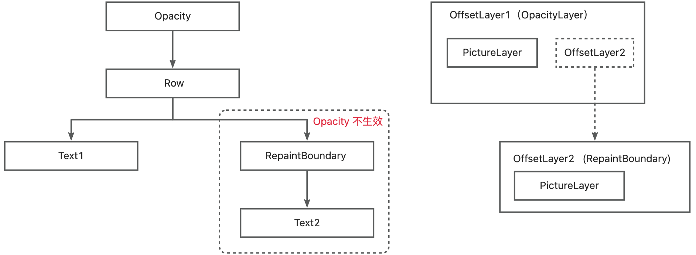
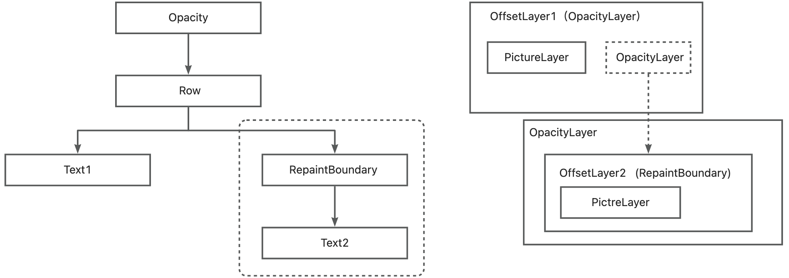
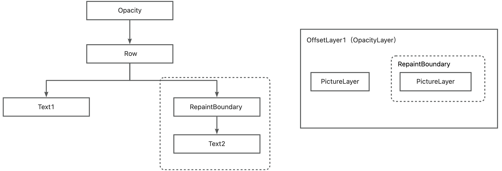

## markNeedsCompositingBitsUpdate()
```dart
class RenderObject{

  //标记当前节点需要 Layer 合成。
  //同时向上遍历，都标记一遍，
  //直到绘制边界时，将绘制边界添加到 _nodesNeedingCompositingBitsUpdate 中。
  //_nodesNeedingCompositingBitsUpdate 会在绘制流程中 flushCompositingBits 使用。
  void markNeedsCompositingBitsUpdate() {

    if (_needsCompositingBitsUpdate) {
      return;
    }
    _needsCompositingBitsUpdate = true;
    if (parent is RenderObject) {
      final RenderObject parent = this.parent! as RenderObject;
      if (parent._needsCompositingBitsUpdate) {
        return;
      }

      if ((!_wasRepaintBoundary || !isRepaintBoundary) && !parent.isRepaintBoundary) {
        parent.markNeedsCompositingBitsUpdate();
        return;
      }
    }
    // parent is fine (or there isn't one), but we are dirty
    if (owner != null) {
      owner!._nodesNeedingCompositingBitsUpdate.add(this);
    }
  }
}
```
<!-- more -->
## Layer 合成概念
Layer 合成主要应用在组件树中存在变换容器时，例如组件树中存在 Opacity（透明度）。Opacity 用于控制子组件树的透明度。下面通过几个场景来理解 Layer 合成的意义：

- 如果子组件树中存在绘制边界（如 RepaintBoundary) 并且**没有采用 Layer 合成**，则透明度不能影响 RepaintBoundary 下面的子组件树。因为 RepaintBoundary 是绘制边界，会生成一个新的 OffsetLayer，而 Opacity 对应的 OfferLayer 无法影响它。



- 如果子组件树中存在绘制边界（如 RepaintBoundary) 并且**没有采用 Layer 合成，而且还想控制透明度，则需要新增一个 Opacity Layer，**即需要两个 Opacity Layer来分别控制实现。同理如果子组件树有多个绘制边界，则就需要创建多个 Opacity Layer，而每新增一个 Layer 对 Skia 渲染就增加了一份负担。



- 如果子组件树中存在绘制边界（如 RepaintBoundary) 并且**采用 Layer 合成，**则透明度可以影响 RepaintBoundary 下面的子组件树。因为 Layer 合成 其实就是复用同一个顶层 Opacity Layer，这样 RepaintBoundary 直接复用 Opacity 对应的 OffsetLayer，所以可以影响它。


### Opacity 实现流程
**标记过程**
```dart
// Opacity 对应 RenderObject
class RenderOpacity extends RenderProxyBox{

  // 有孩子 && 有透明度时，标记自己需要 Layer 合成。
  bool get alwaysNeedsCompositing => child != null && _alpha > 0;

  
  set opacity(double value) {
    if (_opacity == value) {
      return;
    }
    final bool didNeedCompositing = alwaysNeedsCompositing;
    final bool wasVisible = _alpha != 0;
    _opacity = value;
    _alpha = ui.Color.getAlphaFromOpacity(_opacity);
    if (didNeedCompositing != alwaysNeedsCompositing) {
      //当自己的标记发生变换时，需要重新标记
      markNeedsCompositingBitsUpdate();
    }
    markNeedsPaint();
  }
}
```
**绘制过程**
```dart
class RenderOpacity{
  
  @override
  void paint(PaintingContext context, Offset offset) {
    //没有孩子，则不需要绘制
    if (child == null) {
      return;
    }
    //完全透明，则没必要有 layer 了，即实现一个空白
    if (_alpha == 0) {
      // No need to keep the layer. We'll create a new one if necessary.
      layer = null;
      return;
    }

  	//添加 Opacity OffsetLayer，用于实现透明度变换
    layer = context.pushOpacity(offset, _alpha, super.paint, oldLayer: layer as OpacityLayer?);
  }
}
```
```dart
class PaintingContext{

  OpacityLayer pushOpacity(Offset offset, int alpha, PaintingContextCallback painter, { OpacityLayer? oldLayer }) {
    //创建 OpacityLayer
    final OpacityLayer layer = oldLayer ?? OpacityLayer();
    layer
      ..alpha = alpha
      ..offset = offset;

    //添加到 Layer 树中
    pushLayer(layer, painter, Offset.zero);
    return layer;
  }

  void pushLayer(ContainerLayer childLayer, PaintingContextCallback painter, Offset offset, { Rect? childPaintBounds }) {

    //Layer复用，则移除Layer下的所有孩子。
    if (childLayer.hasChildren) {
      childLayer.removeAllChildren();
    }
    //和绘制流程一致，结束当前的绘制，可以理解为保存 Opacity 之前的组件树的绘制，因为下面要另起一个 Layer。
    stopRecordingIfNeeded();
    //将 OpacityLayer 添加到上层 OffsetLayer 中。
    appendLayer(childLayer);
    //根据 OpacityLayer 创建新的 PaintingContext
    final PaintingContext childContext = createChildContext(childLayer, childPaintBounds ?? estimatedBounds);
  	//触发回调，Opacity 中是触发 super.paint()，这样 OpacityLayer 的子组件树都使用的 OpacityLayer，后面就可以控制所有子组件的透明度
    painter(childContext, offset);
    //和绘制流程一致，paint() 之后执行该方法，用于保存绘制内容，生成Picture并保存到Layer中。
    childContext.stopRecordingIfNeeded();
  }
}
```
## 总结

1. 只有组件树中有变换类容器时，才有可能需要重新合成 layer；如果没有变换类组件，则不需要。
2. 当变换类容器的后代节点会向 layer 树中添加新的绘制类 layer 时，则变换类组件中就需要合成 layer。
3. 引入 flushCompositingBits 的根本原因是为了减少 layer 的数量。
