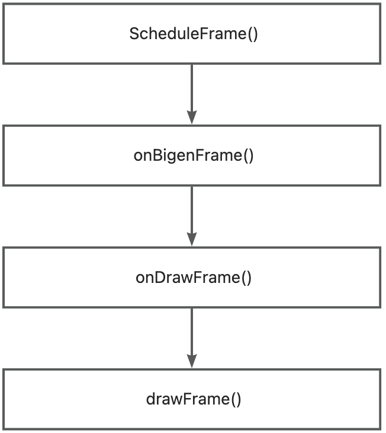
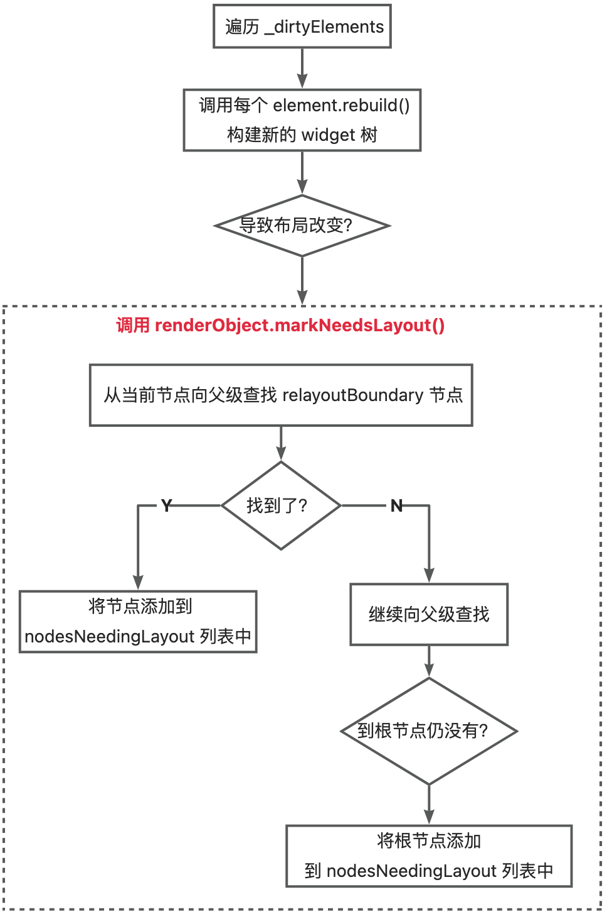
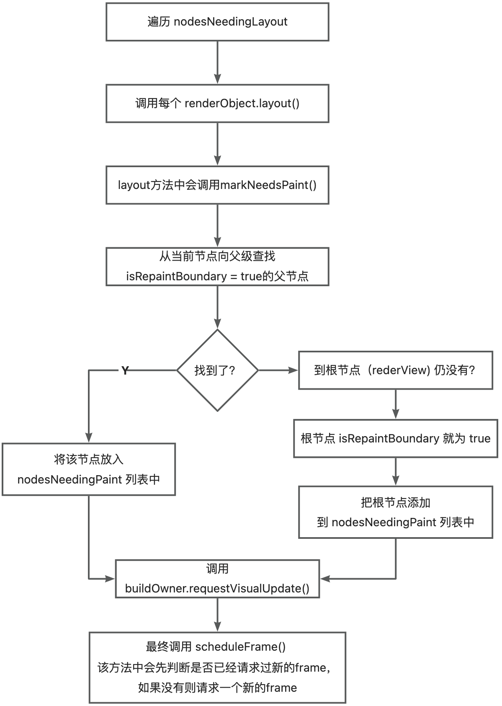
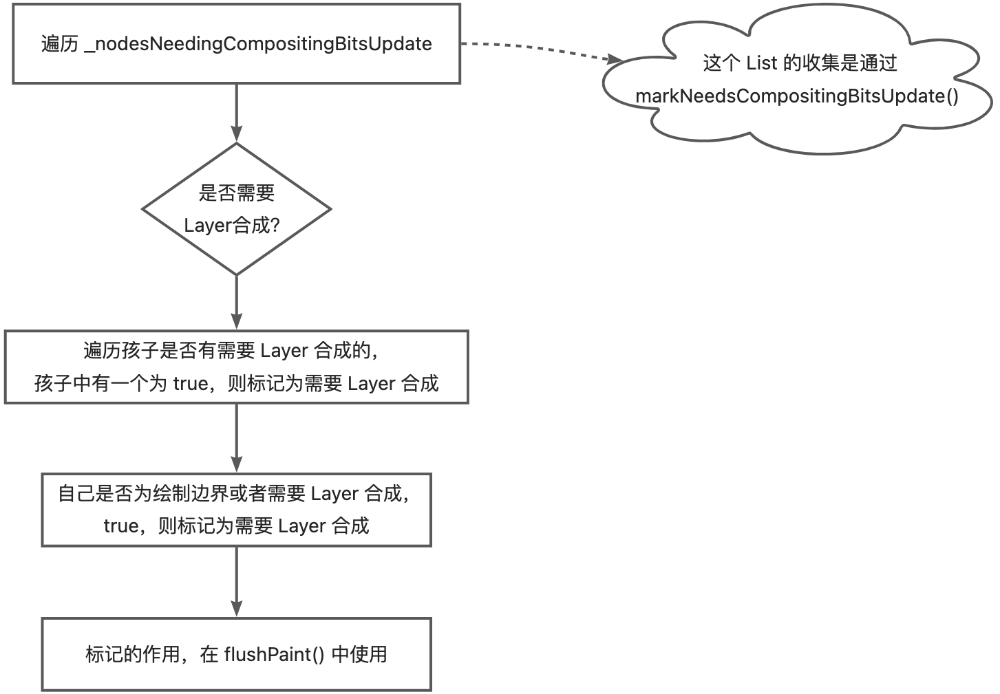
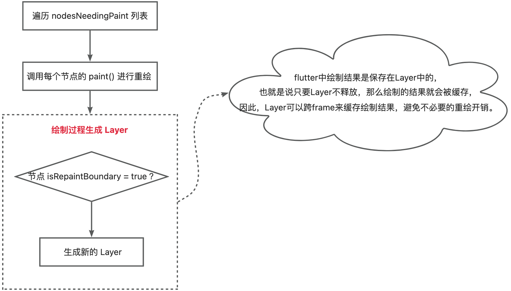

<!-- more -->
## SchedulerPhase
```dart
emun SchedulerPhase{
  // 空闲状态，并没有 frame 在处理。这种状态代表页面未发生变化，并不需要重新渲染。
  /// 如果页面发生变化，需要调用`scheduleFrame()`来请求 frame。
  /// 注意，空闲状态只是指没有 frame 在处理，通常微任务、定时器回调或者用户事件回调都
  /// 可能被执行，比如监听了tap事件，用户点击后我们 onTap 回调就是在idle阶段被执行的。
  idle,

  /// 执行”临时“回调任务，”临时“回调任务只能被执行一次，执行后会被移出”临时“任务队列。
  /// 典型的代表就是动画回调会在该阶段执行。
  transientCallbacks,

  /// 在执行临时任务时可能会产生一些新的微任务，比如在执行第一个临时任务时创建了一个
  /// Future，且这个 Future 在所有临时任务执行完毕前就已经 resolve 了，这中情况
  /// Future 的回调将在[midFrameMicrotasks]阶段执行
  midFrameMicrotasks,

  /// 执行一些持久的任务（每一个frame都要执行的任务），比如渲染管线（构建、布局、绘制）
  /// 就是在该任务队列中执行的.
  persistentCallbacks,

  /// 在当前 frame 在结束之前将会执行 postFrameCallbacks，通常进行一些清理工作和
  /// 请求新的 frame。
  postFrameCallbacks,
}
```
## ScheduleFrame()
```dart
class SchedulerBinding {
  
  void scheduleFrame() {
    //....
    ensureFrameCallbacksRegistered(); //设置 onBeginFrame\onDrawFrame 回调监听
    platformDispatcher.scheduleFrame(); //请求帧
    //....
  }

  //添加帧刷新回调监听
  void ensureFrameCallbacksRegistered() {
    platformDispatcher.onBeginFrame ??= _handleBeginFrame;
    platformDispatcher.onDrawFrame ??= _handleDrawFrame;
	}
}
```
```dart
class PlatformDispatcher{

  //调用 native 代码，请求刷新帧
  void scheduleFrame() => _scheduleFrame();

  @FfiNative<Void Function()>('PlatformConfigurationNativeApi::ScheduleFrame')
  external static void _scheduleFrame();
}
```
## onBeginFrame()
```dart
class SchedulerBinding{

  void handleBeginFrame(Duration? rawTimeStamp){

    assert(schedulerPhase == SchedulerPhase.idle);

    //处理 动画 帧（临时回调任务）
    try {
      // TRANSIENT FRAME CALLBACKS
      _frameTimelineTask?.start('Animate');
      _schedulerPhase = SchedulerPhase.transientCallbacks; //临时回调任务栈
      final Map<int, _FrameCallbackEntry> callbacks = _transientCallbacks;
      _transientCallbacks = <int, _FrameCallbackEntry>{};
      callbacks.forEach((int id, _FrameCallbackEntry callbackEntry) {
        if (!_removedIds.contains(id)) {
          _invokeFrameCallback(callbackEntry.callback, _currentFrameTimeStamp!, callbackEntry.debugStack);
        }
      });
      _removedIds.clear();
    } finally {
      _schedulerPhase = SchedulerPhase.midFrameMicrotasks; //微任务栈
    }
  } 
}
```
## onDrawFrame()
```dart
class SchedulerBinding{
  void handleDrawFrame() {
    ///....
    try {
      /// 处理持久任务栈，例如渲染管线（布局、绘制、上屏）
      _schedulerPhase = SchedulerPhase.persistentCallbacks;
      for (final FrameCallback callback in _persistentCallbacks) {
        _invokeFrameCallback(callback, _currentFrameTimeStamp!);
      }

      /// 处理帧结束任务栈，例如帧结束时清理、请求下一帧
      _schedulerPhase = SchedulerPhase.postFrameCallbacks;
      final List<FrameCallback> localPostFrameCallbacks =
          List<FrameCallback>.of(_postFrameCallbacks);
      _postFrameCallbacks.clear();
      for (final FrameCallback callback in localPostFrameCallbacks) {
        _invokeFrameCallback(callback, _currentFrameTimeStamp!);
      }
    } finally {
      _schedulerPhase = SchedulerPhase.idle;
      ///....
    }
  }
}
```
### 追踪 _persistentCallbacks
```dart
class SchedulerBinding{
  
  final List<FrameCallback> _persistentCallbacks = <FrameCallback>[];
  
  void addPersistentFrameCallback(FrameCallback callback) {
    	_persistentCallbacks.add(callback);
  }
}
```
### 追踪 addPersistentFrameCallback() 调用时机
WidgetsBinding 类 with RenderBinding， addPersistentFrameCallback() 在 RenderBinding 中的 initInstances() 中调用，注入回调监听。<br />initInstances() 在 WidgetsBinding 初始化时调用。<br />WidgetsBinding 初始化在 flutter 启动阶段( runApp() )调用。
```dart
class WidgetBinding extends BindingBase with RenderBinding{
	
  void initInstances() {
    super.initInstances();
    ///.....
  }
}
```
```dart
mixin RenderBinding on SchedulerBinding{
  
  void initInstances() {
    super.initInstances();
    /// ....
    addPersistentFrameCallback(_handlePersistentFrameCallback);
    /// ....
  }

  void _handlePersistentFrameCallback(Duration timeStamp) {
    drawFrame();
    ///....
  }
  
}
```
## drawFrame()
**整个渲染管线流程：**

- buildScope();	//重新构建 widget 树
- flushLayout();	//更新布局
- flushCompositingBits();	//合并信息
- flushPaint();	//更新绘制
- compositeFrame();	//上屏，将绘制信息(bit数据)发送给GPU
```dart
class WidgetBinding with RenderBinding{

  /// ....
  if (renderViewElement != null) {
    buildOwner!.buildScope(renderViewElement!);
  }
  super.drawFrame();

  ///.....
}
```
```dart
mixin RenderBinding on SchedulerBinding{

  void drawFrame() {
    pipelineOwner.flushLayout();
    pipelineOwner.flushCompositingBits();
    pipelineOwner.flushPaint();
    if (sendFramesToEngine) {
      renderView.compositeFrame(); // this sends the bits to the GPU
      pipelineOwner.flushSemantics(); // this also sends the semantics to the OS.
      _firstFrameSent = true;
    }
  }
}
```
### 重构 widget 树 - buildScope()

```dart
class BuilderOwner{

  ///....
  _dirtyElements.sort(Element._sort);
  int dirtyCount = _dirtyElements.length;
  int index = 0;
  while (index < dirtyCount) {
    final Element element = _dirtyElements[index];
    ///....
    element.rebuild();
    ///....
  }

  ///.....
}
```
```dart
class Element{
  
  void rebuild({bool force = false}) {
    performRebuild();
  }

  @protected
  @mustCallSuper
  void performRebuild() {  //由子类来实现，必须调用super.performRebuild()
    _dirty = false;
  }
}
```
以 RenderObjectElement 为例。
```dart

class RenderObjectElement{
    @override
  void performRebuild() { // ignore: must_call_super, _performRebuild calls super.
    _performRebuild(); // calls widget.updateRenderObject()
  }

  @pragma('vm:prefer-inline')
  void _performRebuild() {

    (widget as RenderObjectWidget).updateRenderObject(this, renderObject); //由子类实现更新 renderObject
    
    super.performRebuild(); // clears the "dirty" flag
  }
}
```
以 Text 为例。Text 实际是由 RichText 实现。
```dart
class RichText{
  
  @override
  void updateRenderObject(BuildContext context, RenderParagraph renderObject) {

    /// 这里更改的属性，会根据需要触发 markNeedsLayout()、markNeedsPaint()
    renderObject
      ..text = text
      ..textAlign = textAlign
      ..textDirection = textDirection ?? Directionality.of(context)
      ..softWrap = softWrap
      ..overflow = overflow
      ..textScaleFactor = textScaleFactor
      ..maxLines = maxLines
      ..strutStyle = strutStyle
      ..textWidthBasis = textWidthBasis
      ..textHeightBehavior = textHeightBehavior
      ..locale = locale ?? Localizations.maybeLocaleOf(context)
      ..registrar = selectionRegistrar
      ..selectionColor = selectionColor;
  }
}
```
#### markNeedsLayout()
```dart
class RenderObject{
  
  void markNeedsLayout() {
    ///...
    // 不是边界布局，递归调用前节点到其布局边界节点路径上所有节点的方法 markNeedsLayout
    if (_relayoutBoundary != this) {
      markParentNeedsLayout();
    } else {
      _needsLayout = true;
      if (owner != null) {
        // 将布局边界节点加入到 pipelineOwner._nodesNeedingLayout 列表中
        owner!._nodesNeedingLayout.add(this);
        owner!.requestVisualUpdate();
      }
    }
  }
}
```
#### markNeedsPaint()
```dart
class RenderObject{
  
  void markNeedsPaint() {
    _needsPaint = true;
    // 重绘边界，将该布局放入 _nodesNeedingPaint，并请求新的一帧
    if (isRepaintBoundary && _wasRepaintBoundary) {
      if (owner != null) {
        owner!._nodesNeedingPaint.add(this);
        owner!.requestVisualUpdate();
      }
    } else if (parent is RenderObject) { 
      //不是重绘边界，则继续往父级找
      final RenderObject parent = this.parent! as RenderObject;
      parent.markNeedsPaint();
    } else {
      //根布局不需要标记重绘，因为没有上层能绘制了，只能自己来，直接请求新的一帧
      if (owner != null) {
        owner!.requestVisualUpdate();
      }
    }
  }
}
```
### 更新布局 - flushLayout()

> 具体 layout 执行过程请看[ Layout篇](https://101wr.cn/2023/03/25/Flutter%E6%B8%B2%E6%9F%93%E6%B5%81%E7%A8%8B-Layout/)

```dart
class PipelineOwner{
  
  void flushLayout() {
    try {
      //遍历 _nodesNeedingLayout   
      while (_nodesNeedingLayout.isNotEmpty) {
        final List<RenderObject> dirtyNodes = _nodesNeedingLayout;
        _nodesNeedingLayout = <RenderObject>[];
        //按照节点在树中的深度从小到大排序后再重新layout
        dirtyNodes.sort((RenderObject a, RenderObject b) => a.depth - b.depth);
        for (int i = 0; i < dirtyNodes.length; i++) {
          ///....
          final RenderObject node = dirtyNodes[i];
          if (node._needsLayout && node.owner == this) {
            //重新布局
            node._layoutWithoutResize();
          }
        }
      }
    }
  }

  void _layoutWithoutResize() {
    
    try {
      performLayout(); //重新布局 
      markNeedsSemanticsUpdate();
    } catch (e, stack) {
      _reportException('performLayout', e, stack);
    }
    _needsLayout = false;
    markNeedsPaint();  //标记更新绘制
  }
}
```
### 更新合成信息 - flushCompositingBits()
> flushCompositingBits() 主要是标记需要 Layer 合成，具体标记后的作用，由下面的 flushPaint() 使用。
> 这里的 Layer 合成只有在组件树中有变换容器时才需要，目的是为了减少 Layer 的数量
> 具体流程请看 [Compositing篇](https://101wr.cn/2023/03/30/Flutter%E6%B8%B2%E6%9F%93%E6%B5%81%E7%A8%8B-Compositing/)

)
```dart
class PiplineOwner{
  void flushCompositingBits() {
  	
    _nodesNeedingCompositingBitsUpdate.sort((RenderObject a, RenderObject b) => a.depth - b.depth);
    for (final RenderObject node in _nodesNeedingCompositingBitsUpdate) {
      if (node._needsCompositingBitsUpdate && node.owner == this) {
        node._updateCompositingBits();
      }
    }
    _nodesNeedingCompositingBitsUpdate.clear();
  }

  void _updateCompositingBits() {
    if (!_needsCompositingBitsUpdate) {
      return;
    }
    final bool oldNeedsCompositing = _needsCompositing;
    _needsCompositing = false;

    //遍历孩子，查找是否有需要 Layer 合成的
    visitChildren((RenderObject child) {
      child._updateCompositingBits();
      if (child.needsCompositing) {
        _needsCompositing = true;
      }
    });

    //判断自己是否为 绘制边界 || 需要 Layer 合成
    if (isRepaintBoundary || alwaysNeedsCompositing) {
      _needsCompositing = true;
    }
    // If a node was previously a repaint boundary, but no longer is one, then
    // regardless of its compositing state we need to find a new parent to
    // paint from. To do this, we mark it clean again so that the traversal
    // in markNeedsPaint is not short-circuited. It is removed from _nodesNeedingPaint
    // so that we do not attempt to paint from it after locating a parent.
    if (!isRepaintBoundary && _wasRepaintBoundary) {
      _needsPaint = false;
      _needsCompositedLayerUpdate = false;
      owner?._nodesNeedingPaint.remove(this);
      _needsCompositingBitsUpdate = false;
      markNeedsPaint();
    } else if (oldNeedsCompositing != _needsCompositing) {
      _needsCompositingBitsUpdate = false;
      markNeedsPaint();
    } else {
      _needsCompositingBitsUpdate = false;
    }
  }
}
```
### 更新绘制 - flushPaint()

> 具体 paint 执行过程请看 [Paint篇](https://101wr.cn/2023/03/29/Flutter%E6%B8%B2%E6%9F%93%E6%B5%81%E7%A8%8B-Paint/)

```dart
class PipelineOwner{
  
  void flushPaint() {
    final List<RenderObject> dirtyNodes = _nodesNeedingPaint;
    _nodesNeedingPaint = <RenderObject>[];
    //按照深度排序，可防止重复paint。例如：如果不排序，父执行了flushPaint()，结果子又要执行一遍
    for (final RenderObject node in dirtyNodes..sort((RenderObject a, RenderObject b) => b.depth - a.depth)) {
      if ((node._needsPaint || node._needsCompositedLayerUpdate) && node.owner == this) {
        if (node._layerHandle.layer!.attached) {
          if (node._needsPaint) {
            //需要重新绘制
            PaintingContext.repaintCompositedChild(node);
          } else {
            // Layer 发生了更新
            PaintingContext.updateLayerProperties(node);
          }
        } else {
          node._skippedPaintingOnLayer();
        }
      }
    }
  }
}
```
```dart
class PaintingContext{
  
	static void repaintCompositedChild(RenderObject child, { bool debugAlsoPaintedParent = false }) {
    _repaintCompositedChild(
      child,
      debugAlsoPaintedParent: debugAlsoPaintedParent,
    );
  }

  static void _repaintCompositedChild(
    RenderObject child, {
    bool debugAlsoPaintedParent = false,
    PaintingContext? childContext,
  }) {

    OffsetLayer? childLayer = child._layerHandle.layer as OffsetLayer?;
    if (childLayer == null) {
      
    	//当前RednderObject 没有 Layer。则创建并绑定到该 RenderObject
      final OffsetLayer layer = child.updateCompositedLayer(oldLayer: null);
      child._layerHandle.layer = childLayer = layer;
    } else {
      
      //当前 RenderObject 有 Layer，则清理该 Layer 下的孩子
      childLayer.removeAllChildren();
      final OffsetLayer updatedLayer = child.updateCompositedLayer(oldLayer: childLayer);
    }
    child._needsCompositedLayerUpdate = false;
    //创建 PaintingContext，保存 Layer 和 绘制范围
		childContext ??= PaintingContext(childLayer, child.paintBounds);
    //调用 RenderObject#_paintWithContext()，自己实现绘制
    child._paintWithContext(childContext, Offset.zero);
    //提供了一个统一收口，即绘制结束后，生成 picture 并保存至 Layer 中。子类可重写自己实现保存。
    childContext.stopRecordingIfNeeded();
  }
  
  OffsetLayer updateCompositedLayer({required covariant OffsetLayer? oldLayer}) {
    assert(isRepaintBoundary);
    return oldLayer ?? OffsetLayer();
  }
}
```
```dart
class RenderObject{
  
  void _paintWithContext(PaintingContext context, Offset offset) {
    //这里为 true 意味着跳过了 flushLaout 阶段，也就不需要重新绘制了
    if (_needsLayout) {
      return;
    }

    _needsPaint = false;
    _needsCompositedLayerUpdate = false;
    _wasRepaintBoundary = isRepaintBoundary;
    try {
      //实际走 widget 中 createRenderObject() 创建的实例的 paint()
      paint(context, offset); 
    } catch (e, stack) {
      _reportException('paint', e, stack);
    }
  }
}
```
### 上屏 - compositeFrame()
> 绘制完成后，我们得到的是一棵Layer树，最后我们需要将Layer树中的绘制信息在屏幕上显示。
> renderView.compositeFrame()将绘制信息提交给Flutter engine

```dart
class RenderView extends RenderObject{
  void compositeFrame() {
    final ui.SceneBuilder builder = ui.SceneBuilder();
    //通过 layer 创建 Scene
    final ui.Scene scene = layer!.buildScene(builder);
    //绘制系统UI,例如状态栏、导航栏
    if (automaticSystemUiAdjustment) {
      _updateSystemChrome();
    }
    //展示
    _window.render(scene);
    scene.dispose();
  }
}
```
```dart
class Layer{
  ui.Scene buildScene(ui.SceneBuilder builder) {
    updateSubtreeNeedsAddToScene();
    //由子类实现。
    //总体思路：生成 engine layer，遍历 layer 树，发送给 skia 引擎
    addToScene(builder);
    if (subtreeHasCompositionCallbacks) {
      _fireCompositionCallbacks(includeChildren: true);
    }
    _needsAddToScene = false;
    final ui.Scene scene = builder.build();
    return scene;
  }
}
```
