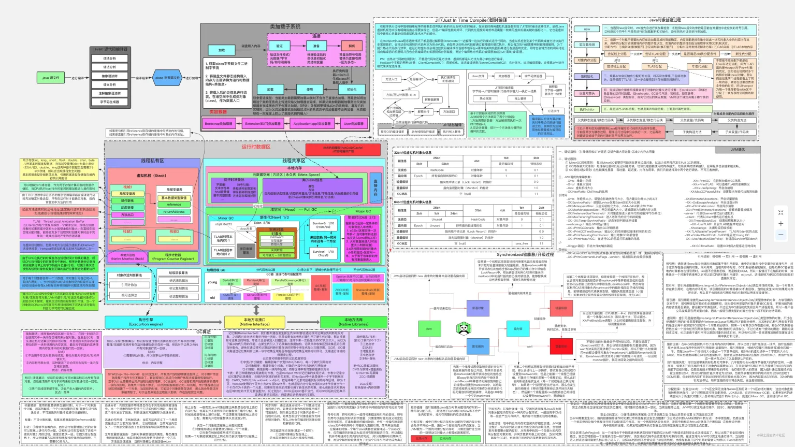
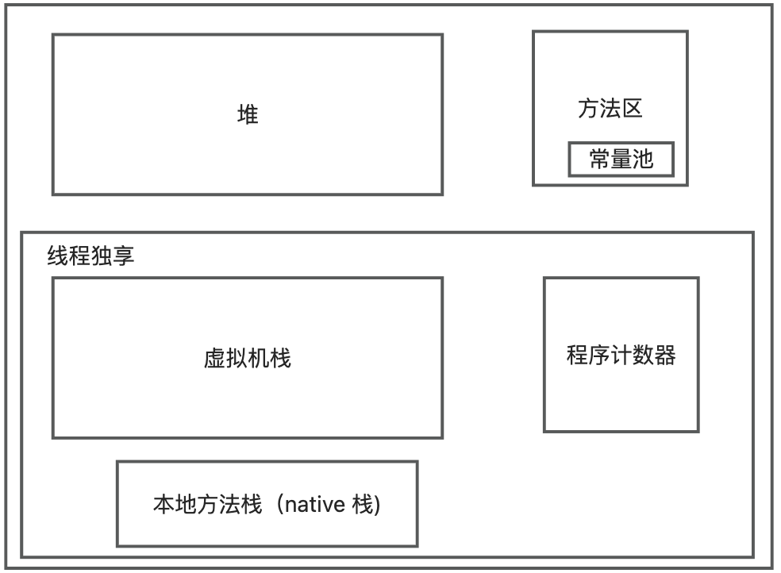
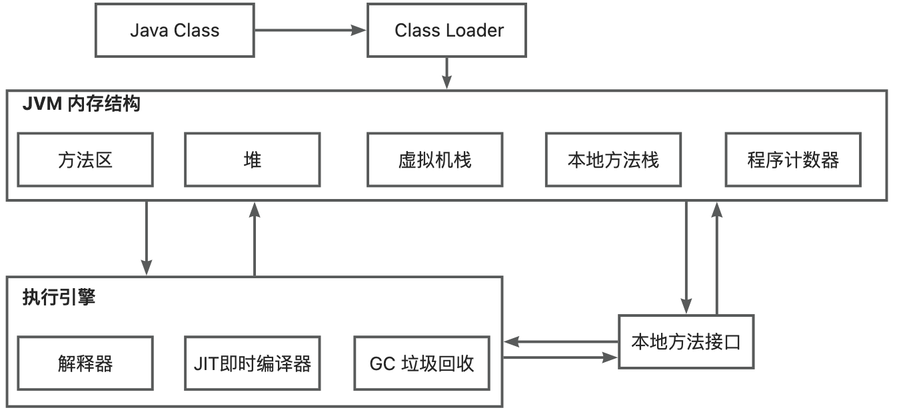
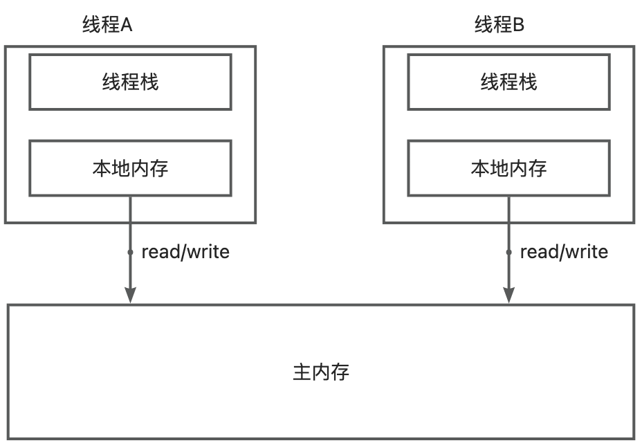
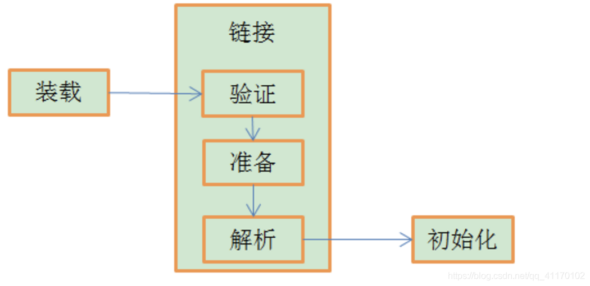
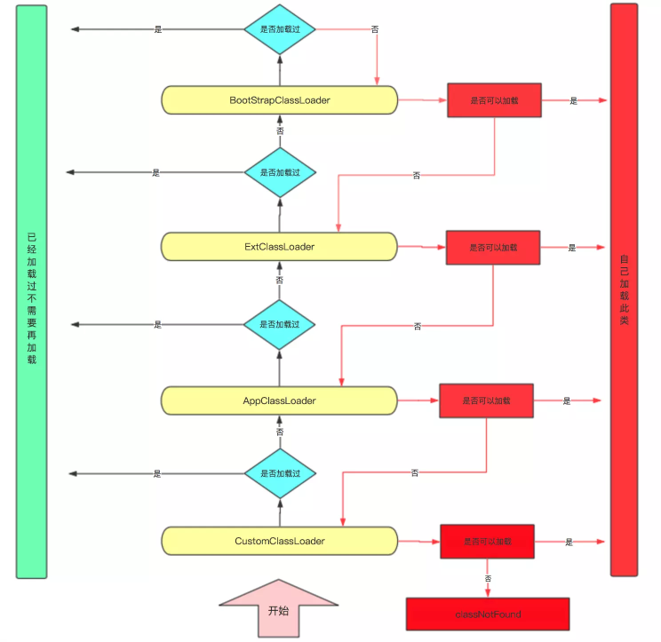

<!-- more -->
# JVM 内存结构

- 方法区(MethodArea)：用于存储类结构信息的地方，包括常量池、静态常量、构造函数等。虽然JVM规范把方法区描述为堆的一个辑部分， 但它却有个别名non-heap（非堆），所以大家不要搞混淆了。方法区还包含一个运行时常量池。
- java堆(Heap)：存储java实例或者对象的地方。这块是GC的主要区域。从存储的内容我们可以很容易知道，方法和堆是被所有java线程共享的。
- java栈(Stack)：java栈总是和线程关联在一起，每当创一个线程时，JVM就会为这个线程创建一个对应的java栈在这个java栈中,其中又会包含多个栈帧，每运行一个方法就建一个栈帧，用于存储局部变量表、操作栈、方法返回等。每一个方法从调用直至执行完成的过程，就对应一栈帧在java栈中入栈到出栈的过程。所以java栈是现成有的。
- 程序计数器(PCRegister)：用于保存当前线程执行的内存地址。由于JVM程序是多线程执行的（线程轮流切换），所以为了保证程切换回来后，还能恢复到原先状态，就需要一个独立计数器，记录之前中断的地方，可见程序计数器也是线程私有的。
- 本地方法栈(Native MethodStack)：和java栈的作用差不多，只不过是为JVM使用到native方法服务的。
## JVM 结构

1. Java源代码编译成Java Class文件
2. 通过类加载器ClassLoader加载到JVM中
3. 类存放在方法区中
4. 类创建的对象存放在堆中
5. 堆中对象的调用方法时会使用到虚拟机栈，本地方法栈，程序计数器
6. 方法执行时每行代码由解释器逐行执行
7. 热点代码由JIT编译器即时编译
8. 垃圾回收机制回收堆中资源
9. 和操作系统打交道需要调用本地方法接口
# JVM 内存模型(JMM)
JMM是一套多线程读写共享数据时，对数据的可见性，有序性和原子性的规则。

# GC垃圾回收机制
## 垃圾辨别方法
### 引用计数

- 每个对象实例都有一个引用计数器，被引用则+1，完成引用则-1。判断对象的引用数量来决定对象是否可以被回收
- 优点：执行效率高，程序执行受影响小
- 缺点：无法检测出循环引用的情况，导致内存泄露
### 可达性

- 扫描堆中的对象，看是否能沿着GC Root对象为起点的引用链找到该对象，找不到则可以回收

**哪些对象可以作为GC Root？** 通过System Class Loader或者Boot Class Loader加载的class对象，通过自定义类加载器加载的class不一定是GC Root

- 虚拟机栈中的引用的对象
- 本地方法栈中JNI（natice方法）的引用的对象
- 方法区中的常量引用的对象
- 方法区中的类静态属性引用的对象
- 处于激活状态的线程
- 正在被用于同步的各种锁对象
- GC保留的对象，比如系统类加载器等。
## 垃圾回收算法
### 标记清除法

- 标记没有被GC Root引用的对象，清除被标记位置的内存
- 优点：处理速度快
- 缺点：造成空间不连续，产生内存碎片
### 标记整理法

- 标记没有被GC Root引用的对象，整理被引用的对象
- 优点：空间连续，没有内存碎片
- 缺点：整理导致效率较低
### 复制法

- 分配同等大小的内存空间，标记被GC Root引用的对象，将引用的对象连续的复制到新的内存空间，清除原来的内存空间，交换新空间和旧空间。
- 优点：空间连续，没有内存碎片
- 缺点：占用双倍的内存空间
### 分代收集

- 新生代：
1. 所有新生成的对象首先都是放在新生代的。新生代的目标就是尽可能快速的收集掉那些生命周期短的对象。
2. 新生代内存按照8:1:1的比例分为一个eden区和两个survivor(survivor0,survivor1)区。大部分对象在Eden区中生成。回收时先将eden区存活对象复制到一个survivor0区，然后清空eden区，当这个survivor0区也存放满了时，则将eden区和survivor0区存活对象复制到另一个survivor1区，然后清空eden和这个survivor0区，此时survivor0区是空的，然后将survivor0区和survivor1区交换，即保持survivor1区为空， 如此往复。
3. 当survivor1区不足以存放 eden和survivor0的存活对象时，就将存活对象直接存放到老年代。若是老年代也满了就会触发一次Full GC，也就是新生代、老年代都进行回收。
4. 新生代发生的GC也叫做Minor GC，MinorGC发生频率比较高(不一定等Eden区满了才触发)。
- 老年代：
1. 在老年代中经历了N次垃圾回收后仍然存活的对象，就会被放到老年代中。因此，可以认为老年代中存放的都是一些生命周期较长的对象。
2. 内存比新生代也大很多(大概比例是1:2)，当老年代内存满时触发Major GC，即Full GC。Full GC发生频率比较低，老年代对象存活时间比较长。
- 永久代：

永久代主要存放静态文件，如Java类、方法等。永久代对垃圾回收没有显著影响，但是有些应用可能动态生成或者调用一些class，例如使用反射、动态代理、CGLib等bytecode框架时，在这种时候需要设置一个比较大的永久代空间来存放这些运行过程中新增的类。
## 垃圾回收器

-  Serial收集器（复制算法): 新生代单线程收集器，标记和清理都是单线程，优点是简单高效； 
-  Serial Old收集器 (标记-整理算法): 老年代单线程收集器，Serial收集器的老年代版本； 
-  ParNew收集器 (复制算法): 新生代收并行集器，实际上是Serial收集器的多线程版本，在多核CPU环境下有着比Serial更好的表现； 
-  CMS(Concurrent Mark Sweep)收集器 (标记-清除算法): 老年代并行收集器，以获取最短回收停顿时间为目标的收集器，具有高并发、低停顿的特点，追求最短GC回收停顿时间。 
-  Parallel Old收集器 (标记-整理算法)： 老年代并行收集器，吞吐量优先，Parallel Scavenge收集器的老年代版本； 
-  Parallel Scavenge收集器 (复制算法): 新生代并行收集器，追求高吞吐量，高效利用 CPU。吞吐量 = 用户线程时间/(用户线程时间+GC线程时间)，高吞吐量可以高效率的利用CPU时间，尽快完成程序的运算任务，适合后台应用等对交互相应要求不高的场景； 
-  G1(Garbage First)收集器 (标记-整理算法)： Java堆并行收集器，G1收集器是JDK1.7提供的一个新收集器，G1收集器基于“标记-整理”算法实现，也就是说不会产生内存碎片。此外，G1收集器不同于之前的收集器的一个重要特点是：G1回收的范围是整个Java堆(包括新生代，老年代)，而前六种收集器回收的范围仅限于新生代或老年代。
# 类加载
## 类加载流程
##  

1. 加载：获取类的二进制字节流；生成方法区的运行时存储结构；在内存中生成 Class 对象 
2. 验证：确保该 Class 字节流符合虚拟机要求 
3. 准备：初始化静态变量 
4. 解析：将常量池的符号引用替换为直接引用 
5. 初始化：执行静态块代码、类变量赋值
## 类加载有三种方式：
1）命令行启动应用时候由JVM初始化加载 2）通过Class.forName() 方法动态加载 3）通过ClassLoader.loadClass() 方法动态加载 **LoadClass和forName的区别:**

- Class.ForName得到的class是已经初始化完成的
- ClassLoader.loadClass得到的class是还没有链接的
## 双亲委托机制
 **为什么要使用双亲委派机制：**

- 防止重复加载同一个.class文件,通过委托去向上级问，加载过了就不用加载了。
- 保证核心.class文件不会被串改，即使篡改也不会加载，即使加载也不会是同一个对象，因为不同加载器加载同一个.class文件也不是同一个class对象，从而保证了class执行安全
## 类加载器：

- 启动类加载器（Bootstrap ClassLoader）：负责加载\lib目录下或者被-Xbootclasspath参数所指定的路径的，并且是被虚拟机所识别的库到内存中。
- 扩展类加载器（Extension ClassLoader）：负责加载\lib\ext目录下或者被java.ext.dirs系统变量所指定的路径的所有类库到内存中。
- 应用类加载器（Application ClassLoader）：负责加载用户类路径上的指定类库，如果应用程序中没有实现自己的类加载器，一般就是这个类加载器去加载应用程序中的类库。
