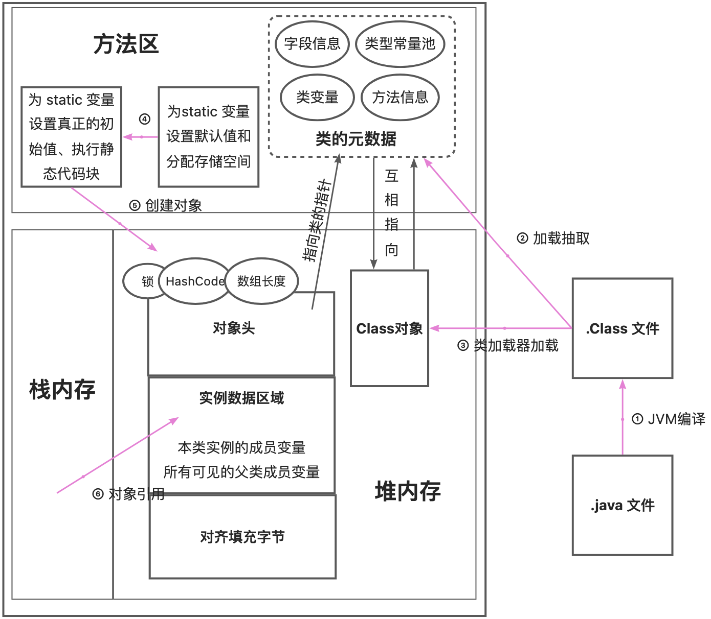
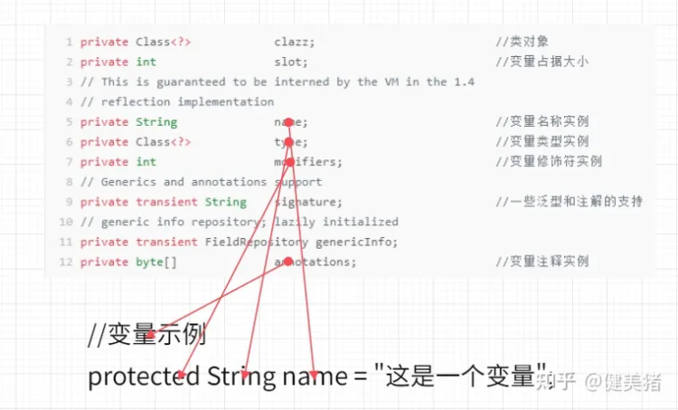
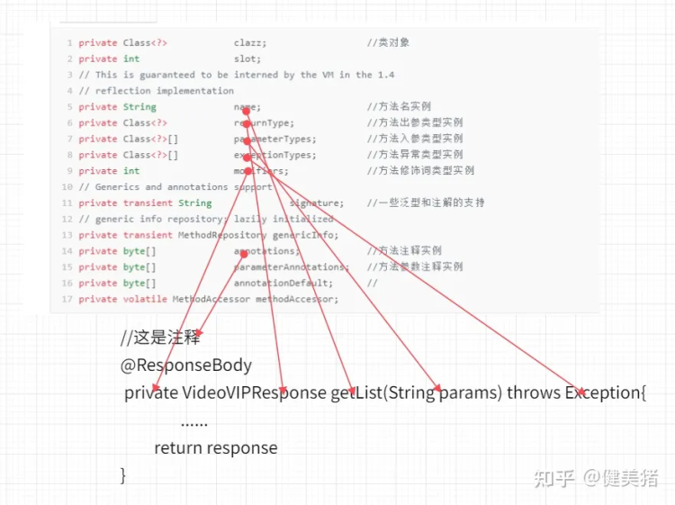
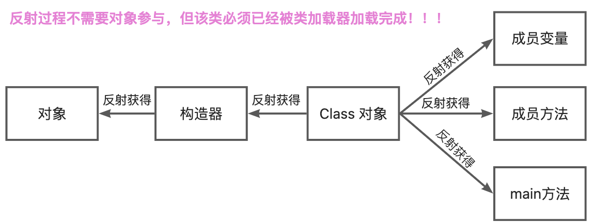
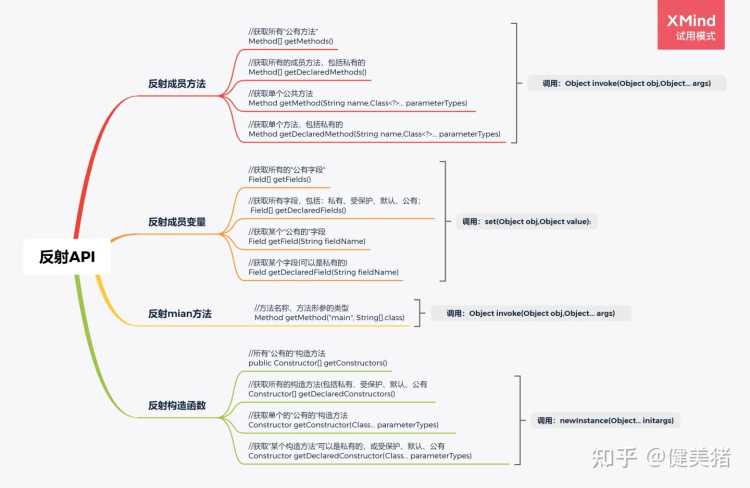

# new 对象的过程


**拓展点：**

- 通过 Class.newInstance() 构造对象时，需要保证该类具有一个无参构造方法，否则会报 InstantiantionException。而通过 Constructor.newInstance() 构造对象则没有要求。
```java
//前提： Dog 类中只有一个有参构造方法

Class cls = Class.forName("com.test.Dog");
Dog dog = cls.newInstance(); //报 InstantiantionException 异常

Constructor cs = Dog.class.getConstructor(String.class);
Dog dog = (Dog)cs.newInstance("测试"); //执行没有问题
```

- 通过  newInstance() 时必须保证该类已经加载并已建立连接，即已被类加载器加载完毕，而直接通过 new 不需要。
# 反射
在 Class 类中有一个静态内部类 ReflectionData，内部持有 Field[] (字段类实例)、Method[] (方法类实例)、Constructor[] (构造器类实例)、Class<?>[] (接口类实例) 等信息。
## Field

## Method

## 反射过程
<br />

