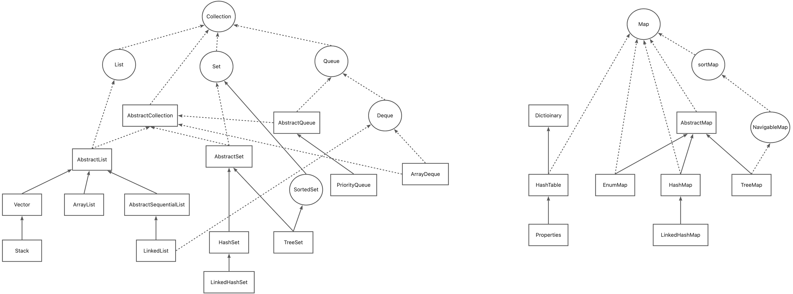

# 结构图

<!-- more -->
# List
## Vector
### 内部存储结构
内部维护一个数组，原始大小为 10 个。
```java
protected Object[] elementData;

public Vector() {
    this(10);
}

public Vector(int initialCapacity) {
    this(initialCapacity, 0);
}

public Vector(int initialCapacity, int capacityIncrement) {
    super();
    if (initialCapacity < 0)
        throw new IllegalArgumentException("Illegal Capacity: "+
                                           initialCapacity);
    this.elementData = new Object[initialCapacity];
    this.capacityIncrement = capacityIncrement;
}

```
### 扩容方式
当存储超出时，扩大原来容量的一倍，并将原数据copy到新数组中。
```java
public synchronized boolean add(E e) {
    modCount++;
    ensureCapacityHelper(elementCount + 1); //检测扩容
    elementData[elementCount++] = e;
    return true;
}

private void ensureCapacityHelper(int minCapacity) {
    if (minCapacity - elementData.length > 0)
        grow(minCapacity); //扩容
}

private void grow(int minCapacity) {
    int oldCapacity = elementData.length;
    //如果使用默认构造方法创建，则直接扩容至原数据的一倍。
    int newCapacity = oldCapacity + ((capacityIncrement > 0) ? capacityIncrement : oldCapacity);
    if (newCapacity - minCapacity < 0)
        newCapacity = minCapacity;
    if (newCapacity - MAX_ARRAY_SIZE > 0)
        newCapacity = hugeCapacity(minCapacity);
    //将原数据copy至新数组中。
    elementData = Arrays.copyOf(elementData, newCapacity);
}
```
## ArrayList
### 内部存储结构
内部维护一个数组。
```java
private static final Object[] DEFAULTCAPACITY_EMPTY_ELEMENTDATA = {};
transient Object[] elementData; 

public ArrayList() {
    this.elementData = DEFAULTCAPACITY_EMPTY_ELEMENTDATA;
}
```
### 扩容方式
当存储超出时，扩大原来容量的50%，并将原数据copy到新数组中。
```java
public boolean add(E e) {
    // size 初始值为 0 
    ensureCapacityInternal(size + 1);  // Increments modCount!!
    elementData[size++] = e;
    return true;
}

private void ensureCapacityInternal(int minCapacity) {
    //如果使用无参构造方法，则这里为true。minCapacity 取 DEFAULT_CAPACITY(值为 10)与 minCapacity(加上要存储的数据的已存的数据量) 最大值
    //如果使用指定初始容量或已有容器的构造函数，则这里为false，minCapacity 为当前的容量（即加上要存储的数据的已存的数据量）
    if (elementData == DEFAULTCAPACITY_EMPTY_ELEMENTDATA) {
        minCapacity = Math.max(DEFAULT_CAPACITY, minCapacity);
    }

    ensureExplicitCapacity(minCapacity);
}

private void ensureExplicitCapacity(int minCapacity) {
    modCount++;

    if (minCapacity - elementData.length > 0)
        grow(minCapacity); //扩容
}

private void grow(int minCapacity) {
    int oldCapacity = elementData.length;
    //扩容至原数组大小的一半
    int newCapacity = oldCapacity + (oldCapacity >> 1);
    if (newCapacity - minCapacity < 0)
        newCapacity = minCapacity;
    if (newCapacity - MAX_ARRAY_SIZE > 0)
        newCapacity = hugeCapacity(minCapacity);
    // minCapacity is usually close to size, so this is a win:
    elementData = Arrays.copyOf(elementData, newCapacity);
}
```
## LinkedList
### 内部存储结构
内部维护一个双向链表。
```java
transient int size = 0;

/**
 * Pointer to first node.
 * Invariant: (first == null && last == null) ||
 *            (first.prev == null && first.item != null)
 */
transient Node<E> first;

/**
 * Pointer to last node.
 * Invariant: (first == null && last == null) ||
 *            (last.next == null && last.item != null)
 */
transient Node<E> last;

/**
 * Constructs an empty list.
 */
public LinkedList() {
}

public LinkedList(Collection<? extends E> c) {
    this();
    addAll(c);
}
```
## CopyOnWriteArrayList
### 内部存储结构
通过 volaite 修饰维护了一个 Object[]
```java
private transient volatile Object[] array;

final void setArray(Object[] a) {
    this.array = a;
}

public CopyOnWriteArrayList() {
    this.setArray(new Object[0]);
}
```
### 如何保证读写并发
只有给写上了一个对象锁，读不上锁。每次写的时候，先copy，再写入，然后将旧地址指向新数组。这样在添加的期间，读不需要阻塞，但读到的仍是旧数据。
```java
public boolean add(E e) {
    synchronized(this.lock) {
        Object[] es = this.getArray();
        int len = es.length;
        es = Arrays.copyOf(es, len + 1);
        es[len] = e;
        this.setArray(es);
        return true;
    }
}
```
```java
public E get(int index) {
    return elementAt(this.getArray(), index);
}

static <E> E elementAt(Object[] a, int index) {
    return a[index];
}

```
### 扩容方式
每次新增时，都会在原容器基础上 + 1，然后搬移旧数据至新容器
```java
public boolean add(E e) {
    synchronized(this.lock) {
        Object[] es = this.getArray();
        int len = es.length;
        es = Arrays.copyOf(es, len + 1); //生成新数组，容量+1
        es[len] = e;
        this.setArray(es);
        return true;
    }
}
```
# Set
## TreeSet
支持自然顺序访问，但添加、删除、包含等操作相对低效（logn 时间）。
### 内部存储结构
内部维护一个 TreeMap，add 时传入的值为 Key，Value 为一个默认的 PRESENT 对象，这样就能保证不重复值。
```java

private transient NavigableMap<E,Object> m;
private static final Object PRESENT = new Object();

TreeSet(NavigableMap<E,Object> m) {
    this.m = m;
}

public TreeSet() {
    this(new TreeMap<E,Object>());
}

public boolean add(E e) {
    return m.put(e, PRESENT)==null;
}
```
## HashSet
利用哈希算法，理想情况下，如果哈希散列正常，可以提供常数事件的添加、删除、包含等操作，但不保证有序。
### 内部存储结构
内部维护一个 HashMap，add 时传入的值为 Key，Value 为一个默认的 PRESENT 对象，这样就能保证不重复值。
```java
public class HashSet<E>{
    
    private transient HashMap<E,Object> map;
    private static final Object PRESENT = new Object();
    
    public HashSet() {
    	map = new HashMap<>();
	}
    
    public boolean add(E e) {
    	return map.put(e, PRESENT)==null;
    }

   	public boolean remove(Object o) {
    	return map.remove(o)==PRESENT;
    }
}
```
## LinkedHashSet
内部构建了一个记录插入顺序的双向链表，因此提供了按照插入顺序遍历的能力，与此同时，也保证了常数时间的添加、删除、包含等操作，这些操作性能略低于 HashSet，因为需要维护链表的开销。
# Map
## HashMap
行为上大致上与 HashTable 一致，主要区别在于 HashMap 不是同步的，支持 null 键和值等。通常情况下，HashMap 进行 put 或者 get 操作，可以达到常数时间的性能，所以它是绝大部分利用键值对存取场景的首选。
### 容器与负载系数
初始容器为 16，最大不得超过 230 ，负载系数为0.75。默认负载因子 (.75) 在时间和空间成本之间提供了良好的折衷。较高的值会减少空间开销，但会增加查找成本（反映在HashMap类的大多数操作中，包括get和put ）。
### put操作
真正执行方法是 putVal()，内部包含了 初始化容器、添加到数组中、如果 hash 值一样，则放在链上、如果链上的数据已经有8个，则将链转成树。
```java
public V put(K key, V value) {
    //通过自有的 hash() 计算hash值
    return putVal(hash(key), key, value, false, true);
}

final V putVal(int hash, K key, V value, boolean onlyIfAbsent,
               boolean evict) {
    Node<K,V>[] tab; Node<K,V> p; int n, i;
    //如果没有初始化，则调用 resize() 进行初始化。
    if ((tab = table) == null || (n = tab.length) == 0)
        n = (tab = resize()).length;
    //通过 (n - 1) & hash 得到 index，如果不存在该 key 则直接添加。
    if ((p = tab[i = (n - 1) & hash]) == null)
        tab[i] = newNode(hash, key, value, null);
    else {
        Node<K,V> e; K k;
        //如果 key 的 hash值 与 equals 都相等，则返回该 node， 用于下面的直接替换新值。
        if (p.hash == hash &&
            ((k = p.key) == key || (key != null && key.equals(k))))
            e = p;
        else if (p instanceof TreeNode)
            //如果 index 重复，并且此时该 node 已经是树时，则添加到树上。如果已有key值则返回该 node， 用于下面的直接替换新值。
            e = ((TreeNode<K,V>)p).putTreeVal(this, tab, hash, key, value);
        else {
            //如果 index 重复，并且此时该 node 链时，则添加到链上。
            for (int binCount = 0; ; ++binCount) {
                if ((e = p.next) == null) {
                    p.next = newNode(hash, key, value, null);
                    //如果链上的数据已经超过 8 个，则将链转成树。
                    if (binCount >= TREEIFY_THRESHOLD - 1) // -1 for 1st
                        treeifyBin(tab, hash);
                    break;
                }
                if (e.hash == hash &&
                    ((k = e.key) == key || (key != null && key.equals(k))))
                    break;
                p = e;
            }
        }
        //已存在该 key 值，则直接替换为新值
        if (e != null) { 
            V oldValue = e.value;
            if (!onlyIfAbsent || oldValue == null)
                e.value = value;
            afterNodeAccess(e);
            return oldValue;
        }
    }
    ++modCount;
    //如果数据量已超过容器时，对容器扩容。
    if (++size > threshold)
        resize();
    afterNodeInsertion(evict);
    return null;
}
```
```java
//为什么这里需要将高位数据移位到低位进行异或运算呢？
//  这是因为有些数据计算出的哈希值差异主要在高位，
//  而 HashMap 里的哈希寻址是忽略容量以上的高位的，
//  那么这种处理就可以有效避免类似情况下的哈希碰撞。
static final int hash(Object key) {
    int h;
    return (key == null) ? 0 : (h = key.hashCode()) ^ (h >>> 16);
}
```
```java
final Node<K,V>[] resize() {
    Node<K,V>[] oldTab = table;
    int oldCap = (oldTab == null) ? 0 : oldTab.length;
    int oldThr = threshold;
    int newCap, newThr = 0;
    if (oldCap > 0) {
        //如果原容器数据量已超过最大值(2的30次方)，则不再扩容，直接返回原容器。
        if (oldCap >= MAXIMUM_CAPACITY) {
            threshold = Integer.MAX_VALUE;
            return oldTab;
        }
        //如果原容器数据量已大于等于默认大小(16)，并且扩容一倍的话不会超过最大值，则将容器扩大一倍。
        else if ((newCap = oldCap << 1) < MAXIMUM_CAPACITY &&
                 oldCap >= DEFAULT_INITIAL_CAPACITY)
            newThr = oldThr << 1; // double threshold
    }
    else if (oldThr > 0) // initial capacity was placed in threshold
        newCap = oldThr;
    else {
        // 初始化容器，大小为16，最大容量 16*0.75
        newCap = DEFAULT_INITIAL_CAPACITY;
        newThr = (int)(DEFAULT_LOAD_FACTOR * DEFAULT_INITIAL_CAPACITY);
    }
    if (newThr == 0) {
        float ft = (float)newCap * loadFactor;
        newThr = (newCap < MAXIMUM_CAPACITY && ft < (float)MAXIMUM_CAPACITY ?
                  (int)ft : Integer.MAX_VALUE);
    }
    //设置新的最大容量与创建新容器
    threshold = newThr;
    @SuppressWarnings({"rawtypes","unchecked"})
        Node<K,V>[] newTab = (Node<K,V>[])new Node[newCap];
    table = newTab;
    if (oldTab != null) {
        //将原数据重新放置到新容器中
    }
    return newTab;
}
```
## LinkedHashMap
继承自 HashMap，内部通过双向链表实现有序，并支持按插入排序或按访问排序。如果按访问排序，访问某个键值对时，会从头拆下放入尾部，这样链头是最老的结点。可以继承 LinkedHashMap，通过访问顺序排序的方式，并且重写 removeEldestEntry()，实现一个 LRU cache
```java
//继承自 HashMap，重写了afterNodeAccess() 和 afterNodeInsertion()。该方法在 HashMap#put() 中调用。

//维护了一个双向链表结构。
void afterNodeAccess(Node<K,V> e) { // move node to last
    LinkedHashMapEntry<K,V> last;
    if (accessOrder && (last = tail) != e) {
        LinkedHashMapEntry<K,V> p =
            (LinkedHashMapEntry<K,V>)e, b = p.before, a = p.after;
        p.after = null;
        if (b == null)
            head = a;
        else
            b.after = a;
        if (a != null)
            a.before = b;
        else
            last = b;
        if (last == null)
            head = p;
        else {
            p.before = last;
            last.after = p;
        }
        tail = p;
        ++modCount;
    }
}

//删除旧元素。
void afterNodeInsertion(boolean evict) { 
    LinkedHashMapEntry<K,V> first;
	//注意： removeEldestEntry() 默认返回 false。即不会删除旧元素。
    if (evict && (first = head) != null && removeEldestEntry(first)) {
        K key = first.key;
        removeNode(hash(key), key, null, false, true);
    }
}
```
```java
public V get(Object key) {
    Node<K,V> e;
    if ((e = getNode(hash(key), key)) == null)
        return null;
    if (accessOrder)
        afterNodeAccess(e);  //如果按照访问顺序排序，会走该方法。
    return e.value;
}

//将访问的元素拆出并放在链尾。
void afterNodeAccess(Node<K,V> e) {
    LinkedHashMapEntry<K,V> last;
    if (accessOrder && (last = tail) != e) {
        LinkedHashMapEntry<K,V> p =
            (LinkedHashMapEntry<K,V>)e, b = p.before, a = p.after;
        p.after = null;
        if (b == null)
            head = a;
        else
            b.after = a;
        if (a != null)
            a.before = b;
        else
            last = b;
        if (last == null)
            head = p;
        else {
            p.before = last;
            last.after = p;
        }
        tail = p;
        ++modCount;
    }
}
```
## HashTable
早期 Java 类库提供的一个哈希表实现，本身是同步的，不支持 null 键和值，由于同步导致的性能开销，所以已经很少被推荐使用。
### 内部存储结构
数组+单链结构。当数组 index 重复时，使用单链维护。默认初始大小 11，负载系数为 0.75。
## TreeMap
基于红黑树的一种提供顺序访问的 Map，和 HashMap 不同，它的 get、put、remove 之类操作都是 O（log(n)）的时间复杂度，具体顺序可以由指定的 Comparator 来决定，或者根据键的自然顺序来判断。
## ConcurrentHashMap
是线程安全的 HashMap，读数据不会上锁，写数据时上锁。如果写入的数据不存在，则通过 CAS 写入，如果已有数据，则通过 synchroized 写入。
### put操作
```java
final V putVal(K key, V value, boolean onlyIfAbsent) {
    if (key == null || value == null) throw new NullPointerException();
    int hash = spread(key.hashCode()); //获取 hash值
    int binCount = 0;
    for (Node<K,V>[] tab = table;;) {
        Node<K,V> f; int n, i, fh;
        if (tab == null || (n = tab.length) == 0)
            tab = initTable();  //初始化容器，通过 CAS 保证
        else if ((f = tabAt(tab, i = (n - 1) & hash)) == null) {
            //尝试通过 CAS 写入，如果失败就自旋保证
            if (casTabAt(tab, i, null,
                         new Node<K,V>(hash, key, value, null)))
                break;                   
        }
        else if ((fh = f.hash) == MOVED) //进行扩容
            tab = helpTransfer(tab, f);
        else {
            V oldVal = null;
            // 如果已有数据，则通过 synchroized 写入
            synchronized (f) {
                if (tabAt(tab, i) == f) {
                    if (fh >= 0) {
                        binCount = 1;
                        for (Node<K,V> e = f;; ++binCount) {
                            K ek;
                            if (e.hash == hash &&
                                ((ek = e.key) == key ||
                                 (ek != null && key.equals(ek)))) {
                                oldVal = e.val;
                                if (!onlyIfAbsent)
                                    e.val = value;
                                break;
                            }
                            Node<K,V> pred = e;
                            if ((e = e.next) == null) {
                                pred.next = new Node<K,V>(hash, key,
                                                          value, null);
                                break;
                            }
                        }
                    }
                    else if (f instanceof TreeBin) {
                        Node<K,V> p;
                        binCount = 2;
                        if ((p = ((TreeBin<K,V>)f).putTreeVal(hash, key,
                                                       value)) != null) {
                            oldVal = p.val;
                            if (!onlyIfAbsent)
                                p.val = value;
                        }
                    }
                    else if (f instanceof ReservationNode)
                        throw new IllegalStateException("Recursive update");
                }
            }
            if (binCount != 0) {
                if (binCount >= TREEIFY_THRESHOLD)
                    treeifyBin(tab, i);
                if (oldVal != null)
                    return oldVal;
                break;
            }
        }
    }
    addCount(1L, binCount);
    return null;
}
```
### 扩容
1、如果新增节点之后，所在链表的元素个数达到了阈值 8，则会调用treeifyBin方法把链表转换成红黑树，不过在结构转换之前，会对数组长度进行判断，实现如下：如果数组长度n小于阈值MIN_TREEIFY_CAPACITY，默认是64，则会调用tryPresize方法把数组长度扩大到原来的两倍，并触发transfer方法，重新调整节点的位置。<br />2、调用put方法新增节点时，在结尾会调用addCount方法记录元素个数，并检查是否需要进行扩容，当数组元素个数达到阈值时，会触发transfer方法，重新调整节点的位置。
# 拓展
## Collections # synchronized 
可通过 Collections # synchronized 系列方法，生成一个线程安全的容器。其原理：创建一个 SynchronizedCollection 用来接收之前的值，并且所有的添加、删除等方法上都加了对象锁。
```java
//举例
Set set = Collections.synchronizedSet(new HashSet);

//原理：
public static <T> Set<T> synchronizedSet(Set<T> s) {
    return new SynchronizedSet<>(s);
}

static class SynchronizedSet<E> extends SynchronizedCollection<E>
      implements Set<E> {

    SynchronizedSet(Set<E> s) {
        super(s);
    }

    public boolean equals(Object o) {
        if (this == o)
            return true;
        synchronized (mutex) {return c.equals(o);}
    }
          
    public int hashCode() {
        synchronized (mutex) {return c.hashCode();}
    }
}

static class SynchronizedCollection<E> implements Collection<E>, Serializable {
    final Collection<E> c;  // Backing Collection
    final Object mutex;     // Object on which to synchronize

    SynchronizedCollection(Collection<E> c) {
        this.c = Objects.requireNonNull(c);
        mutex = this;
    }

    public boolean add(E e) {
        synchronized (mutex) {return c.add(e);}
    }
    public boolean remove(Object o) {
        synchronized (mutex) {return c.remove(o);}
    }
    public int size() {
        synchronized (mutex) {return c.size();}
    }
    public boolean isEmpty() {
        synchronized (mutex) {return c.isEmpty();}
    }
    public boolean contains(Object o) {
        synchronized (mutex) {return c.contains(o);}
    }
}

```
