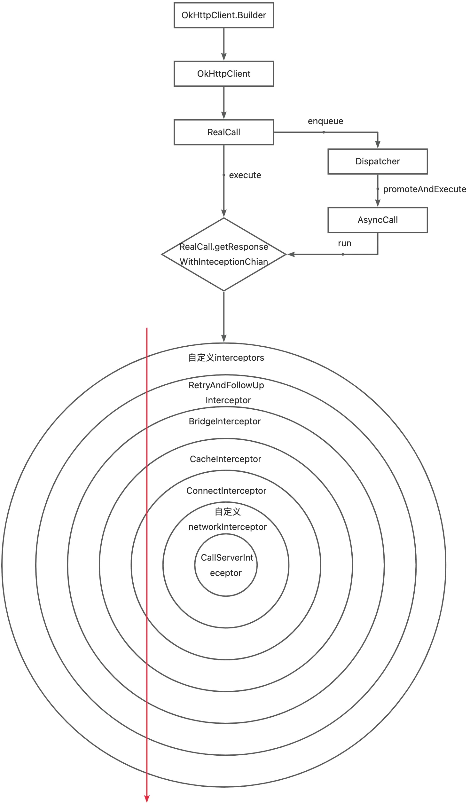
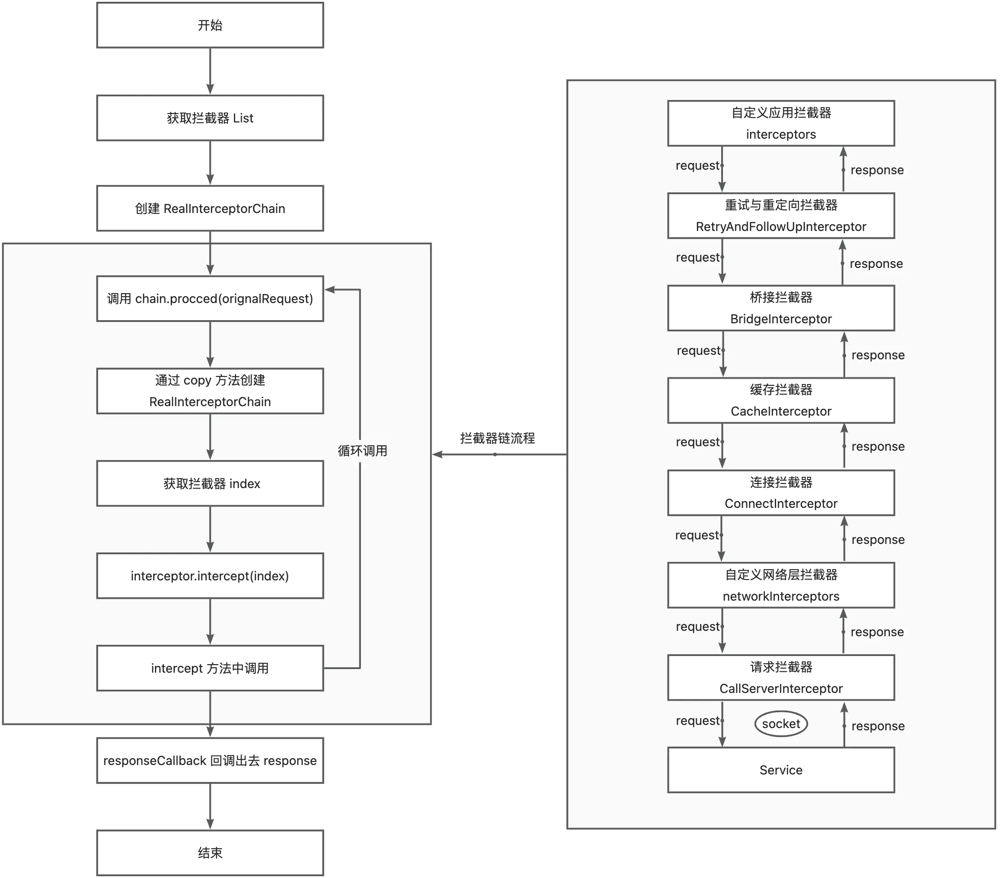

> 源码基于 okhttp:4.10.0

# 请求超时、连接超时、读取超时、写入超时

- 请求超时(callTimeout): 贯穿整个调用过程:解析DNS、连接、写入请求体、服务器处理和读取响应体。如果调用需要重定向或重试，所有操作都必须在一个超时时间内完成。默认为0(无超时限制)
- 连接超时(connectTimeout): 指TCP套接字连接到目标主机耗时，即TCP握手超时时间。默认是10秒。
- 读取超时(readTimeout): 指TCP套接字和单个读IO操作(包括响应源)，即服务端处理+读取响应体超时时间。默认是10秒。
- 写入超时(writeTimeout): 指单个写IO操作，即写入请求体超时时间。默认是10秒。
# 执行流程


<!-- more -->

| 拦截器 | 作用 |
| --- | --- |
| ApplicationInterceptor(应用拦截器) | 拿到原始请求，可以添加一些自定义 Headers、通用参数、参数加密、网关接入等 |
| RetryAndFollowUpInterceptor(重试与重定向拦截器) | 处理错误重试和重定向 |
| BridgeInterceptor(桥接拦截器) | 桥接应用层与网络层,主要工作是为请求添加 Cookie、固定 Header,比如:Host、Content-Length、Content-Type、User-Agent等，然后保存响应结果的 cookie，如果响应结果使用 gzip 压缩，则还需进行解压 |
| CacheInterceptor(缓存拦截器) | 如果命中缓存，则不发起网络请求 |
| ConnectInterceptor(连接拦截器) | 内部维护一个连接池，负责复用、创建连接(三次握手等)、释放连接以及创建连接上的socket流 |
| NetworkInterceptor(网络拦截器) | 用户自定义拦截器，通常用于监控网络层的数据传输 |
| CallServerInterceptor(请求拦截器) | 在前置准备工作完成后，发起真正请求 |

# OkHttpClient 参数
```kotlin
class Builder constructor() {
   //Okhttp 请求分发器，是整个OkhttpClient的执行核心
  internal var dispatcher: Dispatcher = Dispatcher()
  //Okhttp连接池，不过会把任务委托给RealConnectionPool处理
  internal var connectionPool: ConnectionPool = ConnectionPool()
  //用户定义的拦截器，在重试拦截器之前执行
  internal val interceptors: MutableList<Interceptor> = mutableListOf()
  //用户定义的网络拦截器，在CallServerInterceptor(执行网络请求拦截器)之前运行。
  internal val networkInterceptors: MutableList<Interceptor> = mutableListOf()
  //流程监听器
  internal var eventListenerFactory: EventListener.Factory = EventListener.NONE.asFactory()
  //连接失败时是否重连
  internal var retryOnConnectionFailure = true
  //服务器认证设置
  internal var authenticator: Authenticator = Authenticator.NONE
  //是否重定向
  internal var followRedirects = true
  //是否重定向到https
  internal var followSslRedirects = true
  //cookie持久化的设置
  internal var cookieJar: CookieJar = CookieJar.NO_COOKIES
  //缓存设置
  internal var cache: Cache? = null
  //DNS设置
  internal var dns: Dns = Dns.SYSTEM
  //代理设置
  internal var proxy: Proxy? = null
  internal var proxySelector: ProxySelector? = null
  internal var proxyAuthenticator: Authenticator = Authenticator.NONE
  //默认的socket连接池
  internal var socketFactory: SocketFactory = SocketFactory.getDefault()
  //用于https的socket连接池
  internal var sslSocketFactoryOrNull: SSLSocketFactory? = null
  //用于信任Https证书的对象
  internal var x509TrustManagerOrNull: X509TrustManager? = null
  internal var connectionSpecs: List<ConnectionSpec> = DEFAULT_CONNECTION_SPECS
  //http协议集合
  internal var protocols: List<Protocol> = DEFAULT_PROTOCOLS
  //https对host的检验
  internal var hostnameVerifier: HostnameVerifier = OkHostnameVerifier
  internal var certificatePinner: CertificatePinner = CertificatePinner.DEFAULT
  internal var certificateChainCleaner: CertificateChainCleaner? = null
  //请求超时
  internal var callTimeout = 0
  //连接超时
  internal var connectTimeout = 10_000
  //读取超时
  internal var readTimeout = 10_000
  //写入超时
  internal var writeTimeout = 10_000
  internal var pingInterval = 0
  internal var minWebSocketMessageToCompress = RealWebSocket.DEFAULT_MINIMUM_DEFLATE_SIZE
  internal var routeDatabase: RouteDatabase? = null
  }
```
# 示例与源码解读
## 示例
```kotlin
    fun createRequest(){
        val okHttpClient = OkHttpClient.Builder()
        .addInterceptor(AppInterceptor())
        .connectTimeout(10, TimeUnit.MILLISECONDS)
        .readTimeout(10,TimeUnit.MILLISECONDS)
        .writeTimeout(10,TimeUnit.MILLISECONDS)
        .build()

        val request = Request.Builder()
            .url("asd.com/api")
            .get()
            .build()
    
        okHttpClient.newCall(request).enqueue(object : Callback{
            override fun onFailure(call: Call, e: IOException) {
    
            }
    
            override fun onResponse(call: Call, response: Response) {
                if (response.isSuccessful && response.body != null){
    
                }
            }
        })
    }
    
    //自定义应用拦截器
    private class AppInterceptor: Interceptor{
        override fun intercept(chain: Interceptor.Chain): Response {
            val request = chain.request().newBuilder().addHeader("A","test").build()
            return chain.proceed(request)
        }

    }
```
## 源码解读
### OkHttpClient#newCall()
```kotlin
// 创建并返回 RealCall
override fun newCall(request: Request): Call = RealCall(this, request, forWebSocket = false)
```
### RealCall#enqueue()
```kotlin
override fun enqueue(responseCallback: Callback) {
    
    check(executed.compareAndSet(false, true)) { "Already Executed" }
    
    callStart()
    
    // 创建 AsyncCall 对象，并调用 dispatcher.enqueue()
    // 这里 AsyncCall 实现自 Runnable，这个类后头再看
    client.dispatcher.enqueue(AsyncCall(responseCallback))
}

private fun callStart() {
    //打印日志
    this.callStackTrace = Platform.get().getStackTraceForCloseable("response.body().close()")
    // 通知注入的 eventListener
    eventListener.callStart(this)
}
```
### Dispatcher#enqueue()
```kotlin

// 默认线程池
@get:JvmName("executorService") val executorService: ExecutorService
    get() {
      if (executorServiceOrNull == null) {
        executorServiceOrNull = ThreadPoolExecutor(0, Int.MAX_VALUE, 60, TimeUnit.SECONDS,
            SynchronousQueue(), threadFactory("$okHttpName Dispatcher", false))
      }
    return executorServiceOrNull!!
}

// 等待异步队列
private val readyAsyncCalls = ArrayDeque<AsyncCall>()

// 正在执行的异步队列（包含取消但未结束的）
private val runningAsyncCalls = ArrayDeque<AsyncCall>()

// 正在执行的同步队列（包含取消但未结束的）
private val runningSyncCalls = ArrayDeque<RealCall>()

internal fun enqueue(call: AsyncCall) {
    synchronized(this) {
      //添加到等待队列中  
      readyAsyncCalls.add(call)
    
      //查找是否有相同 Host 的 AsyncCall, 如果有则让这个 AsyncCall 中的 callsPerHost 替换当前值
      if (!call.call.forWebSocket) {
        val existingCall = findExistingCallWithHost(call.host)
        if (existingCall != null) call.reuseCallsPerHostFrom(existingCall)
      }
    }
    
    //将 AyncCall 从等待队列中移除，添加到执行队列中，并通过线程池调用
    promoteAndExecute()
}

// 从正在执行和等待异步队列中查找是否有相同 host 的 AsyncCall
private fun findExistingCallWithHost(host: String): AsyncCall? {
    for (existingCall in runningAsyncCalls) {
      if (existingCall.host == host) return existingCall
    }
    for (existingCall in readyAsyncCalls) {
      if (existingCall.host == host) return existingCall
    }
    return null
}
```

```kotlin
  private fun promoteAndExecute(): Boolean {
    this.assertThreadDoesntHoldLock()

    val executableCalls = mutableListOf<AsyncCall>()
    val isRunning: Boolean
    synchronized(this) {
      val i = readyAsyncCalls.iterator()
      while (i.hasNext()) {
        val asyncCall = i.next()
        
        //判断当前正在执行的队列大小是否超过最大限制(64个)
        if (runningAsyncCalls.size >= this.maxRequests) break 
        //判断当前Host的请求数是否超过最大限制(5个)。这里的个数就是上面 reuseCallsPerHostFrom() 加的。
        if (asyncCall.callsPerHost.get() >= this.maxRequestsPerHost) continue // Host max capacity.

        i.remove()
        //增加当前host的请求数
        asyncCall.callsPerHost.incrementAndGet()
        executableCalls.add(asyncCall)
        runningAsyncCalls.add(asyncCall)
      }
      isRunning = runningCallsCount() > 0
    }

    //若当前没有正在执行的，则通过线程池开始执行
    for (i in 0 until executableCalls.size) {
      val asyncCall = executableCalls[i]
      asyncCall.executeOn(executorService)
    }

    return isRunning
  }
```
### AsyncCall# execureOn()
```kotlin
    fun executeOn(executorService: ExecutorService) {
      client.dispatcher.assertThreadDoesntHoldLock()

      var success = false
      try {
        // 上面说过 AsyncCall 实现自 Runable，所以直接执行自己的 run()
        executorService.execute(this)
        success = true
      } catch (e: RejectedExecutionException) {
        val ioException = InterruptedIOException("executor rejected")
        ioException.initCause(e)
        noMoreExchanges(ioException)
        
        //如果出现异常则回调 onFailure()
        responseCallback.onFailure(this@RealCall, ioException)
      } finally {
        if (!success) {
          client.dispatcher.finished(this) // This call is no longer running!
        }
      }
    }
```

```kotlin
    override fun run() {
      threadName("OkHttp ${redactedUrl()}") {
        var signalledCallback = false
        // 触发定时器，限制时间为 callTimeOut，超时则取消请求
        timeout.enter()
        try {
          //调用拦截器链开始处理执行请求
          val response = getResponseWithInterceptorChain()
          signalledCallback = true
          //请求成功则回调 onResponse()
          responseCallback.onResponse(this@RealCall, response)
        } catch (e: IOException) {
          if (signalledCallback) {
            // Do not signal the callback twice!
            Platform.get().log("Callback failure for ${toLoggableString()}", Platform.INFO, e)
          } else {
            responseCallback.onFailure(this@RealCall, e)
          }
        } catch (t: Throwable) {
          cancel()
          if (!signalledCallback) {
            val canceledException = IOException("canceled due to $t")
            canceledException.addSuppressed(t)
            responseCallback.onFailure(this@RealCall, canceledException)
          }
          throw t
        } finally {
          //请求结束，则调用 finished()
          //内部完成两件事：
          // 1. 让当前 Host 的 callsPerHost 减一
          // 2. 调用 promoteAndExecute() 执行下一个请求。如果没有请求 && idleCallback 不为空，则执行 idleCallback.run()
          client.dispatcher.finished(this)
        }
      }
    }
```

```kotlin
  internal fun getResponseWithInterceptorChain(): Response {
    // 收集构建拦截器链
    val interceptors = mutableListOf<Interceptor>()
    interceptors += client.interceptors
    interceptors += RetryAndFollowUpInterceptor(client)
    interceptors += BridgeInterceptor(client.cookieJar)
    interceptors += CacheInterceptor(client.cache)
    interceptors += ConnectInterceptor
    if (!forWebSocket) {
      interceptors += client.networkInterceptors
    }
    interceptors += CallServerInterceptor(forWebSocket)

    val chain = RealInterceptorChain(
        call = this,
        interceptors = interceptors,
        index = 0,
        exchange = null,
        request = originalRequest,
        connectTimeoutMillis = client.connectTimeoutMillis,
        readTimeoutMillis = client.readTimeoutMillis,
        writeTimeoutMillis = client.writeTimeoutMillis
    )

    var calledNoMoreExchanges = false
    try {
      //执行 RealInterceptorChain.proceed() 开始请求流程
      val response = chain.proceed(originalRequest)
      if (isCanceled()) {
        response.closeQuietly()
        throw IOException("Canceled")
      }
      return response
    } catch (e: IOException) {
      calledNoMoreExchanges = true
      throw noMoreExchanges(e) as Throwable
    } finally {
      if (!calledNoMoreExchanges) {
        noMoreExchanges(null)
      }
    }
  }
```
### RealInterceptorChain#proceed()
```kotlin
  override fun proceed(request: Request): Response {
    // ... 省略...
    
    // 创建一个新的 chain，其中 index+1 即下一个拦截器
    val next = copy(index = index + 1, request = request)
    
    // 获取当前拦截器，并执行 intercept(), 传入下一个拦截器
    val interceptor = interceptors[index]
    val response = interceptor.intercept(next) ?: throw NullPointerException(
        "interceptor $interceptor returned null")
    
    //最终所有拦截器走完，并逐层返回结果
    return response
  }
```


## 逐层拦截器解析
### ApplicationInterceptor
应用层拦截器，拦截器的第一层，为自定义拦截器，可以拿到原始请求。
```kotlin
    //这是一个示例自定义应用层拦截器，在原始请求中添加 Header
    // 处理完成后继续调用 proceed()，交给下一个拦截器
    private class AppInterceptor: Interceptor{
        override fun intercept(chain: Interceptor.Chain): Response {
            val request = chain.request().newBuilder().addHeader("A","test").build()
            return chain.proceed(request)
        }

    }
```
### RetryAndFollowUpInterceptor
```kotlin
  override fun intercept(chain: Interceptor.Chain): Response {
    val realChain = chain as RealInterceptorChain
    var request = chain.request
    val call = realChain.call
    var followUpCount = 0
    var priorResponse: Response? = null
    var newExchangeFinder = true
    var recoveredFailures = listOf<IOException>()
    while (true) {
        
      // 在 RealCall 中 新建一个 ExchangeFinder，后面 ConnectInterceptor 会使用到
      call.enterNetworkInterceptorExchange(request, newExchangeFinder)

      var response: Response
      var closeActiveExchange = true
      try {
        if (call.isCanceled()) {
          throw IOException("Canceled")
        }

        try {
          // 执行下一个拦截器。这个拦截主要功能在 Catch，用于处理失败或重定向
          response = realChain.proceed(request)
          newExchangeFinder = true
        } catch (e: RouteException) {
          // 通过路由连接失败。请求将不会被发送 sent.
          if (!recover(e.lastConnectException, call, request, requestSendStarted = false)) {
            throw e.firstConnectException.withSuppressed(recoveredFailures)
          } else {
            recoveredFailures += e.firstConnectException
          }
          newExchangeFinder = false
          continue
        } catch (e: IOException) {
          // 与服务器通信失败，该请求可能已被发送
          if (!recover(e, call, request, requestSendStarted = e !is ConnectionShutdownException)) {
            throw e.withSuppressed(recoveredFailures)
          } else {
            recoveredFailures += e
          }
          newExchangeFinder = false
          continue
        }

        // 尝试关联上一个response，注意：body是为null
        if (priorResponse != null) {
          response = response.newBuilder()
              .priorResponse(priorResponse.newBuilder()
                  .body(null)
                  .build())
              .build()
        }

        val exchange = call.interceptorScopedExchange
        // 根据 responseCode 来处理，如308、408等。如果是重定向或失败，则创建新的 request 重新请求
        val followUp = followUpRequest(response, exchange)

        if (followUp == null) {
          if (exchange != null && exchange.isDuplex) {
            call.timeoutEarlyExit()
          }
          closeActiveExchange = false
          return response
        }

        val followUpBody = followUp.body
        // 如果请求体是一次性的，则不需要重试
        if (followUpBody != null && followUpBody.isOneShot()) {
          closeActiveExchange = false
          return response
        }

        response.body?.closeQuietly()

        //最大重定向或重试次数，不同的浏览器是不同的，Chrome遵循21个重定向;Firefox, curl和wget跟随20;Safari是16;HTTP1.0推荐5。
        if (++followUpCount > MAX_FOLLOW_UPS) {
          throw ProtocolException("Too many follow-up requests: $followUpCount")
        }

        request = followUp
        priorResponse = response
      } finally {
        call.exitNetworkInterceptorExchange(closeActiveExchange)
      }
    }
  }
```
### BridgeInterceptor
```kotlin
  override fun intercept(chain: Interceptor.Chain): Response {
    val userRequest = chain.request()
    
    //创建新 request，并添加 Headers，然后调用下一个拦截器
    val requestBuilder = userRequest.newBuilder()

    val body = userRequest.body
    if (body != null) {
      val contentType = body.contentType()
      if (contentType != null) {
        requestBuilder.header("Content-Type", contentType.toString())
      }

      val contentLength = body.contentLength()
      if (contentLength != -1L) {
        requestBuilder.header("Content-Length", contentLength.toString())
        requestBuilder.removeHeader("Transfer-Encoding")
      } else {
        requestBuilder.header("Transfer-Encoding", "chunked")
        requestBuilder.removeHeader("Content-Length")
      }
    }

    if (userRequest.header("Host") == null) {
      requestBuilder.header("Host", userRequest.url.toHostHeader())
    }

    if (userRequest.header("Connection") == null) {
      requestBuilder.header("Connection", "Keep-Alive")
    }

    // If we add an "Accept-Encoding: gzip" header field we're responsible for also decompressing
    // the transfer stream.
    var transparentGzip = false
    if (userRequest.header("Accept-Encoding") == null && userRequest.header("Range") == null) {
      transparentGzip = true
      requestBuilder.header("Accept-Encoding", "gzip")
    }

    val cookies = cookieJar.loadForRequest(userRequest.url)
    if (cookies.isNotEmpty()) {
      requestBuilder.header("Cookie", cookieHeader(cookies))
    }

    if (userRequest.header("User-Agent") == null) {
      requestBuilder.header("User-Agent", userAgent)
    }
    
    // 返回结果后，保存cookie，如果响应结果经过gzip压缩，则解压
    val networkResponse = chain.proceed(requestBuilder.build())

    cookieJar.receiveHeaders(userRequest.url, networkResponse.headers)

    val responseBuilder = networkResponse.newBuilder()
        .request(userRequest)

    if (transparentGzip &&
        "gzip".equals(networkResponse.header("Content-Encoding"), ignoreCase = true) &&
        networkResponse.promisesBody()) {
      val responseBody = networkResponse.body
      if (responseBody != null) {
        val gzipSource = GzipSource(responseBody.source())
        val strippedHeaders = networkResponse.headers.newBuilder()
            .removeAll("Content-Encoding")
            .removeAll("Content-Length")
            .build()
        responseBuilder.headers(strippedHeaders)
        val contentType = networkResponse.header("Content-Type")
        responseBuilder.body(RealResponseBody(contentType, -1L, gzipSource.buffer()))
      }
    }

    return responseBuilder.build()
  }
```
### CacheInterceptor
```kotlin
  override fun intercept(chain: Interceptor.Chain): Response {
    val call = chain.call()
    // 通过request从 OkHttpClient.cache 中获取缓存(从LruCache中获取缓存) 
    val cacheCandidate = cache?.get(chain.request())

    val now = System.currentTimeMillis()
    //创建缓存策略
    val strategy = CacheStrategy.Factory(now, chain.request(), cacheCandidate).compute()
    val networkRequest = strategy.networkRequest
    val cacheResponse = strategy.cacheResponse

    cache?.trackResponse(strategy)
    val listener = (call as? RealCall)?.eventListener ?: EventListener.NONE

    if (cacheCandidate != null && cacheResponse == null) {
      // The cache candidate wasn't applicable. Close it.
      cacheCandidate.body?.closeQuietly()
    }

    // 没网没缓存，则失败.
    if (networkRequest == null && cacheResponse == null) {
      return Response.Builder()
          .request(chain.request())
          .protocol(Protocol.HTTP_1_1)
          .code(HTTP_GATEWAY_TIMEOUT)
          .message("Unsatisfiable Request (only-if-cached)")
          .body(EMPTY_RESPONSE)
          .sentRequestAtMillis(-1L)
          .receivedResponseAtMillis(System.currentTimeMillis())
          .build().also {
            listener.satisfactionFailure(call, it)
          }
    }

    // 没网，则返回缓存
    if (networkRequest == null) {
      return cacheResponse!!.newBuilder()
          .cacheResponse(stripBody(cacheResponse))
          .build().also {
            listener.cacheHit(call, it)
          }
    }

    //添加缓存监听
    if (cacheResponse != null) {
      listener.cacheConditionalHit(call, cacheResponse)
    } else if (cache != null) {
      listener.cacheMiss(call)
    }

    var networkResponse: Response? = null
    try {
        //执行下一个拦截器
      networkResponse = chain.proceed(networkRequest)
    } finally {
      // 如果我们在 I/O 或其他方面崩溃，不要使用缓存。
      if (networkResponse == null && cacheCandidate != null) {
        cacheCandidate.body?.closeQuietly()
      }
    }


    if (cacheResponse != null) {
      //有缓存，且 responseCode = 304，则返回缓存,否则关闭缓存响应体
      if (networkResponse?.code == HTTP_NOT_MODIFIED) {
        val response = cacheResponse.newBuilder()
            .headers(combine(cacheResponse.headers, networkResponse.headers))
            .sentRequestAtMillis(networkResponse.sentRequestAtMillis)
            .receivedResponseAtMillis(networkResponse.receivedResponseAtMillis)
            .cacheResponse(stripBody(cacheResponse))
            .networkResponse(stripBody(networkResponse))
            .build()

        networkResponse.body!!.close()
        
        cache!!.trackConditionalCacheHit()
        cache.update(cacheResponse, response)
        return response.also {
          listener.cacheHit(call, it)
        }
      } else {

        cacheResponse.body?.closeQuietly()
      }
    }

    //构建网络请求的response
    val response = networkResponse!!.newBuilder()
        .cacheResponse(stripBody(cacheResponse))
        .networkResponse(stripBody(networkResponse))
        .build()

    //如果cache不为null，即用户在OkHttpClient中配置了缓存，则将上一步新构建的网络请求response存到cache中
    if (cache != null) {
      //根据 responseCode,header以及CacheControl.noStore来判断是否可以缓存
      //如果状态码为200、203、204、301、404、405、410、414、501、308 都可以缓存，其他则返回false 不进行缓存
      if (response.promisesBody() && CacheStrategy.isCacheable(response, networkRequest)) {
        // 将该response存入缓存
        val cacheRequest = cache.put(response)
        return cacheWritingResponse(cacheRequest, response).also {
          if (cacheResponse != null) {
        
            listener.cacheMiss(call)
          }
        }
      }

      //根据请求方法来判断缓存是否有效，只对Get请求进行缓存，其它方法的请求则移除
      if (HttpMethod.invalidatesCache(networkRequest.method)) {
        try {
          //缓存无效，将该请求缓存从client缓存配置中移除
          cache.remove(networkRequest)
        } catch (_: IOException) {
          // The cache cannot be written.
        }
      }
    }

    return response
  }
```
### ConnectInterceptor
```kotlin
object ConnectInterceptor : Interceptor {
  @Throws(IOException::class)
  override fun intercept(chain: Interceptor.Chain): Response {
    val realChain = chain as RealInterceptorChain
    //调用 initExchange(),修改 chain中的 exchange，然后交给下一个拦截器
    val exchange = realChain.call.initExchange(chain)
    val connectedChain = realChain.copy(exchange = exchange)
    return connectedChain.proceed(realChain.request)
  }
}
```
#### RealCall#initExchange()
```kotlin
//创建或复用连接池中的连接来承载接下来的请求与响应
internal fun initExchange(chain: RealInterceptorChain): Exchange {

    //在 RetryAndFolloUpInterceptor 中已创建了 exchangeFinder
    val exchangeFinder = this.exchangeFinder!!
    //调用 ExchangeFinder.find()，获得 ExchangeCodec
    val codec = exchangeFinder.find(client, chain)
    val result = Exchange(this, eventListener, exchangeFinder, codec)
    this.interceptorScopedExchange = result
    this.exchange = result
    synchronized(this) {
      this.requestBodyOpen = true
      this.responseBodyOpen = true
    }

    if (canceled) throw IOException("Canceled")
    return result
  }
```
#### ExchangeFinder.find()
```kotlin
  fun find(
    client: OkHttpClient,
    chain: RealInterceptorChain
  ): ExchangeCodec {
    try {
      //获得 RealConnection 对象，然后调用它的 newCodec()
      val resultConnection = findHealthyConnection(
          connectTimeout = chain.connectTimeoutMillis,
          readTimeout = chain.readTimeoutMillis,
          writeTimeout = chain.writeTimeoutMillis,
          pingIntervalMillis = client.pingIntervalMillis,
          connectionRetryEnabled = client.retryOnConnectionFailure,
          doExtensiveHealthChecks = chain.request.method != "GET"
      )
      //创建一个Http2ExchangeCodec或Http1ExchangeCodec（对应http2.0和http1.0)
      return resultConnection.newCodec(client, chain)
    } catch (e: RouteException) {
      trackFailure(e.lastConnectException)
      throw e
    } catch (e: IOException) {
      trackFailure(e)
      throw RouteException(e)
    }
  }
```
```kotlin
// 返回一个连接用来托管一个新的流。如果已存在，则复用；如果不存在然后从连接池中找，有则复用；如果都没有则创建新的。
private fun findConnection(
    connectTimeout: Int,
    readTimeout: Int,
    writeTimeout: Int,
    pingIntervalMillis: Int,
    connectionRetryEnabled: Boolean
): RealConnection {
    if (call.isCanceled()) throw IOException("Canceled")
    
    // 获取已有连接
    val callConnection = call.connection // This may be mutated by releaseConnectionNoEvents()!
    if (callConnection != null) {
      var toClose: Socket? = null
      synchronized(callConnection) {
        //如果已有连接被标记为不活跃 或者 host/port 不是同一个，则释放该链接
        if (callConnection.noNewExchanges || !sameHostAndPort(callConnection.route().address.url)) {
          toClose = call.releaseConnectionNoEvents()
        }
      }
    
      // 如果当前链接没有被释放，则直接复用
      if (call.connection != null) {
        check(toClose == null)
        return callConnection
      }
    
      // The call's connection was released.
      toClose?.closeQuietly()
      eventListener.connectionReleased(call, callConnection)
    }
    
    // We need a new connection. Give it fresh stats.
    refusedStreamCount = 0
    connectionShutdownCount = 0
    otherFailureCount = 0
    
    // 当前连接中没有，则从连接池中找一找
    // 这里调用 RealConnectionPool.callAcquirePooledConnection() ，
    // 经过各种判断查找是否可复用的连接，如果有则将该 realConnection 赋值给 RealCall.connection，并添加到当前连接 List 中
    if (connectionPool.callAcquirePooledConnection(address, call, null, false)) {
      val result = call.connection!!
      eventListener.connectionAcquired(call, result)
      return result
    }
    
    // 如果连接池中没有，则从代理里面看下是否可以匹配
    val routes: List<Route>?
    val route: Route
    if (nextRouteToTry != null) {
      // Use a route from a preceding coalesced connection.
      routes = null
      route = nextRouteToTry!!
      nextRouteToTry = null
    } else if (routeSelection != null && routeSelection!!.hasNext()) {
      // Use a route from an existing route selection.
      routes = null
      route = routeSelection!!.next()
    } else {
      // 首次请求会创建新的 RouteSelector，内部会生成PoxyList
      var localRouteSelector = routeSelector
      if (localRouteSelector == null) {
        localRouteSelector = RouteSelector(address, call.client.routeDatabase, call, eventListener)
        this.routeSelector = localRouteSelector
      }
      val localRouteSelection = localRouteSelector.next()
      routeSelection = localRouteSelection
      routes = localRouteSelection.routes
    
      if (call.isCanceled()) throw IOException("Canceled")
    
      // 有了PoxyList后根据 IP地址进行匹配看是否有可复用的 connection
      if (connectionPool.callAcquirePooledConnection(address, call, routes, false)) {
        val result = call.connection!!
        eventListener.connectionAcquired(call, result)
        return result
      }
    
      route = localRouteSelection.next()
    }
    
    // 上面都没找到可复用的，则直接创建
    val newConnection = RealConnection(connectionPool, route)
    call.connectionToCancel = newConnection
    try {
      //创建连接
      newConnection.connect(
          connectTimeout,
          readTimeout,
          writeTimeout,
          pingIntervalMillis,
          connectionRetryEnabled,
          call,
          eventListener
      )
    } finally {
      call.connectionToCancel = null
    }
    call.client.routeDatabase.connected(newConnection.route())
    
    // If we raced another call connecting to this host, coalesce the connections. This makes for 3
    // different lookups in the connection pool!
    if (connectionPool.callAcquirePooledConnection(address, call, routes, true)) {
      val result = call.connection!!
      nextRouteToTry = route
      newConnection.socket().closeQuietly()
      eventListener.connectionAcquired(call, result)
      return result
    }
    
    synchronized(newConnection) {
      //将创建好的 connection 添加到连接池和当前连接List中
      connectionPool.put(newConnection)
      call.acquireConnectionNoEvents(newConnection)
    }
    
    eventListener.connectionAcquired(call, newConnection)
    return newConnection
}
```
#### RealConnection#connect()
```kotlin
  fun connect(
    connectTimeout: Int,
    readTimeout: Int,
    writeTimeout: Int,
    pingIntervalMillis: Int,
    connectionRetryEnabled: Boolean,
    call: Call,
    eventListener: EventListener
  ) {
    check(protocol == null) { "already connected" }

    var routeException: RouteException? = null
    val connectionSpecs = route.address.connectionSpecs
    val connectionSpecSelector = ConnectionSpecSelector(connectionSpecs)

    //... 前置校验

    while (true) {
      try {
        //判断sslSocketFactory不为空，并且代理模式为Proxy.Type.HTTP时，会调用connectTunnel连接socket，其实最终还是调用 connectSocket方法
        if (route.requiresTunnel()) {
          connectTunnel(connectTimeout, readTimeout, writeTimeout, call, eventListener)
          if (rawSocket == null) {
            // We were unable to connect the tunnel but properly closed down our resources.
            break
          }
        } else {
          connectSocket(connectTimeout, readTimeout, call, eventListener)
        }
        establishProtocol(connectionSpecSelector, pingIntervalMillis, call, eventListener)
        eventListener.connectEnd(call, route.socketAddress, route.proxy, protocol)
        break
      } catch (e: IOException) {
        //... 省略
      }
    }

    if (route.requiresTunnel() && rawSocket == null) {
      throw RouteException(ProtocolException(
          "Too many tunnel connections attempted: $MAX_TUNNEL_ATTEMPTS"))
    }

    idleAtNs = System.nanoTime()
  }
```
```kotlin
  private fun connectSocket(
    connectTimeout: Int,
    readTimeout: Int,
    call: Call,
    eventListener: EventListener
  ) {
    val proxy = route.proxy
    val address = route.address
    // 创建 Socket
    val rawSocket = when (proxy.type()) {
      Proxy.Type.DIRECT, Proxy.Type.HTTP -> address.socketFactory.createSocket()!!
      else -> Socket(proxy)
    }
    this.rawSocket = rawSocket
    eventListener.connectStart(call, route.socketAddress, proxy)
    rawSocket.soTimeout = readTimeout
    try {
      //调用 socket.connect() 建立连接，设置连接超时时间
      Platform.get().connectSocket(rawSocket, route.socketAddress, connectTimeout)
    } catch (e: ConnectException) {
      throw ConnectException("Failed to connect to ${route.socketAddress}").apply {
        initCause(e)
      }
    }

    // The following try/catch block is a pseudo hacky way to get around a crash on Android 7.0
    // More details:
    // https://github.com/square/okhttp/issues/3245
    // https://android-review.googlesource.com/#/c/271775/
    try {
      // 通过 Okio 分别获取source 写入流和sink 输出流缓存在RealConnection中
      source = rawSocket.source().buffer()
      sink = rawSocket.sink().buffer()
    } catch (npe: NullPointerException) {
      if (npe.message == NPE_THROW_WITH_NULL) {
        throw IOException(npe)
      }
    }
  }
```
### CallServerInterceptor
```kotlin
override fun intercept(chain: Interceptor.Chain): Response {
    val realChain = chain as RealInterceptorChain
    val exchange = realChain.exchange!!
    val request = realChain.request
    val requestBody = request.body
    val sentRequestMillis = System.currentTimeMillis()

    //写入Header
    exchange.writeRequestHeaders(request)

    var invokeStartEvent = true
    var responseBuilder: Response.Builder? = null
    //判断请求方式不是 GET 或 HEAD 的话，就添加 RequestBody
    if (HttpMethod.permitsRequestBody(request.method) && requestBody != null) {
      // If there's a "Expect: 100-continue" header on the request, wait for a "HTTP/1.1 100
      // Continue" response before transmitting the request body. If we don't get that, return
      // what we did get (such as a 4xx response) without ever transmitting the request body.
      if ("100-continue".equals(request.header("Expect"), ignoreCase = true)) {
        exchange.flushRequest()
        responseBuilder = exchange.readResponseHeaders(expectContinue = true)
        exchange.responseHeadersStart()
        invokeStartEvent = false
      }
      if (responseBuilder == null) {
        //双工请求特殊处理
        if (requestBody.isDuplex()) {
          // Prepare a duplex body so that the application can send a request body later.
          exchange.flushRequest()
          val bufferedRequestBody = exchange.createRequestBody(request, true).buffer()
          requestBody.writeTo(bufferedRequestBody)
        } else {
          // 创建一个 RequestBodySink 流对象，将 requestBody 写入
          val bufferedRequestBody = exchange.createRequestBody(request, false).buffer()
          requestBody.writeTo(bufferedRequestBody)
          bufferedRequestBody.close()
        }
      } else {
        exchange.noRequestBody()
        if (!exchange.connection.isMultiplexed) {
          // If the "Expect: 100-continue" expectation wasn't met, prevent the HTTP/1 connection
          // from being reused. Otherwise we're still obligated to transmit the request body to
          // leave the connection in a consistent state.
          exchange.noNewExchangesOnConnection()
        }
      }
    } else {
      exchange.noRequestBody()
    }

    if (requestBody == null || !requestBody.isDuplex()) {
      exchange.finishRequest()
    }
    if (responseBuilder == null) {
      //从source中读取并构建Response.Builder，并赋值exchange
      responseBuilder = exchange.readResponseHeaders(expectContinue = false)!!
      if (invokeStartEvent) {
        exchange.responseHeadersStart()
        invokeStartEvent = false
      }
    }
    //继续构建 Response
    var response = responseBuilder
        .request(request)
        .handshake(exchange.connection.handshake())
        .sentRequestAtMillis(sentRequestMillis)
        .receivedResponseAtMillis(System.currentTimeMillis())
        .build()
    var code = response.code
    //如果返回code=100，继续读取新的response
    if (code == 100) {
      // Server sent a 100-continue even though we did not request one. Try again to read the actual
      // response status.
      responseBuilder = exchange.readResponseHeaders(expectContinue = false)!!
      if (invokeStartEvent) {
        exchange.responseHeadersStart()
      }
      response = responseBuilder
          .request(request)
          .handshake(exchange.connection.handshake())
          .sentRequestAtMillis(sentRequestMillis)
          .receivedResponseAtMillis(System.currentTimeMillis())
          .build()
      code = response.code
    }

    //
    exchange.responseHeadersEnd(response)

    response = if (forWebSocket && code == 101) {
      // Connection is upgrading, but we need to ensure interceptors see a non-null response body.
      // 这里是从http转到websocket
      response.newBuilder()
          .body(EMPTY_RESPONSE)
          .build()
    } else {
      response.newBuilder()
          .body(exchange.openResponseBody(response))
          .build()
    }
    if ("close".equals(response.request.header("Connection"), ignoreCase = true) ||
        "close".equals(response.header("Connection"), ignoreCase = true)) {
      exchange.noNewExchangesOnConnection()
    }
    if ((code == 204 || code == 205) && response.body?.contentLength() ?: -1L > 0L) {
      throw ProtocolException(
          "HTTP $code had non-zero Content-Length: ${response.body?.contentLength()}")
    }
    return response
  }
```
# 参考资料
[https://juejin.cn/post/7143038823356858398](https://juejin.cn/post/7143038823356858398)<br />[https://juejin.cn/post/7015517626881277966](https://juejin.cn/post/7015517626881277966#heading-9)
