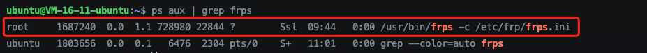
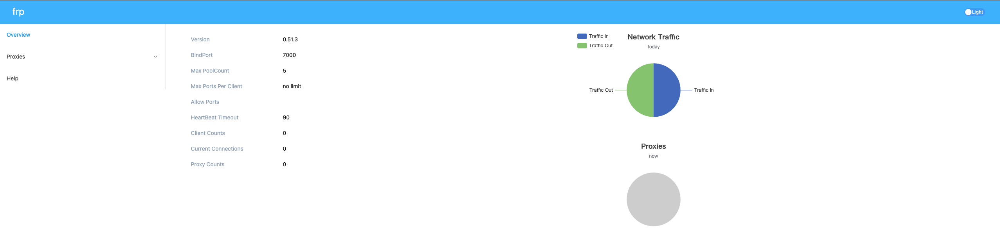
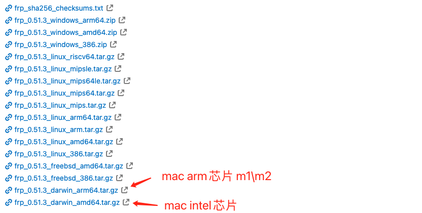
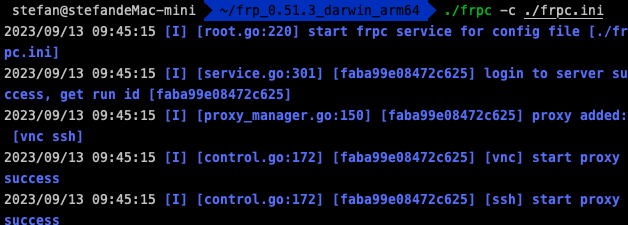

# 背景
公司没有自建内网 VPN，项目出现问题只能来公司解决非常不方便。由于家里和公司都是使用的 Mac 电脑，所以只要实现内网穿透就可以直接使用 vnc 远程控制公司电脑了。目前市面上有很多内网穿透产品，例如：frp、ngrok、natapp、花生壳等。

- ngrok：免费，不需要自建服务端，配置简单。但可能由于服务端在国外，延迟较高。
- frp：免费，配置比较复杂，需要自建服务端。
- natapp：免费/付费，可以理解为国内的 ngrok，配置简单。配置可参考[https://blog.csdn.net/m0_68539124/article/details/128531080](https://blog.csdn.net/m0_68539124/article/details/128531080)
- 花生壳：免费/付费，免费版每月 1G 流量，配置也很简单。

正好前段时间买了台腾讯云服务器，下面就来记录下如何搭建 frp 来实现内网穿透。

<!-- more -->
# 服务端
> 首先你需要一台云服务器。这里以腾讯云清凉应用服务器 ubuntu 64 位为例。

## 下载 frp 并解压
> 版本信息可访问：[https://github.com/fatedier/frp/releases](https://github.com/fatedier/frp/releases) (国内：[https://gitcode.net/mirrors/fatedier/frp/-/releases?spm=1033.2243.3001.5877](https://gitcode.net/mirrors/fatedier/frp/-/releases?spm=1033.2243.3001.5877)）

```bash
# 下载（比较慢）
wget https://github.com/fatedier/frp/releases/download/v0.51.3/frp_0.51.3_linux_amd64.tar.gz

# 解压缩
tar -zxvf frp_0.51.3_linux_amd64.tar.gz
```
## 进入解压后目录，并配置
```bash
# 进入目录
cd frp_0.51.3_linux_amd64

# 编辑 frps.ini
vim frps.ini
```
编辑 frps. ini 文件内容如下：
> 注意：将注释内容（# ****）去掉。

```bash
[common]
# frp监听的端口，默认是7000，可以改成其他的
bind_port = 7000
# 授权码，请改成更复杂的
token = 1234567  # 这个token之后在客户端会用到

# frp管理后台端口，请按自己需求更改
dashboard_port = 7500
# frp管理后台用户名和密码，请改成自己的
dashboard_user = admin
dashboard_pwd = admin
enable_prometheus = true
```
## 设置自启动 frp 服务

- 移动 frps 相关文件，并赋予权限
```bash
# 移动文件
sudo mkdir -p /etc/frp
sudo cp frps.ini /etc/frp
sudo cp frps /usr/bin

# 赋予权限
sudo chmod 777 /usr/bin/frps
```

- 新建自启动服务配置
```bash
sudo vim /usr/lib/systemd/system/frps.service
```
编辑 frps.service 文件内容如下：
```bash
[Unit]
Description=Frp Server Service
After=network.target remote-fs.target nss-lookup.target

[Service]
Type=simple
RestartSec=5s
ExecStart=/usr/bin/frps -c /etc/frp/frps.ini #这里要和上面的路径一致
KillSignal=SIGQUIT
TimeoutStopSec=5
KillMode=process
PrivateTmp=true
StandardOutput=syslog
StandardError=inherit

[Install]
WantedBy=multi-user.target
```

- 重载配置并启动服务
```bash
sudo systemctl daemon-reload       # 重新加载配置
sudo systemctl enable frps.service # 启用 frps 开机启动
sudo systemctl start frps.service  # 启动 frps 服务

# 停止服务(根据需要！！！）
sudo systemctl stop frps.service
```

- 检查启动状态
```bash
ps aux | grep frps
```
如下表示启动成功<br />
## 配置防火墙，开放端口

- 查看防火墙状态
```bash
sudo ufw status 
```
如果是开启状态，则配置如下：
```bash
# 7000 和 7500 要和上面 frps. ini 配置的端口一致。
sudo ufw allow 7000
sudo ufw allow 7500
```

- 云服务器平台防火墙配置
> 我这里是腾讯云轻量应用服务器，直接在轻量应用服务器的防火墙中配置。
> 阿里云或者腾讯云的“云服务器”产品中叫做“安全组”


## 验证
全部配置完毕后，可以直接访问 xx.xxx.xxx.x:7500 (服务器公网ip:7500）进入 frp 后台管理界面。<br />首次进入会要求登录，使用的就是在 frps. ini 文件中配置的 dashboard_user 和 dashboard_pwd。<br />显示如下界面，表示 frp 服务端配置成功！<br />
# 客户端
> 公司电脑是 m2 芯片的 Mac 电脑，所以下面记录的是 arm 芯片的 Mac 电脑配置。

## 下载 frp 并解压
与服务端来源一致：[https://github.com/fatedier/frp/releases](https://github.com/fatedier/frp/releases) (国内：[https://gitcode.net/mirrors/fatedier/frp/-/releases?spm=1033.2243.3001.5877](https://gitcode.net/mirrors/fatedier/frp/-/releases?spm=1033.2243.3001.5877)）<br />
## 进入解压后目录，并配置
编辑 frpc.ini 文件，内容如下：
> 注意：将注释内容（# ****）去掉。

```bash
[common]
server_addr = xx.xxx.xxx.x #服务器公网ip
server_port = 7000 #与 frps.ini 中配置的端口一致
token = 1234567 #与 frps.ini 中配置的 token 一致

[vnc]
type = tcp
local_ip = 127.0.0.1
local_port = 5900
remote_port = 5900 #映射至服务器的端口，需要在服务器防火墙中开启此端口！！！
use_encryption = true
use_compression = true
```
## 设置自启动 frp 服务

- 直接启动

进入到解压后目录下，选择 frpc 文件右键打开，此时会有提示，选择打开。<br />之后执行如下命令：
```bash
./frpc -c ./frpc.ini
```
显示如下内容，表示启动成功<br />

- 自启动配置
```bash
# 编辑自启动文件
touch ~/Library/LaunchAgents/frpc.plist
vim ~/Library/LaunchAgents/frpc.plist
```
编辑 frpc.plist 文件内容如下：
> 注意：/usr/local/bin/frpc/frpc 和 /usr/local/bin/frpc/frpc.ini 路径，可以将 frpc 和 frpc.ini 移动到该路径下，或者将路径替换为这俩文件所在路径。

```bash
<?xml version="1.0" encoding="UTF-8"?>
<!DOCTYPE plist PUBLIC -//Apple Computer//DTD PLIST 1.0//EN
http://www.apple.com/DTDs/PropertyList-1.0.dtd >
<plist version="1.0">
<dict>
    <key>Label</key>
    <string>frpc</string>
    <key>ProgramArguments</key>
    <array>
     <string>/usr/local/bin/frpc/frpc</string>
         <string>-c</string>
     <string>/usr/local/bin/frpc/frpc.ini</string>
    </array>
    <key>KeepAlive</key>
    <true/>
    <key>RunAtLoad</key>
    <true/>
</dict>
</plist>
```
执行如下命令，加载并生效
```bash
sudo chown root ~/Library/LaunchAgents/frpc.plist
sudo launchctl load -w ~/Library/LaunchAgents/frpc.plist
```
## 配置防火墙
这里偷懒，直接关闭了防火墙。
# 完结
至此，frp 服务端、客户端都配置完成。需要将公司Mac开启屏幕共享就可以在家远程控制电脑啦。连接时使用的是 vnc://服务器公网ip:客户端配置的remote_port（例如：vnc://xx.xxx.xxx.x:5900）。
# 参考
[https://segmentfault.com/a/1190000021724321](https://segmentfault.com/a/1190000021724321)<br />[https://blog.csdn.net/weixin_43922901/article/details/109261700](https://blog.csdn.net/weixin_43922901/article/details/109261700)<br />[https://www.isisy.com/search/frps/](https://www.isisy.com/search/frps/)
