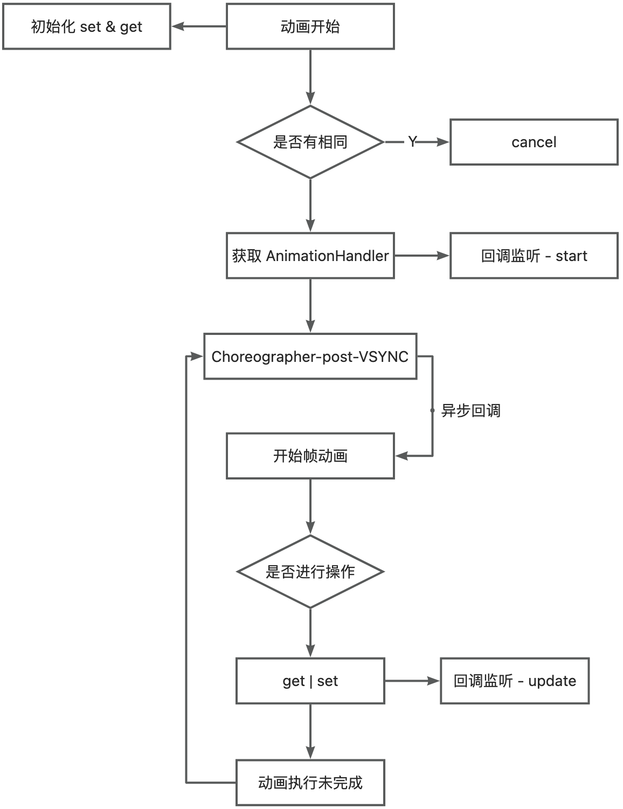
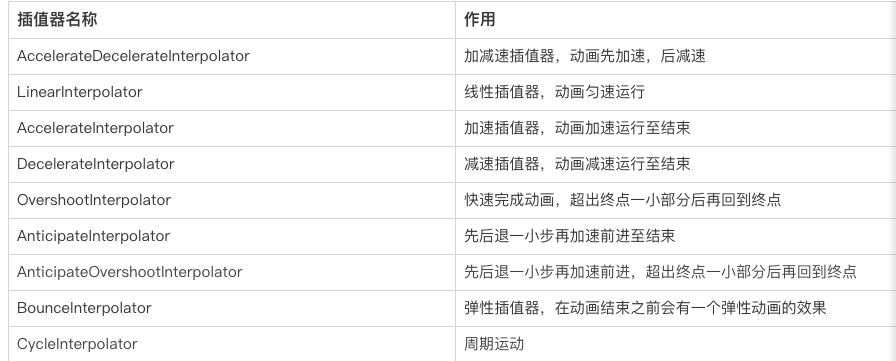

# 帧动画
通过顺序播放一系列图像实现动画效果。
### 示例
```xml
<?xml version="1.0" encoding="utf-8"?>
<animation-list xmlns:android="http://schemas.android.com/apk/res/android"
  android:oneshot="false">
  <item
    android:drawable="@mipmap/c_1"
    android:duration="50" />
  <item
    android:drawable="@mipmap/c_2"
    android:duration="50" />
  <!--  省略...  -->
  <item
    android:drawable="@mipmap/circle_19"
    android:duration="50" />
  <item
    android:drawable="@mipmap/circle_20"
    android:duration="50" />
</animation-list>
```
```java
ImageView image = (ImageView) findViewById(R.id.image);
AnimationDrawable animationDrawable = (AnimationDrawable) image.getDrawable();
animationDrawable.start();
```
<!-- more -->
# 补间动画
通过对场景里的对象不断做图像变换（透明度、缩放、平移、旋转）从而实现动画效果。
### 示例
```java
Animation translateAnimation = new TranslateAnimation(0, 100, 0, 0);
translateAnimation.setDuration(500);
translateAnimation.setInterpolator(new AccelerateInterpolator());
translateAnimation.setFillAfter(true);//设置动画结束后保持当前的位置（即不返回到动画开始前的位置）
imageView.startAnimation(translateAnimation);
```
# 属性动画
通过动态的修改对象的属性实现动画效果。属性动画分为ObjectAnimator和ValueAnimator，其中ObjectAnimator是继承于ValueAnimator。
## 优点

- 属性动画顾名思义就是改变了View的属性，而不仅仅是绘制的位置。
- 属性动画可以操作的属性相比于补间动画大大增加，除了常用的平移、旋转、缩放、透明度还有颜色等,基本上能通过View.setXX来设置的属性,属性动画都可以操作,这大大增加了我们在使用动画时的灵活性。
## ValueAnimator
ValueAnimator并不会改变属性的大小，他只是在一段时间生成某些值。我们需要做的是监听这些值得改变从而该改变View的属性，进而产生动画效果。
```java
ValueAnimator animator = ValueAnimator.ofFloat(0, 1000);  
anim.addUpdateListener(new AnimatorUpdateListener() {  
    @Override 
    public void onAnimationUpdate(ValueAnimator animation) {                
    	mView.setTranslationX(animation.getAnimatedValue());
    }  
}); 
animator.setDuration(1000).start()
```
## ObjectAnimator
在 ValueAnimator 基础上对控件的某个属性执行一次动画
```java
//相同的对mView进行平移的动画ObjectAnimator是这样实现的：
ObjectAnimator animator=ObjectAnimator.ofFloat (mView,"translationX",0,1000);
animator.setDuration (1000);
animator.start();
```
## 执行流程

### ValueAnimator.ofFloat()
```java
public static ValueAnimator ofFloat(float... values) {
	ValueAnimator anim = new ValueAnimator();
    anim.setFloatValues(values);
    return anim;
}
```
```java
public void setFloatValues(float... values) {
    if (values == null || values.length == 0) {
        return;
    }
    // 创建 PropertyValuesHolder，用来存储属性名称+属性值。如果已存在则覆盖属性值
    if (mValues == null || mValues.length == 0) {
        setValues(PropertyValuesHolder.ofFloat("", values));
    } else {
        PropertyValuesHolder valuesHolder = mValues[0];
        valuesHolder.setFloatValues(values);
    }
    // New property/values/target should cause re-initialization prior to starting
    mInitialized = false;
}
```
### ValueAnimator.start()
```java
private void start(boolean playBackwards) {
    if (Looper.myLooper() == null) {
        throw new AndroidRuntimeException("Animators may only be run on Looper threads");
    }

    //....省略
	//注册Vsync监听
    addAnimationCallback(0);

    if (mStartDelay == 0 || mSeekFraction >= 0 || mReversing) {
        //初始化动画估值器，并回调 onAnimationStart()
        startAnimation();
        if (mSeekFraction == -1) {
            //最终调用 setCurrentFraction(0).
            //setCurrentFraction() 如果动画执行中，则会调到指定百分电继续执行。传入值(0-1),2为重复一次的翻转动画的末尾。
            setCurrentPlayTime(0);
        } else {
            setCurrentFraction(mSeekFraction);
        }
    }
}
```
```java
private void addAnimationCallback(long delay) {
    // getAnimationHandler() 返回 AnimationHandler 实例（单例模式）
    getAnimationHandler().addAnimationFrameCallback(this, delay);
}
```
```java
public void addAnimationFrameCallback(final AnimationFrameCallback callback, long delay) {
    //注册获取延迟后的下一帧回调
    if (mAnimationCallbacks.size() == 0) {
        // getProvider() 创建 MyFrameCallbackProvider 实例
        getProvider().postFrameCallback(mFrameCallback);
    }
    if (!mAnimationCallbacks.contains(callback)) {
        mAnimationCallbacks.add(callback);
    }

    if (delay > 0) {
        mDelayedCallbackStartTime.put(callback, (SystemClock.uptimeMillis() + delay));
    }
}
```
```java
private final Choreographer.FrameCallback mFrameCallback = new Choreographer.FrameCallback() {
    @Override
    public void doFrame(long frameTimeNanos) {
        //回调到 ValueAnimator#doAnimationFrame(),该方法内部会调用 animateBaseOnTime()，此方法内部会调用 animateValue() 
        doAnimationFrame(getProvider().getFrameTime());
        if (mAnimationCallbacks.size() > 0) {
            getProvider().postFrameCallback(this);
        }
    }
};
```
```java
private class MyFrameCallbackProvider implements AnimationFrameCallbackProvider {

    final Choreographer mChoreographer = Choreographer.getInstance();

    @Override
    public void postFrameCallback(Choreographer.FrameCallback callback) {
        //注册监听
        mChoreographer.postFrameCallback(callback);
    }

    @Override
    public void postCommitCallback(Runnable runnable) {
        mChoreographer.postCallback(Choreographer.CALLBACK_COMMIT, runnable, null);
    }

    @Override
    public long getFrameTime() {
        return mChoreographer.getFrameTime();
    }

    @Override
    public long getFrameDelay() {
        return Choreographer.getFrameDelay();
    }

    @Override
    public void setFrameDelay(long delay) {
        Choreographer.setFrameDelay(delay);
    }
}
```
```java
private void startAnimation() {

    mAnimationEndRequested = false;
    //初始化
    initAnimation();
    mRunning = true;
    if (mSeekFraction >= 0) {
        mOverallFraction = mSeekFraction;
    } else {
        mOverallFraction = 0f;
    }
    if (mListeners != null) {
        notifyStartListeners(); //回调 AnimatorListener#onAnimationStart()
    }
}
```
```java
void initAnimation() {
    if (!mInitialized) {
        int numValues = mValues.length;
        for (int i = 0; i < numValues; ++i) {
            mValues[i].init();  //调用 PropertyValuesHolder 的 init()
        }
        mInitialized = true;
    }
}
```
```java
//设置估值器，如果没有设置则采用默认线性插值器的估值器
void init() {
    if (mEvaluator == null) {
        // We already handle int and float automatically, but not their Object
        // equivalents
        mEvaluator = (mValueType == Integer.class) ? sIntEvaluator :
                (mValueType == Float.class) ? sFloatEvaluator :
                null;
    }
    if (mEvaluator != null) {
        // KeyframeSet knows how to evaluate the common types - only give it a custom
        // evaluator if one has been set on this class
        mKeyframes.setEvaluator(mEvaluator);
    }
}
```
```java
public void setCurrentFraction(float fraction) {
    //兜底init
    initAnimation();
    fraction = clampFraction(fraction);
    mStartTimeCommitted = true; // do not allow start time to be compensated for jank
    // isPulsingInternal() 判断是否已进入动画循环
	if (isPulsingInternal()) {
        long seekTime = (long) (getScaledDuration() * fraction);
        long currentTime = AnimationUtils.currentAnimationTimeMillis();
        // Only modify the start time when the animation is running. Seek fraction will ensure
        // non-running animations skip to the correct start time.
        mStartTime = currentTime - seekTime;
    } else {
        // If the animation loop hasn't started, or during start delay, the startTime will be
        // adjusted once the delay has passed based on seek fraction.
        mSeekFraction = fraction;
    }
    mOverallFraction = fraction;
	//getCurrentIterationFraction() 计算当前迭代的分数，同时考虑是否应向后播放动画。例如，当动画在迭代中向后播放时，该迭代的分数将从 1f 变为 0f
    final float currentIterationFraction = getCurrentIterationFraction(fraction, mReversing);
    animateValue(currentIterationFraction);
}
```
```java
void animateValue(float fraction) {
    //经过插值器处理
    fraction = mInterpolator.getInterpolation(fraction);
    mCurrentFraction = fraction;
    int numValues = mValues.length;
    for (int i = 0; i < numValues; ++i) {
        // 调用 PropertyValuesHolder#calculateValue() 设置经过估值器计算的值
        mValues[i].calculateValue(fraction);
    }
    //回调 onAnimationUpdate()
    if (mUpdateListeners != null) {
        int numListeners = mUpdateListeners.size();
        for (int i = 0; i < numListeners; ++i) {
            mUpdateListeners.get(i).onAnimationUpdate(this);
        }
    }
}
```
## 插值器 Interpolator
插值器（Interpolator）用于定义动画随时间流逝的变化规律
### 系统内置插值器

### 自定义插值器
实现 TimeInterpolator 接口，重写 getInterpolation() 方法。
```java

public interface TimeInterpolator {
    // input: 表示当前动画执行比例；
    // 返回值：表示动画的完成度
    float getInterpolation(float input);
}

// 示例：AccelerateInterpolator
@Override
public float getInterpolation(float input) {
	if (mFactor == 1.0f) {
		return input * input; // 默认走这里，在 0 ~ 1 区间斜率增加。符合加速概念。
	} else {
		return (float)Math.pow(input, mDoubleFactor);
	}
}

```
## 估值器 TypeEvaluator
估值器（TypeEvaluator）的作用是定义从初始值过渡到结束值的计算规则。
### 自定义估值器
```java
public interface TypeEvaluator<T> {
    // fraction: 表示动画完成度，由插值器返回；
    // startValue: 动画的起始值；
    // endValue: 动画的结束值；
    // return: 当前完成度下计算出来的值;
	public T evaluate(float fraction, T startValue, T endValue);
}

//示例： FloatEvaluator
public class FloatEvaluator implements TypeEvaluator<Number> {
    @Override
	public Float evaluate(float fraction, Number startValue, Number endValue) {
		float startFloat = startValue.floatValue();
		return startFloat + fraction * (endValue.floatValue() - startFloat);
	}
}
```
```java
public class CharEvaluator implements TypeEvaluator<Character> {
 	@Override
 	public Character evaluate(float fraction, Character startValue, Character endValue) {
 		return (char) (startValue + (endValue - startValue) * fraction);
 	}
}

ValueAnimator anim = ValueAnimator.ofObject(new CharEvaluator(), 'A', 'Z');
anim.setDuration(500);
anim.setInterpolator(new LinearInterpolator());
anim.addUpdateListener(new ValueAnimator.AnimatorUpdateListener() {
	@Override
	public void onAnimationUpdate(ValueAnimator animation) {
		Log.d(TAG, "current character is " + animation.getAnimatedValue());
	}
});
anim.start();
```
# 推荐阅读
[Android动画绘制原理（源码解析） - 腾讯云开发者社区-腾讯云](https://cloud.tencent.com/developer/article/1634796)
