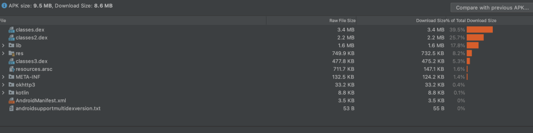
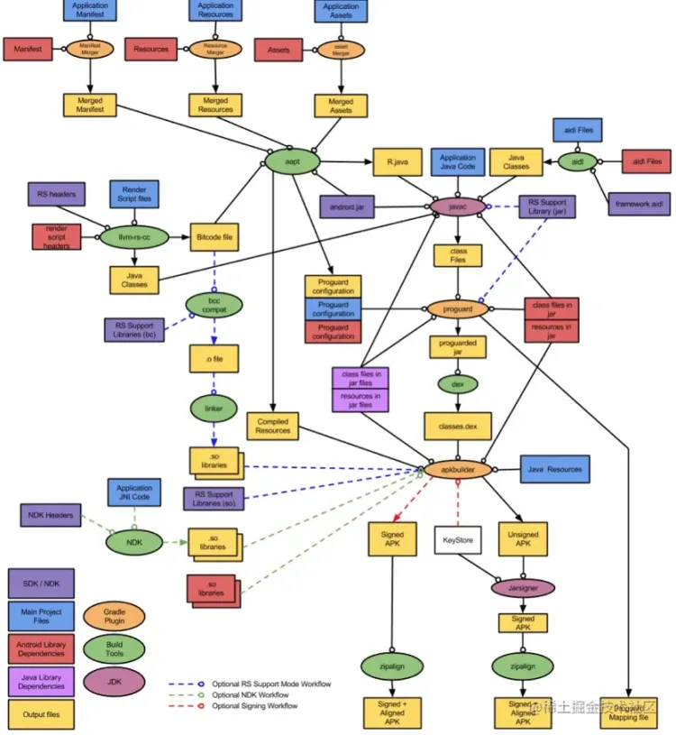
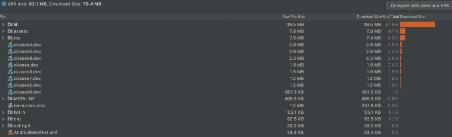

# 原因
1. 下载转化率包体积越小，用户下载等待的时间也会越短，所以下载转换成功率也就越高。同时国内应用市场使用流量下载时会有流量保护机制，如果安装包体积超过阈值，那么在下载时候便有流量安装提醒，相应的对于用户来说安装过程需要多一步操作，这也会影响用户安装的欲望。
2. 渠道商要求当 App 做大之后，可能需要和手机厂商合作预装，这些渠道商也会要求安装包体积不能超过制定阈值，同时安装包体积越大，所需 CDN 流量费用越高。
3. App 性能安装包体积越大，相应的安装时间、签名校验时间越长，运行时内存与ROM空间占用越大。

<!-- more -->
# 分析
## apk构成


- lib/

so 文件目录，可能会有armeabi、armeabi-v7a、arm64-v8a、x86、x86_64、mips。目前只需支持 armeabi-v7a、arm64-v8a 即可，后面随着应用商店64位要求落地，可删除 armeabi-v7a。

- assets/

应用资源，不会生成资源id，可使用 AssetsManager 对象获取资源。

- res/

应用资源，通过 aapt 生成资源id，并保存在 .R 文件和 resource.arsc 文件中。

- META-INF/

包含 CERT.SF 和 CERT.RSA 签名文件，以及 MANIFEST.MF 清单文件。

- .dex文件

代码编译成 .class 文件后，再经过 dex 工具编译生成一个 .dex 文件。

- resources.arsc

包含已编译的资源。此文件包含 res/values/ 文件夹的所有配置中的 XML 内容。打包工具会提取此 XML 内容，将其编译为二进制文件形式，并将相应内容进行归档。此内容包括语言字符串和样式，以及未直接包含在 resources.arsc 文件中的内容（例如布局文件和图片）的路径。
## apk打包流程

## 分析工具
### Android Studio
直接将 apk 拖进 Android Studio 中就可以自动使用 Analyze APK 打开 apk。然后就可以看到 APK 文件的绝对大小以及各组成文件的百分占比，如下图所示：<br />
可以看到该 apk 中占比最大的是 .dex 文件，其次是 lib，所以包体积优化的重点区域在 dex 优化。当然这是一个 demo 项目，并不具有标志性，下面看一个线上 apk：<br />该 apk 中占比就非常鲜明，lib 文件夹占了包体积一半以上，所以重点优化在 so 优化，其次占比较大的是 assets 和 res 两个文件夹，所以还可以对 resouces 优化。
# 优化方案
## so
### so文件缩减
根据市面上手机cpu架构分布，选择保留 armeabi-v7a 和 arm64-v8a 即可。后面各大应用商店强制要求64位后，可以考虑仅保留 arm64-v8a 即可。
```groovy
android {
    defaultConfig {
        ndk {
            abiFilters 'armeabi-v7a'
        }
    }
}
```
### 动态下发加载
与 so 压缩/解压 思路一样，在应用启动后异步下载 so 文件。具体落地可参考 [https://mp.weixin.qq.com/s/X58fK02imnNkvUMFt23OAg](https://mp.weixin.qq.com/s/X58fK02imnNkvUMFt23OAg)
### SO 压缩与解压

1.  ⼲预 gradle apk 打包流程，在 gradle merge 本地库之后，打包 apk 之前使用 XZ 或 7-Zip 将SO进行压缩，生成压缩⽂件保存到assets⽬录之下。 
2.  在默认的 lib 目录，我们只需要加载少数启动过程相关的 Library，其他的 Library 我们都在首次启动时异步解压、加载（可通过 Facebook 开源框架 SoLoader)。 
## dex
### 开启 shrink、 progurard
开启缩减、优化、混淆，移除无用的 class、字段和方法。
```groovy
android {
    buildTypes {
        release {
            // Enables code shrinking, obfuscation, and optimization for only
            // your project's release build type.
            minifyEnabled true

            // Enables resource shrinking, which is performed by the
            // Android Gradle plugin.
            shrinkResources true

            // Includes the default ProGuard rules files that are packaged with
            // the Android Gradle plugin. To learn more, go to the section about
            // R8 configuration files.
            proguardFiles getDefaultProguardFile(
                    'proguard-android-optimize.txt'),
                    'proguard-rules.pro'
        }
    }
    ...
}
```
### 去除 debug 信息与行号信息、Dex 分包优化
可借助 [ReDex](https://fbredex.com/docs/configuring) (facebook 开源黑科技) 移除 dex 中多余的 debug item 块、method id、跨dex 调用造成的冗余信息。
### 裁剪三方库

-  统一基础三方库，避免同一个功能引入多个三方库，例如：为显示图片引入 Glide、Fresco 三方库。 
-  修改三方库源码，仅保留所需功能。 
### 重复代码
使用 [Simian工具](https://link.juejin.cn/?target=https%3A%2F%2Fblog.csdn.net%2FLove667767%2Farticle%2Fdetails%2F53558382) 或者 Lint 来扫描出重复的代码。
## resource
### 图片

- 使用 tinypng 进行压缩。已有 IDEA 插件，可以搜索 TinyPngPlugin。

在 Android 的构建流程中，AAPT 会使用内置的压缩算法来优化 res/drawable/ 目录下的 PNG 图片，但这可能会导致本来已经优化过的图片体积变大，因此，可以通过在 build.gradle 中 设置 cruncherEnabled 来禁止 AAPT 来优化 PNG 图片，代码如下所示：
```groovy
aaptOptions {     
    cruncherEnabled = false 
}
```

- 启用 webp，可以将 png 转为 webp
- 启动 SVG，可以将元素不复杂的 icon 使用 SVG 引入。但需要注意如果 icon 中元素复杂，例如渐变等，在编译时会自动生成对应的全尺寸图片(mdpi~xxxhdpi)，反而会增加包体，这种可以考虑使用 webp
- 开启资源缩减。gradle 中配置 shrinkResource = true
### 资源混淆
可以接入微信团队开源的 [AndResGurad](https://github.com/shwenzhang/AndResGuard)，实现资源命名的混淆。另外也可看下 [ByteX](https://github.com/bytedance/ByteX)。
### 其他资源
#### 语言包
可以配置仅保留中文语言
```groovy
    defaultConfig {
        resConfigs("en","zh","zh-rCN")
    }
```
#### 资源文件
可以配置仅保留需要的资源文件
```groovy
    defaultConfig {
        resConfigs("xxhdpi","xxxhdpi")
    }
```
## assets
### 移除无用的 assets
可借助 Matrix 扫描无用的 assets 资源。需要注意静态 html 等资源因为没有 dex 显示持有，会出现误删问题。<br />原理：

1. 解压 apk，找到所有的 assets 资源集合 A
2. 反解 dex，获取所有的 class 引用的 assets 集合B
3. 取 A 与 B 的差集，即为无用 assets
## 其他方案

- 避免使用枚举。如果可能，请考虑使用 `@IntDef` 注释和 [代码缩减](https://link.juejin.cn/?target=https%3A%2F%2Fdeveloper.android.com%2Fstudio%2Fbuild%2Fshrink-code%3Fhl%3Dzh-cn) 移除枚举并将它们转换为整数。此类型转换可保留枚举的各种安全优势。
- 移除无用的三方库。
- 合并重复的三方库。例如：同时引入了 Glide 和 Picasso，此时可以保留一个即可。
- 将一些非重交互的界面通过 h5 或小程序来实现。
- 针对需求大小与引入 so 对比，可以砍掉 ROI 太低的需求。
- 避免因为一个小功能引入整个库，可以自己定制。例如：要用一个工具类，结果引入了一整个 utils 库。
- 插件化、App Bundle
# 监测

- [腾讯开源工具 Matrix](https://github.com/Tencent/matrix)
- [谷歌开源工具 Android-classyshark](https://github.com/google/android-classyshark)

包体积的监控，主要可以从如下 **三个纬度** 来进行：

- 1）、**大小监控：通常是记录当前版本与上一个或几个版本直接的变化情况，如果当前版本体积增长较大，则需要分析具体原因，看是否有优化空间**。
- 2）、**依赖监控：包括J ar、aar 依赖**。
- 3）、**规则监控：我们可以把包体积的监控抽象为无用资源、大文件、重复文件、R 文件等这些规则**。

包体积的 **大小监控** 和 **依赖监控** 都很容易实现，而要实现 **规则监控** 却得花不少功夫，幸运的是 **Matrix** 中的 [ApkChecker](https://github.com/Tencent/matrix/wiki/Matrix-Android-ApkChecker) 就实现了包体积的规则监控。
# 推荐阅读

- [官方应用缩减指南](https://developer.android.com/studio/build/shrink-code#shrink-resources)
- [Android 包体优化方案](https://juejin.cn/post/7016225898768629773)/ [Android 包体优化保姆方案](https://juejin.cn/post/7116089040264232967)
- [深入探索 Android 包体积优化（匠心制作-上） - 掘金](https://juejin.cn/post/6844904103131234311)
- [包体积优化 · 方法论 · 揭开包体积优化神秘面纱 - 掘金](https://juejin.cn/post/7177195746272215098)
- [Android修炼系列（22），我的 apk 瘦身知识点 - 掘金](https://juejin.cn/post/6992903024632938526)
- [https://time.geekbang.org/column/article/81202](https://time.geekbang.org/column/article/81202)
## 拓展阅读

- [支付宝 App 构建优化解析：Android 包大小极致压缩](https://juejin.cn/post/6844903712201277448)
- [Android 中 mmap 原理即应用简析](https://www.jianshu.com/p/71c9b73d788e)
- [Android混淆从入门到精通](https://www.jianshu.com/p/7436a1a32891)


