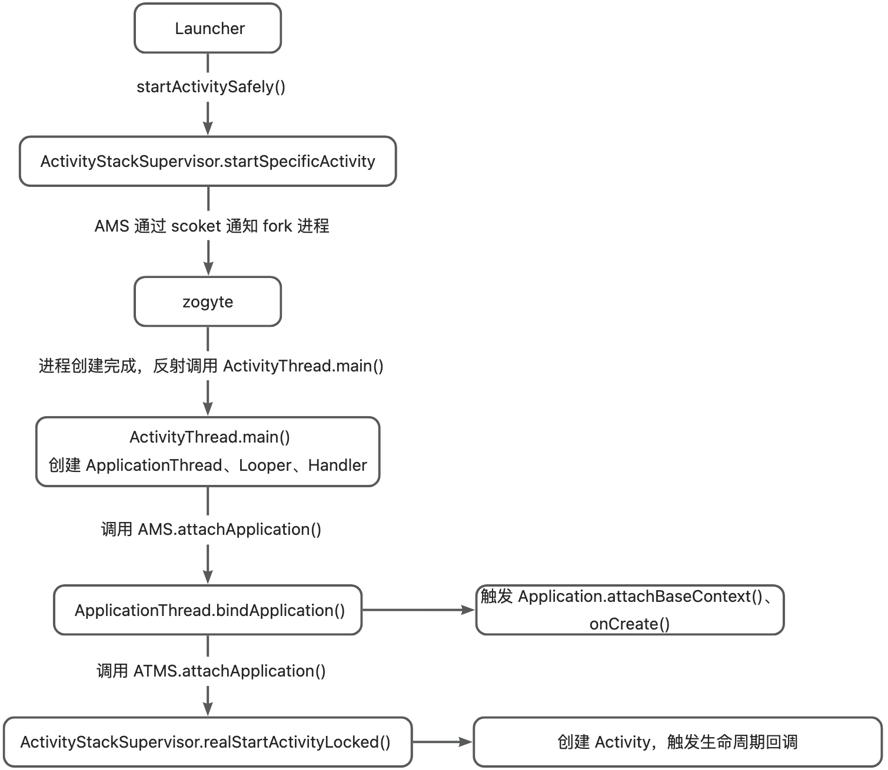
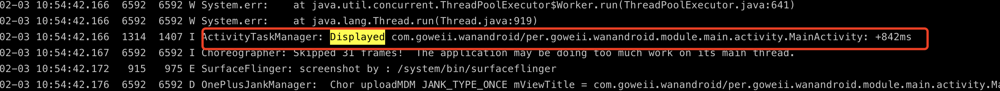
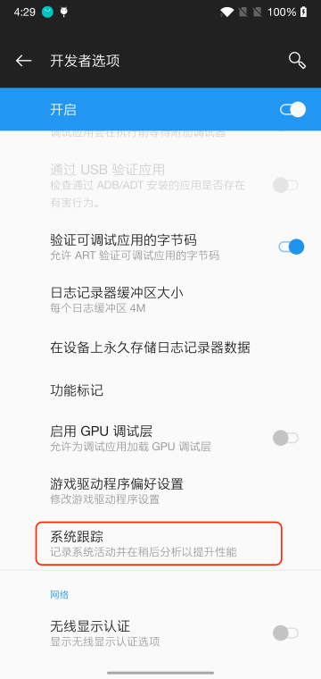
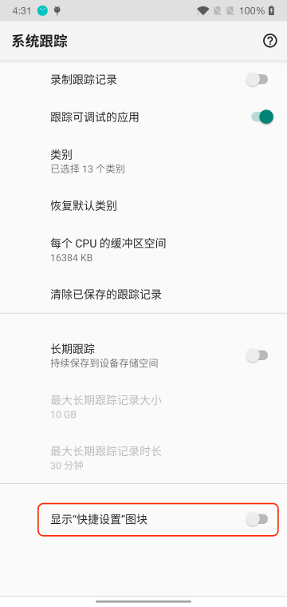
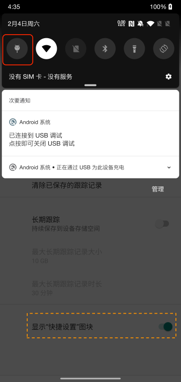
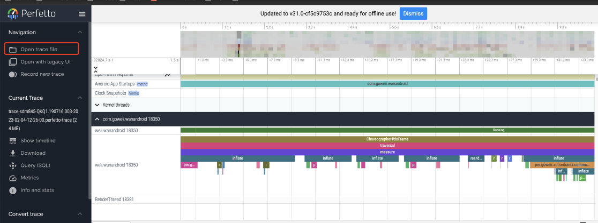
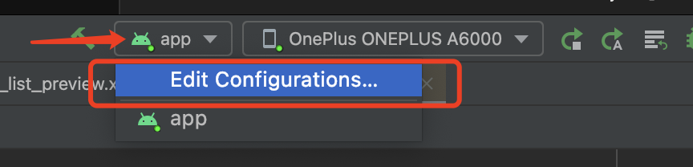
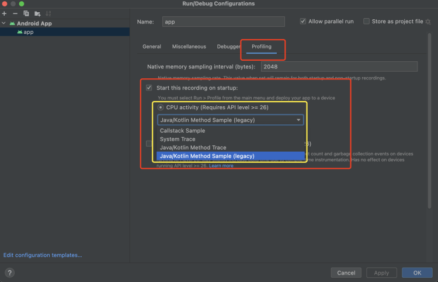

# 应用启动状态
## 冷启动
冷启动的情况包括用户主动杀死后首次启动，或系统终止应用后首次启动。整个启动过程如下图所示：<br /><br />
<!-- more -->
简单理解可分为三个阶段：

- 点击应用 icon，调用 Launcher.startActivitySafely() 来启动 Activity，在启动过程中发现进程未创建，则调用 AMS 通知 zogyte fork 应用进程。
- 应用进程创建完毕后，调用 ActivityThread.main()，创建 ApplicationThread、Looper、Handler。
- 调用 AMS.attachApplication()，用于创建 Application 和 创建并启动 Activity。

**现实场景举例：**用户进入任务管理界面(如小米手机叫"最近任务")，手动划掉杀死应用，下次点击应用 icon 重新启动，此时为冷启动。
## 温启动

- 用户在退出应用后又重新启动应用。进程可能已继续运行，但应用必须通过调用 onCreate() 从头开始重新创建 activity。
- 系统将您的应用从内存中逐出，然后用户又重新启动它。进程和 activity 需要重启，但传递到 onCreate() 的已保存的实例 state bundle 对于完成此任务有一定助益。

**现实场景举例：**用户连续点击返回按钮回到桌面后，下次点击应用 icon 重新启动，此时为温启动。
## 热启动
在热启动中，系统的所有工作就是将您的 activity 带到前台。只要应用的所有 activity 仍驻留在内存中，应用就不必重复执行对象初始化、布局膨胀和呈现。<br />**现实场景举例：**用户直接点击 home 按钮回调桌面后，下次点击应用 icon 重新回到应用，此时为热启动。
# 检测工具
## 基础检测方式
该方式只能获取启动耗时时间，无法获取具体的耗时堆栈信息。启动耗时时间是指进程初始化（如果是冷启动）、activity 创建（如果是冷启动/温启动）以及显示第一帧。
### 日志过滤
启动应用后，可在 logcat 中过滤关键字 'Displayed' ，查看启动耗时：<br /><br />或者通过 AndroidStudio 启动查看日志（注意要选择 **No Filters**)，搜索关键词 'Displayed'：<br />![image.png]../images/启动优化/3.png)
### ADB Shell
```shell
adb shell am start -W [packageName]/[packageName.xActivity]

#示例：
adb shell am start -W com.goweii.wanandroid/per.goweii.wanandroid.module.main.activity.MainActivity
```
执行得到如下结果：<br />![image.png]../images/启动优化/4.png)
## 详细检测方式
### Systrace/Perfetto
#### Systrace:
Systrace 是平台提供的旧版命令行工具，可记录短时间内的设备活动，并保存在压缩的文本文件中。该工具会生成一份报告，其中汇总了 Android 内核中的数据，例如 CPU 调度程序、磁盘活动和应用线程。Systrace 适用于 Android 4.3（API 级别 18）及更高版本的所有平台版本。
> 谷歌官方在22年3月发布的33.0.1版本的platform-tools包中移除了systrace，而最后一个含有systrace的platform-tools版本是33.0.0。
> 详细使用方式可参考官方文档：[在命令行上捕获系统跟踪记录 | Android 开发者 | Android Developers](https://developer.android.google.cn/topic/performance/tracing/command-line?hl=zh-cn)

#### Perfetto
Perfetto 是 Android 10 中引入的平台级跟踪工具。与 Systrace 不同，它提供数据源超集，可让您以协议缓冲区二进制流形式记录任意长度的跟踪记录。建议将 Perfetto 用于运行 Android 10 及更高版本的设备。
##### 使用方式：
###### 开启系统追踪

1. 开启开发者选项。
2. 打开**开发者选项**设置屏幕。
3. 在**调试**部分中，选择**系统跟踪**。如图1 所示。
4. 在应用菜单中，启用**显示“快捷设置”图块**，系统会将“系统跟踪”图块添加到**快捷设置**面板中。如图2 所示。
5. 点击**快捷设置**面板中的**“系统追踪”图块**，开启录制跟踪记录。如图3 所示。
6. 再次点击**“系统追踪”图块**，结束录制。跟踪记录保存在"/data/local/traces"路径下。



###### 分析系统追踪

1. 导出追踪记录。
```shell
adb pull /data/local/traces/
```

2. 使用 Perfetto 官方解析查看。[https://ui.perfetto.dev/](https://ui.perfetto.dev/)


> 详细使用方式可参考官方文档： [捕获设备上的系统跟踪记录 | Android 开发者 | Android Developers](https://developer.android.google.cn/topic/performance/tracing/on-device?hl=zh-cn)

### Profiler
> 用于替代 TraceView 的检测工具，支持 Android Studio 3.2 及以上版本，目前 Traceview 已被弃用。
> Traceview 使用可参考官方文档：[使用 Traceview 检查跟踪日志 | Android 开发者 | Android Developers](https://developer.android.google.cn/studio/profile/traceview?hl=zh_cn)

#### 追踪应用启动CPU活动

1. 选择 **Run > Edit Configurations**。



2. 在 **Profiling** 标签中，勾选 **Start recording a method trace on startup** 旁边的复选框。

"CPU activity"可选项：

      - Callstack Sample : 记录 Java/Kotlin 和原生代码的调用堆栈。
      - System Trace：检查**应用与系统资源的交互情况**；查看所有**核心的CPU瓶颈**；**内部采用systrace**，也可以使用systrace命令。
      - Java/Kotlin Method Trace : 记录每个方法的时间、CPU信息。对运行时性能影响较大。
      - Java/Kotlin Method Sample：相比于Java/Kotlin Method Trace会记录每个方法的时间、CPU信息，它**会在应用的Java代码执行期间频繁捕获应用的调用堆栈**，对运行时性能的影响比较小，**能够记录更大的数据区域**。



3. 将应用部署到搭载 Android 8.0（API 级别 26）或更高版本的设备。


> 详细使用方式可参考官方文档： [使用 CPU 性能分析器检查 CPU 活动 | Android 开发者 | Android Developers](https://developer.android.google.cn/studio/profile/cpu-profiler?hl=zh-cn)

# 优化手段
## 闪屏页优化
使用Activity的windowBackground主题属性预先设置一个启动图片（layer-list实现），在启动后，在Activity的onCreate()方法中的super.onCreate()前再setTheme(R.style.AppTheme)。
```xml
<!-- AndroidManifest.xml -->
<activity
    android:name=".module.main.activity.MainActivity"
    android:configChanges="keyboard|keyboardHidden|screenSize|fontScale|density|orientation"
    android:theme="@style/AppTheme.Main">
    <intent-filter>
        <action android:name="android.intent.action.MAIN" />
        <category android:name="android.intent.category.LAUNCHER" />
    </intent-filter>
</activity>


<!-- themes.xml -->
<style name="AppTheme.Main">
  <item name="android:windowBackground">@drawable/splash_bg</item>
</style>


<!-- splash_bg.xml -->
<layer-list xmlns:android="http://schemas.android.com/apk/res/android"
    xmlns:tools="http://schemas.android.com/tools">

    <item>
        <shape>
            <size
                tools:height="360dp"
                tools:width="360dp" />
            <solid android:color="#73a3f5" />
        </shape>
    </item>

    <item>
        <bitmap
            android:gravity="center"
            android:src="@drawable/logo"
            android:tint="#FFFFFF" />
    </item>

</layer-list>
```
## 初始化任务优化
### 三方库懒初始化
针对在启动后不会立即使用的第三方库，可等到需要使用时再初始化。
### 异步初始化
#### Android异步方式：

1. Thread
   - 最简单、常见的异步方式。
   - 不易复用，频繁创建及销毁开销大。
   - 复杂场景不易使用。
2. HandlerThread
   - 自带消息循环的线程。
   - 串行执行。
   - 长时间运行，不断从队列中获取任务。
3. IntentService
   - 继承自Service在内部创建HandlerThread。
   - 异步，不占用主线程。
   - 优先级较高，不易被系统Kill。
4. AsyncTask
   - Android提供的工具类。
   - 无需自己处理线程切换。
   - 需注意版本不一致问题（API 14以上解决）
5. 线程池
   - Java提供的线程池。
   - 易复用，减少频繁创建、销毁的时间。
   - 功能强大，如定时、任务队列、并发数控制等。
6. RxJava
   - 由强大的调度器Scheduler集合提供。
   - 不同类型的Scheduler：
      - IO
      - Computation

**异步方式总结**

- 推荐度：从后往前排列。
- 正确场景选择正确的方式。
#### 异步启动器
核心流程：

1. **任务Task化，启动逻辑抽象成Task**（Task即对应一个个的初始化任务）。
2. **根据所有任务依赖关系排序生成一个有向无环图**：例如上述说到的推送SDK初始化任务需要依赖于获取设备id的初始化任务，各个任务之间都可能存在依赖关系，所以将它们的依赖关系排序生成一个有向无环图能将**并行效率最大化**。
3. **多线程按照排序后的优先级依次执行**：例如必须先初始化获取设备id的初始化任务，才能去进行推送SDK的初始化任务。
### 延迟初始化
利用IdleHandler特性，**在CPU空闲时执行，对延迟任务进行分批初始化**。<br />触发时机可在闪屏广告页监听 onWindowFocusChanged() 向 IdelHandler 中添加任务。
### 总结：

- **能异步的task我们会优先使用异步启动器在Application的onCreate方法中加载（或者是必须在Application的onCreate方法完成前必须执行完的非异task务）。**
- **对于不能异步的task，我们可以利用延迟启动器进行加载。**
- **如果任务可以到用时再加载，可以使用懒加载的方式**。
## IO优化

- 启动过程**不建议出现网络IO**。如闪屏广告，可提前下载。
- 为了**只解析启动过程中用到的数据**，应**选择合适的数据结构**，如将ArrayMap改造成支持随机读写、延时解析的数据存储结构以替代SharePreference。
## ContentProvider 优化
这里主要是针对一些三方库利用 contentProvider 实现自动初始化，当这种初始化方式多了之后ContentProvider 本身的创建、生命周期执行等堆积起来也会非常耗时。我们可以通过 **JetPack 提供的 Startup** 将多个初始化的 ContentProvider 聚合成一个来进行优化。
# 监控
## 建议监控指标

- 快开慢开比。例如 2 秒快开比、5 秒慢开比，我们可以看到有多少比例的用户体验非常好，多少比例的用户比较槽糕。
- 90% 用户的启动时间。如果 90% 的用户启动时间都小于 5 秒，那么我们 90% 区间启动耗时就是 5 秒。
# 参考资料：
[https://developer.android.com/topic/performance/vitals/launch-time?hl=zh-cn#time-full](https://developer.android.com/topic/performance/vitals/launch-time?hl=zh-cn#time-full)<br />[07 | 启动优化（上）：从启动过程看启动速度优化-极客时间](https://time.geekbang.org/column/article/73651)<br />[抖音 Android 性能优化系列：启动优化实践 | HeapDump性能社区](https://heapdump.cn/article/3624814)<br />[深入探索Android启动速度优化（上） - 掘金](https://juejin.cn/post/6844904093786308622#heading-0)<br />[APP冷启动优化：如何使用好工具【Perfetto\ systrace \MethodTracing】 - 掘金](https://juejin.cn/post/7024387231104106503#heading-3)<br />[雪球 Android App 秒开实践 - 掘金](https://juejin.cn/post/7081606242212413447#heading-1)<br />[Android 启动优化（四）- AnchorTask 是怎么实现的](https://mp.weixin.qq.com/s?__biz=MzUzODQxMzYxNQ==&mid=2247485016&idx=1&sn=196c5e8d130c8e8111c8841782aec607&scene=21#wechat_redirect)
