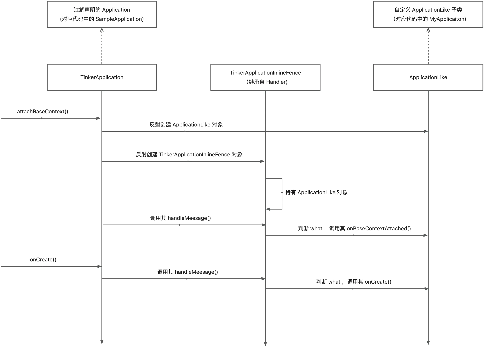

> **声明：源码基于 Tinker SDK 1.9.14.21 版本。**

Tinker 为了能实现对 Application 中代码热修复，建议我们删除自己的 Application，选择继承自 ApplicationLike 类，将原 Application 中逻辑放到该继承类下。那么 Tinker 如何实现对 Application 的代理呢？或者说我们的 ApplicationLike 继承类何时被调用的？下面我们带着疑问来看下 Tinker 的源码。<br />首先先看下如何继承 ApplicaitonLike 的。<br />按照 Tinker 建议，通过注解来配置，并继承自 DefalutApplicationLike 类。并将注解中声明的 "application" 添加到 AndroidManifest.xml 中。
```java
@DefaultLifeCycle(
        application = "com.stefan.SampleApplication",
        flags = ShareConstants.TINKER_ENABLE_ALL,
        loadVerifyFlag = false
)
public class MyApplication extends DefaultApplicationLike {

    public MyApplication(Application application, int tinkerFlags, boolean tinkerLoadVerifyFlag, long applicationStartElapsedTime, long applicationStartMillisTime, Intent tinkerResultIntent) {
        super(application, tinkerFlags, tinkerLoadVerifyFlag, applicationStartElapsedTime, applicationStartMillisTime, tinkerResultIntent);
    }

    @Override
    public void onBaseContextAttached(Context base) {
        super.onBaseContextAttached(base);
        //....
    }

        @Override
    public void onCreate() {
        super.onCreate( );
        //...
    }
    
}
```
<!-- more -->
```xml
<manifest xmlns:android="http://schemas.android.com/apk/res/android"
    xmlns:tools="http://schemas.android.com/tools"
    package="com.stefan">
  <application
        android:name=".SampleApplication">
  </application>
</manifest>
```
这里通过 APT + 注解配置，Tinker 自动生成了 SampleApplication 类。
```java
public class SampleApplication extends TinkerApplication {

    public SampleApplication() {
        /**
         * tinkerFlags: 对应注解中的 flags。运行时支持的补丁包中的文件类型。
         * delegateClassName: 对应注解中的 application。Application代理类。
    	 * loaderClassName: 默认值。加载Tinker的类。
         * tinkerLoadVerifyFlag: 默认值 false。为 true 时表示强制每次加载时校验 Tinker 文件 MD5
    	 * useDelegateLastClassLoader: 默认值 false。为 true 时表示使用 DelegateLastClassLoader，为 false 表示使用 TinkerClassLoader
         */
        super(15, "com.stefan.MyApplication", "com.tencent.tinker.loader.TinkerLoader", false, false);
    }

}
```
通过上面的操作（创建 SampleApplication、在 AndroidManifest.xml 中声明）可以知道，应用启动最终运行的是 SampleApplication（实际为 TinkerApplication）。<br />下面我们看下 TinkerApplication 中的实现。（里面肯定有关于 ApplicationLike 的操作）
```java
public abstract class TinkerApplication extends Application {
    protected TinkerApplication(int tinkerFlags, String delegateClassName,
                                String loaderClassName, boolean tinkerLoadVerifyFlag,
                                boolean useDelegateLastClassLoader) {
        this.tinkerFlags = tinkerFlags;
        this.delegateClassName = delegateClassName;
        this.loaderClassName = loaderClassName;
        this.tinkerLoadVerifyFlag = tinkerLoadVerifyFlag;
        this.useDelegateLastClassLoader = useDelegateLastClassLoader;
    }

    /**
     * 该方法通过反射分别创建了 ApplicationLike、TinkerApplicationInlineFence 对象。
     * TinkerApplicationInlineFence 即为通信的 Handler，它持有 ApplicationLike 对象，这样就实现了 Application -> ApplicationLike 的通信。
     */
    private Handler createInlineFence(Application app,
                                      int tinkerFlags,
                                      String delegateClassName,
                                      boolean tinkerLoadVerifyFlag,
                                      long applicationStartElapsedTime,
                                      long applicationStartMillisTime,
                                      Intent resultIntent) {
        try {
            // Use reflection to create the delegate so it doesn't need to go into the primary dex.
            // And we can also patch it
            final Class<?> delegateClass = Class.forName(delegateClassName, false, mCurrentClassLoader);
            final Constructor<?> constructor = delegateClass.getConstructor(Application.class, int.class, boolean.class,
                    long.class, long.class, Intent.class);
            final Object appLike = constructor.newInstance(app, tinkerFlags, tinkerLoadVerifyFlag,
                    applicationStartElapsedTime, applicationStartMillisTime, resultIntent);
            final Class<?> inlineFenceClass = Class.forName(
                    "com.tencent.tinker.entry.TinkerApplicationInlineFence", false, mCurrentClassLoader);
            final Class<?> appLikeClass = Class.forName(
                    "com.tencent.tinker.entry.ApplicationLike", false, mCurrentClassLoader);
            final Constructor<?> inlineFenceCtor = inlineFenceClass.getConstructor(appLikeClass);
            inlineFenceCtor.setAccessible(true);
            return (Handler) inlineFenceCtor.newInstance(appLike);
        } catch (Throwable thr) {
            throw new TinkerRuntimeException("createInlineFence failed", thr);
        }
    }

    protected void onBaseContextAttached(Context base, long applicationStartElapsedTime, long applicationStartMillisTime) {
        //该方法在加载patch时会详解，这里可以理解为创建了一个 Intent。
        loadTinker();
        mCurrentClassLoader = base.getClassLoader();
        // 创建了一个 Handler 用于告知声明周期变化。
        mInlineFence = createInlineFence(this, tinkerFlags, delegateClassName,
                tinkerLoadVerifyFlag, applicationStartElapsedTime, applicationStartMillisTime,
                tinkerResultIntent);
        //告知 ApplicationLike 生命周期。
        TinkerInlineFenceAction.callOnBaseContextAttached(mInlineFence, base);
    }

    @Override
    protected void attachBaseContext(Context base) {
        super.attachBaseContext(base);
        final long applicationStartElapsedTime = SystemClock.elapsedRealtime();
        final long applicationStartMillisTime = System.currentTimeMillis();
        onBaseContextAttached(base, applicationStartElapsedTime, applicationStartMillisTime);
    }

    @Override
    public void onCreate() {
        super.onCreate();
        if (mInlineFence == null) {
            return;
        }
        TinkerInlineFenceAction.callOnCreate(mInlineFence);
    }

    @Override
    public void onConfigurationChanged(Configuration newConfig) {
        super.onConfigurationChanged(newConfig);
        if (mInlineFence == null) {
            return;
        }
        TinkerInlineFenceAction.callOnConfigurationChanged(mInlineFence, newConfig);
    }
    //....
}
```
```java
//消息中介
public final class TinkerApplicationInlineFence extends Handler {
    
    @Override
    public void handleMessage(Message msg) {
        handleMessage_$noinline$(msg);
    }
    
    private void handleMessage_$noinline$(Message msg) {
        handleMessageImpl(msg);
    }
    private void handleMessageImpl(Message msg) {
        switch (msg.what) {
            case ACTION_ON_BASE_CONTEXT_ATTACHED: {
                mAppLike.onBaseContextAttached((Context) msg.obj);
                break;
            }
            //...
        }
    }
}
```
上面代码注释已经非常清晰，简单总结一下：

- 通过注解生成 TinkerApplication 子类，并在 AndroidManifest.xml 中生命。
- 自定义 ApplicationLike 子类，实现原 Application 中初始化等逻辑。
- 应用启动后走 TinkerApplication 中的 attachBaseContext()，内部通过反射构造了 ApplicationLike 和 TinkerApplicationInlineFence(继承 Handler)对象，并且 TinkerApplicationInlineFence 持有 ApplicationLike 对象。
- 至此后面 TinkerApplication 的生命周期方法都会调用 TinkerApplicationInlineFence，转发到 ApplicationLike。从而实现了对 Application 的代理。

不清晰？来一张图就明白了！<br />
