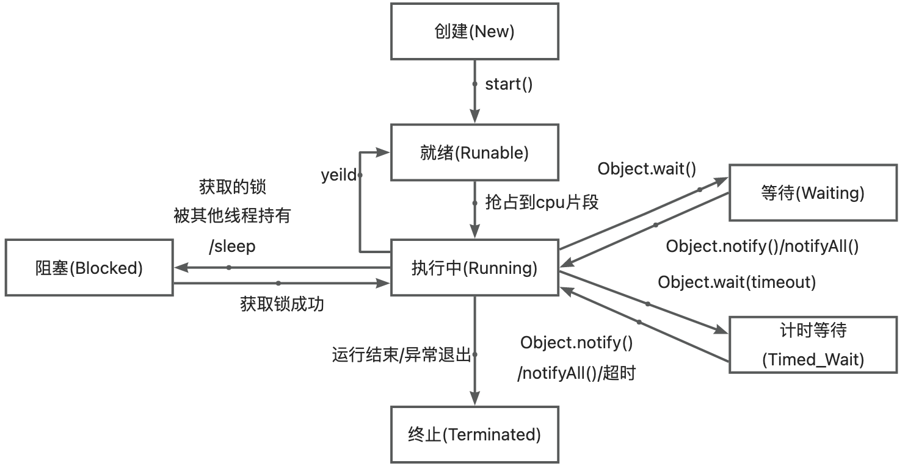
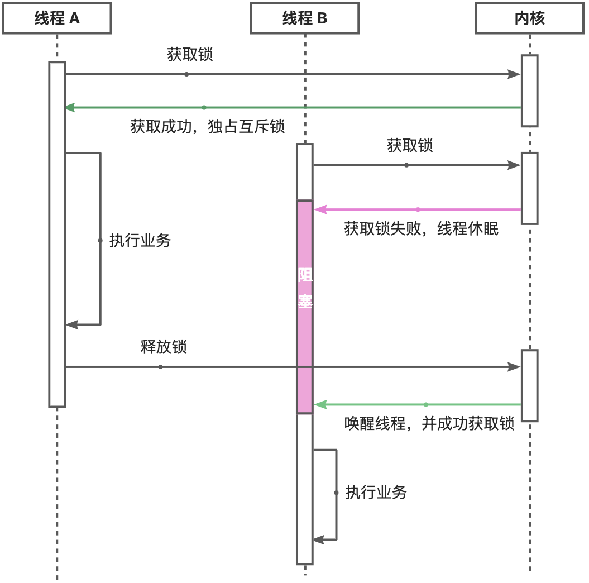
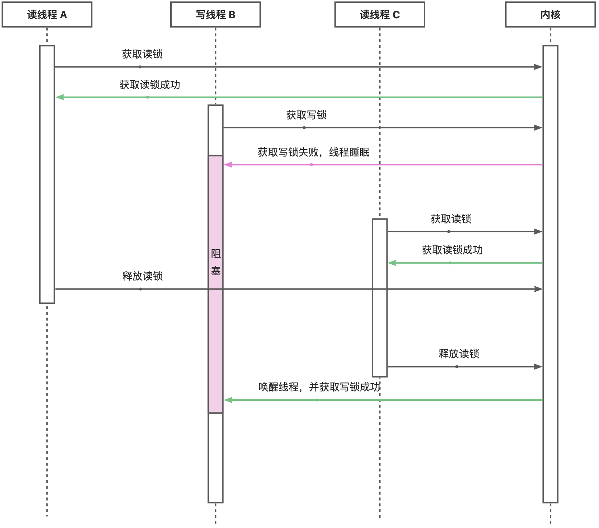
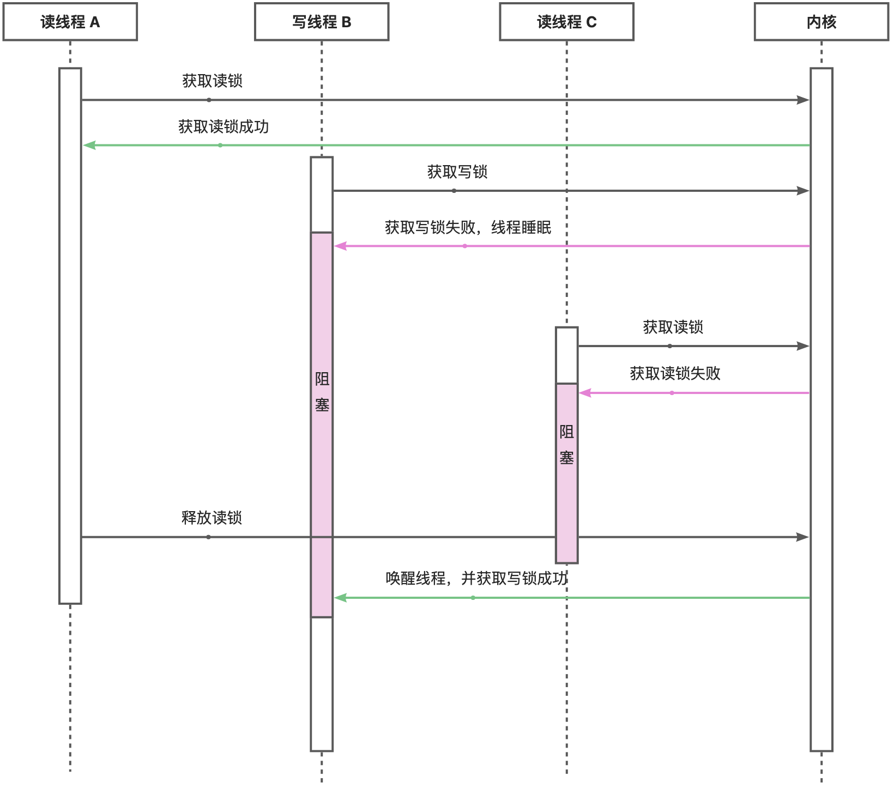

# 线程
## 线程&进程

- 线程是系统最小的调度单位，系统按线程分配 CPU 资源，按进程分配除 CPU 以外的系统资源(主存、外设、文件)。
- JVM 会等待普通线程执行完毕，不会等待守护线程。
- 若线程执行发生异常会释放锁。
- 线程切换：CPU控制权由一个运行态的线程转交给另一个就绪态线程（需从用户态到内核态切换）。
- 一对一线程模型：Java 语言层面的线程会对应一个内核线程。
- 抢占式的线程调度，即有系统决定每个线程可以被分配到多少执行时间。
## 线程生命周期


<!-- more -->

## sleep/yeild/wait

- sleep：线程进入阻塞态，但不释放锁，会触发线程调度。
- yeild：线程进入就绪态，主动让出 CPU，不会释放锁，发生一次线程调度，同优先级或更高优先级的线程有机会执行。
- wait：线程进入阻塞态，释放锁（必须先获取锁）
## 中断线程/守护线程

- 中断线程：
   - 不会真正中断正在执行的线程，只是标记一个中断状态。
   - 当前线程处于阻塞态，则会收到 InterruptedException，可以在 catch 中执行相应逻辑。
   - 若线程想响应中断，则需要检查中断标记，主动停止，或者正常处理 InterruptedException。
```java
Thread.interrupt() //中断
Thread.isInterrupted() //查看线程中断状态
```

- 守护线程：守护线程不属于程序中不可或缺的部分，如果用户线程全部退出，JVM 不会等待守护线程退出，而是直接退出。
```java
Thread thread = new Thread()；
thread.setDaemon(true)；//需要保证在 start() 之前设置为守护线程
thread.start()；
```
# 锁
## 互斥锁
互斥锁加锁失败后，线程会释放 CPU，给其他线程，当前线程进入阻塞。所以互斥锁加锁失败时，会从用户态陷入到内核态，让内核帮我们切换线程，虽然简化了使用锁的难度，但存在一定的性能开销成本。<br />
那这个开销成本是什么呢？会有两次线程上下文切换的成本：

- 当线程加锁失败时，内核会把线程的状态从「运行」状态设置为「睡眠」状态，然后把 CPU 切换给其他线程运行；
- 接着，当锁被释放时，之前「睡眠」状态的线程会变为「就绪」状态，然后内核会在合适的时间，把 CPU 切换给该线程运行。

线程的上下文切换的是什么？当两个线程是属于同一个进程，因为虚拟内存是共享的，所以在切换时，虚拟内存这些资源就保持不动，只需要切换线程的私有数据、寄存器等不共享的数据。<br />
上下切换的耗时有大佬统计过，大概在几十纳秒到几微秒之间，如果你锁住的代码执行时间比较短，那可能上下文切换的时间都比你锁住的代码执行时间还要长。<br />
所以，如果你能确定被锁住的代码执行时间很短，就不应该用互斥锁，而应该选用自旋锁，否则使用互斥锁。<br />
## 自旋锁
自旋锁是通过 CPU 提供的 CAS 函数（_Compare And Swap_），在「用户态」完成加锁和解锁操作，不会主动产生线程上下文切换，所以相比互斥锁来说，会快一些，开销也小一些。<br />
一般加锁的过程，包含两个步骤：

- 第一步，查看锁的状态，如果锁是空闲的，则执行第二步；
- 第二步，将锁设置为当前线程持有；

CAS 函数就把这两个步骤合并成一条硬件级指令，形成原子指令，这样就保证了这两个步骤是不可分割的，要么一次性执行完两个步骤，要么两个步骤都不执行。<br />
使用自旋锁的时候，当发生多线程竞争锁的情况，加锁失败的线程会「忙等待」，直到它拿到锁。这里的「忙等待」可以用 while 循环等待实现，不过最好是使用 CPU 提供的 PAUSE 指令来实现「忙等待」，因为可以减少循环等待时的耗电量。<br />
自旋锁是最比较简单的一种锁，一直自旋，利用 CPU 周期，直到锁可用。需要注意，在单核 CPU 上，需要抢占式的调度器（即不断通过时钟中断一个线程，运行其他线程）。否则，自旋锁在单 CPU 上无法使用，因为一个自旋的线程永远不会放弃 CPU。<br />
自旋锁开销少，在多核系统下一般不会主动产生线程切换，适合异步、协程等在用户态切换请求的编程方式，但如果被锁住的代码执行时间过长，自旋的线程会长时间占用 CPU 资源，所以自旋的时间和被锁住的代码执行的时间是成「正比」的关系，我们需要清楚的知道这一点。<br />
自旋锁与互斥锁使用层面比较相似，但实现层面上完全不同：当加锁失败时，互斥锁用「线程切换」来应对，自旋锁则用「忙等待」来应对。
## 可重入锁
可重入锁： JVM允许同一个线程重复获取同一个锁，这种能被同一个线程反复获取的锁。<br />
由于Java的线程锁是可重入锁，所以，获取锁的时候，不但要判断是否是第一次获取，还要记录这是第几次获取。每获取一次锁，记录+1，每退出synchronized块，记录-1，减到0的时候，才会真正释放锁。
## 乐观锁/悲观锁

- 悲观锁做事比较悲观，它认为多线程同时修改共享资源的概率比较高，于是很容易出现冲突，所以访问共享资源前，先要上锁。
- 乐观锁做事比较乐观，它假定冲突的概率很低，它的工作方式是：先修改完共享资源，再验证这段时间内有没有发生冲突，如果没有其他线程在修改资源，那么操作完成，如果发现有其他线程已经修改过这个资源，就放弃本次操作。

我们常见的 SVN 和 Git 也是用了乐观锁的思想，先让用户编辑代码，然后提交的时候，通过版本号来判断是否产生了冲突，发生了冲突的地方，需要我们自己修改后，再重新提交。<br />
乐观锁虽然去除了加锁解锁的操作，但是一旦发生冲突，重试的成本非常高，所以只有在冲突概率非常低，且加锁成本非常高的场景时，才考虑使用乐观锁。
## 读写锁(ReadWriteLock)
读写锁的工作原理是：

- 当「写锁」没有被线程持有时，多个线程能够并发地持有读锁，这大大提高了共享资源的访问效率，因为「读锁」是用于读取共享资源的场景，所以多个线程同时持有读锁也不会破坏共享资源的数据。
- 但是，一旦「写锁」被线程持有后，读线程的获取读锁的操作会被阻塞，而且其他写线程的获取写锁的操作也会被阻塞。
```java
//示例
public class Counter {
    private final ReadWriteLock rwlock = new ReentrantReadWriteLock();
    private final Lock rlock = rwlock.readLock();
    private final Lock wlock = rwlock.writeLock();
    private int[] counts = new int[10];

    public void inc(int index) {
        wlock.lock(); // 加写锁
        try {
            counts[index] += 1;
        } finally {
            wlock.unlock(); // 释放写锁
        }
    }

    public int[] get() {
        rlock.lock(); // 加读锁
        try {
            return Arrays.copyOf(counts, counts.length);
        } finally {
            rlock.unlock(); // 释放读锁
        }
    }
}
```
### 读优先锁
读锁能被更多的线程持有，以便提高读线程的并发性，它的工作方式是：当读线程 A 先持有了读锁，写线程 B 在获取写锁的时候，会被阻塞，并且在阻塞过程中，后续来的读线程 C 仍然可以成功获取读锁，最后直到读线程 A 和 C 释放读锁后，写线程 B 才可以成功获取读锁。如下图：<br />

### 写优先锁
写优先锁是优先服务写线程，其工作方式是：当读线程 A 先持有了读锁，写线程 B 在获取写锁的时候，会被阻塞，并且在阻塞过程中，后续来的读线程 C 获取读锁时会失败，于是读线程 C 将被阻塞在获取读锁的操作，这样只要读线程 A 释放读锁后，写线程 B 就可以成功获取读锁。如下图：<br />

### 公平读写锁
不管读优先锁，还是写优先锁，都会出现另一方的"饿死"问题，基于这个问题，可以搞一个公平读写锁。一种简单的方式：用队列把获取锁的线程排队，不管是写线程还是读线程都按照先进先出的原则加锁即可，这样读线程仍然可以并发，也不会出现「饥饿」的现象。
## StampedLock
ReadWriteLock 有个潜在的问题：如果有线程正在读，写线程需要等待读线程释放锁后才能获取写锁，即读的过程中不允许写，这是一种悲观的读锁。<br />
StampedLock 和 ReadWriteLock 相比，改进之处在于：读的过程中也允许获取写锁后写入！这样一来，我们读的数据就可能不一致，所以，需要一点额外的代码来判断读的过程中是否有写入，这种读锁是一种乐观锁。
```java
//示例
public class Point {
    private final StampedLock stampedLock = new StampedLock();

    private double x;
    private double y;

    public void move(double deltaX, double deltaY) {
        long stamp = stampedLock.writeLock(); // 获取写锁
        try {
            x += deltaX;
            y += deltaY;
        } finally {
            stampedLock.unlockWrite(stamp); // 释放写锁
        }
    }

    public double distanceFromOrigin() {
        long stamp = stampedLock.tryOptimisticRead(); // 获得一个乐观读锁
        // 注意下面两行代码不是原子操作
        // 假设x,y = (100,200)
        double currentX = x;
        // 此处已读取到x=100，但x,y可能被写线程修改为(300,400)
        double currentY = y;
        // 此处已读取到y，如果没有写入，读取是正确的(100,200)
        // 如果有写入，读取是错误的(100,400)
        if (!stampedLock.validate(stamp)) { // 检查乐观读锁后是否有其他写锁发生
            stamp = stampedLock.readLock(); // 获取一个悲观读锁
            try {
                currentX = x;
                currentY = y;
            } finally {
                stampedLock.unlockRead(stamp); // 释放悲观读锁
            }
        }
        return Math.sqrt(currentX * currentX + currentY * currentY);
    }
}
```
## AQS(AbstractQueuedSynchronizer)
**基于AQS构建同步器：**

- ReentrantLock
- Semaphore
- CountDownLatch
- ReentrantReadWriteLock
- SynchronusQueue
- FutureTask

**知识点：**

- 实现了cas方式竞争共享资源时的线程阻塞等待唤醒机制
- AQS提供了两种资源共享方式1.独占：只有一个线程能获取资源（公平，不公平）2.共享：多个进程可获取资源
- AQS使用了模板方法模式，子类只需要实现tryAcquire()和tryRelease()，等待队列的维护不需要关心
- AQS使用了CLH 队列:包括sync queue和condition queue，后者只有使用condition的时候才会产生
- 持有一个volatile int state代表共享资源，state =1 表示被占用（提供了CAS 更新 state 的方法），其他线程来加锁会失败，加锁失败的线程会放入等待队列（被Unsafe.park()挂起）
- 等待队列的队头是独占资源的线程。队列是双向链表
> [ReentrantLock 中CLH队列](https://blog.csdn.net/wmq880204/article/details/114393128)
> [Java并发之AQS详解](https://blog.csdn.net/JavaShark/article/details/125300628)

## synchronized 
synchronized特点：

- 可重入：可重入锁指的是可重复可递归调用的锁，在外层使用锁之后，在内层仍然可以使用，并且不发生死锁。线程可以再次进入已经获得锁的代码段，表现为monitor计数+1
- 不公平：synchronized 代码块不能够保证进入访问等待的线程的先后顺序
- 不灵活：synchronized 块必须被完整地包含在单个方法里。而一个 Lock 对象可以把它的 lock() 和 unlock() 方法的调用放在不同的方法里
- 自旋锁（spinlock）：是指当一个线程在获取锁的时候，如果锁已经被其它线程获取，那么该线程将循环等待，然后不断的判断锁是否能够被成功获取，直到获取到锁才会退出循环，synchronized是自旋锁。如果某个线程持有锁的时间过长，就会导致其它等待获取锁的线程进入循环等待，消耗CPU。使用不当会造成CPU使用率极高

1.8 之后synchronized性能提升：

- 偏向锁：目的是消除无竞争状态下性能消耗，假定在无竞争，且只有一个线程使用锁的情况下，在 mark word中使用cas 记录线程id（Mark Word存储对象自身的运行数据，在对象存储结构的对象头中）此后只需简单判断下markword中记录的线程是否和当前线程一致，若发生竞争则膨胀为轻量级锁，只有第一个申请偏向锁的会成功，其他都会失败
- 轻量级锁：使用轻量级锁，不要申请互斥量，只需要用 CAS 方式修改 Mark word，若成功则防止了线程切换
- 自旋（一种轻量级锁）：竞争失败的线程不再直接到阻塞态（一次线程切换，耗时），而是保持运行，通过轮询不断尝试获取锁（有一个轮询次数限制），规定次数后还是未获取则阻塞。进化版本是自适应自旋，自旋时间次数限制是动态调整的。
- 重量级锁：使用monitorEnter和monitorExit指令实现（底层是mutex lock），每个对象有一个monitor
```java
public class Counter {
    
    //方法1
    public void add(int n) {
        synchronized(this) { 
            count += n;
        }
    }
    ...
    
    // 方法2 ，与方法1 等价
    public synchronized void add(int n) { // 锁住this
        count += n;
    } 
}
```
### 锁升级/锁膨胀
所谓锁的升级、降级，就是 JVM 优化 synchronized 运行的机制，当 JVM 检测到不同的竞争状况时，会自动切换到适合的锁实现，这种切换就是锁的升级、降级。<br />
当没有竞争出现时，默认会使用偏斜锁。JVM 会利用 CAS 操作（compare and swap），在对象头上的 Mark Word 部分设置线程 ID，以表示这个对象偏向于当前线程，所以并不涉及真正的互斥锁。这样做的假设是基于在很多应用场景中，大部分对象生命周期中最多会被一个线程锁定，使用偏斜锁可以降低无竞争开销。<br />
如果有另外的线程试图锁定某个已经被偏斜过的对象，JVM 就需要撤销（revoke）偏斜锁，并切换到轻量级锁实现。轻量级锁依赖 CAS 操作 Mark Word 来试图获取锁，如果重试成功，就使用普通的轻量级锁；否则，进一步升级为重量级锁。<br />
锁降级确实是当 JVM 进入安全点（SafePoint）的时候，会检查是否有闲置的 Monitor，然后试图进行降级。
### 对象锁与类锁

- 对象锁<br />在 Java 中，每个对象都会有一个 monitor 对象，这个对象其实就是 Java 对象的锁，通常会被称为“内置锁”或“对象锁”。类的对象可以有多个，所以每个对象有其独立的对象锁，互不干扰。 
- 类锁<br />在 Java 中，针对每个类也有一个锁，可以称为“类锁”，类锁实际上是通过对象锁实现的，即类的 Class 对象锁。每个类只有一个 Class 对象，所以每个类只有一个类锁。 
- 实战：
   - 修饰静态方法：类锁
   - 修饰普通方法：对象锁
   - synchronized(this): 对象锁，同一个实例，只能顺序访问，不同实例则可同时访问
   - synchronized(A.class): 类锁，只能一个线程访问，其他线程阻塞
## fail-fast(快速失败）
在用迭代器遍历一个集合对象时，如果遍历过程中对集合对象的内容进行了修改（增加、删除、修改），则会抛出Concurrent Modification Exception。<br />
原理：迭代器在遍历时直接访问集合中的内容，并且在遍历过程中使用一个 modCount 变量。集合在被遍历期间如果内容发生变化，就会改变modCount的值。每当迭代器使用hashNext()/next()遍历下一个元素之前，都会检测modCount变量是否为expectedmodCount值，是的话就返回遍历；否则抛出异常，终止遍历。<br />
注意：这里异常的抛出条件是检测到 modCount！=expectedmodCount 这个条件。如果集合发生变化时修改modCount值刚好又设置为了expectedmodCount值，则异常不会抛出。因此，不能依赖于这个异常是否抛出而进行并发操作的编程，这个异常只建议用于检测并发修改的bug。<br />
场景：java.util包下的集合类都是快速失败的，不能在多线程下发生并发修改（迭代过程中被修改）。
## fail-safe(安全失败）
采用安全失败机制的集合容器，在遍历时不是直接在集合内容上访问的，而是先复制原有集合内容，在拷贝的集合上进行遍历。<br />
原理：由于迭代时是对原集合的拷贝进行遍历，所以在遍历过程中对原集合所作的修改并不能被迭代器检测到，所以不会触发Concurrent Modification Exception。<br />
缺点：基于拷贝内容的优点是避免了Concurrent Modification Exception，但同样地，迭代器并不能访问到修改后的内容，即：迭代器遍历的是开始遍历那一刻拿到的集合拷贝，在遍历期间原集合发生的修改迭代器是不知道的。<br />
场景：java.util.concurrent包下的容器都是安全失败，可以在多线程下并发使用，并发修改。
## volatile
保证变量操作的有序性和可见性。<br />
volatile就是将共享变量在高速缓存中的副本无效化，这导致线程修改变量的值后需立刻同步到主存，读取共享变量都必须从主存读取。<br />
当volatile修饰数组时，表示数组首地址是volatile的而不是数组元素。
## ReentantLock & Condition
ReentrantLock 是 synchronized 的灵活版本。<br />
ReentrantLock 结合 Condition 可以实现和 synchronized & wait/notify 一样的效果(控制线程等待与唤醒)。<br />
Condition 对外提供的方法：

- await() : 释放当前锁，进入等待状态（等价于 wait）
- signal(): 唤醒某个等待线程（等价于 notify)
- signalAll(): 唤醒所有等待线程（等价于 notifyAll）
```java
class TaskQueue {
    private final Lock lock = new ReentrantLock();
    //只有通过调用 lock#newCondition()，才能获得一个绑定了Lock实例的Condition实例。
    private final Condition condition = lock.newCondition(); 
    private Queue<String> queue = new LinkedList<>();

    public void addTask(String s) {
        lock.lock();
        try {
            queue.add(s);
            condition.signalAll();
        } finally {
            lock.unlock();
        }
    }

    public String getTask() {
        lock.lock();
        try {
            while (queue.isEmpty()) {
                condition.await();
            }
            return queue.remove();
        } finally {
            lock.unlock();
        }
    }
}
```
## AtomicIntger
AtomicIntger 是对 int 类型的一个封装，提供原子性的访问和更新操作，其原子性操作的实现是基于 CAS 技术。
```java
// 自己通过 CAS 实现 AtomicInteger
// CAS是指，在这个操作中，如果AtomicInteger的当前值是prev，那么就更新为next，返回true。
//如果AtomicInteger的当前值不是prev，就什么也不干，返回false。
//通过CAS操作并配合do ... while循环，即使其他线程修改了AtomicInteger的值，最终的结果也是正确的。
public int incrementAndGet(AtomicInteger var) {
    int prev, next;
    do {
        prev = var.get();
        next = prev + 1;
    } while ( ! var.compareAndSet(prev, next));
    return next;
}
```
## wait/notify

1. wait/notify 调用前提是已获得锁，即需要在 synchronized 内调用
2. wait/notify 需要使用同一个锁对象
3. 可调用 notifyAll 唤醒所有等待线程，更安全。notify 仅唤醒一个线程，具体哪个由系统决定。
4. 已唤醒的线程，需要重新获得锁之后才会继续执行
```java
//示例：
// 锁的是 TaskQueue 对象
class TaskQueue {
    Queue<String> queue = new LinkedList<>();

    public synchronized void addTask(String s) {
        this.queue.add(s);
        this.notifyAll();
    }

    public synchronized String getTask() throws InterruptedException {
        // 这里必须用 while 进行判断
        //因为线程被唤醒时，需要再次获取this锁。
        // 多个线程被唤醒后，只有一个线程能获取this锁，此刻，该线程执行queue.remove()可以获取到队列的元素，
        // 然而，剩下的线程如果获取this锁后执行queue.remove()，此刻队列可能已经没有任何元素了，
        // 所以，要始终在while循环中wait()，并且每次被唤醒后拿到this锁就必须再次判断
        while (queue.isEmpty()) {
            this.wait();
        }
        return queue.remove();
    }
}
```
# 线程池
## 创建线程池（参数含义）
```java
/**
 * corePoolSize 核心线程数
 * maximumPoolSize 最大线程数
 * keepAliveTime 除核心线程外的空闲线程存活时间( allowCoreThreadTimeOut=true 时包含核心线程)
 * unit 时间单位
 * workQueue 线程阻塞队列
 * threadFactory 创建新线程时使用的工厂
 * handler 线程队列溢出时的策略
 *   - AbortPolicy: 抛出 RejectedExecutionException(默认策略)
 * 	 - CallerRunsPolicy: 由 execute方法的调用者来处理
 *   - DiscardPolicy: 丢弃该任务
 * 	 - DiscardOldestPolicy: 丢弃最早未执行任务
 */
ThreadPoolExecutor(int corePoolSize,
                  int maximumPoolSize,
                  long keepAliveTime,
                  TimeUnit unit,
                  BlockingQueue<Runnable> workQueue,
                  ThreadFactory threadFactory,
                  RejectedExecutionHandler handler) 
```

## Java线程池
### newCachedThreadPool(缓存线程池)
```java
// 没有核心线程，支持最大量的线程数，空闲线程存活时间60s，阻塞队列为空
public static ExecutorService newCachedThreadPool() {
        return new ThreadPoolExecutor(0, Integer.MAX_VALUE,
                                      60L, TimeUnit.SECONDS,
                                      new SynchronousQueue<Runnable>());
    }
```
### newFixedThreadPool(固定数量的线程池)
```java
// 核心线程=最大线程数，空闲线程不会回收，阻塞队列为链表阻塞队列
public static ExecutorService newFixedThreadPool(int nThreads) {
    return new ThreadPoolExecutor(nThreads, nThreads,
                                  0L, TimeUnit.MILLISECONDS,
                                  new LinkedBlockingQueue<Runnable>());
}
```
### newSingleThread(单线程)
```java
// 核心线程=最大线程=1，空闲线程不回收，阻塞队列为链表阻塞队列
// 外面包装的FinalizableDelegatedExecutorService类实现了finalize方法，在JVM垃圾回收的时候会关闭线程池
public static ExecutorService newSingleThreadExecutor() {
    return new FinalizableDelegatedExecutorService
        (new ThreadPoolExecutor(1, 1,
                                0L, TimeUnit.MILLISECONDS,
                                new LinkedBlockingQueue<Runnable>()));
}
```
### newScheduledThreadPool(周期循环线程)
```java
public static ScheduledExecutorService newScheduledThreadPool(int corePoolSize) {
    return new ScheduledThreadPoolExecutor(corePoolSize);
}
```
```java

// 指定核心线程数，最大值线程数，空闲线程存活10ms，阻塞队列为延迟队列
public ScheduledThreadPoolExecutor(int corePoolSize) {
    super(corePoolSize, Integer.MAX_VALUE,
          DEFAULT_KEEPALIVE_MILLIS, MILLISECONDS,
          new DelayedWorkQueue());
}
```
## 线程池原理

- 从数据结构角度

线程池主要使用了阻塞队列( BlockingQueue )和 HashSet 集合构成。

- 从任务提交流程角度

核心线程 -> 阻塞队列 -> 非核心线程 -> handler 拒绝

   - 正在执行线程数 < coreSize，马上创建核心线程执行task，不排队等待；
   - 正在运行的线程数 >= coreSize，将 task 放入阻塞队列；
   - 阻塞队列已满 && 正在运行的线程数 < maximumPoolSize，创建新的非核心线程执行 task；
   - 阻塞队列已满 && 正在运行的线程数 >= maximumPoolSize，调用 handler 的 reject 方法拒绝执行。
### 阻塞队列

- ArrayBlockingQueue: 基于数组结构的有界阻塞队列，遵循 FIFO 原则进行排序
- LinkedBlockingQueue: 基于链表结构的阻塞队列，遵循 FIFO 原则进行排序。
- SynchronousQueue: 不存储元素的阻塞队列。插入操作必须等待删除之后，否则插入操作一直阻塞。
- PriorityBlockingQueue: 具有优先级的无限阻塞队列。
# 拓展阅读
[Awesome-Android-Interview/Java并发面试题.md at master · JsonChao/Awesome-Android-Interview](https://github.com/JsonChao/Awesome-Android-Interview/blob/master/Java%E7%9B%B8%E5%85%B3/Java%E5%B9%B6%E5%8F%91%E9%9D%A2%E8%AF%95%E9%A2%98.md)
