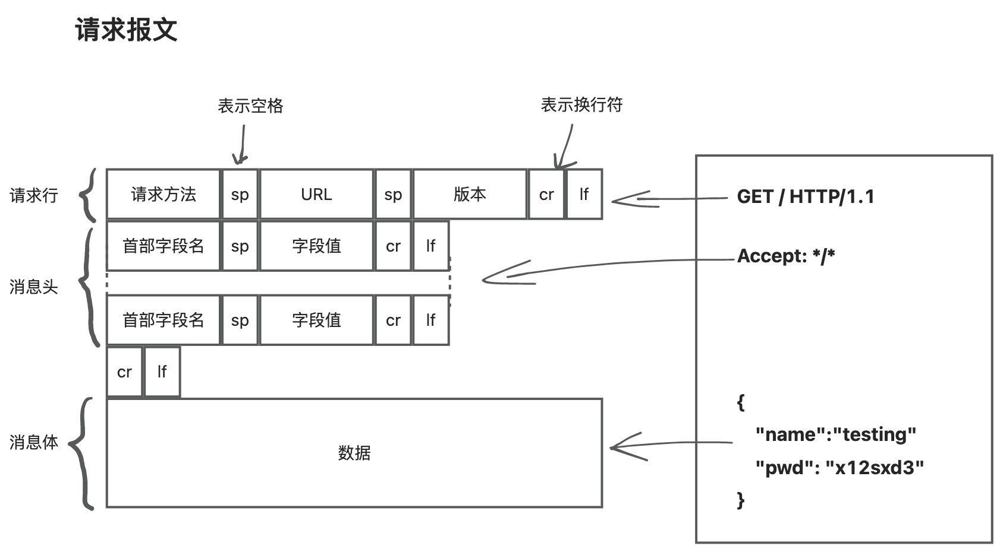
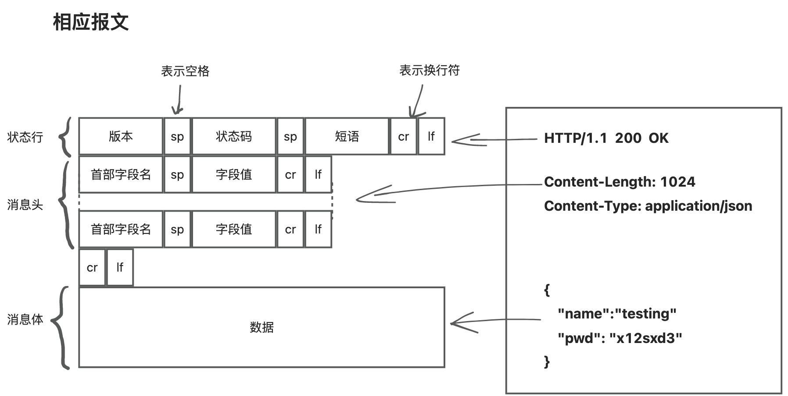
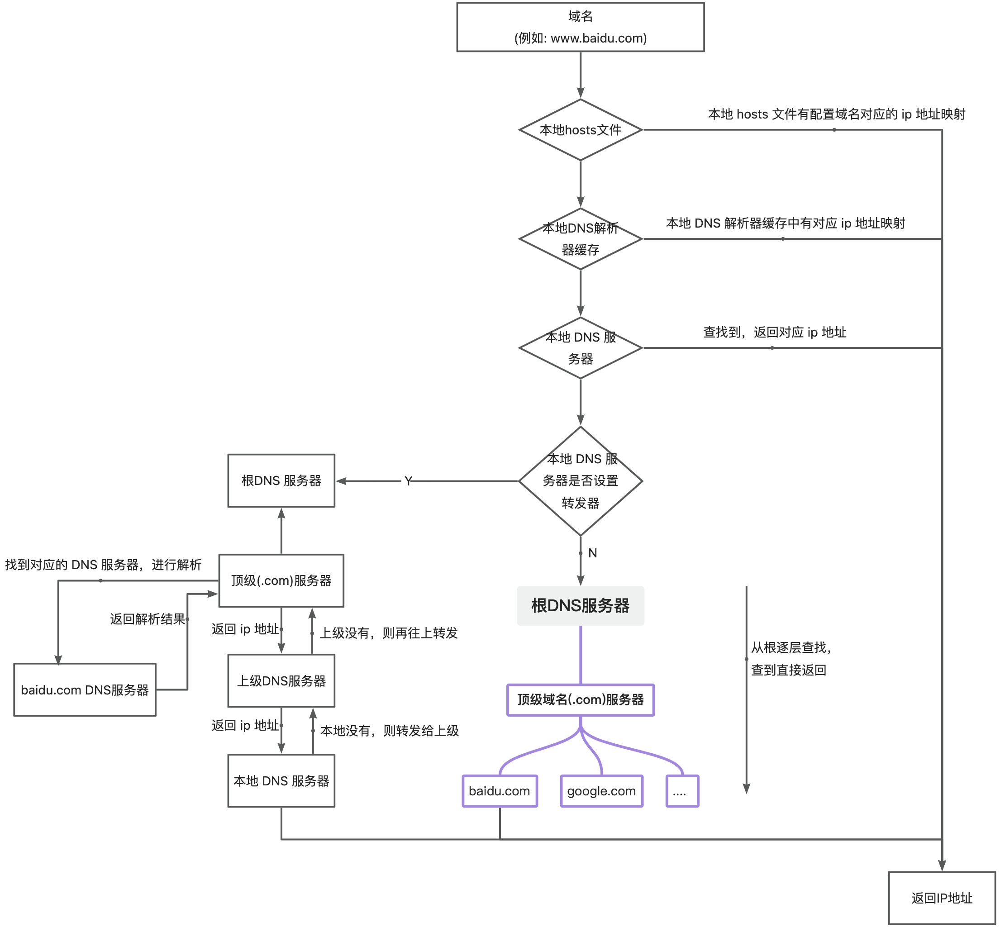
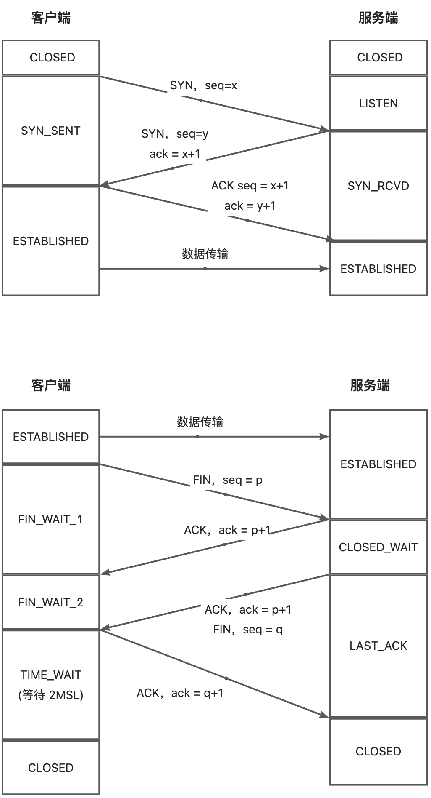
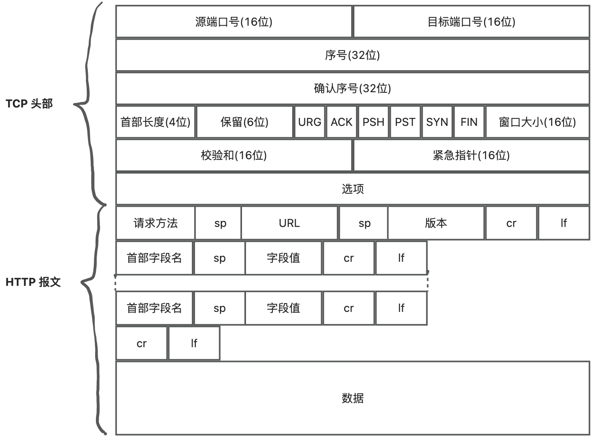
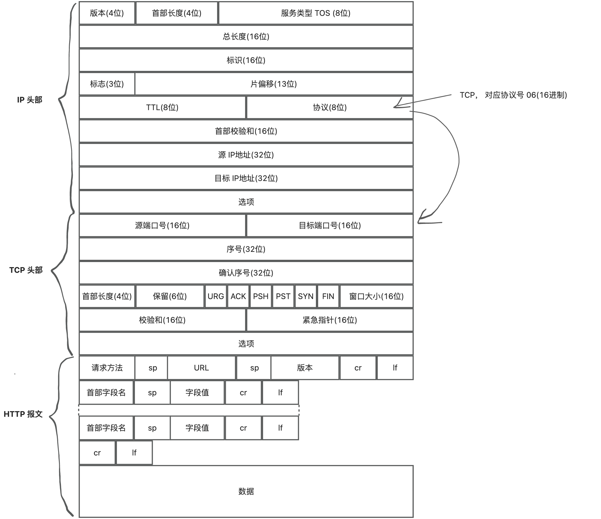
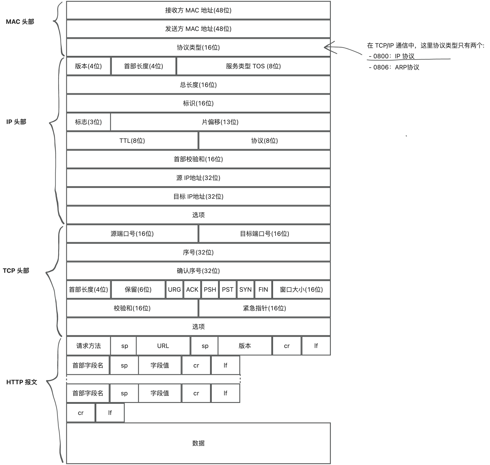
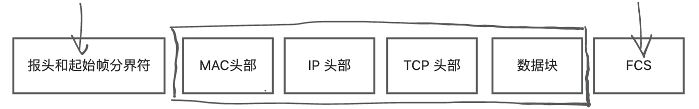
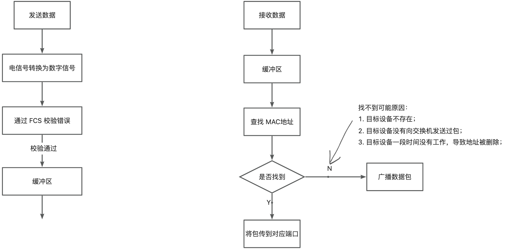

# 构建Http请求体
 

<!-- more -->
# DNS解析

# TCP
**三次握手，四次挥手**  

# IP

# MAC
 
**接收方获取方式** 通过 ARP协议，在以太网中以广播的形式，对以太网所有设备喊话:"xxxx IP地址是谁的？"，然后就有设备会回应并返回自己的 MAC 地址。
# 网卡
网卡驱动程序将数据包复制到网卡内的缓存区，并在开头加入"报头和起始帧分界符"，在末尾加上用于检测错误的"帧校验序列(FCS)"。 
网卡负责将二进制数字信息转换为电信号，这样才能在网线上传输。 

# 交换机

# 路由器
**路由器与交换机区别：**

- 路由器基于 IP 设计，俗称"三层网络设备"，路由器的各个端口都具有 MAC 地址和 IP 地址。
- 交换机基于以太网设计，俗称"二层网络设备"，交换机的各个端口不具备 MAC 地址。

**什么是"二层设备"、"三层设备":**

- 二层设备：只把 MAC 头摘下来，看到底是丢弃、转发，还是自己留着。
- 三层设备：把 MAC 头 和 IP 头摘下来，看到底是丢弃、转发，还是自己留着。
